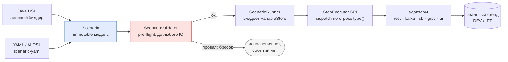
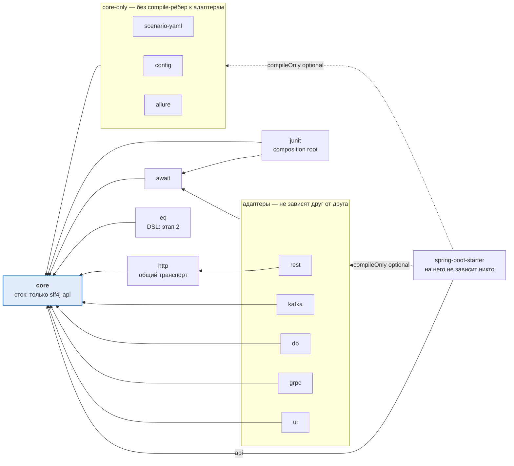
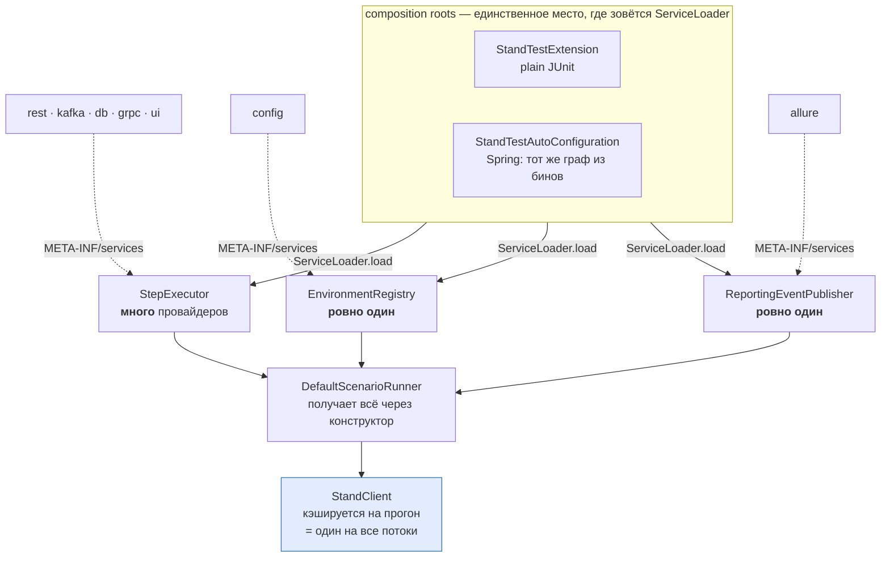
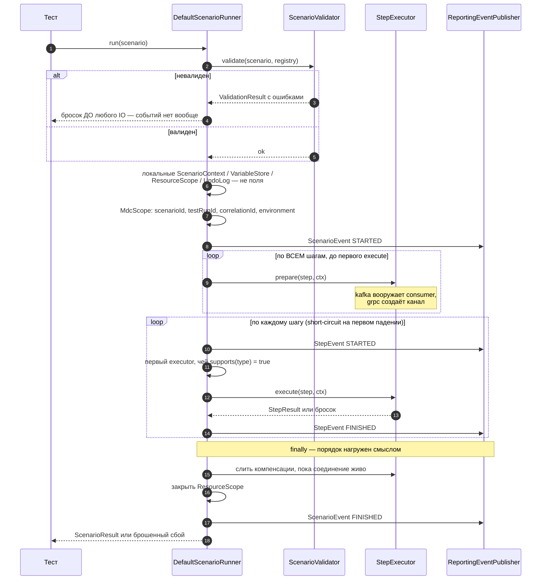
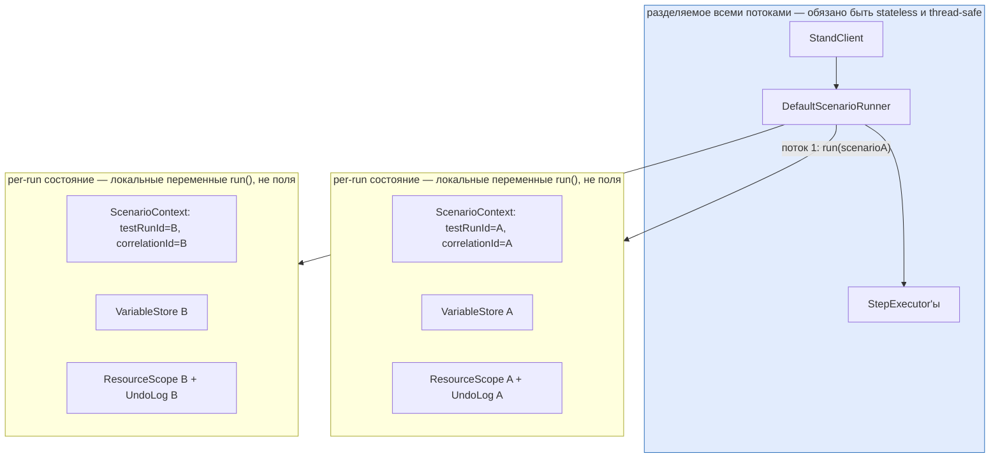
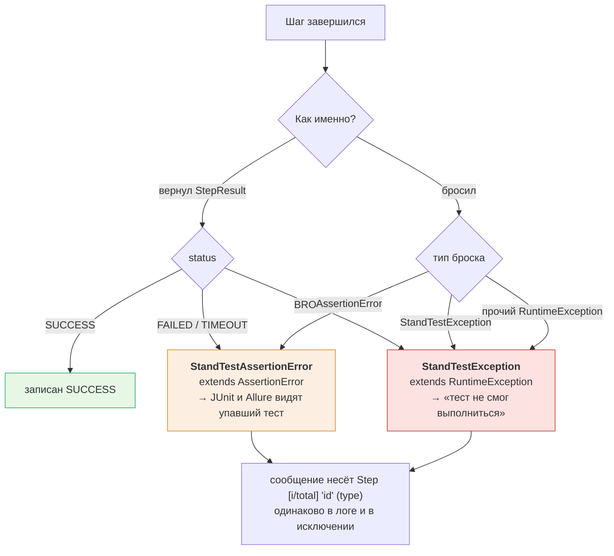
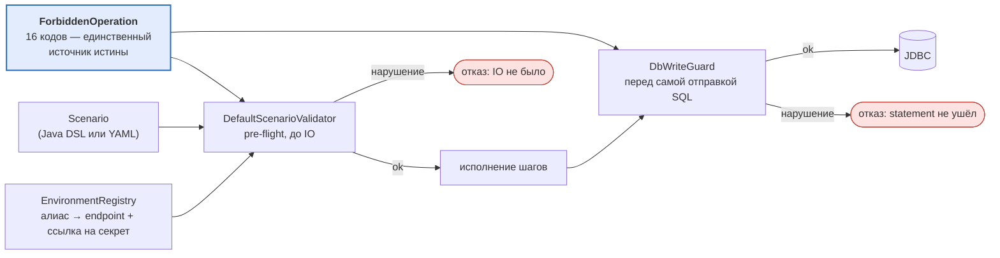

# stand-test-sdk

Внутренний Java **test SDK** для интеграционных и e2e-автотестов против **реальных стендов DEV/IFT**.
Тонкий фасад над зрелыми инструментами (Spring WebClient, `kafka-clients`, JDBC, grpc-java, Playwright,
JUnit 5, Allure) — не собственный транспорт и не Testcontainers.

Что даёт фасад:

| | |
|---|---|
| Единая модель сценария | один immutable `Scenario` независимо от входного DSL |
| Единый механизм ожидания | поллинг с инъецируемым источником времени; `Thread.sleep` запрещён guardrail'ом |
| SDK-owned корреляция | `scenarioId` / `testRunId` / `correlationId` порождает и проставляет SDK |
| Guardrails | сценарий не может обратиться к неразрешённому стенду, зашить секрет, выполнить деструктивный SQL |
| Ограниченный декларативный формат | YAML-поверхность, безопасная для AI-генерации тестов |

**Координаты:** group `ru.alfa.stand.test`, версия вычисляется из git, 15 модулей.
**Требования:** JDK 17+ у потребителя (байткод собирается с `--release 17`), JUnit 5, Gradle или Maven.

Документация: [контракты и правила разработки](AGENTS.md) ·
[план EQ data provisioning](docs/plans/eq-data-provisioning-implementation-plan.md) ·
[публикация](docs/publishing.md).

---

## 1. Архитектура

### 1.1 Один пайплайн

Оба входных DSL сходятся в одну immutable-модель; исполняется только она — дублирования рантайма нет.



Следствия, которые видны потребителю:

- **Java DSL ничего не исполняет.** `Scenario.builder(...)` собирает модель и делает ноль IO. Императивный
  eager-IO внутри fluent-цепочки запрещён (`IMPERATIVE_EAGER_IO`) — он обошёл бы валидатор, то есть все guardrails.
- **Валидатор — единственные ворота.** Он отрабатывает до создания контекста и до любого IO. Провал валидации
  не порождает даже reporting-событий.
- **Раннер не знает ни одного адаптера.** Диспетчеризация — по строке `ScenarioStep.type()` через SPI.

### 1.2 Граф модулей

`A → B` = A зависит от B. Граф ацикличен, `core` — единственный сток.



`bom` — `java-platform` вне compile-графа: он констрейнит версии, но его не импортирует ни один модуль
(обратный импорт дал бы цикл `core → bom → core`).

| Модуль | Что даёт потребителю | Внешние зависимости |
|---|---|---|
| [stand-test-core](stand-test-core/README.md) | Модель, SPI, валидация, guardrails, события, исключения | **только `slf4j-api`** |
| [stand-test-await](stand-test-await/README.md) | Поллинг-движок, `TimeSource` | `slf4j-api` |
| [stand-test-junit](stand-test-junit/README.md) | `@StandTest` — инжект `StandClient`, composition root для plain JUnit | — |
| [stand-test-http](stand-test-http/README.md) | Общий HTTP-транспорт, разрешение URL/auth и correlation-заголовок | spring-webflux (JDK-коннектор) |
| [stand-test-rest](stand-test-rest/README.md) | `rest.*` шаги, JSONPath-ассерты и captures | json-path |
| [stand-test-kafka](stand-test-kafka/README.md) | `kafka.*` шаги, корреляция по заголовку, уникальная consumer group на прогон | kafka-clients 3.9.x |
| [stand-test-db](stand-test-db/README.md) | `db.*` шаги, fail-closed SQL write-guard, undo-log | **нет** — чистый `java.sql`, драйвер даёт потребитель |
| [stand-test-grpc](stand-test-grpc/README.md) | `grpc.unary` через server reflection + `DynamicMessage`, обязательный deadline | grpc-java 1.68.x, protobuf 3.25.x |
| [stand-test-ui](stand-test-ui/README.md) | `ui.*` шаги на Playwright, пул техучёток по ролям, артефакты падения | playwright 1.61.x |
| [stand-test-eq](stand-test-eq/README.md) | `eq.seed`: доменный шаг подготовки данных EQ; бэкенды `showcases` (ЮЛ) и `gateway` (ЮЛ, офлайн); ФЛ и приёмка test — за внешними гейтами | jackson-databind (3.x), json-path; jt400 `compileOnly` |
| [stand-test-allure](stand-test-allure/README.md) | Маппинг reporting-событий в Allure, маскирование вложений | allure-java-commons 2.29.x |
| [stand-test-config](stand-test-config/README.md) | Файловый `EnvironmentRegistry` (`stand-test-environments.yml`) для plain JUnit | snakeyaml |
| [stand-test-spring-boot-starter](stand-test-spring-boot-starter/README.md) | Boot-3 auto-configuration: `@Autowired StandClient`, окружения из `application.yml` | spring-boot-autoconfigure 3.5.x |
| [stand-test-scenario-yaml](stand-test-scenario-yaml/README.md) | YAML DSL (поверхности given/then и AI steps/type) | snakeyaml |
| [stand-test-bom](stand-test-bom/README.md) | `java-platform` — выравнивание версий у потребителя | — |

Правила графа (после удаления модуля `stand-test-example` ArchUnit-теста, который их закреплял,
больше нет — они соблюдаются соглашением):
`core` не видит ни один соседний модуль и ни одну IO-библиотеку; типизированные шаги (`RestStep`,
`KafkaStep`, `DbStep`, `GrpcStep`, `UiStep`) живут в адаптерах, core знает только `GenericStep`
(строка `type` + map параметров); адаптеры не зависят друг от друга; на starter не зависит никто.

### 1.3 Три SPI

Расширяемость держится на трёх интерфейсах core, которые находятся через `java.util.ServiceLoader`
(регистрация — `META-INF/services/...` в каждом модуле):

| SPI | Кто регистрирует | Кардинальность | Если провайдера нет |
|---|---|---|---|
| `core.execution.StepExecutor` | rest, kafka, db, grpc, ui | **много**, аддитивно | шаг такого типа → `StandTestException` |
| `core.environment.EnvironmentRegistry` | config (или бин в starter) | **ровно один** | `NoProviderEnvironmentRegistry` с внятной диагностикой |
| `core.event.ReportingEventPublisher` | allure (или бин в starter) | **ровно один** | `NoOpReportingEventPublisher` |



`ServiceLoader` вызывается только в composition roots — `StandTestExtension.buildStandClient()` (plain
JUnit) и `StandTestAutoConfiguration` (Spring). Сам `core` ничего не ищет: `DefaultScenarioRunner` получает
`List<StepExecutor>` через конструктор.

`StandClient` кэшируется на весь прогон и разделяется всеми параллельными тестовыми потоками — отсюда
контракт: **`StepExecutor` обязан быть stateless и thread-safe**, всё per-run состояние ездит в
`StepExecutionContext`.

### 1.4 Жизненный цикл прогона



Тот же порядок словами:

1. **Валидация до любого IO.** Провал → бросок, событий нет вообще.
2. **Свежее per-run состояние** — `ScenarioContext`, `VariableStore`, `ResourceScope`, `UndoLog` как
   локальные переменные, не поля (раннер разделяемый).
3. **MDC-скоуп** на весь прогон, затем `ScenarioEvent(STARTED)`.
4. **Проход `prepare` по ВСЕМ шагам** до выполнения первого: kafka вооружает consumer'ы, grpc создаёт канал.
   Это лечение гонки «сообщение появилось раньше, чем consumer сел на топик».
5. **Цикл шагов**: per-step MDC, `StepEvent(STARTED)`, первый executor чей `supports(type)` = true,
   `execute`, `StepEvent(FINISHED)`. Политика — **short-circuit**: первый упавший шаг останавливает прогон.
6. **`finally`**: слить компенсации (пока соединение живо) → закрыть `ResourceScope` →
   `ScenarioEvent(FINISHED)` → вердикт по cleanup.

Reporting — best-effort: сбой публишера логируется WARN и не имеет права менять исход теста.

### 1.5 Метаданные и переменные разделены

Это то, что делает параллелизм возможным:

- **`ScenarioContext`** — immutable метаданные: `scenarioId`, `testRunId`, `correlationId`, `environment`,
  теги, `createdAt`.
- **`VariableStore`** — отдельный mutable объект, **по одному на прогон**, которым владеет раннер.
  Никогда не static, не глобальный, не `ThreadLocal`.

`VariableResolver` раскрывает `${name}`: встроенные `scenarioId|testRunId|correlationId|environment` берутся
из контекста, остальное — из store; иначе `StandTestException("Unresolved variable: ...")`.



### 1.6 Семантика сбоев

**`StepStatus.FAILED` — запись для отчёта, она никогда не заменяет собой брошенный сбой.** Оба пути —
возвращённый статус и брошенное исключение — сходятся в одну классификацию:



| Ситуация | Записывается | Бросается |
|---|---|---|
| Не сошлось ожидание | `FAILED` / `TIMEOUT` | `StandTestAssertionError` (extends `AssertionError`) |
| Инфраструктура / конфигурация | `BROKEN` | `StandTestException` (extends `RuntimeException`) |
| Исполнитель бросил `AssertionError` | `FAILED` | `StandTestAssertionError` |
| Исполнитель бросил прочий `RuntimeException` | `BROKEN` | `StandTestException` |

`StandTestAssertionError` — это `AssertionError`, поэтому JUnit и Allure видят **упавший** тест;
`StandTestException` означает «тест не смог выполниться» и требует другой реакции при разборе.
Каждое сообщение несёт `Step [i/total] 'id' (type)` — одинаково в логе и в исключении.

Таймаут `expectEventually` доходит до отчёта дважды: сводкой в тексте исключения и картой диагностики
(`rest.service`, `kafka.messagesSeen`, `db.sql`, `ui.application`, …). В карту кладутся **только
метаданные** — никогда тело ответа или payload сообщения.

### 1.7 Guardrails

`ForbiddenOperation` — единственный источник истины (16 кодов: `THREAD_SLEEP`, `HARDCODED_STAND_URL`,
`SECRET_IN_SOURCE`, `RAW_KAFKA_CLIENT`, `RAW_JDBC_CLIENT`, `NON_WHITELISTED_ENVIRONMENT|SERVICE|TOPIC|
DATASOURCE|GRPC_TARGET|UI_APPLICATION`, `DESTRUCTIVE_SQL_WITHOUT_ALLOW`, `UNBOUNDED_TIMEOUT`,
`FIXED_TEST_DATA_ID`, `BUSINESS_LOGIC_IN_SDK`, `IMPERATIVE_EAGER_IO`).

Enforce'ится в двух эшелонах, оба в рантайме: `DefaultScenarioValidator` отвергает документ до любого IO,
`DbWriteGuard` перепроверяет конкретный SQL непосредственно перед отправкой.



`EnvironmentRegistry` — точка enforce'а whitelist'а: он резолвит логические алиасы
(сервис / топик / датасорс / gRPC-таргет / UI-приложение) в endpoints и **ссылки на секреты**, никогда не в
значения секретов. Escape-hatch'а «указать произвольный URL прямо в шаге» нет by design.

---

## 2. Подключение: plain JUnit 5 (без Spring)

### 2.1 Зависимости

Все модули получают одну версию через BOM:

```kotlin
testImplementation(platform("ru.alfa.stand.test:stand-test-bom:<version>"))

testImplementation("ru.alfa.stand.test:stand-test-junit")   // @StandTest + composition root
testImplementation("ru.alfa.stand.test:stand-test-config")  // файловый реестр окружений
testImplementation("ru.alfa.stand.test:stand-test-rest")    // + -kafka / -db / -grpc / -ui по необходимости

// опционально: отчётность
testImplementation("ru.alfa.stand.test:stand-test-allure")
// SDK тянет только allure-java-commons; интеграцию с JUnit 5 добавляете вы, иначе отчёт выйдет ПУСТЫМ:
testImplementation("io.qameta.allure:allure-junit5:2.29.1")

// stand-test-db не тянет JDBC-драйвер — добавьте свой:
testRuntimeOnly("org.postgresql:postgresql:<version>")
```

Подключайте только те адаптеры, которые реально используете: их транзитивные зависимости
(spring-webflux, kafka-clients, grpc, playwright) иначе попадут на ваш classpath без нужды.

Логирование: SDK поставляет **только фасад** `slf4j-api`. Биндинг (Logback, `slf4j-simple`) добавляете вы —
конфликта multiple-bindings не возникает.

### 2.2 Реестр окружений

`src/test/resources/stand-test-environments.yml` (или `.yaml`; путь переопределяется системным свойством
`stand.test.environments.config`). **Каждый `*-ref` — это имя переменной окружения, никогда не значение:**
ни endpoints, ни секреты не попадают в исходники.

```yaml
version: 6                                  # версия ФОРМАТА файла, не версия SDK; можно опустить — тогда 1
default-environment: ${APP_STEND:ift}       # необязательно; пустой Scenario.environment() возьмёт это значение
environments:
  ift:
    services:
      client-service:
        base-url-ref: CLIENT_SERVICE_URL
        correlation: { source: HEADER, name: X-Correlation-Id }
        # опционально: SDK сам проставит заголовок Authorization
        auth: { scheme: BASIC, username-ref: CLIENT_USER, password-ref: CLIENT_PASSWORD }
    topics:
      response-topic:
        name: pakt.response.ift
        correlation: { source: HEADER, name: X-Correlation-Id }
    datasources:
      main-db:
        url-ref: MAIN_DB_URL
        user-ref: MAIN_DB_USER
        password-ref: MAIN_DB_PASSWORD
        allowed-schemas: [test_data]
        write-allowed: true
    grpc-targets:
      billing-grpc:
        target-ref: BILLING_GRPC_TARGET
        correlation: { source: METADATA, name: x-correlation-id }
    kafka-cluster:
      bootstrap-servers-ref: KAFKA_BOOTSTRAP
      security-protocol-ref: KAFKA_SECURITY_PROTOCOL
```

Запускайте тесты с выставленными переменными, на которые ссылается конфиг (`CLIENT_SERVICE_URL`,
`MAIN_DB_URL`, …). UI-приложения — см. §5.
В стартере тот же ключ пишется как `stand.test.default-environment`. Явный `.environment(...)` имеет
приоритет; ссылка на отсутствующее окружение останавливает загрузку реестра. Формат v5 продолжает
загружаться, но новые ключи `default-environment` и `eq-backends` требуют v6.
`eq-backends` сохраняется в реестре как секция алиасов; `EqSeed` исполняется бэкендом, выбранным этой
секцией (`showcases` для confirmed-среза ЮЛ; `gateway` и `individual(...)` пока fail-closed).

### 2.3 Первый тест

`@StandTest` инжектит `StandClient`, собранный из адаптеров, найденных на classpath. Кода проводки нет.

```java
@StandTest
@StandEnv("ift")
@StandScenarioId("payment-flow")
class PaymentFlowTest {

    @Test
    void createsRequest(StandClient stand, @StandScenarioId String id, @StandEnv String env) {
        Scenario scenario = Scenario.builder(id)
                .environment(env)
                .step(RestStep.post("client-service", "/api/requests")
                        .body("{\"amount\":1}")
                        .injectCorrelationId()
                        .expectStatus(200)
                        .capture("requestId", "$.requestId")
                        .build())
                .step(DbStep.expectEventually("main-db")
                        .sql("SELECT status FROM test_data.orders WHERE id = :id")
                        .param("id", "${requestId}")
                        .expectValue("NEW")
                        .withinSeconds(30)
                        .build())
                .build();

        ScenarioResult result = stand.run(scenario);   // Validator → Runner → StepExecutor SPI

        assertThat(result.isSuccessful()).isTrue();
    }
}
```

Аннотации из `stand-test-junit`: `@StandTest` (extension), `@StandEnv`, `@StandScenarioId` — работают и на
классе, и как параметры метода.

---

## 3. Подключение: Spring Boot 3

Тот же объектный граф, что собирает `@StandTest`, только собранный из бинов и настроенный
`application.yml` вместо `ServiceLoader`. `stand-test-spring-boot-starter` — **библиотека**, а не
загружаемое приложение: плагин `org.springframework.boot` в ней намеренно не применён.

### 3.1 Зависимости

Starter форсирует **только `stand-test-core`**. Каждый адаптер, `await` и `allure` — optional
(`compileOnly` со стороны стартера) и транзитивно **не подтягиваются**: вы добавляете ровно то, что
используете, и тяжёлые транзитивные зависимости (spring-webflux, kafka-clients, grpc, playwright) не
попадают на classpath без спроса.

```kotlin
dependencies {
    testImplementation(platform("ru.alfa.stand.test:stand-test-bom:<version>"))

    testImplementation("ru.alfa.stand.test:stand-test-spring-boot-starter")

    // добавьте только то, что этот тестовый проект реально использует:
    testImplementation("ru.alfa.stand.test:stand-test-rest")     // → бин RestStepExecutor
    testImplementation("ru.alfa.stand.test:stand-test-kafka")    // → бин KafkaStepExecutor
    testImplementation("ru.alfa.stand.test:stand-test-db")       // → бин DbStepExecutor
    testImplementation("ru.alfa.stand.test:stand-test-grpc")     // → бин GrpcStepExecutor
    testImplementation("ru.alfa.stand.test:stand-test-ui")       // → UiStepExecutor через SPI, без бина
    testImplementation("ru.alfa.stand.test:stand-test-await")    // → бины Awaiter / AwaitPolicy
    testImplementation("ru.alfa.stand.test:stand-test-allure")   // → Allure-публишер вместо no-op

    // stand-test-allure тянет только allure-java-commons; интеграцию с JUnit 5 добавляете вы,
    // иначе отчёт выйдет ПУСТЫМ:
    testImplementation("io.qameta.allure:allure-junit5:2.29.1")

    // stand-test-db не тянет JDBC-драйвер:
    testRuntimeOnly("org.postgresql:postgresql:<version>")
}
```

Maven:

```xml
<dependencyManagement>
  <dependencies>
    <dependency>
      <groupId>ru.alfa.stand.test</groupId>
      <artifactId>stand-test-bom</artifactId>
      <version>${stand-test.version}</version>
      <type>pom</type>
      <scope>import</scope>
    </dependency>
  </dependencies>
</dependencyManagement>

<dependencies>
  <dependency>
    <groupId>ru.alfa.stand.test</groupId>
    <artifactId>stand-test-spring-boot-starter</artifactId>
    <scope>test</scope>
  </dependency>
  <dependency>
    <groupId>ru.alfa.stand.test</groupId>
    <artifactId>stand-test-rest</artifactId>
    <scope>test</scope>
  </dependency>
</dependencies>
```

Версия Boot **не** констрейнится `stand-test-bom` — ею управляет ваш собственный Boot-BOM или плагин.
Auto-configuration регистрируется через
`META-INF/spring/org.springframework.boot.autoconfigure.AutoConfiguration.imports`; никаких `@Import`
и `@EnableXxx` писать не нужно.

### 3.2 Что автоконфигурируется

Каждый бин — `@ConditionalOnMissingBean` (объявите свой — он победит), вся конфигурация гейтится
`stand.test.enabled` (default `true`).

| Бин | Условие |
|---|---|
| `ScenarioValidator` | всегда — `DefaultScenarioValidator` |
| `EnvironmentRegistry` | всегда — собирается из `stand.test.environments.*` (пустой, если их нет) |
| `RestStepExecutor` / `KafkaStepExecutor` / `DbStepExecutor` / `GrpcStepExecutor` | соответствующий модуль на classpath |
| `ReportingEventPublisher` | Allure на classpath **и** `stand.test.reporting.allure.enabled` ≠ `false`; иначе no-op |
| `ScenarioRunner` | всегда — `DefaultScenarioRunner` над всеми бинами `StepExecutor` **и** над исполнителями, найденными на classpath |
| `StandClient` | всегда — фасад `DefaultStandClient` |
| `Awaiter`, `AwaitPolicy` | `stand-test-await` на classpath |

**Адаптер без бина тоже подхватывается.** Модуль, регистрирующий `StepExecutor` через
`META-INF/services`, находится и добавляется в раннер — так работает `stand-test-ui`. Объявленный бин
всегда имеет приоритет: SPI-провайдер того класса, который уже объявлен бином, пропускается, поэтому
дубля не возникает. Найденные исполнители один раз объявляются в логе на старте контекста. Запись в
`META-INF/services`, указывающая на незагружаемый класс, — это `WARN`, а не отказ контекста.

### 3.3 `application.yml`

```yaml
stand:
  test:
    enabled: true
    version: 2                      # версия ФОРМАТА реестра, не версия SDK; отсутствует → 1
    await:
      timeout: 30s
      poll-interval: 500ms
    reporting:
      enabled: true
      allure:
        enabled: true
    environments:
      ift:
        services:
          client-service:
            base-url-ref: CLIENT_SERVICE_URL
            correlation: { source: HEADER, name: X-Correlation-Id }
            auth: { scheme: BASIC, username-ref: CLIENT_USER, password-ref: CLIENT_PASSWORD }
        datasources:
          main-db:
            url-ref: MAIN_DB_URL
            user-ref: MAIN_DB_USER
            password-ref: MAIN_DB_PASSWORD
            allowed-schemas: [test_data]
            write-allowed: true
        topics:
          events:
            name: ift.events.v1
            correlation: { source: KEY, name: X-Correlation-Id }
        grpc-targets:
          accounts:
            target-ref: ACCOUNTS_GRPC
            correlation: { source: METADATA, name: x-correlation-id }
        kafka-cluster:                       # кластер по умолчанию окружения
          bootstrap-servers-ref: KAFKA_BOOTSTRAP
          security-protocol-ref: KAFKA_SECURITY_PROTOCOL
        # kafka-clusters:                    # либо несколько именованных кластеров
        #   analytics:
        #     bootstrap-servers-ref: ANALYTICS_KAFKA_BOOTSTRAP
```

Ключи — те же, что в файловом `stand-test-environments.yml`, только под префиксом
`stand.test.environments.*`. `*-ref` — **имя переменной окружения, никогда не значение**; адаптеры
резолвят его из OS environment в момент исполнения шага.

Реестр эффективно обязателен: guardrail отвергает любое окружение, не объявленное в
`stand.test.environments.*`, поэтому пустая конфигурация даёт ошибку на первом же `run(...)`.

### 3.4 Использование в тесте

```java
@SpringBootTest
class PaymentFlowSpringTest {

    @Autowired
    private StandClient stand;

    @Test
    void createsRequest() {
        Scenario scenario = Scenario.builder("payment-flow")
                .environment("ift")
                .step(RestStep.post("client-service", "/api/requests")
                        .body("{\"amount\":1}")
                        .injectCorrelationId()
                        .expectStatus(200)
                        .capture("requestId", "$.requestId")
                        .build())
                .step(DbStep.expectEventually("main-db")
                        .sql("SELECT status FROM test_data.orders WHERE id = :id")
                        .param("id", "${requestId}")
                        .expectValue("NEW")
                        .withinSeconds(30)
                        .build())
                .build();

        assertThat(stand.run(scenario).isSuccessful()).isTrue();
    }
}
```

Код сценария идентичен plain-JUnit-версии (§2.3) — отличается только способ получить `StandClient`.
Аннотации `@StandTest` / `@StandEnv` / `@StandScenarioId` в Spring-пути не нужны: `scenarioId` и
`environment` задаются прямо в билдере.

Если конфигурация окружений живёт в отдельном профиле, добавьте `@ActiveProfiles("stand-test")` и
держите её в `application-stand-test.yml`.

### 3.5 Value twins: Spring-плейсхолдеры вместо `*-ref`

Это **фича только стартера**: в файловом `stand-test-environments.yml` Spring'а нет, и файл остаётся
refs-only by construction. Каждое поле из таблицы имеет парный ключ без суффикса `-ref`, значение
которого Spring резолвит на старте контекста:

| Value-поле (резолвит Spring) | `*-ref`-твин (ленивый, резолвит адаптер) | Ресурс |
|---|---|---|
| `base-url` | `base-url-ref` | сервис, UI-приложение |
| `url` | `url-ref` | датасорс |
| `target` | `target-ref` | gRPC-таргет |
| `bootstrap-servers` | `bootstrap-servers-ref` | Kafka-кластер |
| `security-protocol` | `security-protocol-ref` | Kafka-кластер |
| `user` | `user-ref` | датасорс (**секрет**) |
| `password` | `password-ref` | датасорс / auth (**секрет**) |
| `username` | `username-ref` | auth (**секрет**) |
| `token` | `token-ref` | auth (**секрет**) |
| `sasl-jaas-config` | `sasl-jaas-config-ref` | Kafka-кластер (**секрет**) |
| `credentials-username` / `credentials-password` | `credentials-username-ref` / `credentials-password-ref` | UI-приложение, **с версии формата 5** (**секрет**) |

Таблица исчерпывающая. У `credentials-pool-ref` и `discovery-account-ref` value-твина **нет** —
сеттера тоже нет, поэтому написание без суффикса просто ничего не свяжет, молча.

```yaml
services:
  client-service:
    base-url: ${CLIENT_SERVICE_URL:}          # Spring резолвит на старте контекста
datasources:
  main-db:
    url: ${MAIN_DB_URL:}
    user: ${MAIN_DB_USER}
    password: ${MAIN_DB_PASSWORD}             # см. цену ниже — для секрета лучше password-ref
```

**Правила, каждое из которых закрывает реальный сбой:**

- **Ровно один твин на поле.** Одновременно заданные `base-url` и `base-url-ref` роняют старт контекста
  сообщением `"... sets both 'base-url' and 'base-url-ref' — configure exactly one"`.
- **Всегда пишите `:` внутри плейсхолдера** — `${CLIENT_SERVICE_URL:}`. С незаданной переменной значение
  свяжется пустой строкой, контекст стартует, а отказ переедет на исполнение шага
  (`"... configured as a literal value but it is empty"`). Без дефолта Spring роняет старт на
  нерезолвленном плейсхолдере. Гейт `@EnabledIfEnvironmentVariable` на такой переменной — дело
  добровольное и по умолчанию не ставится: он не видит умолчаний из `application.yml` и превращает
  работающий тест в молчаливый skip.
- **`${...}` внутри `*-ref`-поля — никогда.** Spring схлопнет плейсхолдер до того, как SDK увидит ref, и
  результат будет прочитан как имя переменной. Это ловушка двойного резолва: она выглядит как неверный
  пароль, а не как ошибка конфигурации. В `*-ref` пишется голое ИМЯ переменной.
- **У секретного твина есть цена.** Значение, пришедшее через value-твин, материализуется в Spring
  Environment (actuator `/env`, дампы, логи), а inline-дефолт остаётся в git после ротации. Guard'а
  `requireReferenceShape` на этом пути нет — `password: hunter2` технически примется так же, как
  захардкоженный URL. Поэтому: в value-твине всегда `${ENV_VAR}`, а **для секрета предпочтителен
  `*-ref`**, который SDK резолвит лениво из OS environment и никогда не кладёт в Environment.
  Паролю дефолт не дают никогда.
- SDK-внутренний маркер `literal://` в пользовательской конфигурации отвергается fail-closed.

### 3.6 Переопределение бинов и отключение

Любой бин переопределяется объявлением своего того же типа:

```java
@Bean
ReportingEventPublisher reportingEventPublisher() {
    return new MyReportingEventPublisher();
}
```

Полное отключение — `stand.test.enabled: false`: auto-configuration не вносит **ни одного** бина, и SDK
можно развести руками или через `@StandTest` из `stand-test-junit`.

### 3.7 Диагностика

| Симптом | Причина и что делать |
|---|---|
| `run(...)` падает с «окружение не whitelisted» | реестр пуст — объявите хотя бы одно окружение под `stand.test.environments.*` |
| Контекст не стартует: `Invalid stand.test.environments.<env> configuration: ... must not be blank` | не заполнен какой-то `*-ref` или вложенный `correlation.source`/`name` — все ссылки обязательны и должны быть непустыми именами переменных |
| Контекст не стартует: версия формата новее поддерживаемой | понизьте `stand.test.version` или обновите `stand-test-*` (§6) |
| `No step executor registered for step type '...'` | модуль адаптера не на classpath — добавьте `stand-test-rest`/`-kafka`/`-db`/`-grpc`/`-ui` |
| Бинов SDK нет вовсе | `stand.test.enabled=false` либо стартер не на classpath |
| Отчёт не доезжает до Allure | нет `stand-test-allure`, либо `stand.test.reporting.allure.enabled=false`, либо забыт `allure-junit5` |
| Вход в UI отвергается, «неверный пароль» | `${...}` внутри `*-ref` — ловушка двойного резолва (§3.5) |

Полный справочник по стартеру — [stand-test-spring-boot-starter/README.md](stand-test-spring-boot-starter/README.md).

---

## 4. Типы шагов

Диспетчеризация — по префиксу `type()`. Типизированные билдеры живут в адаптерах.

| Адаптер | Фабрики | Матчеры ассертов |
|---|---|---|
| **rest** | `RestStep.get/post/put/delete(service, path)`, `RestStep.expectEventually(service, path)` | все пять: `equals` / `contains` / `exists` / `notNull` / `matches` |
| **grpc** | `GrpcStep.unary(target)` | все пять — паритет с REST |
| **kafka** | `KafkaStep.send(topic)`, `KafkaStep.expect(topic)` | **только `equals`** — любой другой матчер отвергается |
| **db** | `DbStep.query/expectEventually/seed/cleanup/write(datasource)` | типа ассерта нет: `expectValue` сравнивает на равенство |
| **ui** | `UiStep.open/click/fill/expect/expectEventually/login(application, …)` | — |

Равенство не дублируется: kafka и db делегируют в core'ский `AssertionMatchers.equalsMatch`, поэтому все
адаптеры используют один evaluator и не могут разъехаться.

`rest.expectEventually` поллит GET'ом через общий await-движок: транспортная ошибка прерывает как
инфраструктурный сбой, 5xx поллится дальше, captures применяются только к финальному ответу.

---

## 5. UI-тесты (`stand-test-ui`)

UI-приложение адресуется логическим алиасом ровно так же, как сервис или топик; произвольный URL в шаге
указать негде. Неизвестный алиас отвергается валидатором до старта браузера
(`NON_WHITELISTED_UI_APPLICATION`). Секция `ui-applications` требует **версии формата 2**.

```yaml
version: 5
environments:
  ift:
    ui-applications:
      client-portal:
        base-url-ref: CLIENT_PORTAL_IFT_URL     # ИМЯ переменной окружения, не URL
        default-viewport: desktop               # профиль прогона — конфигурация, не поле сценария
        viewport-profiles:
          desktop: { width: 1440, height: 900 }
          mobile:  { width: 390, height: 844 }
        trace: "off"                            # off (умолчание) | on-failure
        auth:
          scheme: FORM                          # NONE | FORM | STORAGE_STATE | SSO (SSO — говорящий отказ)
          credentials-pool-ref: CLIENT_PORTAL_TEST_USERS   # переменная с РЕЕСТРОМ учёток
          roles: [client, operator]             # объявлены роли ⇒ ui.login обязан назвать одну из них
          discovery-account-ref: CLIENT_PORTAL_DISCOVERY   # учётка разведки, вне пула
          challenge: none                       # none | mfa | otp | captcha — объявляется, не обходится
          login:                                # локаторы формы: <стратегия>=<значение>
            path: /login
            username-locator: testId=login-username
            password-locator: testId=login-password
            submit-locator: "role=button:Sign in"
            signed-in-locator: testId=user-menu  # элемент, который есть только после входа
```

**Учётные записи.** Переменная `CLIENT_PORTAL_TEST_USERS` содержит **реестр**, а не учётку:
`portal-client-1:client;portal-manager-1:manager`. Запись — это `<id>:<роль>` (имена переменных с логином
и паролем выводятся из id: `PORTAL_CLIENT_1_USERNAME` / `PORTAL_CLIENT_1_PASSWORD`) либо
`<id>:<роль>:<переменная-логина>:<переменная-пароля>`.

Приложению с **одной** учёткой реестр не нужен — она называется прямо, и эта пара исключает
`credentials-pool-ref`. С **версии формата 5** пара — это value twin: голый ключ несёт значение,
`credentials-username-ref` / `credentials-password-ref` несут ссылку.

```yaml
auth:
  scheme: STORAGE_STATE
  credentials-username-ref: CLIENT_PORTAL_USERNAME   # имя переменной окружения
  credentials-password-ref: CLIENT_PORTAL_PASSWORD
  roles: [admin]
```

Паролю дефолт не дают никогда — то же правило, что у `password-ref` датасорса.

**Вход — отдельный шаг `ui.login`.** Техучётка арендуется **по роли** из per-JVM пула; аренда
регистрируется в `ResourceScope`, поэтому `finally` раннера возвращает её при любом исходе. Ожидание
свободной учётки ограничено (`accountTimeout`, по умолчанию 60 с); исчерпание пула — `StandTestException`
с именем приложения, ролью, размером пула и таймаутом. `FORM` заполняет форму каждый раз;
`STORAGE_STATE` восстанавливает сессию, сохранённую **на учётку**, проверяет её по `signed-in-locator` и
откатывается к форме при истечении. **MFA/OTP/CAPTCHA не обходятся** — приложение объявляет `challenge`, и
SDK либо находит `UiLoginChallengeHandler` на classpath, либо отказывается.

**Артефакты падения:** скриншот с заклеенными чувствительными зонами (маскировка **до** снимка), консоль и
сетевая история текстом, при `trace: on-failure` — Playwright-трейс. `ui.login` брекетит заполнение
креденшелов `suspendTracing()`/`resumeTracing()`: трейс пишет параметры действий, а параметр `fill` — это
набираемое значение.

**Настройки прогона** (системные свойства):

| Свойство | Умолчание |
|---|---|
| `stand.test.ui.headless` | `true` |
| `stand.test.ui.browser` | `chromium` |
| `stand.test.ui.action.timeout.millis` | `10000` |
| `stand.test.ui.navigation.timeout.millis` | `30000` |
| `stand.test.ui.artifacts.dir` | `build/stand-test-ui` |
| `stand.test.ui.artifacts.retention.days` | `7` |

Подробности и границы — [stand-test-ui/README.md](stand-test-ui/README.md).

---

## 6. Версионирование формата реестра

Корневой `version` (или `stand.test.version` на starter'е) — версия **формата файла**, не версия SDK. Обе
поверхности читают одну константу в `stand-test-core` (`EnvironmentConfigFormat`). Текущая поддерживаемая
версия — **5**.

| Что в конфигурации | Поведение SDK |
|---|---|
| ключ отсутствует | читается как `1` — файлы, написанные до версионирования, работают без изменений; `WARN` |
| `version` < поддерживаемой | читается, один `WARN` при загрузке |
| `version` = поддерживаемой | читается молча |
| `version` > поддерживаемой | отказ с сообщением: версия файла, поддерживаемая версия, что сделать |
| не целое или ≤ 0 | ошибка конфигурации (fail-closed) |

**Окна совместимости нет:** SDK читает **каждую** версию от 1 до поддерживаемой и не получает права
перестать это делать. Отставший файл работает неограниченно долго. Отказ бывает ровно один и в другую
сторону — файл новее, чем понимает SDK.

Секция, появившаяся после версии 1, обязана объявить свою версию:

| Версия | Что появилось |
|---|---|
| 1 | `services`, `topics`, `datasources`, `grpc-targets`, `kafka-cluster` |
| 2 | `ui-applications` |
| 3 | `ui-applications.auth.login` / `auth.challenge` |
| 4 | пара `credentials-username` / `credentials-password` |
| 5 | та же пара как **value twin** + `credentials-username-ref` / `credentials-password-ref` |

---

## 7. Параллельное выполнение

SDK построен под параллельный прогон сценариев **в одной JVM**: каждый прогон получает уникальные
`testRunId` и `correlationId`, собственный `VariableStore` и уникальную Kafka consumer group; всё per-run
состояние thread-confined, поэтому один закэшированный `StandClient` безопасно разделяется потоками.

Включается через `src/test/resources/junit-platform.properties`:

```properties
junit.jupiter.execution.parallel.enabled=true
junit.jupiter.execution.parallel.mode.classes.default=concurrent   # классы — параллельно
junit.jupiter.execution.parallel.mode.default=same_thread          # методы внутри класса — последовательно
junit.jupiter.execution.parallel.config.strategy=dynamic
junit.jupiter.execution.parallel.config.dynamic.factor=0.5
```

Это рекомендуемая модель: она соответствует инварианту *один прогон сценария = один поток*. Модель работает
**только внутри одной JVM** — держите Gradle `maxParallelForks = 1`.

### Что параллельно-безопасно

- **DB.** INSERT в `db.seed` обязан помечать строки зарезервированным биндом `:testRunId` **и объявлять
  колонку-тег** через `taggedByTestRunId("test_run_id")` — ту же, по которой фильтрует `db.cleanup` через
  `whereTestRunId("test_run_id")`. Write-guard проверяет, что объявленная колонка действительно есть в
  списке колонок INSERT, поэтому seed с неубираемым тегом отвергается до любого IO. Любой фиксированный
  первичный ключ выводите из per-run значения: `id = "order-${testRunId}"`.
- **Kafka.** `kafka.expect` обязан выбирать по per-run **уникальному** дискриминатору —
  `correlationIdFromContext()` или `key(...)`, содержащий плейсхолдер (`${testRunId}`). Enforce'ится
  fail-closed и при сборке, и в рантайме. Константный ключ допустим только вместе с
  `correlationIdFromContext()`, где он лишь сужает выборку среди собственных сообщений прогона.
- **REST / gRPC.** SDK инжектит per-run `correlationId` в каждый вызов; скоупьте создаваемые сущности через
  `${testRunId}` / `${correlationId}` в теле запроса или фикстуре.

### Как пометить тест последовательным

| Аннотация (`stand-test-junit`) | Разворачивается в | Для чего |
|---|---|---|
| `@StandParallelSafe` | `@Execution(CONCURRENT)` | явная пометка «безопасно параллельно» |
| `@StandSerial` | `@Execution(SAME_THREAD)` | сериализовать методы одного класса |
| `@StandIsolated` | `@Isolated` | гонять класс в одиночку |

Для взаимного исключения между тестами, делящими один именованный ресурс, — нативный
`@ResourceLock("<alias>")`.

### Потолок для UI-набора

Потолок параллельности UI-набора равен **размеру пула техучёток**. Выше потолка прогоны ждут свободную
учётку, но ждут ограниченно: при параллельности `P`, пуле `N` и длительности сценария `T` последний в
очереди простаивает ≈ `T × (P/N − 1)`; если это больше `accountTimeout` (60 с), прогон падает как `BROKEN`.
Диагностика `ui.account.waitMillis` показывает фактический простой. Только потоки, не форки: пул живёт в
процессе, вторая JVM завела бы свой и выдала ту же учётку второму прогону.

---

## 8. Логирование

SDK логирует через **SLF4J** и поставляет только фасад (`slf4j-api`); биндинг ваш.

Каждый прогон штампует идентификаторы в **MDC**, поэтому их несёт каждая строка лога — и SDK, и адаптеров,
и вашего кода в тестовом потоке:

| Ключ MDC | Область |
|---|---|
| `scenarioId` / `testRunId` / `correlationId` / `environment` | весь прогон |
| `stepId` / `stepType` / `stepIndex` | текущий шаг |

| Уровень | Что пишется |
|---|---|
| INFO | старт / финиш сценария |
| DEBUG | старт и успех каждого шага (+ длительность), трейсы адаптеров |
| WARN | несошедшийся ассерт (`FAILED` / `TIMEOUT`), best-effort заминки |
| ERROR | инфраструктурный сбой шага (`BROKEN`) |

DEBUG-трейсы адаптеров содержат **только метаданные** — никогда тела запросов/ответов, заголовки,
`Authorization`, ключи и значения сообщений, текст SQL или связанные значения, ссылки на секреты.

---

## 9. Декларативный формат и AI-генерация

`stand-test-scenario-yaml` парсит декларативный формат (steps/type) в ту же валидированную модель.
Guardrails выводятся из `ForbiddenOperation` и enforce'ятся рантайм-валидатором.

Отдельного модуля с JSON Schema больше нет (`stand-test-ai-schema` удалён 12.08.2026). Практическое
следствие: **предварительной проверки документа схемой не существует** — нарушение ловится при разборе
(`AiScenarioParser`, fail-closed) и валидатором, то есть после загрузки, а не до неё.

Кит для AI-агента (Claude Code), превращающего текстовый бизнес-кейс в безопасный Java-автотест, —
[`docs/ai-agent/`](docs/ai-agent/README.md): копируемый бандл `.claude/` со скиллами и слэш-командами,
контракт базы знаний и пайплайн загрузки спецификаций. Разобранный пример —
[`docs/ai-agent/usage-guide.md`](docs/ai-agent/usage-guide.md).

---

## 10. Сборка и публикация

```bash
./gradlew build                       # компиляция + корпоративный анализ (валит сборку) + тесты
./gradlew :stand-test-core:test       # тесты одного модуля
./gradlew publishToMavenLocal         # локальная публикация всех модулей + BOM

# удалённая публикация: учётка ТОЛЬКО через переменные окружения, `-P` не сработает
ARTIFACTORY_USER=<user> ARTIFACTORY_PASSWORD=<token> ./gradlew publish
```

Сборка стоит на корпоративных плагинах `ru.alfalab.*` (`library-configurer` на модулях, `codestyle` и
`org.sonarqube` на корне). Toolchain, который они задают (17), переопределён на JDK, которым запущен
Gradle — на CI-агенте установлен только JDK 25 и скачать toolchain неоткуда; байткод при этом
по-прежнему таргетит **Java 17** (`--release 17`), артефакты грузятся на JDK 17/21/24.
Gradle 9.6.1 (ниже корпоративный плагин не запускается); configuration cache, parallel и build cache включены.

Зависимости разрешаются анонимно через зеркало `https://binary.alfabank.ru/artifactory/maven-secure`
(прописано в `settings.gradle.kts`) — никаких персональных свойств для сборки не нужно. Публикация идёт
в репозиторий `alfa`, который настраивает configurer: хост `ARTIFACTORY_HOST`, учётка `ARTIFACTORY_USER`
/ `ARTIFACTORY_PASSWORD`, ключи репозиториев `LIBRARY_SNAPSHOT_REPOSITORY` / `LIBRARY_RELEASE_REPOSITORY`
— см. [docs/publishing.md](docs/publishing.md).

Эти настройки передаются **переменными окружения**: `PropertyUtils` корпоративного плагина читает env в
ВЕРХНЕМ регистре либо gradle-свойство в нижнем (`artifactory_user`), а `stand-test-bom` — своё
gradle-свойство в верхнем, так что единого написания через `-P` на все 15 артефактов не существует.
Цель публикации должна быть **локальным** репозиторием: `.../artifactory/public/` — виртуальный
агрегат и PUT не принимает, это адрес для чтения.

Статанализ (checkstyle + SpotBugs корпоративного codestyle) — **гейт сборки**: `strict = true`, любая
находка валит `build`. Это стало возможным после того, как репозиторий довели до нуля находок; до этого
стоял `strict = false` и анализ был отчётным. Находки по-прежнему лежат в
`<модуль>/build/reports/{checkstyle,spotbugs}` и уезжают в Sonar. Проверяется только `main`: задачи
`checkstyleTest`/`spotbugsTest` существуют, но в `check` не входят. Гейта покрытия нет — корпоративная
обвязка JaCoCo делает только отчёты.

Версия артефактов считается из git плагином `ru.alfalab.semantic-version`, а не объявляется: в
`gradle.properties` строки `version` нет. `./gradlew printVersion` печатает снапшот текущей ветки
(например `0.1.0-target.solution-SNAPSHOT`), `./gradlew printReleaseVersion` — релизный номер.

### CI

Репозиторий собирает **Jenkins** — джоба `stand-test-framework` по пайплайну `ci/microservice/Jenkinsfile`
из `taksa-core/jenkins`: `build -x test` → `test` → `jacocoTestReport :sonar` → prepublish → publish.

Docker-заглушки в сборке больше нет. `dockerCreateDockerfile` (задача bmuschko-плагина, которую даёт
только `ru.alfalab.microservice-configurer` — здесь применяется `library-configurer`) какое-то время
жила в корневом `build.gradle.kts` как самописная заглушка, писавшая `build/docker/Dockerfile` с
`FROM scratch`: микросервисная стадия prepublish проверяет `find . -type f -path '*/build/docker/Dockerfile'`
и валила сборку без контекста (сборки #11 и #12). Заглушка убрана вместе со свойством `docker_registry`
из `gradle.properties` (его читает только `MicroserviceConfigurerExtension`, в этой сборке — никто):
этот репозиторий поставляется Maven-артефактами и никакого образа не публикует, а держать контекст,
из которого может уехать в реестр образ-пустышка, хуже, чем не иметь его вовсе.

⚠️ Отсюда следует требование к джобе: ей нужен **библиотечный** пайплайн либо микросервисный без
docker-стадий. Параметр `artifact_target_type=BUILD` закрывает только стадию **publish**, но не
prepublish, поэтому на микросервисном пайплайне без правки стадия prepublish снова упадёт на проверке
docker-контекста. Это ошибка конфигурации джобы, а не сборки — чинить на стороне пайплайна.

Браузерный набор (`:stand-test-ui:browserTest`) в CI не запускается — ему нужен образ с Chromium.

Определения GitLab CI (`.gitlab-ci.yml`) в репозитории больше нет: сборкой занимается Jenkins,
а файл описывал контракт (checkstyle `maxWarnings = 0`, гейт покрытия), которого после перехода
на корпоративные плагины не существует.

---

## 11. Известные ограничения

- gRPC — **только unary**-вызовы (server reflection + `DynamicMessage`, генерируемые стабы не нужны).
- Ассерты Kafka — **только `equals`**; у db типа ассерта нет вовсе (`expectValue` сравнивает на равенство).
  REST и gRPC несут полный набор из пяти матчеров.
- `stand-test-db` не тянет JDBC-драйвер — его поставляет потребитель.
- Предварительной проверки декларативного документа JSON Schema нет (см. §9).
- Первой публикации во внутренний Nexus/Artifactory ещё не было — URL репозитория в ожидании.
- Сценарии выполняются только против окружений, объявленных в реестре. Escape-hatch'а нет by design.

---

## 12. Куда смотреть дальше

- [`AGENTS.md`](AGENTS.md) — текущие контракты и правила разработки SDK.
- [`docs/brd/eq-data-provisioning-brd.md`](docs/brd/eq-data-provisioning-brd.md) и
  [`docs/plans/eq-data-provisioning-implementation-plan.md`](docs/plans/eq-data-provisioning-implementation-plan.md) —
  требования и порядок реализации EQ data provisioning.
