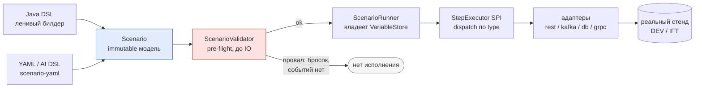
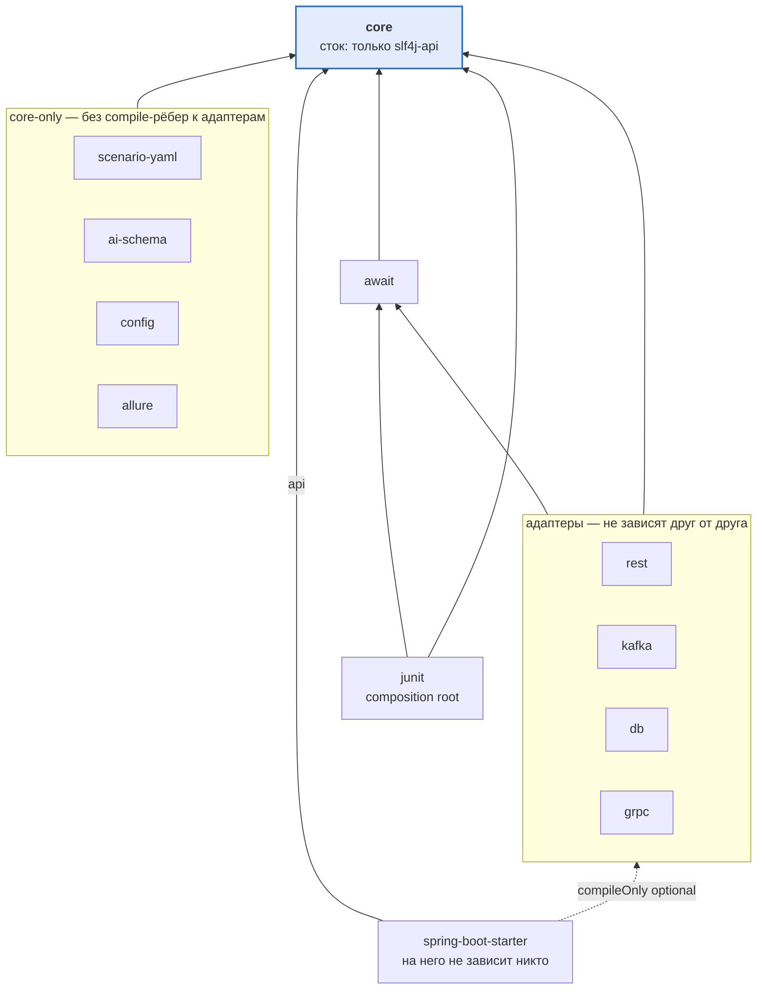
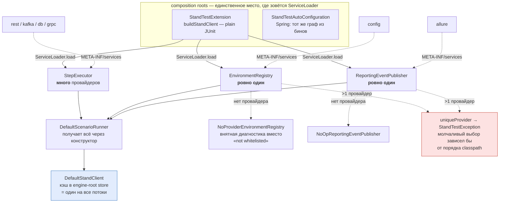
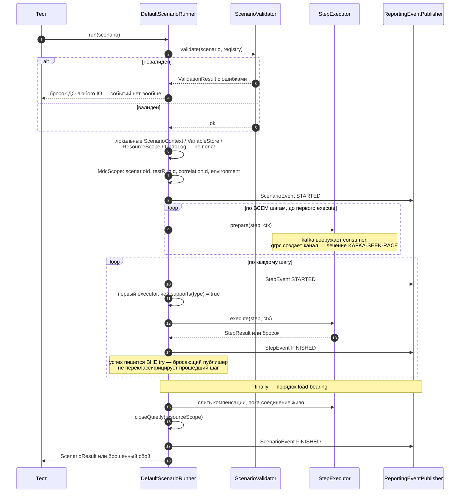
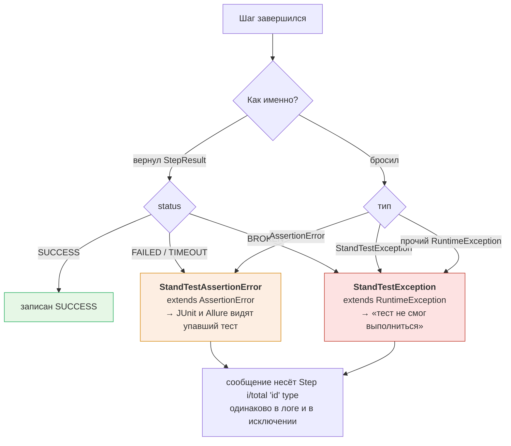

# stand-test-sdk — архитектурный обзор

Документ для тех, кто **дорабатывает сам SDK**. Он описывает, как библиотека устроена внутри, какие
инварианты держат конструкцию и где что менять. Потребительская сторона (подключить, написать тест,
описать стенд) — в корневом [README.md](../../README.md); исчерпывающий источник истины по решениям и
порядку реализации — [stand-test-sdk-implementation-plan.md](stand-test-sdk-implementation-plan.md)
(~120k строк). Этот обзор — компактный вход в них обоих: он не заменяет план, а даёт карту кода.

Версия на момент написания: `ru.alfa.stand.test:0.1.0-SNAPSHOT`, 14 модулей, Gradle 9.3.0,
toolchain JDK 24 при `--release 17`.

---

## 1. Что это за библиотека

`stand-test-sdk` — внутренний Java **test SDK** для интеграционных/e2e автотестов против **реальных
стендов DEV/IFT**. Это намеренно **тонкий фасад** над зрелыми инструментами (Spring WebClient,
`kafka-clients`, JDBC, grpc-java, JUnit 5, Allure), а не собственный транспорт и не Testcontainers.

Фасад существует ради пяти вещей, которые иначе каждая команда решает по-своему и по-разному ломает:

1. **Единая модель сценария** — один immutable `Scenario`, что бы ни было на входе.
2. **Единый механизм ожидания** — никакого `Thread.sleep`; один поллинг-движок с инъецируемым временем.
3. **SDK-owned корреляция** — `scenarioId`/`testRunId`/`correlationId` порождает и проставляет SDK.
4. **Guardrails** — сценарий физически не может обратиться к неразрешённому стенду, зашить секрет или
   выполнить деструктивный SQL.
5. **Формат, безопасный для AI-генерации** — ограниченный декларативный DSL плюс JSON Schema.

---

## 2. Главная идея: одна модель, один исполнитель

Оба входных DSL сходятся в **одну** immutable модель, и исполняется только она. Дублирования рантайма
нет — это центральное архитектурное решение, из которого выводится почти всё остальное:

Следствия, которые надо держать в голове при любой правке:

- **Java DSL ничего не исполняет.** `Scenario.builder(...)` собирает модель и делает ноль IO.
  Императивный eager-IO внутри fluent-цепочки запрещён (`ForbiddenOperation.IMPERATIVE_EAGER_IO`):
  он бы обошёл валидатор, то есть все guardrails разом.
- **Валидатор — единственные ворота.** Он отрабатывает до создания контекста и до любого IO
  (`DefaultScenarioRunner.java:148`). Провал валидации не порождает даже reporting-событий.
- **Раннер не знает ни одного адаптера.** Диспетчеризация — по строке `ScenarioStep.type()` через SPI.

---

## 3. Граф модулей

`A → B` = A зависит от B. Граф ацикличен, `core` — единственный сток.

`bom` — `java-platform` вне compile-графа: он констрейнит версии, но его не импортирует ни один модуль
(обратный импорт дал бы цикл `core → bom → core`). `example` — test-only сток, на него не зависит никто;
у него на classpath лежит весь SDK сразу, поэтому именно там живёт ArchUnit-проверка графа.

| Модуль | Роль | Внешние зависимости main-графа |
|---|---|---|
| `core` | Модель, SPI, контракты, валидация, события | **только `slf4j-api`** |
| `await` | Поллинг-движок, `TimeSource` | `slf4j-api` |
| `junit` | `@StandTest` extension = composition root | — |
| `rest` | REST-шаги | spring-webflux (JDK-коннектор), json-path |
| `kafka` | Kafka-шаги | kafka-clients 3.9.x |
| `db` | DB-шаги | **нет** — чистый `java.sql` (драйвер даёт потребитель) |
| `grpc` | gRPC unary | grpc-java 1.68.x, protobuf 3.25.x |
| `allure` | Sink reporting-событий | allure-java-commons |
| `scenario-yaml` | Оба YAML-фронтенда | snakeyaml |
| `ai-schema` | JSON Schema + правила генерации | **нет** (JDK-only; всё тестовое) |
| `config` | Файловый `EnvironmentRegistry` | snakeyaml |
| `spring-boot-starter` | Boot-3 auto-configuration | spring-boot-autoconfigure |
| `bom` | `java-platform` с constraints | — |
| `example` | Витрина на offline-двойниках | test-only |

**Правила графа, которые не обсуждаются:**

- **`core` — чистый сток.** Ноль рёбер к соседним модулям, ноль IO-библиотек. Единственная санкционированная
  внешняя зависимость — `slf4j-api`: это чистый фасад без биндинга и без IO, поэтому инвариант «JDK-only,
  no IO» выживает, а биндинг поставляет потребитель.
- **Типизированные шаги живут в адаптерах, не в core.** `RestStep`/`KafkaStep`/`DbStep`/`GrpcStep` — в своих
  модулях; core знает только `GenericStep` (строка `type` + map параметров). Именно поэтому у core нет
  compile-time ребра ни к одному адаптеру.
- **Адаптеры не зависят друг от друга.**
- **На starter не зависит никто.**

**Граф запинен тестом, а не соглашением.** `stand-test-example/src/test/java/.../ModuleDependencyArchTest.java` —
ArchUnit по main-байткоду всех модулей (example — единственный модуль, у которого на classpath лежит весь
SDK сразу). Он ловит **фактическое использование** запрещённого ребра, а не просто объявление в Gradle, и
содержит защиту от вырожденности (`SDK.size() > 100`), иначе все `noClasses()`-правила проходили бы
тривиально. Комментарии `Planned internal dependencies` в каждом `build.gradle.kts` должны совпадать с этим графом.

---

## 4. Три SPI и composition roots

Расширяемость держится на трёх интерфейсах core, которые находятся через `java.util.ServiceLoader`:

| SPI | Кто регистрирует | Кардинальность |
|---|---|---|
| `core.execution.StepExecutor` | rest, kafka, db, grpc | **много** (аддитивно) |
| `core.environment.EnvironmentRegistry` | config (или бин в starter) | **ровно один** |
| `core.event.ReportingEventPublisher` | allure (или бин в starter) | **ровно один** |

Регистрация — файлы `META-INF/services/...` в `src/main/resources` каждого модуля.

**Важно: сам `core` ничего не ищет.** `DefaultScenarioRunner` получает `List<StepExecutor>` через
конструктор. `ServiceLoader` вызывается только в composition roots:

- **Plain JUnit** — `StandTestExtension.buildStandClient()` (`stand-test-junit/.../StandTestExtension.java:168`):
  грузит executors, публишер и реестр через один и тот же SPI, собирает
  `DefaultScenarioRunner(executors, new DefaultScenarioValidator(), registry, publisher)` → `DefaultStandClient`.
  Благодаря этому у `junit` **ноль compile-рёбер к адаптерам** (его зависимости — только `core` + `await`).
- **Spring** — `StandTestAutoConfiguration` собирает тот же граф объектов из бинов.

Две детали, за которыми стоит осознанное решение:

- **`uniqueProvider` падает громко** при >1 провайдере на SPI (`StandTestExtension.java:196`): молчаливый
  выбор зависел бы от порядка classpath, то есть запуск вёл бы себя по-разному незаметно для автора.
- **Fallback'и различают «нет провайдера» и «не разрешено».** Без реестра подставляется
  `NoProviderEnvironmentRegistry`, чтобы диагностика говорила «нет провайдера на test classpath», а не
  вводящее в заблуждение «Environment 'ift' is not whitelisted».
- **`StandClient` кэшируется в engine-root store** JUnit — один экземпляр на весь прогон, разделяемый всеми
  параллельными тестовыми потоками. Отсюда контракт: **`StepExecutor` обязан быть stateless и thread-safe**;
  всё per-run состояние ездит в `StepExecutionContext`.

---

## 5. Ядро: модель и состояние

Пакеты `stand-test-core/src/main/java/ru/alfa/stand/test/core/`:

| Пакет | Содержимое |
|---|---|
| *(корень)* | `StandClient` (фасад-контракт), `DefaultStandClient` |
| `scenario` | `Scenario` + ленивый `Builder`, `ScenarioStep`, `GenericStep`, `StepParameterKeys` |
| `execution` | `ScenarioRunner`/`DefaultScenarioRunner`, `StepExecutor`, `StepExecutionContext`, `ResourceScope`, `MdcScope` |
| `context` | `ScenarioContext` — per-run метаданные |
| `variable` | `VariableStore`, `VariableResolver` |
| `environment` | `EnvironmentRegistry`, `*Definition`, `AuthConfig`, `CorrelationConfig`, `SecretReferences` |
| `validation` | `ScenarioValidator`/`DefaultScenarioValidator`, `ForbiddenOperation`, SQL-классификатор |
| `result` | `ScenarioResult`, `StepResult`, `StepStatus` |
| `event` | sealed `ReportingEvent` → `ScenarioEvent`/`StepEvent`, `ReportingEventPublisher`, `Attachment` |
| `assertion` | `AssertionMatcher`, `AssertionMatchers` |
| `compensation` | `CleanupPolicy`, `Compensator`, `UndoLog`, `CompensationOutcome` |
| `exception` | `StandTestException`, `StandTestAssertionError` |
| `identifier` | `ScenarioId`, `TestRunId`, `CorrelationId` |

### Разделение метаданных и переменных — то, что делает параллелизм возможным

Это ключевой контракт (план §8.2), и его легко нарушить не подумав:

- **`ScenarioContext` — immutable метаданные**: `record(ScenarioId, TestRunId, CorrelationId, environment,
  tags, createdAt)`. `ScenarioContext.start(...)` порождает `testRunId`/`correlationId`.
- **`VariableStore` — отдельный mutable объект**, по одному на прогон, которым владеет раннер.
  **Никогда** не static, не глобальный и не `ThreadLocal`.

Всё per-run состояние (`ScenarioContext`, `VariableStore`, `ResourceScope`, `UndoLog`) создаётся внутри
`run(...)` как **локальные переменные** — включая `primary` (пойманное исключение). Раннер — разделяемый
синглтон, поэтому поле вместо локальной переменной здесь означало бы гонку между параллельными прогонами.

`VariableResolver` раскрывает `${name}`: встроенные `scenarioId|testRunId|correlationId|environment` берутся
из контекста, остальное — из store, иначе `StandTestException("Unresolved variable: ...")`. **Раннер сам
переменные не резолвит** — он передаёт `context.resolver()` исполнителям, потому что раннер не делает IO и
не знает, какие поля шага вообще подлежат интерполяции.

### Значимые типы — immutable records

Value-типы — `record` с защитными копиями (`List/Set/Map.copyOf`). Это не стилевое предпочтение: модель
уезжает в разделяемый раннер и в reporting-события, и мутабельность здесь означала бы гонку.

---

## 6. Жизненный цикл прогона

`DefaultScenarioRunner.run(...)` — сердце SDK. Порядок шагов **нагружен смыслом**, менять его нельзя без
понимания, почему он такой:

Тот же порядок словами, с обоснованием каждого шага:

1. **Валидация первой, до любого IO** — `validator.validate(scenario, environmentRegistry).throwIfInvalid()`.
   Провал → событий нет вообще.
2. **Свежее per-run состояние** — новые `ScenarioContext`, `ResourceScope`, `UndoLog`, `VariableStore`.
3. **MDC-скоуп на весь прогон** — `scenarioId`/`testRunId`/`correlationId`/`environment`; на выходе прежний
   MDC восстанавливается, поэтому параллельные прогоны не смешиваются. Затем `ScenarioEvent(STARTED)`.
4. **Проход `prepare`** (`prepareSteps`) — по **всем** шагам в порядке объявления, **до** выполнения первого.
   Это лечение гонки `KAFKA-SEEK-RACE`: consumer'ы должны быть вооружены раньше, чем `rest.post` вызовет
   появление сообщения. Из четырёх адаптеров `prepare` переопределяют только kafka (вооружает consumer) и
   grpc (создаёт канал).
5. **Цикл шагов** → `executeStep`: per-step MDC (`stepId`/`stepType`/`stepIndex`), `StepEvent(STARTED)`,
   резолв исполнителя, `execute`, проверка на null-результат.
6. **Диспетчеризация** — линейный поиск **первого** исполнителя, чей `supports(type)` вернул `true`. Нет
   совпадения → `StandTestException("No step executor registered for step type ...")`.
7. **Запись успеха — вне `try`**: намеренно, чтобы бросающий публишер не мог переклассифицировать
   прошедший шаг или продублировать `StepResult`.
8. **`finally` с нагруженным порядком**: слить компенсации (пока run-scoped соединение ещё открыто) →
   `closeQuietly(resourceScope)` → `ScenarioEvent(FINISHED)` → лог → и только теперь решать вердикт по
   cleanup. Бросить раньше — значит утечь соединение и сломать отчёт. Если cleanup упал на зелёном прогоне —
   бросаем; если прогон уже падал — `addSuppressed`, чтобы настоящая причина не была замаскирована.

**Reporting — best-effort.** Оба `publish` глотают `Throwable` (а не только `RuntimeException`) и пишут WARN:
это защита от `LinkageError`/`NoClassDefFoundError` из рассинхронизированного Allure. Сбой отчётности не
имеет права менять исход теста.

---

## 7. Failure semantics

Правило: **`StepStatus.FAILED` — это запись для отчёта, и она никогда не заменяет собой брошенный сбой.**

Ключ к чтению диаграммы: **оба пути сходятся** — возвращённый failing-статус не остаётся молчаливой записью,
а конвертируется в брошенный сбой с той же классификацией, что и брошенный путь.

| Ситуация | Записывается | Бросается |
|---|---|---|
| Не сошлось ожидание (`FAILED`/`TIMEOUT`) | `FAILED`/`TIMEOUT` | `StandTestAssertionError` (extends `AssertionError`) |
| Инфраструктура/конфиг (`BROKEN`) | `BROKEN` | `StandTestException` (extends `RuntimeException`) |
| Исполнитель бросил `AssertionError` | `FAILED` | `StandTestAssertionError` |
| Исполнитель бросил прочий `RuntimeException` | `BROKEN` | `StandTestException` |

Смысл разделения: `StandTestAssertionError` — это `AssertionError`, поэтому JUnit и Allure видят **упавший
тест**, а не сломанный. `StandTestException` означает «тест не смог выполниться», что при разборе прогона
требует другой реакции.

Политика — **short-circuit**: первый упавший шаг останавливает прогон. Возвращённый failing-статус не
остаётся молчаливым — он конвертируется в брошенный сбой с той же классификацией, что и брошенный путь.
Каждое сообщение несёт `Step [i/total] 'id' (type)` — одинаково в логе и в исключении.

Одно задокументированное исключение: `StandTestException`, уже брошенный из `prepare` (собственный сбой
вооружения адаптера), пробрасывается **без обёртки**, чтобы его точная классификация выжила.

---

## 8. Guardrails: два эшелона от одного источника

**`ForbiddenOperation` — единственный источник истины** (15 кодов: `THREAD_SLEEP`, `HARDCODED_STAND_URL`,
`SECRET_IN_SOURCE`, `NON_WHITELISTED_*`, `DESTRUCTIVE_SQL_WITHOUT_ALLOW`, `UNBOUNDED_TIMEOUT`,
`IMPERATIVE_EAGER_IO`, …). Из него выводятся **оба** эшелона:

1. **Статический** — JSON Schema в `ai-schema` (для AI-генерации).
2. **Рантайм** — `DefaultScenarioValidator`, который **переenforce'ит и value-level правила схемы**
   (секретные заголовки, SQL-sleep, границы таймаутов). Документ, миновавший проверку схемой, встречает ту
   же сеть.

**Анти-дрейф запинен тестами**, а не дисциплиной:

- `ForbiddenOperationCoverageTest` — итерирует `ForbiddenOperation.values()` и требует, чтобы каждый код был
  **строкой таблицы** в правилах генерации, а у 9 кодов в колонке Layer стояло `runtime`.
- `AssertionMatcherCoverageTest` — `containsExactlyInAnyOrder` между ключами схемы и `AssertionMatcher.values()`.
  Добавить матчер только с одной стороны нельзя: схема не может рекламировать то, чего рантайм не исполняет.
- `AiSchemaParityTest` (в example) — замыкает петлю «схема приняла → парсер принял → модель исполнима».

**`EnvironmentRegistry` — точка enforcement whitelist'а.** Он резолвит логические алиасы
(service/topic/datasource/gRPC) в endpoints и **ссылки на секреты, никогда не значения**. Escape-hatch'а нет
by design: сценарий выполняется только против объявленного окружения.

---

## 9. Секреты: refs, value-twins и `literal://`

Модель, в которой легче всего ошибиться, поэтому по пунктам.

**Три написания ссылки** (`SecretReferences`): голое `NAME`, `${NAME}`, `${NAME:default}` (переменная
окружения выигрывает у default'а даже когда пуста — семантика Spring). Резолв — лениво, в адаптере, через
`System::getenv`.

**Value-twins (только starter).** Non-secret ENDPOINT-поля могут нести уже раскрытое Spring'ом значение:
`base-url`/`url`/`target`/`bootstrap-servers`/`security-protocol`. Внутри оно оборачивается в
`SecretReferences.literal(...)`, и адаптер резолвит его verbatim. Twin и `*-ref` **взаимоисключающи** —
задать оба значит уронить старт контекста (`refOrLiteral`).

Секретные поля (пароль/токен auth, пароль datasource, Kafka SASL) **тоже** допускают twin-написание, но с
реальным компромиссом: раскрытый секрет материализуется в Spring `Environment` (actuator `/env`, логи,
дампы), а inline-default лежит в файле репозитория. Поэтому для секретов **`*-ref` остаётся выбором по
умолчанию**: голое ИМЯ, резолвится лениво, в `Environment` не связывается никогда.

**Два жёстких правила:**

- **`literal://` — SDK-внутренний протокол, не написание для конфига.** В пользовательской конфигурации он
  отвергается fail-closed на обоих фронтендах. Оборачивать вправе только starter — Spring уже раскрыл `${VAR:}`.
- **В `*-ref` никогда не кладут `${...}`.** На starter'е Spring схлопнет плейсхолдер до того, как SDK увидит
  ref, и результат будет прочитан как **имя переменной** — ловушка двойного резолва.

Маскирование — **второй эшелон на стороне sink'а**: `SecretMasker` в allure маскирует по именам-маркерам
(`password`, `secret`, `token`, `authorization`, `apikey`, `cookie` — с нормализацией, поэтому `X-Api-Key` и
`Proxy-Authorization` тоже ловятся) и по форме значения (одинокий `Bearer`/`Basic` + 8+ символов → `***`).
Задокументированные пределы: объект/массив под секретным ключом целиком не маскируется, не-JSON `key=value`
не переписывается. Первый эшелон — контракт продюсеров: DEBUG-трейсы адаптеров содержат **только метаданные**,
никогда тела, заголовки, ключи/значения сообщений, текст SQL или связанные значения.

---

## 10. Await

`stand-test-await` — **собственный поллинг-движок; Awaitility отвергнут осознанно**, чтобы потребители SDK
не наследовали и не конфликтовали с транзитивной версией Awaitility.

- `Awaiter.await(policy, probe, condition)` — probe выполняется **на вызывающем потоке**, поэтому
  thread-confined JDBC-соединения и Kafka-consumer'ы остаются конфайнутыми.
- **Ключевая оговорка контракта:** таймаут ограничивает **цикл поллинга, а не отдельный probe**. Блокирующий
  probe блокирует ожидание — поэтому probe обязан нести собственный ограниченный таймаут (например, db
  режет statement timeout по окну ожидания).
- `AwaitResult` **сам по себе не бросает** на таймауте: решение «это провал ожидания или инфраструктура»
  принимает адаптер.
- `TimeSource` (`nanoTime()` + `sleep(nanos)`) — один seam, делающий таймауты детерминированно тестируемыми:
  фейк продвигает собственные показания внутри `sleep` вместо блокировки. Монотонность by design — сдвиг NTP
  не может испортить таймаут.
- `SystemTimeSource` — **единственное место в SDK, где происходит настоящий sleep**: санкционированное
  ожидание между опросами, а не фиксированная пауза.

Структурная деталь: `await` зависит от `core`, но **раннер не зависит от `await`** — ожидание целиком
адаптерная забота. Поэтому guardrail на таймауты живёт в валидаторе (`UNBOUNDED_TIMEOUT`), а не в раннере.

---

## 11. Адаптеры

Все четыре структурно одинаковы: fluent-билдер → core'овский `GenericStep` (строка `type` + map параметров),
плюс stateless `StepExecutor`, зарегистрированный через ServiceLoader. `supports()` везде —
`startsWith(TYPE_PREFIX)`.

| Модуль | `type()` | Транспорт | Корреляция |
|---|---|---|---|
| rest | `rest.get/post/put/delete`, `rest.expectEventually` | WebClient на JDK-коннекторе (без reactor-netty), sync `.block()` | HEADER |
| kafka | `kafka.send`, `kafka.expect` | kafka-clients (`assign`/`seekToEnd`) | **HEADER-only** |
| db | `db.query`, `db.expectEventually`, `db.seed`, `db.cleanup`, `db.write` | чистый JDBC, `DriverManager`, свой `:name`→`?` | **нет** — изоляция через `:testRunId` |
| grpc | `grpc.unary` (только unary) | grpc-java, reflection + `DynamicMessage` | METADATA |

Резолв алиасов везде двухстадийный: **алиас → definition** через `EnvironmentRegistry`, затем **ref → значение**
через `SecretReferences.resolve(ref, System::getenv)`. Run-scoped ресурсы кладутся в `ResourceScope` под
неймспейснутыми ключами (`kafka.consumer:<alias>`, `db.datasource:<alias>`, `grpc.channel:<alias>`).

Инъекция correlationId — общий алгоритм «default-on»: `shouldInject = флаг.orElse(есть ли носитель)`; если
инъекцию форсировали, а носителя в definition нет → `StandTestException`.

**Особенности, за которыми стоят разборы:**

- **rest** — авторизация берётся **только из реестра**: `Authorization` проставляется, когда у endpoint есть
  `AuthConfig`. Auth — свойство сервиса, не выбор шага; inline auth-заголовки в сценариях запрещены
  валидатором. `rest.expectEventually` поллит с `ignoreExceptions(false)`: транспортная ошибка прерывает
  немедленно (инфраструктура), а HTTP 5xx — нормальный ответ и поллится дальше. `firstMismatch(...)` — одна
  реализация и для single-shot, и для предиката поллинга: дрейфу неоткуда взяться.
- **kafka** — `ArmedConsumer`: `arm()` делает `partitionsFor` → `assign` → `seekToEnd` → форсированный
  `position()`, чтобы разрешить ленивый seek ещё в фазе `prepare`. `pollAndSelect` буферизует записи и
  отмечает `partition:offset`, поэтому выбор ведётся по **буферу**, а не по позиции consumer'а — и более
  поздний expect всё ещё может забрать запись с меньшим offset'ом, пропущенную предыдущим дискриминатором.
  Чужие записи (correlation ≠ этот прогон) считаются в `messagesSeen`, но не буферизуются; буфер ограничен
  10 000 → быстрый `StandTestException` вместо медленного таймаута. **Guard на per-run дискриминатор**
  (проверяется и в `prepare`, и в `execute`): `kafka.expect` обязан иметь `correlationIdFromContext()` или
  ключ; **константный** ключ без `${...}` отвергается — два параллельных прогона матчились бы на него оба.
- **db** — `DbWriteGuard` работает **до любого IO**. DESTRUCTIVE/DDL запрещены всегда; WRITE — только для
  `db.seed`/`db.cleanup`, только при `writeAllowed`, только в схему из `allowedSchemas`. UPDATE/DELETE обязаны
  скоупиться через **объявленный** маркер `whereTestRunId`, а не через упоминание `:testRunId` в SQL
  (`DELETE ... WHERE id = :testRunId OR 1=1` бинд упоминает, но не скоупит ничего). Seed-INSERT обязан
  объявить `taggedByTestRunId(col)`, **и эта колонка должна реально присутствовать в списке колонок INSERT** —
  иначе тег ушёл бы в неубираемую колонку. Sleep-функции (`pg_sleep`/`waitfor`/`benchmark`/…) отвергаются на
  **собранном** SQL, что закрывает обход через `sqlResource`, невидимый статическому валидатору.
  Лейн `db.write` + undo-log: только single-row `INSERT ... VALUES`, обязательный `identifiedBy(...)`,
  проверка уникальности ключа через `DatabaseMetaData` **до коммита**; `DbCompensator` перед удалением делает
  pre-count (autoCommit=true ⇒ DELETE необратим): 0 строк ⇒ SKIPPED, >1 ⇒ FAILED и не удаляет **ничего**.
- **grpc** — reflection + `DynamicMessage`, поэтому декларативным сценариям не нужны сгенерированные стабы.
  **Deadline обязателен** — `GrpcStep.build()` падает без него, дефолта не существует; один `Deadline`
  покрывает и reflection-lookup, и сам RPC. Non-OK gRPC-статус → `StandTestException` (**инфраструктура**),
  то есть на статус нельзя написать assert — асимметрия с REST, где 5xx это ответ.

---

## 12. Параллелизм

Модель: **один прогон сценария = один поток**. Параллелятся сценарии/классы, а не шаги одного сценария.

Безопасность обеспечена конструкцией: уникальные `testRunId`/`correlationId` на прогон, собственный
`VariableStore`, уникальная Kafka consumer group (`stand-test-<testRunId>-<topicAlias>`), всё per-run
состояние thread-confined. Один кэшированный `StandClient` разделяется потоками безопасно.

Рекомендуемая конфигурация — классы параллельно, методы последовательно; **только in-JVM** (`maxParallelForks=1`),
так как отдельные JVM гоняли бы фиксированные порты и общее внешнее состояние. Референс — `stand-test-example`.
Опт-аут для неизолируемых тестов: `@StandSerial`, `@StandIsolated`, `@StandParallelSafe` (тонкие фасады над
JUnit'овыми).

---

## 13. Периферия

- **`scenario-yaml`** — две поверхности, **core-only** (адаптеры резолвятся через SPI в рантайме, compile-рёбер нет).
  Surface A (`given`/`then`): узлы — одноключевые мапы `{stepType: {...}}`, обе фазы склеиваются в **один плоский
  список** (фазы — сахар для порядка, а не понятие модели); gRPC отсюда **недостижим**. Surface B (AI, `steps`/`type`):
  плоский список объектов с полем `type`, ключ окружения `environment` (не `env` — поверхности тут расходятся).
  **Surface B сходится на транслятора surface A**, поэтому оба фронтенда дают байт-идентичные `GenericStep`.
  Парсер только строит модель: ноль IO, `${...}` остаются нетронутыми для рантайм-резолвера. Хардening общий
  (`SafeYaml`, чтобы не дрейфовал): `SafeConstructor` (никакой инстанциации произвольных типов),
  `allowDuplicateKeys=false`, лимиты алиасов и глубины.
- **`ai-schema`** — main-граф JDK-only (core, Jackson, networknt — всё `testImplementation`, поэтому Jackson
  не попадает в main). Публикуемый артефакт — сама схема + правила генерации. Ценность модуля в кросс-чек-тестах (§8).
- **`config`** — `FileEnvironmentRegistry` (SPI-провайдер для plain JUnit), **ленивый**: `ServiceLoader`-дискавери
  остаётся свободной от файлового IO, поэтому битый конфиг всплывает при первом использовании, а не ломает
  дискавери через `ServiceConfigurationError`. Порядок источников: system property → classpath
  `stand-test-environments.yml` → секция `stand.test.environments` в `application.yml` (тот же формат, что
  биндит starter — «один стиль конфигурации на два мира») → пустой реестр. Хранит **только ссылки**.
- **`spring-boot-starter`** — `@AutoConfiguration`, выключается `stand.test.enabled=false`. Адаптеры —
  `compileOnly` optional: starter компилируется против их типов, но **не реэкспортирует** их, поэтому
  webflux/kafka/grpc/allure не попадают на classpath потребителя без спроса. Конфигурации под адаптеры
  **вложенные** не для красоты: Spring читает конфиг-класс через ASM, и резолв сигнатуры `@Bean`-метода с
  отсутствующим в classpath типом бросил бы `NoClassDefFoundError` **раньше**, чем сработает method-level
  `@ConditionalOnClass`. По умолчанию реестр пуст → сценарий падает быстро: starter никогда не подключается
  к стенду молча.
- **`allure`** — не listener, а **push-sink** через SPI; Allure-типы не протекают (`implementation`).
  `allure-junit5` намеренно **не** зависимость: закрытие Allure test case — забота потребителя, иначе JUnit
  оказался бы на classpath чистого reporting-модуля. Двойная защита: каждый `publish` ловит `Throwable`
  (второй эшелон после раннера). `TIMEOUT` мапится в Allure `FAILED`. Контракт вложений намеренно
  транспорт-агностичен (TEXT/JSON/XML/SQL/BINARY/KEY_VALUE — никаких REST/Kafka/DB-видов).
- **`bom`** — `java-platform`, скипается root-блоком `subprojects` (`java-platform` несовместим с `java-library`).
  Констрейнит 12 публикуемых модулей + `slf4j-api` + курируемые third-party. **Не** констрейнит Spring Boot
  (им владеет BOM потребителя) и тестовые либы. Жёсткое правило: констрейнимый модуль **не импортирует BOM
  обратно** — это дало бы цикл `core → bom → core`.
- **`example`** — test-only витрина на offline-двойниках (JDK `HttpServer`, H2, реальный gRPC-сервер с
  reflection, Kafka `MockProducer`/`MockConsumer` через seam `KafkaClientFactory`, `AdvancingTimeSource`).
  Прогоняет SDK **как чёрный ящик через публичный API**, поэтому `./gradlew build` зелёный офлайн. Здесь же
  живут два кросс-модульных guard'а: `ModuleDependencyArchTest` и `AiSchemaParityTest`. Единственный тест,
  который не удалось задублить, — `KafkaExampleTest` (`kafka.expect` вооружает настоящий consumer): тег
  `requires-broker`, исключён из дефолтного прогона.

---

## 14. Инварианты — чек-лист контрибьютора

Нарушение любого из них ломает конструкцию, а не только тест:

- [ ] В `core` не приехали адаптер/IO-библиотеки, Spring, Allure, YAML или бизнес-логика.
- [ ] Типизированный шаг добавлен **в адаптер**, а не в core.
- [ ] Новый `StepExecutor` **stateless и thread-safe**; per-run состояние — только в `StepExecutionContext`.
- [ ] Per-run состояние — локальные переменные, не поля разделяемого синглтона; никаких static/`ThreadLocal`.
- [ ] `FAILED` не подменяет собой брошенный сбой; assertion → `StandTestAssertionError`, инфра → `StandTestException`.
- [ ] Новый guardrail заведён в `ForbiddenOperation` и покрыт **обоими** эшелонами (схема + рантайм-валидатор).
- [ ] Новый матчер добавлен и в `AssertionMatcher`, и в схему (иначе падает `AssertionMatcherCoverageTest`).
- [ ] Секреты не попадают в логи/вложения; DEBUG адаптера — только метаданные.
- [ ] Ссылка на секрет не резолвится жадно; `literal://` в пользовательском конфиге отвергается.
- [ ] Никакого `Thread.sleep` — ожидание только через `Awaiter`; probe несёт собственный таймаут.
- [ ] Value-типы immutable, с защитными копиями.
- [ ] Исходники 17-совместимы (`--release 17`): нет Sequenced-collections, `Math.clamp`, record-patterns.
- [ ] Checkstyle zero-tolerance: AssertJ вместо JUnit-assertions, без `@NotNull`-аннотаций, `System.out` запрещён.
- [ ] Покрытие ≥80% INSTRUCTION (JaCoCo-гейт вшит в `check`).

---

## 15. Как добавить новый шаг или адаптер

**Новая операция в существующем адаптере:**
1. Значение `type()` в enum операций модуля (`RestMethod`/`KafkaOperation`/`DbOperation`/`GrpcOperation`).
2. Фабрика + поля в билдере шага; `build()` собирает `GenericStep` с ключами из `*StepParameters`.
3. Ветка в `execute()` исполнителя; если нужно вооружение до прогона — `prepare()`.
4. Если операция достижима из декларативного формата: транслятор в `scenario-yaml`, тип в
   `AiStepNormalizer` и в JSON Schema (иначе кросс-чек-тесты упадут).

**Новый адаптер (новый транспорт):**
1. Модуль зависит **только** от `core` (+`await` при ожиданиях) — никаких рёбер к другим адаптерам.
2. Билдер шага + `*StepParameters` + stateless `StepExecutor` с `supports(prefix)`.
3. Регистрация в `META-INF/services/ru.alfa.stand.test.core.execution.StepExecutor`.
4. Алиас и `*Ref` в модели `environment` core + маппинг **в обоих** фронтендах (`config` и starter) —
   их паритет пинится `EnvironmentRegistryParityTest`.
5. Коды `NON_WHITELISTED_*` в `ForbiddenOperation` + проверки в валидаторе.
6. Ресурсы — в `ResourceScope` под неймспейснутым ключом, **до** любой операции, которая может бросить.
7. Ребро в `ModuleDependencyArchTest`, версии в каталог и в BOM, вложенная конфигурация в starter
   (`@ConditionalOnClass`, `compileOnly`), офлайн-двойник в `example`.

---

## 16. Известные асимметрии и долги

Не «баги», а осознанные границы MVP — но знать их надо, потому что они ловушки для ожиданий:

1. **Kafka — единственный equals-only адаптер.** У REST и gRPC полный набор из 5 матчеров
   (`EQUALS/CONTAINS/EXISTS/NOT_NULL/MATCHES`) и wire-ключ `MATCHER`; у `KafkaAssertion` поля матчера нет
   вообще, а `AiStepNormalizer` отвергает любой не-`equals` матчер на `kafka.expect`. `GrpcAssertion`
   сохраняет двухаргументный конструктор с дефолтом `EQUALS` — compat-шим со времён, когда gRPC был equals-only.
2. **Числовая коэрсия продублирована**: `MessageAssertions.valuesMatch` (kafka) переизобретает то, что core'овский
   `AssertionMatchers` уже делает для REST/gRPC. Семантика та же, копии две.
3. **DB-ассерты другой формы**: без JSONPath — один `expectValue` против первой колонки однострочного SELECT;
   captures по **имени колонки**. `db.expectEventually` требует ровно одну строку (>1 ⇒ «ambiguous»).
4. **Корреляция покрыта неравномерно**: rest=HEADER, kafka=HEADER-only (KEY/PAYLOAD_FIELD не реализованы),
   grpc=METADATA, db — нет вовсе.
5. **Таймауты**: rest/kafka/db дефолтят в 30 000 ms; у gRPC дефолта **нет** — deadline обязателен на build-time.
6. **Статус транспорта**: REST 5xx — ответ (можно ассертить), non-OK gRPC — всегда инфраструктура (ассертить нельзя).
7. **`db.write` MVP**: только INSERT, только single-row `VALUES`, ключи, генерируемые БД, не поддержаны;
   undo для UPDATE/DELETE отложен.
8. **gRPC — plaintext-only** (`usePlaintext()`), тогда как REST-auth и Kafka SASL/SSL идут из реестра. Streaming вне скоупа.
9. **`prepare()` использует 2 адаптера из 4** (kafka, grpc); rest/db — no-op.
10. **gRPC недостижим из surface A** (`given`/`then`) — только из AI-формата.
11. **Публикация endpoint-less**: проводка готова, реальные координаты Nexus/Artifactory и первый прогон
    публикации остались.

---

## 17. Карта: где что искать

| Задача | Файл |
|---|---|
| Понять исполнение | `stand-test-core/.../execution/DefaultScenarioRunner.java` (Javadoc — полный контракт) |
| Контракт SPI | `stand-test-core/.../execution/StepExecutor.java` |
| Сборка графа (plain JUnit) | `stand-test-junit/.../StandTestExtension.java:168` |
| Сборка графа (Spring) | `stand-test-spring-boot-starter/.../StandTestAutoConfiguration.java` |
| Guardrails | `stand-test-core/.../validation/ForbiddenOperation.java` + `DefaultScenarioValidator.java` |
| Секреты | `stand-test-core/.../environment/SecretReferences.java` |
| Правила графа | `stand-test-example/src/test/java/.../ModuleDependencyArchTest.java` |
| Решения по DB | `docs/arch/stand-test-db-decisions.md`, `stand-test-db-rollback-design.md` |
| Источник истины | `docs/arch/stand-test-sdk-implementation-plan.md` |
