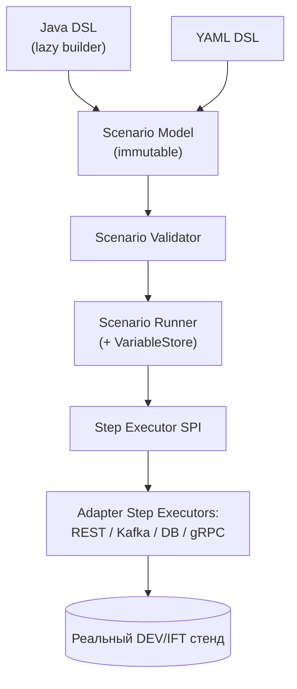
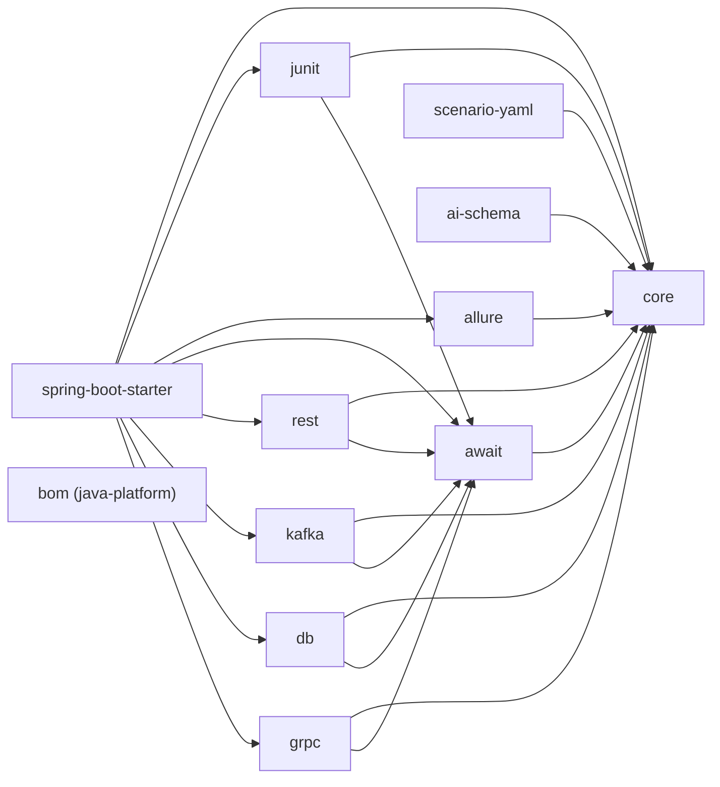

# stand-test-sdk — План реализации

> Статус: **Draft / Proposed** (2026-06-26). Архитектурный план реализации внутренней
> библиотеки стендовых автотестов `stand-test-sdk`.
> Этот документ — источник истины для последующей реализации. На данном этапе **код SDK не
> пишется**: все «будущие сущности» (`ScenarioContext`, `Awaiter`, `@StandTest`, …) описаны
> только по имени и зоне ответственности.
> Координаты артефактов: group `ru.alfa.stand.test`, текущая версия `0.1.0-SNAPSHOT`
> (далее в примерах — `<version>`), базовый пакет `ru.alfa.stand.test.<module>`.

---

## 1. Назначение библиотеки

`stand-test-sdk` — это **тонкий SDK/фасад** для написания автотестов против **реальных
DEV/IFT-стендов** (не Testcontainers как основа). Библиотека подключается как test-зависимость и
даёт единый стиль описания интеграционных и e2e бизнес-флоу, в которых одновременно участвуют REST,
Kafka, проверки БД, gRPC, асинхронные ожидания, отчётность Allure и JUnit 5.

**Проблема, которую решаем.** Сейчас стендовые автотесты пишутся вразнобой: у каждой команды свой
способ дернуть REST, прочитать из Kafka, сходить в БД, «подождать» эффект (часто `Thread.sleep`),
прикрепить артефакты в отчёт. Результат — flaky-тесты, несравнимые отчёты, скрытые подключения к
неописанным стендам, секреты в коде и невозможность безопасно генерировать тесты AI-агентом.

**Что библиотека фиксирует как НЕ-цели (важно):**

- **Не заменяет JUnit 5 как test engine.** Жизненный цикл и запуск остаются за JUnit; SDK
  интегрируется в него через extension. Но **SDK-level assertions пробрасываются как
  JUnit-compatible failures через `AssertionError`** (см. [§8.3 Result and failure semantics](#83-result-and-failure-semantics)) —
  то есть SDK не «отдаёт ассерты JUnit», а поднимает свои несоответствия так, чтобы JUnit/Allure
  трактовали их нативно как падение теста.
- **Не заменяет RestAssured / HTTP-клиенты / Kafka-клиенты / JDBC / gRPC / Allure.** Под капотом —
  зрелые инструменты; SDK не пишет свой транспорт и свой репортер.
- **Является тонким SDK/фасадом** поверх зрелых инструментов: единый вход, единый контекст,
  единые ожидания и отчётность.
- **Нужна для единого стиля** стендовых автотестов: один словарь, одни идентификаторы, один
  await-механизм, один формат отчёта.
- **Нужна для безопасной генерации автотестов AI-агентом**: декларативный ограниченный формат и
  guardrails, не дающие сгенерировать произвольный/опасный код.

---

## 2. Что библиотека должна стандартизировать

Правила (инварианты), которые SDK обязан задавать и по возможности форсить:

1. **`scenarioId`** — у каждого сценария есть стабильный идентификатор.
2. **`testRunId`** — у каждого запуска есть уникальный идентификатор прогона.
3. **`correlationId` принадлежит SDK.** Генерируется SDK в начале прогона сценария, входит в
   `ScenarioContext` и **инжектится исходящим** в REST/Kafka/gRPC (для БД — используется в
   query/assert/cleanup, если применимо). Capture `correlationId` из ответа сервиса допустим только
   как fallback/compatibility-режим (см. [§8.4](#84-correlationid-ownership-и-outbound-injection)).
4. **Только общий await-механизм.** Все ожидания асинхронных эффектов идут через единый `Awaiter`
   (см. [§4 stand-test-await](#stand-test-await)).
5. **Запрещён `Thread.sleep`.** Прямые фиксированные паузы недопустимы.
6. **Запрещены fixed test-data ids.** Данные генерируются/каптятся в рамках прогона, не хардкодятся.
7. **Запрещены произвольные подключения к неописанным стендам.** Только окружения и логические
   алиасы из whitelisted-конфигурации (`@StandEnv` / env-конфиг, см.
   [§9 Configuration / Environment model](#9-configuration--environment-model)).
8. **Секреты не хранятся в коде и в yaml.** Только внешние источники (env vars / secret manager /
   CI-secret); yaml и Java ссылаются на ключ (secret reference), а не значение.
9. **БД — слой probe/assertion, а не обход публичного поведения сервиса.** Если у сервиса есть
   публичный API/событие — проверяем через них; БД для зондов/ассертов.
10. **Cleanup явный или soft.** Очистка только явная, либо soft-cleanup по `testRunId` (помечаем и
    подчищаем данные прогона), без «широких» destructive-операций.

---

## 3. Архитектурный принцип

Целевая схема исполнения — единый конвейер от описания сценария к реальному стенду:



**Ключевой принцип — единая внутренняя модель.** **Java DSL** и **YAML DSL** — это два *входа*,
которые приводятся к **одной** внутренней `Scenario Model`. Дальше валидация, раннер, исполнители
шагов и адаптеры работают **только** с этой моделью. Так runtime-логика не дублируется: добавление
шага/возможности делается один раз на уровне модели и исполнителей, а оба DSL получают его «бесплатно».

**Java DSL — это lazy builder.** Он не исполняет IO в fluent-chain, а **строит** immutable
`Scenario Model`, которая затем проходит тот же `Scenario Validator` + `Scenario Runner`, что и YAML
(контракт зафиксирован в [§8.1](#81-single-scenario-model-pipeline)). Императивные API,
выполняющие реальный вызов прямо в цепочке, **запрещены** — они обходят валидатор и guardrails.

Слои и их роли:

- **Java DSL / YAML DSL** — поверхностный синтаксис описания сценария (см. черновики в §10 и §11).
- **Scenario Model** — неизменяемое типизированное представление сценария (шаги, параметры,
  ожидания, ассерты, метаданные `scenarioId`/`testRunId`/`correlationId`/`environment`).
- **Scenario Validator** — статическая проверка модели до запуска (обязательные поля, ссылки на
  переменные, whitelisting стендов/датасорсов/схем, запрет небезопасных операций — единый список
  forbidden operations, см. [§8.6](#86-forbidden-operations--единый-источник-истины)).
- **Scenario Runner** — оркестрация исполнения шагов, владение контекстом и `VariableStore`
  (см. [§8.2](#82-scenariocontext-variablestore-и-captureresolve)).
- **Step Executor SPI** — контракт исполнителя шага (живёт в `core`); конкретные реализации — в
  адаптерах.
- **Adapter Step Executors (REST/Kafka/DB/gRPC)** — тонкие обёртки над зрелыми клиентами;
  единственная точка реального IO к стенду.

---

## 4. Модули и ответственность

Для каждого модуля: назначение · что входит · чего быть не должно · внутренние зависимости ·
допустимые внешние зависимости · MVP · отложено. Точные версии внешних библиотек фиксируются
поитерационно; принцип — **тонкий фасад поверх зрелых инструментов**, без собственного транспорта.
Распределение компонентов конвейера (модель/валидатор/раннер/SPI/фасад) по модулям зафиксировано в
[§8.5 Module ownership](#85-module-ownership-validator-runner-step-executor-spi-standclient).

### stand-test-bom

- **Назначение.** Управление версиями модулей SDK и согласованным набором внешних библиотек.
- **Входит.** `java-platform`-платформа: constraints на все `stand-test-*` и (опционально) на
  курируемые версии внешних инструментов.
- **Не должно входить.** Любой код, ресурсы, `src/`. BOM ничего не «реализует».
- **Внутренние зависимости.** Нет (платформа объявляет constraints по координатам).
- **Внешние зависимости.** Нет.
- **MVP.** Минимальная заготовка-платформа; constraints наполняются по мере появления утверждённого
  списка зависимостей (см. [§13 Publishing & Versioning](#13-publishing--versioning)).
- **Отложено.** Re-export сторонних BOM (Spring Boot и т.п.) — до момента, когда появятся реальные
  зависимости.

### stand-test-core

- **Назначение.** Базовая модель сценария и контекста, SPI и базовые контракты — фундамент графа
  модулей. Только модели, интерфейсы и базовые контракты, **без** конкретной реализации
  REST/Kafka/DB/gRPC.
- **Входит (будущие контракты, только описание).**
  - `Scenario`, `ScenarioStep` (generic-модель шага: тип + типизированные параметры);
  - `ScenarioContext` (immutable metadata), `ScenarioId`, `TestRunId`, `CorrelationId`,
    `Environment` (в Итерации 1 реализован как `String` — принятое отклонение, см. §21);
  - `VariableStore` (mutable runtime-хранилище переменных), `VariableResolver`;
  - `ScenarioValidator`, `ValidationResult`;
  - `ScenarioRunner` (interface/SPI), `StepExecutor` SPI, `StepExecutionContext`;
  - `StepResult`, `ScenarioResult`, `StepStatus`;
  - `StandClient` (контракт-фасад);
  - `ForbiddenOperation` (единый источник истины запрещённых операций);
  - `EnvironmentRegistry` контракты (резолв логических алиасов → endpoint + secret-ref);
  - `StepEvent` / `ReportingEvent` SPI (для Allure и логов);
  - `StandTestException` (инфраструктурные ошибки), `StandTestAssertionError` (ассерты);
  - неизменяемые value-объекты.
- **Не должно входить.** Реализации адаптеров (REST/Kafka/DB/gRPC), JUnit-зависимости, Spring,
  YAML-парсер, отчётность — только абстракции, модель и SPI.
- **Внутренние зависимости.** Нет (сток графа).
- **Внешние зависимости.** Минимум: SLF4J (api). JSON/JSONPath-биндинг — на уровне адаптеров, не в
  core.
- **MVP.** Да — value-объекты, контекст, `VariableStore`/resolver, result/status-модели, базовые
  исключения, `ScenarioValidator`/`ScenarioRunner`/`StepExecutor` SPI, `StandClient`-контракт,
  reporting-event SPI.
- **Отложено.** Расширенная модель условий/ветвлений сценария; продвинутый data-generator.

### stand-test-await

- **Назначение.** Единый механизм ожиданий асинхронных эффектов.
- **Входит (будущие сущности).** `AwaitPolicy`, `AwaitResult`, `Awaiter`, `TimeoutDiagnostics`.
- **Обязательные свойства.** **никаких `Thread.sleep`**; **configurable timeout**; **poll interval**;
  **diagnostics on timeout** (что ждали, сколько попыток, последнее наблюдаемое состояние).
- **Не должно входить.** Любая транспортная логика (await не знает про REST/Kafka/DB напрямую — он
  ждёт переданный предикат/поставщик значения).
- **Внутренние зависимости.** `stand-test-core`.
- **Внешние зависимости.** SLF4J; опционально Awaitility как зрелый движок поллинга (фасад, а не своя
  реализация с нуля).
- **MVP.** Да — централизованная политика ожидания, timeout, polling, diagnostics.
- **Отложено.** Адаптивные/backoff-стратегии, бюджет ожиданий на сценарий.

### stand-test-junit

- **Назначение.** Интеграция с JUnit 5 (bridge JUnit ↔ контекст/раннер SDK).
- **Входит (будущие сущности).** Аннотации `@StandTest`, `@StandEnv`, `@ScenarioId`; extension
  `StandTestExtension` (инициализация контекста, lifecycle, проброс `testRunId`/`correlationId`,
  предоставление `StandClient` как параметра теста); запуск сценария через `ScenarioRunner`;
  преобразование SDK-падений (`StandTestAssertionError`/`StandTestException`) в JUnit-failures.
- **Не должно входить.** Бизнес-ассерты, транспорт, отчётность — только мост «JUnit ↔ контекст SDK».
- **Внутренние зависимости.** `stand-test-core`, `stand-test-await`.
- **Внешние зависимости.** `junit-jupiter-api` (JUnit 5).
- **MVP.** Да — extension, аннотации, lifecycle, инициализация контекста, предоставление
  `StandClient` без Spring.
- **Отложено.** Параметризованные сценарии, интеграция с YAML-источниками сценариев.

### stand-test-rest

- **Назначение.** REST-вызовы и проверки. Содержит typed step-модель (`RestStep`) и REST
  `StepExecutor` (см. [§8.5](#85-module-ownership-validator-runner-step-executor-spi-standclient)).
- **Входит (будущие возможности).** GET/POST/PUT/DELETE; headers; auth; outbound-инъекция
  `correlationId` (header, имя — из env-конфига); JSONPath-ассерты; capture
  переменных из ответа в `VariableStore`; attachments запроса/ответа в отчёт.
- **Не должно входить.** Собственный HTTP-клиент с нуля; бизнес-логика сервисов.
- **Внутренние зависимости.** `stand-test-core`, `stand-test-await`.
- **Внешние зависимости.** Зрелый HTTP-клиент (RestAssured / OkHttp / `java.net.http`), Jackson,
  JSONPath.
- **MVP.** Да — минимальные GET/POST, outbound correlationId, JSON-ассерты, capture переменных.
- **Отложено.** Полный набор методов/auth-флоу, multipart, ret- и redirect-политики.

### stand-test-kafka

- **Назначение.** Kafka send/expect/assert для стендовых сценариев. Содержит typed step-модель
  (`KafkaStep`) и Kafka `StepExecutor`.
- **Входит (будущие возможности).** send JSON-сообщения с outbound `correlationId`; expect сообщение
  из топика; фильтр по key; фильтр по `correlationId`; фильтр по JSONPath; timeout-diagnostics;
  attach потреблённых сообщений в отчёт.
- **Базовая offset-стратегия (обязательно для MVP).**
  - `group.id` уникален **на прогон сценария** (включает `testRunId`), не переиспользуется между
    тестами;
  - перед триггерящим действием консьюмер уже подготовлен: `subscribe`/`assign` → **`seekToEnd`
    (start-from-now)** → выполняется действие → `poll` до timeout;
  - явный риск **`KAFKA-SEEK-RACE`**: если позицию консьюмера не зафиксировать **до** действия,
    ожидаемое сообщение можно пропустить (см. [§15](#15-parallel-execution-and-isolation) и
    [§19 риски](#19-риски));
  - при timeout в отчёт прикладывается диагностика: topic; partition(s); offsets; число
    просмотренных сообщений; критерии фильтра; сэмпл последних сообщений.
- **Не должно входить.** Собственный Kafka-клиент; бизнес-обработчики; продакшн-конфигурация
  ретраев/DLQ.
- **Внутренние зависимости.** `stand-test-core`, `stand-test-await`.
- **Внешние зависимости.** `kafka-clients` (Apache, raw — для контроля assign/seek), Jackson, JSONPath.
- **MVP.** Да — send JSON, expect JSON, фильтр по `correlationId`/key, базовая offset-стратегия,
  timeout-diagnostics.
- **Отложено.** Сложные offset/commit-стратегии, batch-проверки, schema-registry/Avro.

### stand-test-db

- **Назначение.** Слой seed/probe/assertion для БД. Содержит typed step-модель (`DbStep`) и DB
  `StepExecutor`. **Сначала — probe/assertion-слой, а не generic DB-клиент**: запись поддерживается
  только как ограниченная подготовка тест-данных.
- **Входит (будущие возможности).** seed-скрипты; query; await-query; expect row exists; expect single
  value; cleanup по `testRunId`.
- **Ограничения безопасности (обязательно).**
  - **datasource whitelist** — только описанные датасорсы из env-конфига;
  - **schema whitelist** — seed/cleanup пишут только в разрешённые схемы (`allowedSchemas`);
  - **readonly по умолчанию**; seed/cleanup требуют **explicit write-allow** (флаг датасорса
    `writeAllowed` в env-конфиге + явный шаг);
  - **destructive SQL запрещён по умолчанию** и требует **explicit allow flag**;
  - **что считается destructive:** `delete` без фильтра по `testRunId`; `truncate`; `drop`;
    `update` без фильтра по `testRunId`; любой `insert`/`update`/`delete` вне whitelisted-схемы;
  - **seed помечает данные `testRunId`** (если таблица/модель это поддерживает);
  - **cleanup работает по `testRunId`** (soft-cleanup, без «широких» операций);
  - **shared mutable test data запрещены** (см. [§15](#15-parallel-execution-and-isolation));
  - **БД не становится основным способом проверки бизнес-логики**, если есть публичный API/событие.
- **Не должно входить.** ORM/доменные репозитории сервиса; «широкие» destructive-операции;
  обход публичного поведения; generic-режим «произвольный SQL к произвольной БД».
- **Внутренние зависимости.** `stand-test-core`, `stand-test-await`.
- **Внешние зависимости.** JDBC (`java.sql`), драйвер предоставляет потребитель; опционально
  HikariCP/Spring-JDBC как тонкий помощник.
- **MVP.** Да — query, await-query, expect single value, seed (write-allow), черновик
  cleanup-стратегии по `testRunId`.
- **Отложено.** Полноценный безопасный движок cleanup, миграционные сиды, multi-datasource транзакции.

### stand-test-grpc

- **Назначение.** gRPC-вызовы и проверки. Содержит typed step-модель (`GrpcStep`) и gRPC
  `StepExecutor`.
- **Входит (будущие возможности).** unary-вызовы; metadata (включая outbound `correlationId`);
  deadlines; protobuf-ассерты; capture полей.
- **Не должно входить.** Собственный gRPC-стек; генерация контрактов сервиса; streaming на старте.
- **Внутренние зависимости.** `stand-test-core`, `stand-test-await`.
- **Внешние зависимости.** `grpc-java` (`io.grpc`), `protobuf-java`.
- **MVP.** Не входит в MVP (см. §6) — модуль-каркас, реализация позже.
- **Отложено.** Streaming (client/server/bidi), сложные deadline/retry-политики.

### stand-test-allure

- **Назначение.** Единые отчёты. Listener/consumer для `StepEvent` / `ReportingEvent` (см.
  [§17 Logging and observability](#17-logging-and-observability)); **Allure не является
  hard-зависимостью core**.
- **Входит (будущие возможности).** Каждый шаг как Allure step; attachments REST request/response;
  attachments Kafka-сообщений; attachments SQL query/result; attachments gRPC request/response;
  переменные; `testRunId`/`correlationId`/`scenarioId` в отчёте; timeout-diagnostics из await в отчёт.
- **Не должно входить.** Транспорт; ассерты; бизнес-логика — только отчётность/диагностика.
- **Внутренние зависимости.** `stand-test-core` (метаданные/события шагов через reporting-event SPI).
- **Внешние зависимости.** `allure-java-commons` / `allure-junit5`.
- **MVP.** Да — step-репортинг, attachments, метаданные сценария, проброс timeout-диагностики.
- **Отложено.** Кастомные категории дефектов, агрегированные дашборды.

### stand-test-spring-boot-starter

- **Назначение.** Удобная автоконфигурация для Spring Boot тестовых проектов.
- **Важно.** **Core SDK не должен зависеть от Spring Boot.** Starter — отдельный удобный модуль,
  который связывает нужные runtime-модули в Spring-тест-контекст. Плагин `org.springframework.boot`
  **не** применяется (это библиотека, а не bootable-приложение). В MVP `StandClient` доступен и без
  Spring — через `StandTestExtension` (см. stand-test-junit); `@Autowired StandClient` — это
  post-MVP удобство этого стартера.
- **Входит (будущее).** Auto-configuration, бины-обёртки `StandClient`/адаптеров, биндинг конфигурации
  окружений.
- **Не должно входить.** Реализация адаптеров; зависимость core/адаптеров от starter (только в одну
  сторону).
- **Внутренние зависимости.** Нужные runtime-модули (`core`, `junit`, `allure`, `await`, адаптеры) —
  **никогда наоборот**.
- **Внешние зависимости.** `spring-boot-autoconfigure`, `spring-boot`.
- **MVP.** Не входит в MVP (см. §6).
- **Отложено.** Весь модуль до стабилизации core и адаптеров.

### stand-test-scenario-yaml

- **Назначение.** YAML DSL для описания сценариев.
- **Важно.** YAML нужен в первую очередь для **AI-generated tests** и **ограниченного декларативного
  формата**. Это второй вход в ту же `Scenario Model` (§3).
- **Входит (будущее).** Парсер YAML → generic `Scenario Model` (`ScenarioStep` по типу шага); план
  раннера declarative-сценариев. Исполнители резолвятся через `StepExecutor` SPI в рантайме.
- **Не должно входить.** Дублирование runtime-логики (раннер один — общий, на уровне core);
  произвольные «escape в Java»; **compile-time рёбра на адаптеры**.
- **Внутренние зависимости.** **Только `stand-test-core`** (раннер достаёт адаптеры через core-SPI,
  инжектируемые в рантайме, — это **не** compile-time ребро на адаптеры).
- **Внешние зависимости.** SnakeYAML / `jackson-dataformat-yaml`.
- **MVP.** Не входит в MVP (только дизайн на итерации 9, §7).
- **Отложено.** Полноценный YAML-runner.

### stand-test-ai-schema

- **Назначение.** JSON Schema, правила и ограничения для AI-агента.
- **Важно.** AI-агент **не должен генерировать произвольный Java-код**, если сценарий можно описать
  декларативно. Модуль задаёт схему допустимого YAML-сценария и перечень запрещённых операций,
  **генерируя** ограничения из единого источника истины в core (`ForbiddenOperation`,
  `EnvironmentRegistry`), а не ведя отдельный список (см.
  [§8.6](#86-forbidden-operations--единый-источник-истины)).
- **Входит (будущее).** JSON Schema модели сценария; правила/guardrails генерации; список forbidden
  operations, **производный** от core-контракта.
- **Не должно входить.** **Зависимости от runtime-модулей** (адаптеров) и от `scenario-yaml`;
  исполнение сценариев.
- **Внутренние зависимости.** Только модель `stand-test-core`, **без** runtime/адаптеров и **без**
  `scenario-yaml`.
- **Внешние зависимости.** Инструмент работы с JSON Schema (например, `networknt/json-schema-validator`).
- **MVP.** Не входит в MVP.
- **Отложено.** Весь модуль до стабилизации YAML DSL.

---

## 5. Dependency graph

Стрелка `A → B` читается как «**A зависит от B**». `stand-test-core` — единственный сток (ни от чего
не зависит). Граф ацикличен.



Правила графа:

- `stand-test-core` **не зависит** от адаптеров (он их сток через SPI).
- `stand-test-await` → `core`.
- `stand-test-junit` → `core`, `await`.
- `stand-test-rest` → `core`, `await`.
- `stand-test-kafka` → `core`, `await`.
- `stand-test-db` → `core`, `await`.
- `stand-test-grpc` → `core`, `await`.
- `stand-test-allure` → `core`.
- `stand-test-scenario-yaml` → **только `core`** (адаптеры — через core-SPI в рантайме, **без**
  compile-time ребра на конкретные адаптеры → нет дублирования раннера).
- `stand-test-ai-schema` → **только модель `core`**, **не** зависит от runtime/адаптеров и от
  `scenario-yaml`.
- `stand-test-spring-boot-starter` → нужные runtime-модули, **никогда наоборот**.
- adapter-модули **не зависят друг от друга**.
- `stand-test-bom` — платформа управления версиями (не участвует в compile-графе модулей; импортируется
  только внешними потребителями).

> Примечание (scaffold). Сейчас в `build.gradle.kts` модулей рёбра `project(...)` ещё не активированы
> (живут как комментарии-заготовки). Комментарии `Planned internal dependencies` приведены **к этому
> графу** (в частности: `scenario-yaml` → только `core`; `ai-schema` → только `core`, без
> `scenario-yaml` и адаптеров). При реализации рёбра добавляются строго по этому графу. Сверка
> комментариев скаффолда с целевым графом выполнена (см. [§20 анти-правила](#20-что-нельзя-делать-анти-правила)).

---

## 6. MVP

**MVP включает** (первый реализуемый срез — сквозной REST→Kafka→DB-флоу с ожиданиями и отчётом):

- `stand-test-core`
- `stand-test-await`
- `stand-test-junit`
- `stand-test-rest`
- `stand-test-kafka`
- `stand-test-db`
- `stand-test-allure`

**MVP НЕ включает:**

- полноценный YAML DSL (`stand-test-scenario-yaml` — только дизайн);
- AI schema (`stand-test-ai-schema`);
- gRPC streaming (и `stand-test-grpc` в целом — каркас без реализации);
- Spring Boot starter (`stand-test-spring-boot-starter`);
- сложный data generator;
- UI;
- инфраструктуру на основе Testcontainers как способ стендового тестирования (test doubles для
  тестов **самого SDK** допустимы — см. [§16](#16-testing-strategy-for-sdk-itself)).

---

## 7. Порядок реализации

Реализация разбита на изолированные итерации; после каждой проект собирается и зелёный (см. §18 DoD).
**Итерация 0 (дизайн, без кода) предшествует Итерации 1** — её контракты должны быть закрыты до старта
`stand-test-core`.

- **Итерация 0 — Core contracts (design-only).** Зафиксировать контракты уровня core (см.
  [§8](#8-итерация-0-core-contracts)): single Scenario Model pipeline; `ScenarioContext`/`VariableStore`;
  result/failure semantics; correlationId ownership; module ownership; forbidden-ops single source of
  truth. Кода нет — только разделы плана.
- **Итерация 1 — Core model.** `scenarioId`; `testRunId`; `correlationId`; scenario context;
  `VariableStore`/variable resolver; базовые result/status-модели; базовые исключения;
  `ScenarioValidator`/`ScenarioRunner`/`StepExecutor` SPI; `StandClient`-контракт; reporting-event SPI.
- **Итерация 2 — Await.** Централизованная await-политика; timeout; polling; diagnostics.
- **Итерация 3 — JUnit.** JUnit 5 extension; аннотации; lifecycle; инициализация контекста;
  предоставление `StandClient`; проброс SDK-падений в JUnit.
- **Итерация 4 — REST adapter.** Минимальные GET/POST; outbound correlationId; JSON-ассерты; capture
  переменных.
- **Итерация 5 — Kafka adapter.** send JSON; expect JSON; базовая offset-стратегия (start-from-now,
  уникальный group.id); фильтр по `correlationId`; timeout-diagnostics.
- **Итерация 6 — DB adapter.** query; await-query; expect single value; seed (write-allow);
  schema-whitelist; черновик cleanup-стратегии по `testRunId`.
- **Итерация 7 — Allure.** step-репортинг; attachments; метаданные сценария; проброс timeout-диагностики.
- **Итерация 8 — Example tests.** Только технические примеры использования SDK; **без** бизнес-логики
  реального проекта.
- **Итерация 9 — YAML DSL design.** Черновик схемы; план парсера; план раннера (без реализации).
- **Итерация 10 — AI guardrails.** JSON Schema (из core-контракта); forbidden operations; правила
  генерации.

---

## 8. Итерация 0. Core contracts

> **Design-only.** Этот раздел закрывает архитектурные блокеры уровня core **до** старта реализации
> `stand-test-core`. Здесь нет кода — только контракты. Все имена сущностей — «будущие», описаны по
> зоне ответственности.

### 8.1 Single Scenario Model Pipeline

И **Java DSL**, и **YAML DSL** обязаны приводиться к одной внутренней `Scenario Model`. Единый pipeline:

```text
Java DSL / YAML DSL
    ↓
Scenario Model          (immutable)
    ↓
Scenario Validator      (whitelist стендов/датасорсов/схем, forbidden operations, обязательные поля)
    ↓
Scenario Runner         (владеет ScenarioContext + VariableStore)
    ↓
Step Executor SPI       (контракт в core)
    ↓
Adapter Step Executors: REST / Kafka / DB / gRPC
    ↓
Real DEV/IFT stand
```

**Критически важно: Java DSL не должен выполнять IO прямо в fluent-chain.**

Запрещённый подход (eager-IO в цепочке — каждый вызов сразу идёт на стенд):

```java
// ЗАПРЕЩЕНО: исполняет HTTP-запрос прямо в цепочке, минуя Scenario Model + Validator.
stand.rest("client-service")
    .post("/api/request")
    .expectStatus(200);
```

**Правильный подход.** Java DSL — это **lazy builder**, который строит immutable `Scenario Model`,
после чего сценарий исполняется через единый `ScenarioValidator` + `ScenarioRunner`. Целевой стиль
(draft, см. полный пример в [§10](#10-public-api-sketch-java-dsl)):

```java
var scenario = Scenario.builder("example-flow")
    .env("ift")
    .step(RestStep.post("client-service", "/api/request")
        .body("fixtures/request.json")
        .injectCorrelationId()
        .expectStatus(200)
        .capture("requestId", "$.requestId"))
    .step(KafkaStep.expect("response-topic")
        .correlationIdFromContext()
        .withinSeconds(30)
        .assertPath("$.status", "SUCCESS"))
    .step(DbStep.expectEventually("mainDb")
        .query("select status from request where id = :requestId")
        .paramFromContext("requestId")
        .withinSeconds(20)
        .expectSingleValue("SUCCESS"))
    .build();              // immutable Scenario Model

stand.run(scenario);      // Validator → Runner → StepExecutor SPI → adapters
```

**Анти-правило (обязательно):**

> **Imperative eager-IO Java API запрещён**, потому что он обходит `Scenario Validator`, forbidden
> operations, environment whitelist и единый `Runner`. Java DSL обязан быть lazy builder’ом,
> производящим immutable `Scenario Model`, исполняемую тем же конвейером, что и YAML.

### 8.2 ScenarioContext, VariableStore и capture/resolve

Конфликт, который снимаем: value-объекты должны быть immutable, но `capture("requestId", …)` обязан
сохранять переменные между шагами. Модель:

- **`ScenarioContext`** содержит **immutable** метаданные прогона:
  - `scenarioId`;
  - `testRunId`;
  - `correlationId`;
  - `environment`;
  - tags / labels;
  - `createdAt`.
- **`VariableStore`** — отдельное **мутабельное** хранилище переменных исполнения.
- `VariableStore` принадлежит `ScenarioRunner`.
- **Один запуск сценария = один изолированный `VariableStore`.**
- `VariableStore` **не** static / global / thread-local по умолчанию.
- При parallel execution каждый сценарий получает свой store.
- Capture из REST/Kafka/DB/gRPC пишет значения в `VariableStore`.
- Resolve `${requestId}` читает значения из `VariableStore`.
- Правило immutability относится к value-объектам и определению сценария, но **не** к runtime
  execution store.

Контракт:

```text
Scenario definition is immutable.
Scenario metadata value objects are immutable.
Runtime variables are stored in a per-scenario VariableStore owned by ScenarioRunner.
```

**Thread-confinement:**

- один `VariableStore` на один scenario run;
- **запрещено** шарить store между тестами;
- parallel execution безопасен при уникальных `testRunId` и `correlationId` (см.
  [§15](#15-parallel-execution-and-isolation)).

### 8.3 Result and failure semantics

SDK имеет внутренние модели результата — `StepResult`, `ScenarioResult`, `StepStatus` — но
**pass/fail JUnit определяется через исключения, совместимые с JUnit**. Правила:

1. Если SDK-assertion не прошёл — SDK **бросает** ошибку, совместимую с JUnit failure.
2. Для assertion failures используется наследник `AssertionError` — будущий `StandTestAssertionError`
   (JUnit/Allure трактуют его нативно как падение).
3. Для инфраструктурных ошибок — runtime exception, будущий `StandTestException`.
4. `StepStatus.FAILED` **не** должен молча сохраняться без падения теста.
5. По умолчанию — **short-circuit policy**: при падении critical-шага сценарий останавливается,
   ошибка пробрасывается в JUnit, JUnit показывает failed test.
6. **Collect-all mode** — возможная post-MVP опция, **не** дефолт.
7. Allure получает failure diagnostics из того же `ScenarioResult`/`StepResult` (через reporting-event
   SPI), а не из отдельного источника.

> Переформулировка §1: SDK **не заменяет** JUnit как test engine, но SDK-level assertions
> пробрасываются как **JUnit-compatible failures через `AssertionError`**.

### 8.4 CorrelationId ownership и outbound injection

Снимаем противоречие «инвариант требует проброс correlationId, а примеры каптят его из ответа».
Правильная модель:

- `correlationId` **генерируется SDK** в начале scenario run и входит в `ScenarioContext`.
- REST/Kafka/gRPC-адаптеры **автоматически инжектят** `correlationId` в **исходящие** вызовы:
  - **REST** — header (например, `X-Correlation-Id`); имя header **конфигурируется** через
    environment/config model;
  - **Kafka** — header / key / payload-field; способ **конфигурируется**;
  - **gRPC** — metadata.
- **DB-шаги** используют `correlationId` только для query/assert/cleanup, если применимо.
- Capture `correlationId` **из ответа сервиса не является основным сценарием**.
- Capture из response — для **service-generated** id, которые SDK не может знать заранее: `requestId`,
  `operationId`, `entityId`, external business id.

**Правило:**

> SDK-owned `correlationId` должен пробрасываться outbound **до** триггерящего действия. Capture
> `correlationId` из ответа сервиса допустим только как fallback/compatibility-режим.

Java DSL и YAML draft (см. §10–§11) обновлены так, что `correlationId` SDK-owned и явно инжектится в
исходящий REST/Kafka/gRPC-запрос (`injectCorrelationId()` / `correlationIdFromContext()` /
`injectCorrelationId: true`).

### 8.5 Module ownership: Validator, Runner, Step Executor SPI, StandClient

Привязка компонентов конвейера к модулям:

**`stand-test-core` содержит контракты** (полный список — в [§4 stand-test-core](#stand-test-core)):
`Scenario`, `ScenarioStep`, `ScenarioContext`, `VariableStore`, `VariableResolver`,
`ScenarioValidator`, `ValidationResult`, `ScenarioRunner` (interface/SPI), `StepExecutor` SPI,
`StepExecutionContext`, `StepResult`, `ScenarioResult`, `StepStatus`, `StandClient` (контракт-фасад),
`ForbiddenOperation`, `EnvironmentRegistry`-контракты, `StepEvent`/`ReportingEvent` SPI. Только
модели, интерфейсы и базовые контракты — **без** реализации REST/Kafka/DB/gRPC.

**Adapter-модули содержат реализации `StepExecutor`** и typed step-definitions:

- `stand-test-rest` — `RestStep` + REST executor;
- `stand-test-kafka` — `KafkaStep` + Kafka executor;
- `stand-test-db` — `DbStep` + DB executor;
- `stand-test-grpc` — `GrpcStep` + gRPC executor.

**Решение по step-model (зафиксировано — выбран один подход).** core владеет **generic** моделью шага
(`ScenarioStep` = тип шага + типизированные параметры) и `StepExecutor` SPI; **typed step definitions
(`RestStep`/`KafkaStep`/`DbStep`/`GrpcStep`) живут в adapter-модулях** и собирают core-`ScenarioStep`.
Следствия:

- Java DSL, использующий `RestStep`/`KafkaStep`/…, compile-time зависит от соответствующих
  adapter-модулей — это нормально: тест-проект и так подключает нужные адаптеры;
- `scenario-yaml` строит **generic** `ScenarioStep` по типу шага и резолвит исполнитель через
  `StepExecutor` SPI в рантайме → **зависит только от core**, без compile-рёбер на адаптеры и без
  дублирования раннера;
- core остаётся без зависимостей на адаптеры; оба входа сходятся к одной generic-модели.

**`stand-test-junit` содержит JUnit 5 bridge:** extension; lifecycle; запуск сценария через
`ScenarioRunner`; преобразование SDK-падений в JUnit-failures; предоставление `StandClient`.

**`stand-test-allure` содержит listener/consumer** для `StepEvent`/`ReportingEvent`. Allure **не**
является hard-зависимостью core.

### 8.6 Forbidden operations — единый источник истины

- Forbidden operations имеют **единый источник истины в core** (`ForbiddenOperation` + правила,
  которые потребляет `ScenarioValidator`).
- `stand-test-ai-schema` **не** ведёт отдельный независимый список запретов.
- `ai-schema` **генерирует/использует** ограничения из core-контракта.
- Иначе появится drift между runtime-валидатором и AI-схемой (риск зафиксирован в
  [§19](#19-риски)).

---

## 9. Configuration / Environment model

Конфигурация окружений — это **security backbone**: точка, где применяются whitelist и secret
references, и единственный способ резолва логических алиасов в конкретные endpoints. Модель:

- **logical environment name**: `dev`, `ift`, `stage`;
- **logical service name**: `client-service` (REST/gRPC target);
- **logical topic alias**: `response-topic`;
- **logical datasource alias**: `mainDb`;
- **logical gRPC target alias**;
- **secret references** вместо секретов в коде (yaml/Java ссылаются на ключ env/secret-manager);
- **whitelist** endpoints/topics/datasources/schemas **per environment**;
- `ScenarioValidator` проверяет, что сценарий использует **только разрешённые алиасы**;
- **запрет hardcoded URLs** в сценариях;
- **запрет произвольных datasource URLs**.

Пример conceptual config (только иллюстрация в markdown — конфиги не создаются):

```yaml
environments:
  ift:
    services:
      client-service:
        baseUrl: ${CLIENT_SERVICE_URL}
        correlationHeader: X-Correlation-Id
    kafka:
      topics:
        response-topic:
          name: pakt.response.ift
          correlation:
            source: header
            name: X-Correlation-Id
    datasources:
      mainDb:
        urlRef: MAIN_DB_URL
        userRef: MAIN_DB_USER
        passwordRef: MAIN_DB_PASSWORD
        allowedSchemas: [test_data, public]
        writeAllowed: false
```

Логические имена из DSL (`stand.rest("client-service")`, `db("mainDb")`, `kafka("response-topic")`)
резолвятся `EnvironmentRegistry` в endpoint + secret-ref **только** для выбранного `@StandEnv`/`env`.

---

## 10. Public API sketch (Java DSL)

> **Черновик / draft — НЕ реализуется на этом этапе.** Целевой вид Java DSL; финальные сигнатуры
> уточняются на итерациях 1–7. Java DSL — **lazy builder** (см. [§8.1](#81-single-scenario-model-pipeline)):
> сценарий **строится** как immutable `Scenario Model`, затем исполняется единым Validator + Runner.
> Никакого eager-IO в fluent-chain.

```java
// В MVP StandClient берётся из JUnit-расширения (без Spring):
//   StandTestExtension предоставляет StandClient как параметр теста / ресолвер.
//   @Autowired StandClient — это post-MVP удобство из stand-test-spring-boot-starter.

@StandTest(env = "ift")
class ExampleFlowTest {

    @Test
    void shouldProcessFlow(StandClient stand) {                 // resolved by StandTestExtension (no Spring)
        var scenario = Scenario.builder("example-flow")
                .env("ift")
                .step(RestStep.post("client-service", "/api/request")   // RestStep — из stand-test-rest
                        .body("fixtures/request.json")
                        .injectCorrelationId()                          // SDK-owned correlationId → outbound header
                        .expectStatus(200)
                        .capture("requestId", "$.requestId"))           // service-generated id
                .step(KafkaStep.expect("response-topic")                // KafkaStep — из stand-test-kafka
                        .correlationIdFromContext()
                        .withinSeconds(30)
                        .assertPath("$.status", "SUCCESS"))
                .step(DbStep.expectEventually("mainDb")                 // DbStep — из stand-test-db
                        .query("select status from request where id = :requestId")
                        .paramFromContext("requestId")
                        .withinSeconds(20)
                        .expectSingleValue("SUCCESS"))
                .build();                                               // immutable Scenario Model

        stand.run(scenario);   // Validator → Runner → StepExecutor SPI → adapters
    }
}
```

Подготовка данных (`given`-шаги), действие и проверки описываются как **отдельные шаги** модели —
их разделение читается так же явно, как в YAML (`given` / `then`).

---

## 11. YAML DSL draft

> **Черновик / draft — НЕ реализуется на этом этапе.** Будущий декларативный формат (вход в ту же
> `Scenario Model`, §3). YAML-runner на этом этапе не создаётся. `correlationId` — **SDK-owned** и
> инжектится outbound; из ответа каптятся только service-generated id.

```yaml
id: example-flow
title: Example async flow
env: ift                       # обязательный выбор whitelisted-окружения (§9)
tags: [integration, kafka, db]

given:
  - rest.post:
      service: client-service          # логический алиас, резолвится EnvironmentRegistry (§9)
      path: /api/request
      body: fixtures/request.json
      injectCorrelationId: true        # SDK-owned correlationId → X-Correlation-Id (имя из env-конфига)
      expectStatus: 200
      capture:
        requestId: $.requestId         # service-generated id, который SDK не знает заранее

then:
  - kafka.expect:
      topic: response-topic            # логический алиас топика (§9)
      correlationIdFromContext: true   # матч по SDK-owned correlationId, инжектированному выше
      timeout: 30s
      assert:
        "$.status": "SUCCESS"

  - db.expectEventually:
      datasource: mainDb               # whitelisted datasource, readonly (§4 stand-test-db, §9)
      timeout: 20s
      query: |
        select status
        from request
        where id = :requestId
      params:
        requestId: "${requestId}"
      equals: "SUCCESS"
```

---

## 12. Gradle strategy

Потребитель подключает SDK как **test-зависимости**, выравнивая версии через BOM-платформу. Координаты —
реальные (`ru.alfa.stand.test`), `<version>` подставляется при релизе (текущая `0.1.0-SNAPSHOT`).

```kotlin
testImplementation(platform("ru.alfa.stand.test:stand-test-bom:<version>"))

testImplementation("ru.alfa.stand.test:stand-test-junit")
testImplementation("ru.alfa.stand.test:stand-test-rest")
testImplementation("ru.alfa.stand.test:stand-test-kafka")
testImplementation("ru.alfa.stand.test:stand-test-db")
testImplementation("ru.alfa.stand.test:stand-test-allure")
```

Принципы:

- Версии модулей не указываются в `testImplementation(...)` — их даёт `platform(... :stand-test-bom)`.
- Подключаются только нужные адаптеры (минимальный набор для конкретного набора тестов).
- `stand-test-spring-boot-starter` подключается отдельно — только в Spring Boot тест-проектах.

---

## 13. Publishing & Versioning

- **Публикация в Nexus/Artifactory** (внутренний репозиторий; URL фиксируется при настройке релизного
  пайплайна, сейчас намеренно отложен).
- **SNAPSHOT-версии** — для разработки; **release-версии** — для потребителей.
- **SemVer policy**: `MAJOR.MINOR.PATCH`; ломающие изменения public API → `MAJOR`.
- **Backward compatibility** для public API соблюдается в пределах `MAJOR`.
- **Binary compatibility checks** — post-MVP: `japicmp` или `revapi` в CI.
- **BOM публикуется вместе с модулями** (общая версия SDK выравнивается платформой).
- Consumers подключают зависимости через `testImplementation(platform(...))` (см. §12). BOM
  публикуется первым/вместе, чтобы `platform(...)` резолвился у потребителя.
- Maven-публикации модулей должны нести POM-метаданные (name/description/scm) — наполняется при
  настройке релиза.

---

## 14. Supported JDK and bytecode compatibility

- **Java toolchain может быть современным, но bytecode target обязан быть совместим с потребителями.**
- **Рекомендуемый `--release`: 17 или 21** (LTS baseline для внутреннего test-SDK).
- Для внутреннего test-SDK предпочтительна LTS-база: **Java 17 или Java 21**.
- **Decision point / risk (текущий scaffold).** Сейчас в `gradle/libs.versions.toml` toolchain
  `java = "24"` (не-LTS) и не задан `--release`, то есть по умолчанию байткод Java 24 — потребители на
  JDK 17/21 такой артефакт **не загрузят**. Требуется решение: либо задать `--release` на LTS-baseline
  при сохранении toolchain, либо обосновать требование JDK 24 для потребителей. **Gradle сейчас не
  меняем — фиксируем решение в плане.**
- **Compatibility matrix (целевая):**

  | Параметр | Значение (целевое) |
  |---|---|
  | Build toolchain (JDK) | современный (например, 21/24) |
  | Bytecode `--release` | 17 или 21 (LTS baseline) |
  | Min consumer JDK | = выбранный `--release` |
  | Текущий scaffold | toolchain 24, `--release` не задан → **risk** |

---

## 15. Parallel execution and isolation

- Каждый scenario run получает **уникальный `testRunId`**.
- Каждый scenario run получает **уникальный `correlationId`**.
- Каждый scenario run получает **свой `VariableStore`** (см. [§8.2](#82-scenariocontext-variablestore-и-captureresolve)).
- **Kafka consumer group уникален per scenario run** (включает `testRunId`; см. §4 stand-test-kafka).
- Test data изолируется через `testRunId`.
- **Cleanup не затрагивает чужие данные** (только по своему `testRunId`).
- **Static mutable state запрещён.**
- `ThreadLocal` — только при строгой причине; по умолчанию избегать.

---

## 16. Testing strategy for SDK itself

> Запрет Testcontainers относится к **потребительским** стендовым автотестам как основной стратегии,
> но **не запрещает** использовать test doubles при тестировании **самого SDK**.

- **Unit-тесты для core** — без IO.
- **Fake / in-memory adapters** — для проверки `Runner`/`Validator` (через `StepExecutor` SPI).
- **Embedded broker** или controlled fake допустимы для unit/integration-тестов **самого SDK**.
- Реальные DEV/IFT-стенды **не обязательны** для unit-тестов SDK.
- Adapter SPI должен позволять тестировать **timeout/negative** кейсы без реального стенда.
- **Coverage gate: минимум 80 %** (см. §18 DoD).

---

## 17. Logging and observability

- **SLF4J** как logging-facade (core зависит только от `slf4j-api`).
- **MDC** для `scenarioId`, `testRunId`, `correlationId`.
- **Structured logs** там, где возможно.
- **Не логировать secrets.**
- **Timeout diagnostics** попадают и в logs, и в **reporting events** (`StepEvent`/`ReportingEvent`).
- **Allure-адаптер потребляет reporting events**, а не захардкожен в core (см.
  [§8.5](#85-module-ownership-validator-runner-step-executor-spi-standclient)).

---

## 18. Definition of Done

DoD различается для итераций с кодом и design-only итераций.

**Для code-итераций (1–8):**

- [ ] Gradle build проходит (`./gradlew build` зелёный);
- [ ] unit-тесты проходят;
- [ ] coverage ≥ 80 %;
- [ ] публичный API документирован;
- [ ] Javadoc для публичных API;
- [ ] нет `Thread.sleep`;
- [ ] нет hardcoded stand URLs;
- [ ] нет secrets в коде/yaml;
- [ ] нет raw Kafka/JDBC bypass в примерах;
- [ ] timeout-поведение покрыто тестами;
- [ ] negative-кейсы покрыты;
- [ ] проброс SDK-падений в JUnit failure покрыт тестами;
- [ ] reporting events покрыты тестами;
- [ ] есть README модуля и технические примеры usage (без бизнес-логики реального проекта);
- [ ] есть Allure-диагностика (шаги/attachments/метаданные).

**Для design-only итераций (0, 9, 10):**

- [ ] markdown-раздел обновлён;
- [ ] примеры помечены как draft;
- [ ] runtime-код не добавлен;
- [ ] раздел отревьюен и согласован;
- [ ] противоречия в плане устранены.

**Versioning / binary compatibility** — упомянуты в [§13](#13-publishing--versioning) (binary-compat
checks как post-MVP).

---

## 19. Риски

| Риск | Mitigation |
|---|---|
| SDK станет слишком большим | Жёсткие границы модулей (§4), тонкий фасад поверх зрелых инструментов, анти-правила (§20); ревью на «не лезет ли бизнес-логика в SDK». |
| Тесты будут flaky | Только общий await-механизм (§2.4), запрет `Thread.sleep`, configurable timeout + poll + diagnostics; negative/timeout-тесты в DoD. |
| Команды начнут использовать БД как основной assert | Правило §2.9 + §4 `stand-test-db` (readonly по умолчанию, БД как probe); линт/ревью; приоритет публичного API/события над БД. |
| AI начнёт генерировать опасный код | `stand-test-ai-schema`: JSON Schema + forbidden operations из единого core-источника (§8.6); запрет произвольного Java; валидатор сценариев (§3). |
| Появятся разные стили тестов | Единый DSL и единая `Scenario Model` (§3), стандартизованные идентификаторы (§2), примеры usage и стартер. |
| Стенды будут нестабильны | await-диагностика и таймауты с понятными отчётами; ретраи только через политику await; стенды только из whitelist (§2.7). |
| Секреты попадут в репозиторий | §2.8 + §9: секреты только из env/secret-manager; запрет значений в коде/yaml; проверка в DoD и (позже) pre-commit/CI-скан. |
| Kafka offset strategy будет работать неправильно | Базовая offset-стратегия в §4 `stand-test-kafka` (уникальный group.id per run, start-from-now, поллинг до timeout); фильтрация по `correlationId`/key; timeout-diagnostics с числом просмотренных сообщений; тесты на «не нашли». |
| Сложность поддержки Gradle multi-module | Единые convention в root `subprojects { }`, BOM-платформа, минимальные графы зависимостей, CI на каждый модуль; периодический ревью графа. |
| Несовместимость версий зависимостей | BOM-платформа выравнивает версии (§13); обновления через version catalog; smoke-проверка у потребителя. |
| Java bytecode incompatibility | §14: фиксированный `--release` на LTS baseline; CI проверяет target; toolchain 24 помечен как decision point. |
| AI schema drift from runtime validator | §8.6: единый источник forbidden-ops в core; `ai-schema` генерирует ограничения из core-контракта. |
| Java DSL bypassing validator | §8.1: lazy builder + анти-правило (§20); запрет eager-IO Java API; единый Validator для обоих входов. |
| Kafka seek race (`KAFKA-SEEK-RACE`) | §4 `stand-test-kafka`: позиция консьюмера фиксируется (`seekToEnd`) **до** триггерящего действия; контракт порядка; диагностика. |
| DB adapter станет unsafe generic DB client | §4 `stand-test-db`: readonly по умолчанию, write-allow flag, datasource+schema whitelist, probe-first правило, определение destructive SQL. |
| Parallel execution interference | §15: уникальные `testRunId`/`correlationId`, per-scenario `VariableStore`, уникальный consumer group, изоляция данных по `testRunId`, запрет static mutable state. |

---

## 20. Что нельзя делать (анти-правила)

- **Не писать свой JUnit** — интеграция через extension JUnit 5.
- **Не писать свой HTTP-клиент**, если можно использовать готовый (RestAssured/OkHttp/`java.net.http`).
- **Не писать свой Kafka-клиент с нуля** — поверх `kafka-clients`.
- **Не делать Testcontainers основой** стендового тестирования — цель библиотеки — реальные
  DEV/IFT-стенды (test doubles для тестов самого SDK допустимы — §16).
- **Не делать UI.**
- **Не начинать с YAML-runner** до стабилизации core-модели.
- **Не добавлять бизнес-логику конкретного сервиса** в SDK.
- **Не смешивать SDK и тесты конкретного проекта.**
- **Не делать DB-adapter слишком мощным unsafe-инструментом** (readonly по умолчанию, destructive —
  только с явным разрешением, datasource + schema whitelist).
- **Не выполнять IO в fluent-chain Java DSL** (imperative eager-IO API запрещён — обходит Validator и
  guardrails, см. §8.1).
- **Не использовать raw Kafka consumers/producers и raw JDBC в тестах в обход SDK.**
- **Не хардкодить stand URLs / datasource URLs** — только whitelisted-алиасы из env-конфига (§9).
- **Не вести отдельный список forbidden operations** в `ai-schema` — единый источник в core (§8.6).
- **Scaffold-консистентность.** Комментарии `Planned internal dependencies` в
  `stand-test-scenario-yaml/build.gradle.kts` и `stand-test-ai-schema/build.gradle.kts` приведены к
  целевому графу (§5): `scenario-yaml` → только `core`; `ai-schema` → только `core` (без
  `scenario-yaml` и адаптеров); adapter-модули не зависят друг от друга; core не зависит от
  адаптеров/интеграций. Менять можно только комментарии/документацию скаффолда, не добавляя реальные
  зависимости.

---

## 21. Следующий шаг после плана

После согласования этого плана и закрытия **Итерации 0 (§8 Core contracts)** следующим этапом будет
**реализация `stand-test-core`** (Итерация 1, §7):

- базовые value-объекты (`ScenarioId`, `TestRunId`, `CorrelationId`, `Environment`);
- scenario context (`ScenarioContext`) + `VariableStore`/`VariableResolver`;
- `ScenarioValidator`/`ScenarioRunner`/`StepExecutor` SPI, `StandClient`-контракт;
- result-модель (`StepResult`, `ScenarioResult`, `StepStatus`);
- исключения (`StandTestException`, `StandTestAssertionError`), reporting-event SPI;
- unit-тесты на публичный API core.

> **Принятое отклонение (Итерация 1, C-2).** `Environment` из списка value-объектов выше реализован как
> голый `String` (в `ScenarioContext`/`Scenario`/`EnvironmentRegistry`/`EnvironmentDefinition.name`), а
> не как отдельный value-record. Это осознанное MVP-упрощение: окружение валидируется там, где несёт
> смысл (`ScenarioContext` отклоняет blank; `DefaultScenarioValidator` — `ENVIRONMENT_REQUIRED`), а
> `Scenario` остаётся permissive (blank ловит валидатор, а не билдер). Введение типа `Environment`/
> `EnvironmentName` отложено как будущее (ломающее) изменение. См.
> `stand-test-core/docs/stand-test-core-remediation-plan.md` (C-2).

Реализация адаптеров (REST/Kafka/DB/gRPC), JUnit-расширения, YAML-runner и AI-schema на этом шаге
**не начинается** — строго по порядку итераций из §7.
