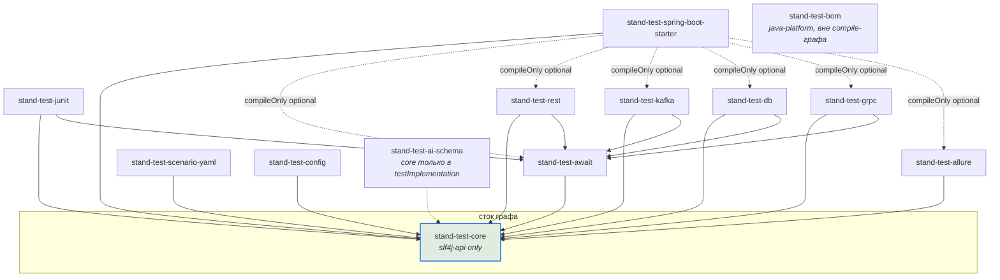
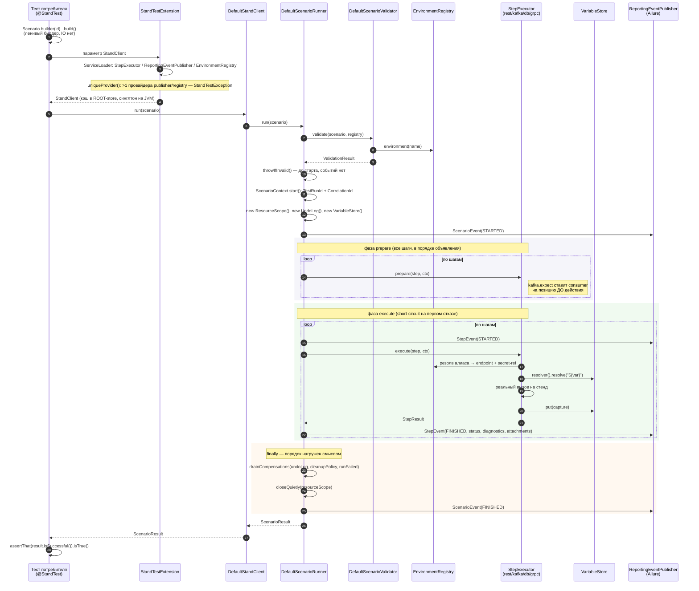
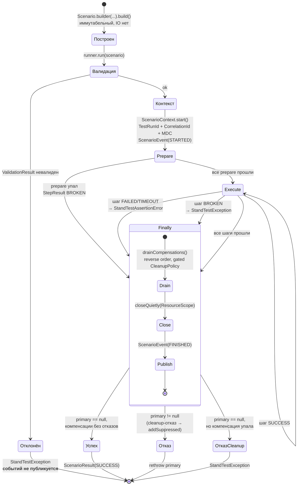
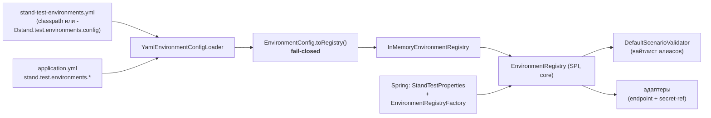
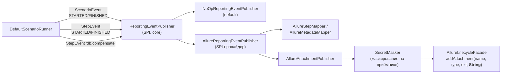
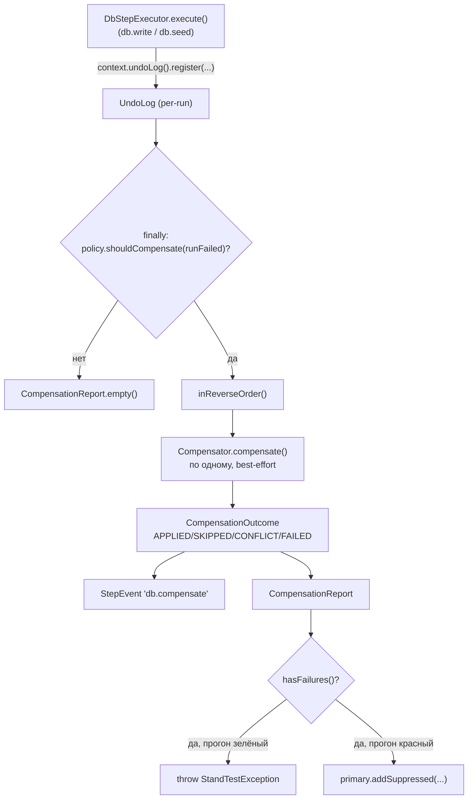
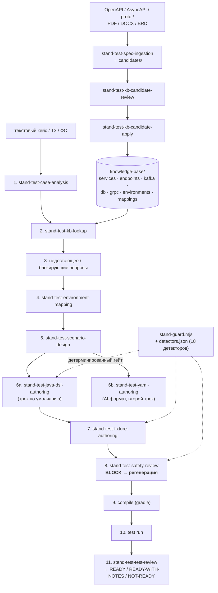

# 00. Карта текущего состояния `stand-test-sdk` перед UI-волной 1

| | |
|---|---|
| **Документ** | Аналитический (архитектурная карта «как есть») |
| **Основание** | [`docs/brd/ui-test-generation-brd.md`](../brd/ui-test-generation-brd.md) v0.3 |
| **Дата** | 2026-08-01 |
| **Ветка / коммит** | `feat/ai-agent-kit` @ `cf81358` |
| **Статус** | **Снимок на `cf81358`**, а не описание сегодняшнего состояния — см. пометку ниже |
| **Сверен** | 2026-08-04 (`UITG-F002`, конфликт `CONF-07`) против `46d3cfb` + рабочего дерева |

> ## ⚠ Это снимок: восемь утверждений в нём устарели, девятое проверено и верно
>
> Документ снят **до** UI-модуля и утверждал, среди прочего, что модуля `stand-test-ui` не
> существует. Он существует: 36 java-файлов в `main`, пять типов шагов `ui.*`, отдельная задача
> `browserTest` на 24 браузерных теста. Из-за этого документ **переписан не был** — он ценен именно
> как карта швов, снятая до работы, и переписывание стёрло бы то, ради чего его цитируют.
>
> Вместо переиздания каждое утверждение, которое стало ложным, помечено на месте блоком
> **«Устарело»**: исходный текст сохранён как запись состояния на `cf81358`, рядом стоит факт на
> 2026-08-04 и ссылка на код. Устарели **восемь** утверждений — §1 (модуля нет), §2 и §6.3 (нет
> правила, ограничивающего зависимости `core`; сказано дважды и оба раза неверно), §5 S-9 (нет
> записей об UI-приложениях), S-10 (нет ветки `ui.` в валидаторе), S-12 (нет пула учёток), §7.3 (нет
> раздела UI-приложений), §12 (нет ни одного CI-конфига).
>
> **Девятое проверено и оставлено верным** — «UI-типов шагов нет» в §7.3: речь о JSON-схеме
> AI-формата, а не об SDK, и там их действительно нет. Это не пробел, а решение: `ui.*` остаётся
> Java-треком (`UITG-S046`, зависит от OQ-09). Утверждение помечено именно потому, что читается как
> устаревшее, и следующий читатель иначе «поправит» верное на неверное.
>
> **Чего эта сверка не делала.** Остальные 700 строк построчно не перепроверялись: сверка искала
> утверждения об отсутствии UI, а не полноту карты. Считать непомеченное подтверждённым на сегодня
> нельзя — «не помечено» здесь значит «не проверялось», а не «верно». Полное переиздание — `UITG-S011`,
> и оно ждёт `UITG-ADR003`.

> **Метод.** Прослежены фактические вызовы от публичного API теста до адаптера и до формирования
> отчёта, а не только имена файлов. Все утверждения ниже подтверждены чтением исходников; в скобках
> дан путь и, где это важно, номер строки. Там, где кода нет, стоит явная пометка **«нет в коде»** —
> предположения не выдаются за факты.
>
> **Границы документа.** Он описывает то, что есть, и точки, куда UI можно пристроить. Это **не**
> технический дизайн UI-модуля и **не** план реализации: их нельзя писать до traceability matrix
> ([`01-brd-traceability.md`](01-brd-traceability.md)) и закрытия неизвестных
> ([`02-open-questions.md`](02-open-questions.md)).

---

## 1. Модули и ответственность

14 Gradle-модулей (`settings.gradle.kts`), группа `ru.alfa.stand.test`, базовый пакет
`ru.alfa.stand.test.<module>`.

| Модуль | Ответственность | Внешние зависимости (`main`) | Публикуется |
|---|---|---|---|
| `stand-test-core` | Модель сценария, SPI, value-объекты, результаты, события отчётности, валидация/guardrails, `VariableStore`, компенсации, реестр сред (контракт) | **только** `slf4j-api` (фасад, без binding и IO) | да |
| `stand-test-await` | Единый механизм ожидания: `Awaiter`, `AwaitPolicy`, `AwaitResult`, `TimeSource`, `TimeoutDiagnostics` | — | да |
| `stand-test-junit` | JUnit 5 lifecycle: `StandTestExtension` (`ParameterResolver`), аннотации `@StandTest`/`@StandEnv`/`@StandScenarioId`, маркеры параллельности | `junit-jupiter-api` | да |
| `stand-test-rest` | HTTP-шаги: `rest.get`/`rest.post`/`rest.expectEventually`, 5 матчеров, auth из реестра | `spring-webflux` (WebClient), `json-path` | да |
| `stand-test-kafka` | `kafka.send`/`kafka.expect`, HEADER-корреляция, consume-and-advance | `kafka-clients`, `json-path` | да |
| `stand-test-db` | `db.expectEventually`/`db.seed`/`db.write`/`db.cleanup`, write-guard, undo-log-компенсаторы | JDBC (JDK) | да |
| `stand-test-grpc` | `grpc.unary` через server reflection + `DynamicMessage`, 5 матчеров | `grpc-*`, `protobuf-*`, `json-path` | да |
| `stand-test-allure` | Приёмник `ReportingEventPublisher` → Allure; маскирование секретов на стороне приёмника | `allure-java-commons` | да |
| `stand-test-scenario-yaml` | Два YAML-поверхностных формата (given/then и AI steps/type) → `Scenario` | `snakeyaml` | да |
| `stand-test-ai-schema` | JSON Schema сценария + правила генерации; **плюс 35 тест-классов, валидирующих кит** (`src/test`) | (main пустой; тесты — `networknt`, `jackson`, `snakeyaml`) | да |
| `stand-test-config` | Файловый `EnvironmentRegistry` (SPI-провайдер `FileEnvironmentRegistry`, загрузка `stand-test-environments.yml`) | `snakeyaml` | да |
| `stand-test-spring-boot-starter` | Boot-3 автоконфигурация; адаптеры подключены как `compileOnly` optional | `spring-boot-autoconfigure` | да |
| `stand-test-example` | Витрина на офлайн-дублях; **здесь же живёт ArchUnit-тест графа зависимостей** | `archunit`, `h2` (test) | **нет** |
| `stand-test-bom` | `java-platform` с constraints на все публикуемые модули + курируемые версии третьих сторон | — | да |

**Место для UI-модуля в этой таблице пока пусто.** Модуля `stand-test-ui` не существует; ни одного
класса, ресурса или строки конфигурации, относящихся к браузеру, в репозитории нет (проверено
поиском по `Playwright|browser|selenium|webdriver` вне `docs/brd/`).

> **Устарело (2026-08-04).** Модуль **существует**: `stand-test-ui`, 36 java-файлов в
> `src/main/java/ru/alfa/stand/test/ui/`, пять типов шагов (`ui.open`/`click`/`fill`/`expect`/
> `expectEventually`) плюс `ui.login`, Playwright заперт в пакете `…ui.playwright` правилом
> `playwrightIsConfinedToDriverPackage`. Строка таблицы модулей для него по-прежнему не дописана —
> но не потому, что модуля нет, а потому, что этот документ не переиздавался (`UITG-S011`).
> В `settings.gradle.kts` модуль объявлен; в git его ещё нет — посадка `UITG-S001`…`S009`.

---

## 2. Граф зависимостей



**Инварианты, зафиксированные тестом.** `stand-test-example/src/test/java/ru/alfa/stand/test/example/ModuleDependencyArchTest.java`
проверяет ArchUnit-правилами четыре вещи:

1. `core` не зависит ни на один соседний модуль (сток графа);
2. адаптеры `rest`/`kafka`/`db`/`grpc` не зависят друг на друга;
3. `allure`/`scenario-yaml`/`ai-schema`/`config` зависят только на `core`;
4. на starter не зависит никто (он лист).

Плюс тест `importIsNonVacuous()` следит, чтобы правила не стали пустыми (`SDK.size() > 100`).

> **Пробел, важный для NFR-05.** Все четыре правила говорят только про **соседние SDK-модули**.
> **Ни одно правило не ограничивает третьесторонние зависимости `core`.** Строка
> `implementation(libs.playwright)` в `stand-test-core/build.gradle.kts` прошла бы сборку и все
> существующие тесты. NFR-05 сегодня держится на дисциплине и CLAUDE.md, а не на проверке. См. §11.1.

> **Устарело (2026-08-04).** Пробел закрыт: `coreHasNoUiOrIoDependencies` держит явный белый список
> (JDK + `slf4j-api`), поэтому `implementation(libs.playwright)` в `core` теперь **роняет сборку**, а
> не проходит её. Правил в `ModuleDependencyArchTest` стало не четыре, а восемь — добавились ещё
> `scenarioHasNoUiFields`, `playwrightIsConfinedToDriverPackage` со стражем невакуумности и
> `nothingDependsOnUi`. То же самое сказано в §6.3, которая ставила эту задачу; здесь — потому что
> цитируют обычно ближайшую к графу формулировку.

---

## 3. Последовательность исполнения существующего теста

От `@StandTest`-класса потребителя до отчёта. Ниже — реальный путь для plain-JUnit-варианта
(в Spring-варианте `StandClient` приходит из `StandTestAutoConfiguration`, остальное совпадает).



**Что здесь принципиально для UI:**

- **`StandClient` — синглтон на JVM** (`StandTestExtension:162-165`, `extensionContext.getRoot().getStore(...)`),
  значит и список `StepExecutor` создаётся один раз и **разделяется всеми параллельными сценариями**.
  Любое состояние прогона в полях executor'а немедленно ломает изоляцию.
- **`ResourceScope` и `UndoLog` создаются заново на каждый `run()`** (`DefaultScenarioRunner:151-154`)
  и закрываются/дренируются в `finally`. Это единственное санкционированное место для ресурса,
  живущего один прогон.
- **`prepare` идёт до всех `execute`.** Шаг, который должен «встать на позицию» до действия
  (сегодня — kafka-consumer), делает это в `prepare`.

---

## 4. Lifecycle одного сценария



**Семантика отказа (`DefaultScenarioRunner:399-414`, `plan §8.3`):**

| Что произошло | Записывается как | Бросается |
|---|---|---|
| Не выполнилось ожидание (`AssertionError` или возвращённый `FAILED`/`TIMEOUT`) | `StepStatus.FAILED` / `TIMEOUT` | `StandTestAssertionError` (наследник `AssertionError` → JUnit/Allure видят «упавший тест») |
| Инфраструктура/конфигурация (`StandTestException`, любая другая `RuntimeException`, возвращённый `BROKEN`) | `StepStatus.BROKEN` | `StandTestException` (наследник `RuntimeException`) |
| Отказ в `prepare` | `StepStatus.BROKEN` | `StandTestException`; уже классифицированный — **разворачивается без обёртки** (`:345-350`) |

Возвращённый `StepStatus.FAILED` **никогда не остаётся молча в результате** — он конвертируется в
брошенный отказ (`:174-179`). Это то, что закрывает «зелёный тест на сломанном экране».

Каждый отказ снабжается меткой `Step [index/total] 'id' (type)` (`stepLabel`, `:533`) — и в сообщении
исключения, и в логе, и в MDC (`scenarioId`/`testRunId`/`correlationId`/`environment` на весь прогон,
`stepId`/`stepType`/`stepIndex` на шаг).

---

## 5. Точки расширения для нового UI-адаптера

Ниже — **фактические seam'ы**, каждый существует и используется хотя бы одним адаптером. UI-модуль
может встроиться, не трогая ни `core`, ни другие адаптеры.

| # | Seam | Файл | Как им пользуется существующий адаптер | Что даёт UI |
|---|---|---|---|---|
| S-1 | `StepExecutor` SPI (`supports`/`prepare`/`execute`) | `core/execution/StepExecutor.java` | `RestStepExecutor.supports()` матчит префикс `rest.` | `UiStepExecutor.supports("ui.")` — диспетчеризация без compile-ребра из core |
| S-2 | `ServiceLoader`-регистрация | `META-INF/services/ru.alfa.stand.test.core.execution.StepExecutor` (есть в rest/kafka/db/grpc) | файл с одной строкой — FQCN executor'а | тот же файл в `stand-test-ui` — и `StandTestExtension` подхватит |
| S-3 | `GenericStep(id, type, description, parameters)` | `core/scenario/GenericStep.java` | все адаптеры кладут свои параметры в `Map<String,Object>`, глубоко иммутабельный | UI-шаг = `GenericStep` с `type="ui.click"` и своими ключами; **поля в `Scenario` не добавляются** |
| S-4 | `ResourceScope` (per-run, `AutoCloseable`, закрывается в `finally`) | `core/execution/ResourceScope.java` | `KafkaStepExecutor` держит консьюмера под ключом `kafka.consumer:<topic>` | **единственно верный дом для `BrowserContext`** — по одному на прогон, закрывается всегда |
| S-5 | `UndoLog` + `Compensator` (обобщённые, без DB-специфики) | `core/compensation/` | **только** `DbStepExecutor:191` регистрирует компенсатор | UI-адаптер может зарегистрировать свой компенсатор **без изменений core** — см. §11.11 |
| S-6 | `VariableStore` + `VariableResolver` | `core/variable/` | REST кладёт `capture` → Kafka/DB читают `${var}` | захват с экрана → проверка в Kafka/БД тем же механизмом; **связывание по данным (BR-13) работает уже сегодня** |
| S-7 | `ReportingEventPublisher` + `StepEvent(…, attachments)` | `core/event/` | `RestStepExecutor` кладёт диагностику в `StepResult.diagnostics` | UI-шаги попадают в тот же отчёт; **но вложения только текстовые** — см. §11.4 |
| S-8 | `Awaiter`/`AwaitPolicy` из `stand-test-await` | `await/` | `rest.expectEventually`, `kafka.expect`, `db.expectEventually` | `ui.expectEventually` через тот же движок — без `Thread.sleep` |
| S-9 | `EnvironmentRegistry` (интерфейс в core, провайдер по SPI) | `core/environment/EnvironmentRegistry.java`, `config/FileEnvironmentRegistry.java` | REST резолвит `service` → `ServiceEndpointDefinition` | UI резолвит `application` → *(записи для UI-приложений в модели пока нет)* — см. §11.7 |
| S-10 | Префиксная диспетчеризация guardrails | `core/validation/DefaultScenarioValidator.java:96-106` | `type.startsWith("rest.")` → проверка алиаса `service` | ветка `ui.` **отсутствует** — её придётся добавить в core, иначе алиас приложения не проверяется |
| S-11 | `ForbiddenOperation` как единственный источник правды | `core/validation/ForbiddenOperation.java` | из него выводятся и рантайм-валидатор, и JSON Schema (cross-check тест) | новые UI-запреты добавляются сюда — и автоматически попадают в оба контура |
| S-12 | Маркеры параллельности JUnit | `junit/StandParallelSafe.java`, `StandSerial.java`, `StandIsolated.java` | `@Execution(CONCURRENT)` / `SAME_THREAD` / `@Isolated` | пометка UI-классов; **пула учёток нет** — см. §11.10 |

> **Устарело (2026-08-04) — три строки этой таблицы.** Швы, помеченные как «предстоит сделать»,
> сделаны; предсказания S-1…S-8 и S-11 сбылись буквально и правки не требуют.
>
> | Строка | Было | Стало |
> |---|---|---|
> | **S-9** | «записей для UI-приложений в модели пока нет» | есть: `core/environment/UiApplicationDefinition.java`, секция `ui-applications` реестра с версии формата 2 (коммит `46d3cfb`) |
> | **S-10** | «ветка `ui.` **отсутствует**» | есть: `DefaultScenarioValidator:169` проверяет алиас приложения через `ForbiddenOperation.NON_WHITELISTED_UI_APPLICATION` |
> | **S-12** | «**пула учёток нет**» | есть: `AccountPool`/`InProcessAccountPool`/`UiAccountPools` в `stand-test-ui`, аренда по роли, возврат в `ResourceScope` (ADR-UI-006) |

---

## 6. Куда Playwright добавлять нельзя (NFR-05)

NFR-05 требует: `stand-test-core` не получает зависимостей от Playwright и любого IO; **модель
сценария не получает UI-специфичных полей**.

### 6.1 Запрещённые точки — с конкретикой

| Место | Почему запрещено | Что сломается, если нарушить |
|---|---|---|
| `stand-test-core/build.gradle.kts` — любая новая `implementation`/`api` кроме `slf4j-api` | Единственная санкционированная внешняя зависимость core — фасад логирования без binding и IO | Инвариант «core — JDK-only, без IO»; потребитель получит Playwright транзитивно во **все** тесты, включая чисто протокольные |
| `core/scenario/Scenario.java` — поля `viewport`, `browser`, `baseUrl`, `locale`, `headless` | BR-31 прямо это отвергает; Приложение А BRD помечает «вьюпорт в билдере сценария» как **отвергнуто** | `Scenario` перестанет быть транспортно-агностичной; протокольные сценарии получат бессмысленные поля; `equals`/`hashCode`/сериализация YAML разъедутся |
| `core/scenario/ScenarioStep.java` — методы вида `locator()` | Интерфейс намеренно минимален: `id`/`type`/`description` | Каждый адаптер обязали бы реализовывать UI-метод |
| `core/execution/StepExecutionContext.java` — компонент `BrowserContext` | Контекст — это только per-run состояние, общее для всех адаптеров | core получит compile-ребро на Playwright |
| Типизированные UI-шаги (`UiStep`, `UiLocator`) в `core` | Типизированные шаги адаптеров (`RestStep`, `KafkaStep`, …) **живут в адаптерах** — в core их нет ни для одного протокола | Нарушение установленной симметрии; core начнёт знать про браузер |
| `core/event/Attachment.java` — поле `byte[]` «для скриншотов» | Изменение общей модели вложений ради одного адаптера + бинарь пришлось бы протаскивать через все приёмники | См. §11.4 — конфликт реален, но решается **не** здесь; решение в `stand-test-allure`/новом sink'е |
| `stand-test-await`, `stand-test-junit` | Оба — общие для всех адаптеров и тоже не знают ни про один протокол | Playwright прилетел бы в каждый тест через `stand-test-junit` |
| Кросс-зависимость `stand-test-ui` → `stand-test-rest`/`kafka`/`db`/`grpc` | ArchUnit-правило `adaptersDoNotDependOnEachOther` — если UI внесут в список адаптеров | Циклы и «адаптер знает про адаптер»; сквозной сценарий связывается через `VariableStore`, а не через compile-ребро |

### 6.2 Разрешённые точки

- Новый модуль `stand-test-ui` → `core` + `await` (ровно как rest/kafka/db/grpc).
- `stand-test-ui/src/main/resources/META-INF/services/…StepExecutor`.
- `compileOnly optional` ребро `stand-test-spring-boot-starter` → `stand-test-ui` (starter уже так
  подключает шесть модулей).
- Constraint на `stand-test-ui` и на версию Playwright в `stand-test-bom`.
- **UI-специфичные ветки в `DefaultScenarioValidator` и константы в `ForbiddenOperation`/
  `StepParameterKeys`** — это не зависимость и не IO, а расширение guardrails; ровно так там уже
  живут `db.`/`rest.`/`kafka.`/`grpc.`.

### 6.3 Чего проверка сегодня не ловит

`ModuleDependencyArchTest` проверяет только рёбра между модулями SDK. **Правила «core зависит
исключительно на JDK + slf4j-api» не существует.** До начала работ над UI-модулем это правило нужно
завести — иначе NFR-05 не «проверяется тестом графа зависимостей в сборке», как обещано в BRD, а
проверяется ревьюером.

> **Устарело (2026-08-04).** Правило заведено, и не одно: `coreHasNoUiOrIoDependencies` (белый список
> — только JDK и `slf4j-api`), `scenarioHasNoUiFields`, `playwrightIsConfinedToDriverPackage` вместе
> с проверкой на невакуумность и `nothingDependsOnUi` — всё в
> `stand-test-example/src/test/java/ru/alfa/stand/test/example/ModuleDependencyArchTest.java`.
> Рекомендация этого раздела выполнена: NFR-05 проверяется сборкой, а не ревьюером.

---

## 7. Текущий механизм конфигурации

### 7.1 Два входа, одна модель



Порядок поиска в `YamlEnvironmentConfigLoader.load()`: системное свойство
`stand.test.environments.config` → `stand-test-environments.yml`/`.yaml` на classpath →
`application.yml`/`.yaml`, ветка `stand.test.environments`. Пусто → пустой реестр.

### 7.2 Fail-closed — и почему это ровно тот механизм, о котором говорит D-10

`EnvironmentConfig` держит явные множества допустимых ключей и отвергает всё остальное:

```java
// stand-test-config/.../EnvironmentConfig.java
private static final Set<String> ROOT_KEYS = Set.of("environments");
private static final Set<String> ENV_KEYS  = Set.of("services", "topics", "datasources",
        "grpc-targets", "grpcTargets", "kafka-cluster", "kafkaCluster",
        "kafka-clusters", "kafkaClusters");
// …
throw new StandTestException("Unknown field '" + key + "' at " + location + " (allowed: " + known + ")");
```

**Проверенное следствие для BR-37.** Файл из Приложения А.2 BRD (`version: 2` в корне,
`ui-applications:` внутри среды) сегодня будет отвергнут двумя ошибками:
`Unknown field 'version' at <document> (allowed: environments)` и
`Unknown field 'ui-applications' at environments.ift (allowed: …)`. Сообщение называет поле, но
**не** говорит «файл новее вашего SDK — обновитесь». D-10 описывает реальную проблему точно.

### 7.3 Модель среды: что в ней есть и чего нет

`EnvironmentDefinition` (`core/environment/`) содержит `services`, `topics`, `datasources`,
`grpcTargets`, `kafkaCluster`, `kafkaClusters`. **Раздела UI-приложений нет.**

Аутентификация сервиса — `AuthConfig(scheme, usernameRef, passwordRef, tokenRef)` с
`AuthScheme = {BASIC, BEARER}`. Нет: `FORM`, `SSO`, `STORAGE_STATE`, ролей, пула учёток,
`viewport-profiles`.

> **Устарело (2026-08-04) — оба абзаца.** Раздел UI-приложений есть: `ui-applications` с версии
> формата 2 (`EnvironmentConfigFormat.SUPPORTED_VERSION = 3`), с `base-url-ref`,
> `default-viewport`/`viewport-profiles`, `trace` и собственной `UiAuthConfig`, где живут `FORM`,
> `STORAGE_STATE`, роли и `credentials-pool-ref`; `SSO` — объявленное написание с говорящим
> «не реализовано». Пул учёток реализован в `stand-test-ui` (ADR-UI-006). Что осталось верным: это
> **конфигурация**, а не поля `Scenario`, — `scenarioHasNoUiFields` держит границу.

### 7.4 Секреты

`SecretReferences` (`core/environment/`) — единственная точка разрешения:

- `*-ref`-поле должно быть **голым именем** переменной окружения либо `${VAR}`/`${VAR:default}`;
- SDK-внутренний маркер `literal://` в пользовательской конфигурации **отвергается fail-closed**;
- значение, похожее на резолвнутый endpoint или на инлайн-секрет (пробелы, `://`, префикс
  `Bearer `/`Basic `), отвергается с объяснением.

В Spring-варианте у ENDPOINT-полей есть value-твины (`base-url`/`url`/`target`/…), обёртываемые в
`SecretReferences.literal(...)`; у секретных полей твины тоже допустимы, но с осознанным
трейд-оффом (секрет материализуется в Spring Environment). Подробности — в CLAUDE.md.

---

## 8. Текущий механизм отчётности



**Свойства, которые UI унаследует бесплатно:**

- Публикация — **best-effort side-channel**: бросивший publisher проглатывается и логируется на WARN
  (`DefaultScenarioRunner:497-521`, ловится `Throwable`, а не только `RuntimeException`), тест
  никогда не падает из-за отчётности.
- `StepEvent` несёт `scenarioId`/`testRunId`/`correlationId`/`stepId`/`stepType`/`phase`/`status`/
  `message`/`diagnostics`/`attachments` — **все идентификаторы BR-22 уже на месте**.
- Маскирование секретов делает приёмник (`SecretMasker`), а не адаптер.
- Событие FINISHED публикуется даже на путях «нет executor'а» и «executor бросил».

**Свойство, которое UI не унаследует:**

`Attachment` — это `record Attachment(String name, String mediaType, String content)`, и
`DefaultAllureLifecycleFacade:67` делает `content.getBytes(StandardCharsets.UTF_8)`. Весь тракт
вложений **текстовый**. Скриншот PNG, видео WebM и Playwright-трейс `.zip` через него не проходят.
Разбор — §11.4.

**«Слой отказа» (BR-22, D-7).** Отдельного поля «слой» нет, но `StepEvent.stepType` его несёт:
`rest.post`, `kafka.expect`, `db.expectEventually`, `grpc.unary` — и, по той же схеме, `ui.click`.
Определить слой по отчёту, не читая код теста, можно уже сегодня.

---

## 9. Текущий механизм cleanup



**Факты:**

- `CleanupPolicy = {ON_FAILURE (default), ALWAYS, NEVER}` — задаётся в `Scenario.Builder`
  (`cleanupPolicy`, дефолт `ON_FAILURE`). **`ALWAYS` уже реализована и работает** — то, что просит
  BR-24, здесь доступно без доработки.
- `Compensator` (`actionId`/`target`/`compensate`) и `UndoLog` — **полностью обобщённые, без
  DB-специфики, живут в `core`**.
- **Регистрирует компенсаторы ровно одно место**: `DbStepExecutor:191` (проверено поиском по всем
  `src/main`). Это факт, на который опирается D-9.
- Дренаж — в `finally`, **до** `closeQuietly` (чтобы run-scoped соединение было ещё живо) и **до**
  публикации FINISHED. Порядок прокомментирован в коде как нагруженный смыслом.
- Компенсатор не имеет права бросать; защитный `catch (Throwable)` превращает нарушение контракта в
  `FAILED`-исход и продолжает дренаж.
- **Сценарных компенсирующих шагов нет.** В `Scenario` нет поля `cleanup`; в билдере нет метода
  `.cleanup(step)`; раннер дренирует только `UndoLog`. Приложение А BRD помечает это верно.

---

## 10. Устройство AI-authoring pipeline

Кит живёт под `docs/ai-agent/` **в двух копиях** (`.claude/` и `.opencode/`, одинаковые ассеты) и
копируется в проект **потребителя** — это не рабочая оснастка самого SDK.



**Состав кита (пересчитано):**

| Элемент | Количество | Где |
|---|---|---|
| Скиллы | 17 | `docs/ai-agent/.claude/skills/` |
| Команды | 14 | `docs/ai-agent/.claude/commands/` |
| Детерминированные детекторы гейта | 18 | `docs/ai-agent/.claude/hooks/detectors.json` (**11 BLOCK + 7 HIGH**) |
| Схемы KB | 20 | `docs/ai-agent/knowledge-base/schema/` |
| Схемы AI-формата | 3 | `stand-test-ai-schema/src/main/resources/schema/` |
| Тесты, валидирующие кит | 35 классов | `stand-test-ai-schema/src/test/` |
| Версия кита | `MANIFEST.json: version: 1` | `docs/ai-agent/MANIFEST.json` |

**AI-формат сценария** (`stand-test-scenario.schema.json`), проверено чтением схемы:

- корень: `additionalProperties: false`, свойства ровно `id`, `title`, `description`, `environment`,
  `tags`, `steps`; обязательны `id`, `environment`, `steps`. **Раздела `cleanup` нет** — BR-32 прав;
- 7 типов шагов: `rest.get`, `rest.post`, `rest.expectEventually`, `kafka.send`, `kafka.expect`,
  `db.expectEventually`, `grpc.unary`. UI-типов нет;
  > **Всё ещё верно, и это решение, а не пробел (сверено 2026-08-04).** Типы `ui.*` существуют в
  > `stand-test-ui`, но **в AI-схему не добавлены**: `ui.*` — только Java-трек, декларативная
  > поверхность отложена до `UITG-S046` и поставлена BRD в зависимость от ответа на OQ-09.
  > Утверждение читается как «в схеме нет» — так и есть; «в SDK нет» было бы неверно;
- `$defs.assertion`: `required: ["path"]`, `additionalProperties: false`, ровно один матчер из
  `equals`/`exists`/`notNull`/`contains`/`matches` (через `oneOf`). Проверка `text`/`visible`/
  `enabled` в этот def **не укладывается** — BR-32 прав и здесь.

**Эталонный набор** (BR-01, BR-05): `docs/agent-evaluation/dataset/cases/` — **27 директорий**
(15 протокольных + 12 UI), каждая с `case.yml` + `input.md`, контракт —
`docs/agent-evaluation/contracts/evaluation-case.schema.json`, валидируется тестом
`EvaluationCaseSchemaValidationTest`. UI-половина добавлена 03.08.2026 (S-5.5): версия контракта 2,
аддитивная; факты о DOM приезжают подсаженными отчётами разведки, `execution.outcome` у всех
двенадцати — `NOT_RUN` (браузерного дубля корпус не поставляет). Готовность —
`docs/agent-evaluation/ui-wave-1-readiness.md`.

**База знаний**: `services`, `endpoints`, `kafka`, `db`, `grpc`, `environments`, `mappings`,
`candidates`, `schema`. Сущностей «экран / элемент / пользовательский флоу» нет. **В схемах KB нет
поля версии** (проверено grep по `"schemaVersion"`/`"version"` во всех 20 файлах) — версионирование
кита сегодня держится только на `MANIFEST.json: version: 1`. Это прямо касается BR-36.

---

## 11. Архитектурные конфликты

Двенадцать проверок, заданных постановкой. Каждый вывод помечен: **НЕТ КОНФЛИКТА** / **КОНФЛИКТ** /
**ТРЕБУЕТ ИЗМЕНЕНИЯ CORE** / **ВНЕШНЯЯ ЗАВИСИМОСТЬ**.

### 11.1 Можно ли добавить UI как адаптер без Playwright и UI-полей в core?

**Да — НЕТ КОНФЛИКТА, при одном условии.**

Механизм готов: `StepExecutor` диспетчеризуется по строке `ScenarioStep.type()`, `GenericStep` несёт
произвольную `Map<String,Object>`, регистрация — через `ServiceLoader`. Core не получает ни compile-ребра,
ни знания про браузер. Ровно так живут четыре существующих адаптера.

Условие: **guardrails придётся расширить внутри core** — ветку `ui.` в
`DefaultScenarioValidator.checkAliasWhitelist()` и константы в `ForbiddenOperation`/`StepParameterKeys`.
Это не зависимость и не IO, но это правка `stand-test-core`, и её надо назвать вслух в оценке.

**Риск, который надо закрыть до старта:** отсутствие ArchUnit-правила на третьесторонние зависимости
core (§6.3). Без него NFR-05 не проверяется автоматически.

### 11.2 Может ли текущий `Scenario` поддерживать UI-шаги без изменения модели?

**Да — НЕТ КОНФЛИКТА для самих шагов.**

`Scenario` хранит `List<ScenarioStep>`; `ScenarioStep` — это `id`/`type`/`description`.
`UiStep.build()` в модуле `stand-test-ui` возвращает `GenericStep` — и `Scenario` о браузере не
узнаёт. Вьюпорт/браузер/локаль в модель не попадают (BR-31), они конфигурация.

**Но одно изменение `Scenario` BRD всё-таки требует** — и это не UI-поле: сценарные компенсирующие
шаги `.cleanup(step)` (см. 11.11). Их отсутствие — про cleanup, а не про UI, и потому не нарушает
NFR-05.

### 11.3 Как UI-шаг будет работать с `VariableStore`?

**НЕТ КОНФЛИКТА — механизм работает как есть.**

`StepExecutionContext.variableStore()` доступен любому executor'у; `context.resolver()` разворачивает
`${var}`. Захват с экрана — это `store.put("applicationNumber", text)`, а последующая проверка Kafka
читает `${applicationNumber}` тем же кодом, что и сегодня для REST-захватов.

**Ограничение, которое нельзя нарушать:** `VariableStore` — обычный `LinkedHashMap` **без
синхронизации** (`core/variable/VariableStore.java`). Он безопасен ровно потому, что один прогон =
один поток. UI-адаптер не имеет права выносить работу с экраном в свой пул потоков и писать в store
оттуда. Playwright-овский `Page` тоже не потокобезопасен — ограничения совпадают, и это скорее удача,
чем проблема.

### 11.4 Можно ли переиспользовать текущий reporting pipeline?

**Частично — КОНФЛИКТ по бинарным вложениям.**

Переиспользуется без изменений: события, идентификаторы, диагностика, best-effort-семантика,
маскирование, `stepType` как «слой отказа».

Не переиспользуется: `Attachment.content` — `String`, и Allure-фасад делает
`content.getBytes(UTF_8)`. BR-21 требует приложить скриншот, трейс/видео, консоль браузера и сетевые
запросы. Консоль и сеть — текст, они пройдут. **Скриншот, видео и трейс — бинарь, они не пройдут.**

Base64 в текстовое поле — не решение: `AttachmentType.extensionForMediaType()` выдаст `.bin`, и в
отчёте вместо картинки будет base64-простыня.

Варианты (выбор — предмет технического проектирования, не этого документа):
(а) расширить `Attachment` вторым представлением (например, ссылкой на файл), сохранив обратную
совместимость; (б) отдавать путь к файлу артефакта, а прикладывать — приёмнику. Оба варианта трогают
`core/event/Attachment.java` — то есть **изменение core, не учтённое в §13.1 BRD**.

### 11.5 Как отличать UI-ошибку от REST/Kafka/DB?

**НЕТ КОНФЛИКТА.**

Три уровня уже есть и заработают для UI автоматически:

1. **Тип шага.** `StepEvent.stepType` / `StepResult.stepType` = `ui.click` против `kafka.expect`.
2. **Класс отказа.** `StandTestAssertionError` (не выполнилось ожидание) против `StandTestException`
   (инфраструктура) — и `StepStatus.FAILED`/`TIMEOUT` против `BROKEN`.
3. **Метка шага.** `Step [4/7] 'submit-application' (ui.click)` — в сообщении исключения, в логе и
   в MDC.

Обязанность UI-адаптера: **правильно классифицировать свои отказы**. «Локатор не найден за
таймаут» — это `FAILED`/`TIMEOUT` (ожидание не выполнилось). «Браузер не стартовал», «страница не
отдала 200 на навигации», «учётка не выдана из пула» — это `BROKEN`. Ошибка классификации здесь
отравляет BR-26 и NFR-01 (flaky rate) на входе.

### 11.6 Как запретить literal URL?

**НЕТ КОНФЛИКТА — но механизм не тот, который можно предположить.**

`ForbiddenOperation.HARDCODED_STAND_URL` в enum есть, **но рантайм-валидатор его никогда не
испускает** (проверено grep по всем `src/main`: единственное упоминание — само объявление enum).
Литеральный URL сегодня невозможен не потому, что его ищут, а потому, что **его негде написать**:
у REST-шага нет параметра «url», есть только `service` (алиас), и `RestStepExecutor` резолвит его
через реестр. Ключ, которого нет в `StepParameterKeys`, executor просто не прочитает.

Для UI это означает конкретное проектное требование: **в UI-шаге не должно быть параметра, куда
можно положить URL.** Есть `application` (алиас) и `path` (относительный путь) — как в примере
Приложения А. Плюс два существующих контура:

- **рантайм**: ветка `ui.` в `checkAliasWhitelist` (её надо дописать) — алиас не в реестре —
  `NON_WHITELISTED_*`;
- **статический гейт кита**: детектор «адрес написан там, где положен алиас» (BLOCK) в
  `detectors.json` + `stand-test-safety-review`.

Отдельная история — BR-33 (перехват сети). Там паттерн маршрута **является** строкой, похожей на
URL, и вайтлист по origin алиаса придётся проверять явно. Но это волна 2 — вне текущего разбора.

### 11.7 Как реализовано fail-closed поведение environment registry?

**Реализовано и подтверждено кодом (§7.2).** Два слоя:

1. **Загрузчик** (`EnvironmentConfig`): неизвестный ключ / неверный тип / непохожая на ref строка →
   `StandTestException` с указанием пути и списка допустимых ключей.
2. **Валидатор** (`DefaultScenarioValidator`): неизвестная среда → `NON_WHITELISTED_ENVIRONMENT` и
   **ранний выход** (алиасы дальше не проверяются — среды нет, проверять не по чему); неизвестный
   алиас сервиса/топика/датасорса/gRPC-таргета → соответствующий `NON_WHITELISTED_*`.

Плюс `NoProviderEnvironmentRegistry` в `stand-test-junit` — заглушка на случай, когда SPI-провайдера
нет вообще (закрывает known-gap пустого реестра).

### 11.8 Как безопасно версионировать формат registry?

**КОНФЛИКТ, уже описанный в D-10 — и подтверждённый.**

Проблема ровно в том, что fail-closed работает. Старый SDK, встретив `version: 2`, скажет
`Unknown field 'version' at <document> (allowed: environments)`. Инженер прочитает это как «в файле
опечатка», а не как «обнови SDK».

Что здесь надо решить (это **открытый вопрос**, а не готовый ответ — см. OQ-13 и
[`02-open-questions.md`](02-open-questions.md) Q-08):

- ключ версии обязан быть **добавлен в `ROOT_KEYS` заранее, в релизе N-1**, и в этом релизе
  игнорироваться или проверяться на «не больше моего» — иначе версионирование само по себе
  ломающее изменение, и «старая версия отказывается внятно» недостижимо для **уже выпущенных**
  версий SDK;
- то же касается второй поверхности — Spring-стартера (`StandTestProperties` + `EnvironmentRegistryFactory`):
  у него **свой** маппер, и он должен понимать версию так же. Риск дрейфа двух мапперов уже
  зафиксирован в проектной памяти как известный.

### 11.9 Где должен жить browser lifecycle?

**НЕТ КОНФЛИКТА — место есть, и оно ровно одно.**

Проверенный факт: `StandClient` кэшируется в **ROOT-store** JUnit-расширения
(`StandTestExtension:162-165`), то есть список `StepExecutor` — **синглтон на JVM, разделяемый всеми
параллельными сценариями**. Поля executor'а — общие. Значит:

| Ресурс | Где живёт | Почему |
|---|---|---|
| `Playwright` / `Browser` (дорого, переиспользуемо, потокобезопасно на уровне запуска процессов) | **не решено** — либо поле executor'а с явной синхронизацией, либо отдельный per-JVM холдер с закрытием на shutdown | ROOT-store JUnit-расширения не переживает Spring-путь; вопрос вынесен в Q-05 |
| `BrowserContext` + `Page` (состояние прогона: куки, storageState, вьюпорт) | **`ResourceScope`**, ключ вида `ui.context:<application>` | создаётся на `run()`, закрывается в `finally` — точь-в-точь как run-scoped JDBC-соединение и kafka-consumer |
| Выданная из пула учётка | **`ResourceScope`** (закрытие = возврат в пул) | возврат обязан произойти и на упавшем прогоне |

Класть `BrowserContext` в поле executor'а — **прямая поломка изоляции**: два параллельных теста
получили бы одну сессию.

### 11.10 Один browser context на тест и отсутствие общего mutable state

**Частично — механизм изоляции есть, ВНЕШНЯЯ ЗАВИСИМОСТЬ по пулу учёток.**

Что уже обеспечивает изоляцию: свежий `ScenarioContext` (свои `testRunId`/`correlationId`), свежий
`VariableStore`, свежий `ResourceScope`, свежий `UndoLog` — всё на каждый `run()`
(`DefaultScenarioRunner:150-154`). Локальная (не instance-полем) переменная `primary` для отказа
прокомментирована в коде именно как защита от гонки. Маркеры `@StandParallelSafe`/`@StandSerial`/
`@StandIsolated` есть.

Чего нет:

- **пула технических учёток нет вообще** — ни класса, ни поля в реестре, ни секции конфигурации.
  BR-34 (выдача по роли, ограниченный таймаут ожидания, возврат) целиком к разработке;
- `junit-platform.properties` есть **только в `stand-test-example`** (classes=concurrent,
  methods=same_thread, fixed parallelism=10). Это витрина, а не то, что получает потребитель;
  целевая модель BR-25 «классы + методы» ни в одном модуле не сконфигурирована;
- BR-29 (один `storageState` на выданную учётку) упирается в тот же несуществующий пул.

Ключевое ограничение сверху: **фактическая степень параллельности ≤ размера пула учёток**, а размер
пула — внешнее решение (G-5, OQ-12). Технически это не архитектурный конфликт, а зависимость от
владельцев приложений.

### 11.11 Можно ли расширить undo-log компенсациями не-DB шагов без регрессии?

**Да для компенсаторов; ТРЕБУЕТ ИЗМЕНЕНИЯ CORE для сценарных cleanup-шагов. D-9 верен, но по более
узкой причине, чем сформулировано.**

Разберём на два независимых вопроса — BRD их смешивает.

**(а) Может ли не-DB адаптер зарегистрировать компенсатор?** — **Да, уже сегодня, без единой правки
core.** `Compensator` и `UndoLog` живут в `core/compensation/` и не содержат ничего DB-специфичного:
интерфейс — это `actionId()`, `target()`, `compensate()`. `StepExecutionContext.undoLog()` доступен
любому executor'у. То, что регистрирует только `DbStepExecutor:191`, — факт **употребления**, а не
ограничение модели. `CleanupPolicy.ALWAYS` тоже уже реализована.

**(б) Может ли сценарий объявить компенсирующий шаг — `.cleanup(RestStep.post(...))`?** — **Нет, и
это требует правки core.** В `Scenario` нет поля cleanup-шагов, в билдере нет метода, а
`drainCompensations()` обходит **только** `UndoLog`. Именно этого нет в примере Приложения А, и
именно это BRD помечает как «не существует».

Почему различие важно для оценки: путь (а) — работа внутри UI-модуля, ноль риска для существующих
тестов. Путь (б) — изменение `Scenario` и раннера, то есть тот самый RISK-15. **Если для волны 1
достаточно (а)** — «UI-адаптер сам регистрирует компенсатор отзыва заявки в момент её создания» —
то доработка core сдвигается из волны 1 и RISK-15 из плана волны 1 уходит. Это вопрос к техническому
проектированию, и он поднят как Q-06.

**Про регрессию.** Дренаж уже устроен best-effort по каждому действию, с защитным `catch (Throwable)`
и агрегацией в `CompensationReport`. Новый источник компенсаторов не меняет поведение старых. Риск
концентрируется в пути (б).

### 11.12 Что невозможно без изменений внешних систем

**ВНЕШНЯЯ ЗАВИСИМОСТЬ — пять пунктов; ни один не закрывается кодом SDK.**

| Требование | Что нужно снаружи | Гейт BRD |
|---|---|---|
| BR-29, BR-30 — вход через IdP, стратегия MFA/OTP/КАПЧА | Байпас на стендах либо альтернатива (заранее выданная сессия, сервис получения кода) — по каждому приложению | **G-1**, OQ-01 |
| BR-34, BR-29, SEC-10 — пул учёток по ролям + учётка разведки без необратимых прав | Выделение учёток владельцами приложений | **G-5**, OQ-12 |
| BR-13 «связывание по `correlationId`» | Backend продукта обязан протянуть заголовок от фронтенда до Kafka/БД, топик — объявить HEADER-носитель (единственный реализованный в SDK) | **G-6**, AS-07, DEP-08 |
| BR-18, NFR-09 — прогон в CI | Образ с браузерами либо grid/Selenoid, квоты, бюджет. **В репозитории нет ни одного CI-конфига** (проверено: нет `.github/`, `.gitlab-ci.yml`, Jenkinsfile) | **G-3**, OQ-03 |

> **Устарело (2026-08-04) — последняя строка.** `.gitlab-ci.yml` в репозитории есть (`UITG-S025`):
> джобы `verify` и `nightly-verify` гоняют `./gradlew build`. Браузерной джобы там намеренно нет —
> `CiPipelineConfigTest` роняет сборку, если `browserTest` появится в пайплайне раньше своей
> инфраструктуры. Требование снаружи никуда не делось и сузилось до образа с браузерами: состав и
> стоимость доставки посчитаны в
> [`planning/32-playwright-closed-contour-spike.md`](planning/32-playwright-closed-contour-spike.md).
| BR-24, SEC-03 — вычистка данных, созданных через UI | Доступный способ удаления (UI/API/БД) по каждому приложению | AS-05, OQ-06 |

Отдельно: SEC-02 (запрет разрушающих действий при разведке) — **принципиально не машинно-проверяемое
на стороне SDK**. Сам BRD это признаёт и переносит гарантию на SEC-10 (права учётки). Никакой
guardrail в `ForbiddenOperation` этого не заменит.

---

## 12. Что зафиксировано проверками

Прогнано на `feat/ai-agent-kit` @ `cf81358`, до создания этих документов.

| Проверка | Команда | Результат |
|---|---|---|
| Полная сборка | `./gradlew build` | **BUILD SUCCESSFUL**, 156 задач |
| Тесты (принудительный перепрогон) | `./gradlew test --rerun-tasks` | **1203 теста, 0 падений, 0 ошибок, 1 пропущен** |
| Линтер | `./gradlew checkstyleMain checkstyleTest --rerun-tasks` | **BUILD SUCCESSFUL**, 25 задач, 0 нарушений (`maxWarnings = 0`) |
| Архитектурные тесты | входят в `:stand-test-example:test` (`ModuleDependencyArchTest`, 5 тестов) | зелёные |
| Валидация схем и кита | входят в `:stand-test-ai-schema:test` (315 тестов, 35 классов) | зелёные |
| Покрытие | JaCoCo INSTRUCTION ≥ 80 %, вшито в `check` | порог держится |

Пропущенный тест: `ru.alfa.stand.test.example.ClientRequestAcceptedE2eDraftTest` — черновой e2e,
отключён намеренно, к UI-работе отношения не имеет.

**Дефектов, которые надо чинить, проверки не выявили.** Всё, что зафиксировано в этом документе как
пробел (отсутствие ArchUnit-правила на внешние зависимости core, текстовые вложения, отсутствие
CI-конфига, `junit-platform.properties` только в витрине), — это **разрыв между текущим состоянием и
требованиями BRD**, а не поломка существующего. Это разделение — требование постановки, и оно
соблюдено.

---

## 13. Куда дальше

1. [`01-brd-traceability.md`](01-brd-traceability.md) — построчная сверка требований BRD с кодом.
2. [`02-open-questions.md`](02-open-questions.md) — то, чего нельзя подтвердить кодом.
3. Технический дизайн UI-модуля и ADR по D-2/D-9 — **только после** закрытия блокирующих вопросов
   из (2).
