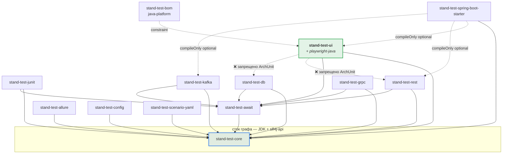
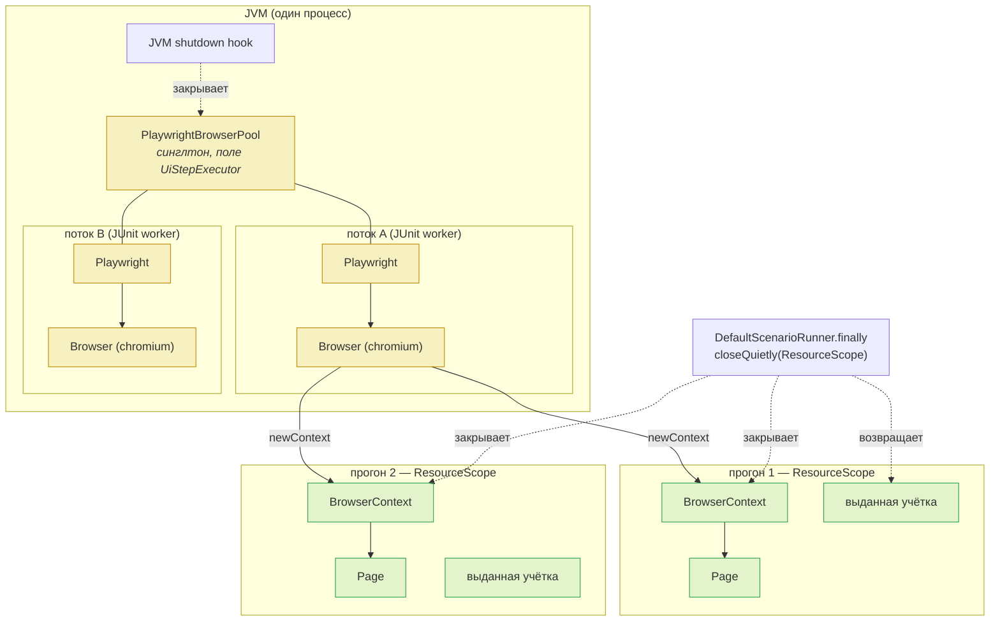
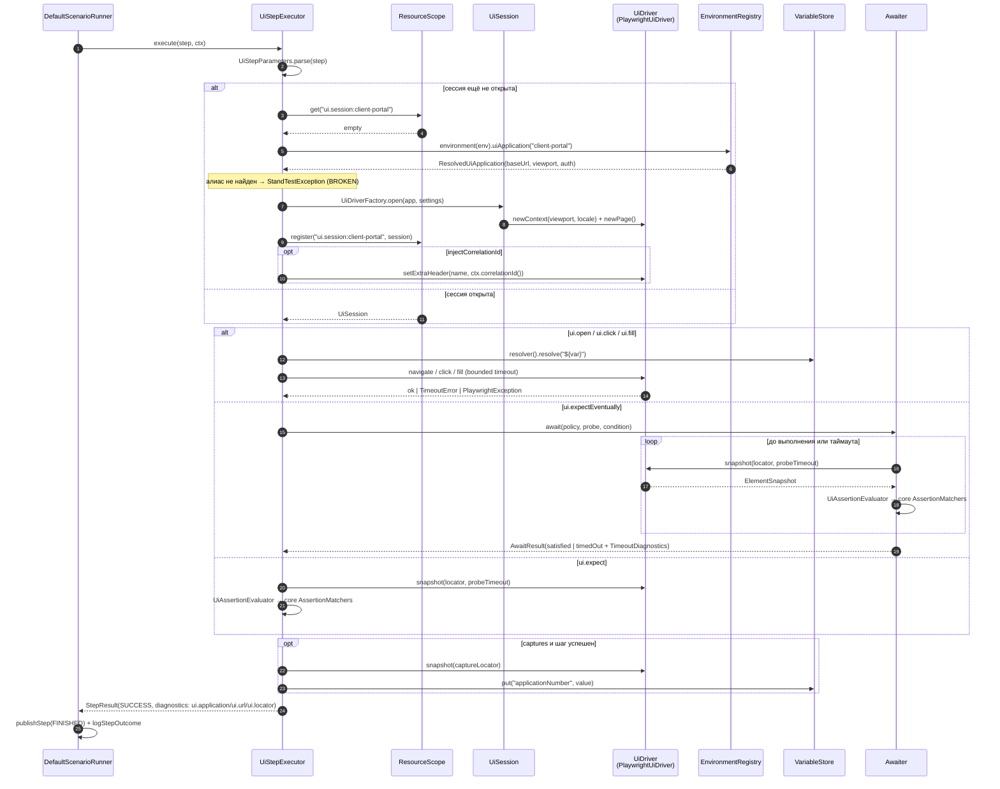

# 10. Целевая архитектура `stand-test-ui` (волна 1)

| | |
|---|---|
| **Документ** | Технический дизайн (волна 1) |
| **Основание** | [BRD](../brd/ui-test-generation-brd.md) v0.3 · [`00-current-state.md`](00-current-state.md) · [`01-brd-traceability.md`](01-brd-traceability.md) · [`02-open-questions.md`](02-open-questions.md) |
| **Дата** | 2026-08-01 |
| **Ветка / коммит** | `feat/ai-agent-kit` @ `cf81358` |
| **Статус** | Проект. Production-код не изменялся |
| **Решения** | [`adr/`](adr/) — ADR-UI-001 … ADR-UI-007 |

> **Пример из Приложения А BRD не является утверждённым API.** BRD сам помечает его как
> иллюстрацию («точные имена классов и сигнатуры builder'ов — предмет технического проектирования»).
> Ниже — проектируемое API; расхождения с иллюстрацией названы явно в §4.7.
>
> **Область — волна 1.** Визуальные регрессы, a11y, кросс-браузерность, grid, подмена сети,
> декларативный YAML-трек и self-healing в этот документ не входят: это волны 2–3, и смешивать их
> запрещено постановкой.

---

## 1. Принцип: адаптер, а не UI-фреймворк

`stand-test-ui` строится **по тому же шаблону, что четыре существующих адаптера**, и не изобретает
собственного жизненного цикла. Сверка один в один:

| Механизм SDK | Как использует `stand-test-rest` | Как использует `stand-test-ui` |
|---|---|---|
| Диспетчеризация шага | `RestStepExecutor.supports("rest.")` | `UiStepExecutor.supports("ui.")` |
| Регистрация | `META-INF/services/…StepExecutor` | то же |
| Модель шага | `RestStep.build()` → `GenericStep(id, "rest.post", …, Map)` | `UiStep.build()` → `GenericStep(id, "ui.click", …, Map)` |
| Ключи параметров | `RestStepParameters` — зеркало `StepParameterKeys` | `UiStepParameters` — то же зеркало |
| Резолв адреса | `BaseUrlResolver` (алиас → base-url-ref → значение) | `UiApplicationResolver` (алиас → base-url-ref → значение) |
| Транспортный seam | `HttpCaller` (подменяется в тестах) | **`UiDriver`** (подменяется в тестах) |
| Ожидание | `Awaiter` + `AwaitPolicy` | то же |
| Ресурс на прогон | `ResourceScope`, ключ `kafka.consumer:<topic>` | `ResourceScope`, ключ `ui.session:<application>` |
| Компенсация | `context.undoLog().register(...)` (сегодня — только db) | то же |
| Матчеры | `core.assertion.AssertionMatchers` | то же |
| Отчётность | `StepResult.diagnostics` / `attachments` | то же |

**Ничего из перечисленного не изобретается заново.** Новое в модуле ровно три вещи: абстракция
локатора, жизненный цикл браузера и снятие артефактов. Всё остальное — переиспользование.

---

## 2. Состав модуля

`stand-test-ui`, пакет `ru.alfa.stand.test.ui`. 24 типа в `src/main/java`, разбитых на пять слоёв.
Слой «драйвер» — **единственный, который знает про Playwright**.

```
ru.alfa.stand.test.ui
│
├── ▣ ПУБЛИЧНОЕ API (пишет автор теста и агент)
│   ├── UiStep.java ................. fluent-билдер → ScenarioStep. Единственная точка входа
│   ├── UiLocator.java .............. record(strategy, value, accessibleName, sensitive)
│   ├── LocatorStrategy.java ........ enum TEST_ID | ROLE | LABEL | TEXT | CSS
│   ├── UiProperty.java ............. enum TEXT | VALUE | ATTRIBUTE | VISIBLE | ENABLED
│   └── UiCaptureSource.java ........ enum TEXT | VALUE | ATTRIBUTE
│
├── ▣ МОДЕЛЬ ШАГА (внутренняя, но стабильная: её читает executor)
│   ├── UiStepParameters.java ....... константы ключей — зеркало StepParameterKeys
│   ├── UiAssertion.java ............ record(property, attribute, expectedValue, matcher)
│   ├── UiCapture.java .............. record(variableName, locator, source, attribute)
│   └── UiAction.java ............... record(kind, locator, value) — kind: CLICK | FILL
│
├── ▣ ИСПОЛНЕНИЕ (без Playwright)
│   ├── UiStepExecutor.java ......... implements StepExecutor. Оркестрация, классификация отказа
│   ├── UiSession.java .............. AutoCloseable; живёт в ResourceScope; владеет UiDriver
│   ├── UiRunSettings.java .......... record: headless, browser, viewport, trace, таймауты
│   ├── UiApplicationResolver.java .. интерфейс: alias → ResolvedUiApplication
│   ├── EnvironmentUiApplicationResolver.java .. реализация поверх EnvironmentRegistry
│   ├── ResolvedUiApplication.java .. record(alias, baseUrl, viewport, auth)
│   └── UiAssertionEvaluator.java ... делегирует в core AssertionMatchers
│
├── ▣ SPI ДРАЙВЕРА (единственный шов к браузеру)
│   ├── UiDriver.java ............... интерфейс: navigate/click/fill/read/probe/artifacts
│   ├── ElementSnapshot.java ........ record(present, visible, enabled, text, value, attributes)
│   ├── UiDriverFactory.java ........ интерфейс: open(ResolvedUiApplication, UiRunSettings) → UiDriver
│   └── UiArtifacts.java ............ record(screenshot: Path, trace: Path, console: String, network: String)
│
└── ▣ РЕАЛИЗАЦИЯ НА PLAYWRIGHT (import com.microsoft.playwright — только здесь)
    ├── PlaywrightUiDriver.java ..... implements UiDriver
    ├── PlaywrightDriverFactory.java  implements UiDriverFactory
    ├── PlaywrightBrowserPool.java .. владение Playwright + Browser, ThreadLocal + shutdown
    ├── PlaywrightLocators.java ..... UiLocator → com.microsoft.playwright.Locator
    └── SensitiveZoneMasker.java .... маскирование в DOM до снятия артефакта
```

**Правило, которое проверяется тестом:** ни один тип вне пакета
`ru.alfa.stand.test.ui.playwright` не импортирует `com.microsoft.playwright.**`.
Это ArchUnit-правило, а не соглашение (§17.3).

### 2.1 Зависимости модуля

```kotlin
// stand-test-ui/build.gradle.kts
dependencies {
    api(project(":stand-test-core"))
    implementation(project(":stand-test-await"))

    implementation(libs.playwright)     // НОВАЯ запись в gradle/libs.versions.toml
    implementation(libs.slf4j.api)

    testImplementation(platform(libs.junit.bom))
    testImplementation(libs.junit.jupiter)
    testImplementation(libs.assertj.core)
    testImplementation(libs.logback.classic)
    // component-тесты поднимают локальное веб-приложение на com.sun.net.httpserver — JDK, без зависимостей
}
```

Ровно та же форма, что у `stand-test-rest`: `api(core)` + `implementation(await)` + транспортная
библиотека. **`stand-test-core` не трогается** (кроме отдельного изменения `Attachment`, §12 и
ADR-UI-005 — оно не является зависимостью на Playwright).

---

## 3. Граф зависимостей



`stand-test-ui` встаёт в граф **точно как пятый адаптер**: зависит на `core` и `await`, не зависит
ни на один другой адаптер, никто не зависит на него, кроме `bom` (constraint) и стартера
(`compileOnly optional`).

---

## 4. Публичный API

### 4.1 Что публично и почему

Публичность здесь — обязательство поддержки: это то, что напишет агент и что будет ревьюить
автоматизатор. Всё остальное — детали, которые можно менять без миграции потребителей.

| Тип | Публичен, потому что | Что было бы, если сделать внутренним |
|---|---|---|
| `UiStep` | Единственная точка входа автора теста; аналог `RestStep`/`DbStep` | Сценарий нечем собрать |
| `UiLocator` | Живёт в Page Object потребителя — константы полей класса | Page Object невозможен, локаторы утекут в тело теста и обесценят митигацию RISK-02 |
| `LocatorStrategy` | Появляется в сигнатурах фабрик `UiLocator`; агент выбирает стратегию по приоритету (D-5) | Приоритет локаторов нечем выразить, KPI-9 нечего считать |
| `UiProperty` | Появляется в сигнатуре `assertProperty(...)` для проверок за пределами сахара | Расширение проверок потребует релиза SDK на каждый новый вид |
| `UiCaptureSource` | Автор выбирает, откуда берётся захват: текст, значение поля или атрибут | Захват из `value` (поле ввода) невыразим |
| `UiDriver` + `UiDriverFactory` + `ElementSnapshot` | **Шов подмены**: позволяет потребителю и нашим же unit-тестам работать без браузера; прямой аналог публичного `HttpCaller` в rest | Модуль нетестируем без Chromium; 90 % его тестов станут медленными и хрупкими |
| `UiApplicationResolver` + `ResolvedUiApplication` | Тот же шов для резолва алиаса; аналог публичного `BaseUrlResolver` | Нельзя протестировать executor без реестра |
| `UiStepParameters` | Читает `scenario-yaml` (волна 3) и потребитель, разбирающий чужой `GenericStep`; так же публичен `RestStepParameters` | Второй трек авторинга придётся связывать строковыми литералами |

**Намеренно НЕ публичны:** `UiSession`, `UiStepExecutor`, `UiAssertionEvaluator`, весь пакет
`playwright`. `UiStepExecutor` инстанцируется `ServiceLoader`'ом; он `public` по требованию SPI, но
не входит в поддерживаемую поверхность и помечается `@ApiStatus`-эквивалентом в Javadoc (в
репозитории это делается словами, аннотации JetBrains запрещены checkstyle'ом).

### 4.2 `UiStep` — минимальный API walking skeleton

Пять типов шагов. Больше в волне 1 не нужно, и каждый лишний — это лишняя строка в JSON Schema и в
гейтах.

```java
package ru.alfa.stand.test.ui;

public final class UiStep {

    // ── фабрики: тип шага выбирается здесь, как у RestStep.get/post/expectEventually ──

    /** ui.open — открыть приложение по алиасу на относительном пути. Абсолютный URL невыразим. */
    public static UiStep open(String application, String path);

    /** ui.click */
    public static UiStep click(String application, UiLocator locator);

    /** ui.fill — ввод значения; поддерживает ${var} через VariableResolver. */
    public static UiStep fill(String application, UiLocator locator, String value);

    /** ui.expect — немедленная проверка без ожидания. */
    public static UiStep expect(String application, UiLocator locator);

    /** ui.expectEventually — опрос через Awaiter до выполнения условия или таймаута. */
    public static UiStep expectEventually(String application, UiLocator locator);

    // ── общее ──
    public UiStep id(String id);
    public UiStep description(String description);

    // ── проверки (сахар поверх UiAssertion) ──
    public UiStep assertVisible();                       // VISIBLE == true
    public UiStep assertVisible(boolean visible);
    public UiStep assertEnabled(boolean enabled);
    public UiStep assertText(String expected);           // TEXT   EQUALS
    public UiStep assertTextContains(String expected);   // TEXT   CONTAINS
    public UiStep assertTextMatches(String regex);       // TEXT   MATCHES
    public UiStep assertValue(String expected);          // VALUE  EQUALS
    public UiStep assertAttribute(String name, String expected);
    /** Точка расширения: любое свойство × любой матчер ядра, без нового метода на каждый случай. */
    public UiStep assertProperty(UiProperty property, AssertionMatcher matcher, Object expected);

    // ── захват в VariableStore ──
    public UiStep capture(String variableName);                       // из локатора шага, TEXT
    public UiStep capture(String variableName, UiLocator from);       // из другого локатора, TEXT
    public UiStep capture(String variableName, UiLocator from, UiCaptureSource source);

    // ── ожидание (только на expectEventually — как within(...) у RestStep) ──
    public UiStep within(Duration timeout);
    public UiStep withinSeconds(long seconds);
    public UiStep pollInterval(Duration pollInterval);

    // ── корреляция ──
    /** Инжектит SDK-owned correlationId заголовком во все исходящие запросы страницы. */
    public UiStep injectCorrelationId();
    public UiStep injectCorrelationId(boolean inject);

    public ScenarioStep build();
}
```

**Почему нет `UiStep.form(...)` из Приложения А.** Составной шаг «заполнить N полей» — это
`fill(...)` × N. Отдельный тип даёт вторую грамматику для того же действия, усложняет JSON Schema
(волна 3) и прячет номер шага в отчёте: при падении на третьем поле метка
`Step [3/7] 'fill-amount' (ui.fill)` точнее, чем `Step [2/5] 'fill-form' (ui.form)`. Отклонено
осознанно, см. §4.7.

### 4.3 `UiLocator` — абстракция локатора

```java
public record UiLocator(LocatorStrategy strategy, String value, String accessibleName, boolean sensitive) {

    public static UiLocator testId(String testId);              // приоритет 1 — устойчивый
    public static UiLocator role(String role, String name);     // приоритет 2 — завязан на текст (AS-02)
    public static UiLocator label(String labelText);            // приоритет 3
    public static UiLocator text(String text);                  // приоритет 4
    public static UiLocator css(String selector);               // последнее средство, всегда хрупкий

    /** Помечает зону как чувствительную: маскируется в DOM до снятия артефакта (BR-35, SEC-05). */
    public UiLocator sensitive();

    /** true для всего, кроме TEST_ID — вход в KPI-9. */
    public boolean fragile();
}
```

**XPath отсутствует намеренно.** Он не добавляет выразительности сверх CSS и на порядок хуже
переживает дрейф вёрстки (RISK-02). Отсутствие фабрики — самый дешёвый способ его запретить: это тот
же приём, которым в SDK запрещён литеральный URL — «нет параметра, куда его положить»
([`00-current-state.md`](00-current-state.md) §11.6).

**`fragile()` — вход в KPI-9, но не его источник.** KPI-9 считается статически по смерженным Page
Object'ам (так требует BRD), а не по самоотчёту агента; метод существует, чтобы отчёт генерации
(BR-07) и статический счётчик пользовались **одним** определением хрупкости.

### 4.4 Модель проверок

```java
public record UiAssertion(UiProperty property, String attribute, Object expectedValue, AssertionMatcher matcher) { }
```

Оценка делегируется **в существующий эвалюатор ядра** — `AssertionMatchers.matches(matcher,
expected, pathPresent, actual)`. Ровно так kafka и db уже делегируют туда `equalsMatch`, и ровно это
не даёт четырём (теперь пяти) адаптерам разъехаться в семантике сравнения.

| `UiProperty` | Тип значения | Допустимые матчеры | Откуда берётся |
|---|---|---|---|
| `TEXT` | String | EQUALS, CONTAINS, MATCHES, EXISTS, NOT_NULL | `ElementSnapshot.text()` |
| `VALUE` | String | те же пять | `ElementSnapshot.value()` |
| `ATTRIBUTE` | String | те же пять | `ElementSnapshot.attributes().get(name)` |
| `VISIBLE` | boolean | **только EQUALS** | `ElementSnapshot.visible()` |
| `ENABLED` | boolean | **только EQUALS** | `ElementSnapshot.enabled()` |

Ограничение «булево свойство — только EQUALS» проверяется в `UiStep.build()` (fail-fast на сборке
сценария, до валидатора) и повторно в executor'е. Асимметрия по матчерам документируется так же
явно, как существующая асимметрия kafka (equals-only) против rest/grpc — иначе она станет
сюрпризом, как это уже было в проекте.

### 4.5 Модель захвата

```java
public record UiCapture(String variableName, UiLocator locator, UiCaptureSource source, String attribute) { }
```

Executor кладёт результат в `context.variableStore().put(variableName, value)`. Дальше значение
доступно любому шагу любого адаптера как `${variableName}` — **это и есть механизм BR-13
«связывание по данным», и он не требует ни одной новой строки в core** (см.
[`01-brd-traceability.md`](01-brd-traceability.md), D-8).

Обратное направление — `fill(locator, "${customerName}")` — разрешается через
`context.resolver()`, тем же `VariableResolver`, что и тело REST-запроса.

### 4.6 Пример: Page Object и тест на проектируемом API

```java
public final class NewApplicationPage {

    private static final String APP = "client-portal";

    private static final UiLocator PRODUCT = UiLocator.testId("application-product");
    private static final UiLocator AMOUNT  = UiLocator.role("textbox", "Сумма");
    private static final UiLocator SUBMIT  = UiLocator.role("button", "Подтвердить заявку");
    private static final UiLocator STATUS  = UiLocator.testId("application-status");
    private static final UiLocator NUMBER  = UiLocator.testId("application-number");

    private NewApplicationPage() {
    }

    public static ScenarioStep open() {
        return UiStep.open(APP, "/applications/new")
                .id("open-new-application")
                .injectCorrelationId()
                .assertVisible()
                .build();
    }

    public static ScenarioStep fillAmount(String amount) {
        return UiStep.fill(APP, AMOUNT, amount)
                .id("fill-amount")
                .build();
    }

    public static ScenarioStep submit() {
        return UiStep.click(APP, SUBMIT)
                .id("submit-application")
                .build();
    }

    public static ScenarioStep awaitAccepted() {
        return UiStep.expectEventually(APP, STATUS)
                .id("await-accepted-status")
                .assertText("Принята")
                .capture("applicationNumber", NUMBER)
                .withinSeconds(20)
                .build();
    }
}
```

```java
Scenario scenario = Scenario.builder("cp-204-new-application")
        .environment("ift")
        .tag("ui")
        .step(NewApplicationPage.open())
        .step(NewApplicationPage.fillAmount("100000"))
        .step(NewApplicationPage.submit())
        .step(NewApplicationPage.awaitAccepted())
        // связывание по данным — существующий механизм, ни одной новой строки в core
        .step(KafkaStep.expect("application-events")
                .id("await-application-event")
                .correlationIdFromContext()
                .withinSeconds(30)
                .assertPath("$.applicationNumber", "${applicationNumber}")
                .build())
        .build();

assertThat(stand.run(scenario).isSuccessful()).isTrue();
```

Ни URL, ни пароля, ни `Thread.sleep`, ни поля браузера в `Scenario`.

### 4.7 Расхождения с иллюстрацией из Приложения А BRD

| Иллюстрация BRD | Проект | Почему |
|---|---|---|
| `UiStep.open(...).expectVisible(SUBMIT)` | `assertVisible()` на локаторе шага | Проверка чужого локатора внутри `open` смешивает навигацию и ассершен; отдельный `ui.expect` даёт свой номер шага и свой слой в отчёте |
| `UiStep.form(APP).select(...).type(...)` | `ui.fill` × N | См. §4.2 |
| `.screenshot("application-accepted")` на успехе | нет в волне 1 | Скриншот на зелёном прогоне — расход на хранение (SEC-09, NFR-09) без сценария использования; артефакты снимаются на падении (BR-21). Возврат — вместе с визуальными регрессами, волна 3 |
| `UiStep.login(APP).role("client")` | `ui.login` — **Slice 3**, не в walking skeleton | Аутентификация — самая рискованная часть волны 1 (§13.1 BRD) и упирается в G-1/G-5; skeleton не должен её ждать |
| `.assertTextContains(...)` | сохранено | Совпадает |
| `Scenario.builder(...).cleanup(step)` | **не проектируется в волне 1** | ADR-UI-007: волна 1 обходится компенсатором адаптера без правки `Scenario` |

---

## 5. Внутренние SPI

Два шва. Оба существуют ради того же, ради чего в rest существуют `HttpCaller` и `BaseUrlResolver`:
**сделать executor тестируемым без внешнего мира**.

### 5.1 `UiDriver` — шов к браузеру

```java
public interface UiDriver extends AutoCloseable {

    /** Навигация на относительный путь внутри origin приложения. */
    void navigate(String relativePath);

    /** Снимок состояния элемента; никогда не бросает из-за отсутствия элемента. */
    ElementSnapshot snapshot(UiLocator locator, Duration probeTimeout);

    void click(UiLocator locator, Duration timeout);

    void fill(UiLocator locator, String value, Duration timeout);

    /** Заголовок, добавляемый ко всем исходящим запросам страницы (correlationId). */
    void setExtraHeader(String name, String value);

    /** Снимает артефакты; маскирование чувствительных зон выполняется ДО снятия. */
    UiArtifacts captureArtifacts(String label, List<UiLocator> sensitiveZones);

    @Override
    void close();
}
```

```java
public record ElementSnapshot(
        boolean present, boolean visible, boolean enabled,
        String text, String value, Map<String, String> attributes) {

    public static ElementSnapshot absent();
}
```

**`snapshot` намеренно не бросает при отсутствии элемента.** Отсутствие — это `present == false`,
то есть **данные для ассершена**, а не отказ. Иначе `assertVisible(false)` («элемента не должно
быть») пришлось бы выражать через ловлю исключения — и `ignoreExceptions` у `AwaitPolicy` начал бы
маскировать настоящие поломки драйвера.

### 5.2 `UiApplicationResolver` — шов к реестру

```java
@FunctionalInterface
public interface UiApplicationResolver {
    ResolvedUiApplication resolve(String applicationAlias, StepExecutionContext context);
}

public record ResolvedUiApplication(String alias, String baseUrl, String viewportProfile, UiAuthConfig auth) { }
```

Продуктивная реализация — `EnvironmentUiApplicationResolver`: читает `EnvironmentRegistry`, разрешает
`base-url-ref` через `SecretReferences.resolve(...)`. В unit-тестах подменяется лямбдой.

---

## 6. Lifecycle Playwright и владение объектами

Разбор в [`02-open-questions.md`](02-open-questions.md) Q-05 оставил открытым один вопрос: где живёт
`Browser`. Для `BrowserContext` ответ следовал из кода однозначно. Ниже — проектное решение
(ADR-UI-002) с явной пометкой, что именно подлежит проверке в spike.

| Объект | Область жизни | Владелец | Закрытие | Обоснование |
|---|---|---|---|---|
| `Playwright` | поток (`ThreadLocal`) | `PlaywrightBrowserPool` | JVM shutdown hook | Playwright Java не потокобезопасен; один экземпляр на поток совпадает с инвариантом SDK «один прогон = один поток». **Подлежит подтверждению в spike** (§18) |
| `Browser` | поток, лениво, вместе с `Playwright` | `PlaywrightBrowserPool` | тот же hook | Запуск браузера дорог (сотни мс); переиспользование в пределах потока держит NFR-03 (≤3 мин на сценарий) |
| `BrowserContext` | **прогон** (`run()`) | `ResourceScope`, ключ `ui.session:<alias>` | `finally` раннера | Куки, `storageState`, вьюпорт — состояние прогона. Один контекст на прогон = изоляция параллельных тестов (BR-25) |
| `Page` | прогон, внутри `UiSession` | `UiSession` | вместе с контекстом | Одна вкладка на прогон в волне 1; несколько вкладок — вне области |
| Выданная учётка | прогон | `ResourceScope` | `finally` | Возврат в пул обязан произойти и на упавшем прогоне (Slice 4) |

**Критическое: `BrowserContext` не может лежать в поле `UiStepExecutor`.** Проверенный факт —
`StandClient` кэшируется в ROOT-store JUnit-расширения (`StandTestExtension:162-165`), значит список
`StepExecutor` **синглтон на JVM, разделяемый всеми параллельными сценариями**. Поле executor'а —
общий mutable state. Это ограничение — причина, по которой `UiSession` живёт в `ResourceScope`, а не
в адаптере.



**Оговорка о переиспользовании браузера.** Skeleton (Slice 1) поднимает браузер на каждый прогон:
медленно, зато заведомо корректно и измеряет верхнюю границу NFR-03. Пул с `ThreadLocal` вводится
отдельной задачей после того, как корректный медленный вариант работает и есть замер. Порядок
«сначала правильно, потом быстро» здесь не догма, а следствие того, что Q-05 открыт.

---

## 7. Модель изоляции тестов

Пять уровней, четыре из которых **уже обеспечены существующим кодом** и достаются UI бесплатно.

| Уровень | Механизм | Существует? |
|---|---|---|
| Идентификаторы прогона | `ScenarioContext.start()` — свежие `TestRunId` + `CorrelationId` на каждый `run()` | **да** |
| Переменные | свежий `VariableStore` на каждый `run()`; обычный `LinkedHashMap` — безопасен именно потому, что один прогон = один поток | **да** |
| Ресурсы | свежий `ResourceScope` на каждый `run()`, `closeAll()` в `finally` | **да** |
| Компенсации | свежий `UndoLog` на каждый `run()` | **да** |
| **Состояние браузера** | **один `BrowserContext` на прогон** — свои куки, storage, кэш | **новое** |
| **Учётка** | одна выданная учётка на прогон, `storageState` привязан к учётке, а не к набору (BR-29) | **новое, Slice 4** |

**Жёсткое ограничение, которое обязан соблюдать модуль:** UI-адаптер **не имеет права** выносить
работу с экраном в собственный пул потоков и писать в `VariableStore` оттуда. `VariableStore` не
синхронизирован, `Page` Playwright тоже не потокобезопасен — ограничения совпадают.

**Потолок параллельности — размер пула учёток** (BR-34, G-5, OQ-12), а не возможности SDK. Это
внешний блокер, и разработку он не задерживает: до Slice 4 модуль работает на одной учётке
последовательно.

---

## 8. Интеграция с JUnit 5

**Новых точек интеграции не требуется.** `stand-test-junit` не получает зависимости на
`stand-test-ui` — это запрещено графом (иначе Playwright прилетел бы в каждый протокольный тест).

```
UI-модуль → META-INF/services/…StepExecutor
              ↓ ServiceLoader
StandTestExtension.buildStandClient()  ← существующий код, не меняется
              ↓
DefaultScenarioRunner(executors, …)    ← UiStepExecutor просто в списке
```

Автор теста пишет то же, что для протокольного теста:

```java
@StandTest(env = "ift")
class NewApplicationTest {
    @Test
    void applicationIsCreated(StandClient stand) { … }
}
```

Единственный нюанс — **закрытие браузерного пула**. ROOT-store JUnit'а не действует на
Spring-пути (`StandTestAutoConfiguration`), поэтому пул закрывается **JVM shutdown hook'ом** — это
работает на обеих поверхностях и не требует нового модуля-зависимости. Разбор альтернатив —
ADR-UI-002.

Существующие маркеры параллельности (`@StandParallelSafe`, `@StandSerial`, `@StandIsolated`)
применимы к UI-классам без изменений.

---

## 9. Модель UI-шага и его исполнение

### 9.1 Пять типов шагов волны 1

| Тип | Действие | Ожидание | Захват | Проверки |
|---|---|---|---|---|
| `ui.open` | навигация на относительный путь | нет (готовность документа — дело драйвера) | нет | опционально |
| `ui.click` | клик | ограничен `timeoutMillis` действия | нет | нет |
| `ui.fill` | ввод (с резолвом `${var}`) | то же | нет | нет |
| `ui.expect` | нет | нет | да | обязательны |
| `ui.expectEventually` | нет | `Awaiter`, обязательный ограниченный таймаут | да | обязательны |

Параметры кладутся под ключами `UiStepParameters`, которые — **зеркало `StepParameterKeys`**:
`APPLICATION` (новая константа), `PATH`, `TIMEOUT_MILLIS`, `POLL_INTERVAL_MILLIS`, `ASSERTIONS`,
`CAPTURES`, `INJECT_CORRELATION_ID`. Это не косметика: проверки таймаутов и заголовков в
`DefaultScenarioValidator` работают **по имени ключа**, а не по префиксу типа, и потому
распространятся на `ui.*` **бесплатно** ([`01-brd-traceability.md`](01-brd-traceability.md), BR-23).

### 9.2 Sequence: исполнение UI-шага



Обратите внимание: сессия создаётся **лениво, на первом UI-шаге**, и переиспользуется остальными
шагами того же прогона по ключу `ResourceScope`. Точно так же `DbStepExecutor` держит run-scoped
соединение.

### 9.3 Модель ожидания

Владелец ожидания — **`Awaiter` из `stand-test-await`**, а не автоожидания Playwright. Два
ожидания, вложенные друг в друга, дают неверный бюджет времени и непредсказуемую диагностику.
Разграничение:

| Что | Кто ждёт | Граница |
|---|---|---|
| Опрос ассершена (`ui.expectEventually`) | `Awaiter`, `pollInterval` по умолчанию 200 мс (как у rest) | `timeoutMillis` шага, обязателен, ≤ 1 ч (`MAX_TIMEOUT_MILLIS`) |
| Actionability действия (`click`/`fill`: элемент видим, включён, стабилен) | Playwright — здесь его автоожидание **уместно и полезно** | явно выставленный таймаут действия, производный от `timeoutMillis` шага |
| Проба внутри опроса (`snapshot`) | Playwright | **короткий** `probeTimeout` ≈ `pollInterval`, чтобы проба не съедала бюджет опроса |

`Thread.sleep` не появляется нигде; `AwaitPolicy` требует строго положительных `timeout` и
`pollInterval` на уровне конструктора, а `DefaultScenarioValidator` дополнительно отвергает
`timeoutMillis` вне `(0; 3 600 000]`.

---

## 10. Обработка ошибок и определение слоя отказа

### 10.1 Таблица классификации

Это **центральная таблица корректности модуля**. Ошибка здесь отравляет NFR-01 (flaky rate) и BR-26
на входе: инфраструктурный отказ, записанный как `FAILED`, попадёт в числитель flaky.

| Что произошло | `StepStatus` | Бросается раннером | Почему так |
|---|---|---|---|
| Ассершен не выполнился (текст не совпал, элемент не виден) | `FAILED` | `StandTestAssertionError` | Ожидание о продукте не подтвердилось |
| `ui.expectEventually` исчерпал таймаут | `TIMEOUT` | `StandTestAssertionError` | То же, но с `TimeoutDiagnostics` |
| `click`/`fill` по отсутствующему или неактивному элементу | `FAILED` | `StandTestAssertionError` | **Утверждение о состоянии экрана**: тест ожидал кнопку — её нет. Это дефект продукта или дрейф UI, не инфраструктура |
| Алиас приложения не в реестре | `BROKEN` | `StandTestException` | Конфигурация. Ловится **до прогона** валидатором (§11) |
| `base-url-ref` не разрешился | `BROKEN` | `StandTestException` | Конфигурация |
| Браузер не запустился, не скачался, упал | `BROKEN` | `StandTestException` | Инфраструктура |
| Навигация не состоялась (DNS, TLS, connection refused) | `BROKEN` | `StandTestException` | Стенд недоступен — в NFR-01 это отдельный счётчик, не flaky |
| Страница ответила 5xx на навигации | `BROKEN` | `StandTestException` | Стенд не поднялся. Симметрично REST, где транспортная ошибка прерывает опрос |
| Пул учёток исчерпан за отведённый таймаут (Slice 4) | `BROKEN` | `StandTestException` | Инфраструктура; **ожидание обязано быть ограниченным** (BR-34) |
| Любая иная `PlaywrightException` | `BROKEN` | `StandTestException` | Неклассифицированное — консервативно инфраструктура |

### 10.2 Слой отказа (BR-22, D-7)

Отдельного поля «слой» не заводится — **оно уже есть** в виде `stepType`. Определение слоя по
отчёту, без чтения кода теста:

```
Step [4/7] 'submit-application' (ui.click) FAILED: element not actionable: role=button name="Подтвердить заявку"
      │        │                    │
      │        │                    └── слой: UI
      │        └── какой шаг
      └── позиция в сценарии
```

`ui.` против `kafka.expect` / `db.expectEventually` / `rest.post` — слой читается из префикса типа.
Дополнительно executor кладёт в `StepResult.diagnostics`:

| Ключ | Значение |
|---|---|
| `ui.application` | алиас приложения |
| `ui.url` | текущий URL страницы (внутри origin алиаса) |
| `ui.locator` | человекочитаемое описание локатора |
| `ui.locator.strategy` | `TEST_ID`/`ROLE`/… — вход в KPI-9 |
| `ui.element.present` / `visible` / `enabled` | снимок на момент отказа — отвечает «кнопки не было» против «кнопка была, но неактивна» |
| `exception.class` | добавляет раннер |

Это то же, что делает `RestStepExecutor`, кладя в диагностику метод, URL и статус.

### 10.3 Sequence: обработка падения

```mermaid
sequenceDiagram
    autonumber
    participant E as UiStepExecutor
    participant D as UiDriver
    participant M as SensitiveZoneMasker
    participant R as DefaultScenarioRunner
    participant P as ReportingEventPublisher
    participant SC as ResourceScope

    E->>E: ассершен не выполнился / TimeoutError
    E->>E: классификация → FAILED | TIMEOUT | BROKEN

    rect rgb(255,248,240)
        Note over E,M: снятие артефактов — только на отказе
        E->>M: маскировать зоны sensitive() В DOM
        M->>D: заменить значения помеченных элементов
        E->>D: captureArtifacts(label, sensitiveZones)
        D-->>E: UiArtifacts(screenshot.png, trace.zip, console.txt, network.txt)
        Note right of D: screenshot дополнительно с mask-опцией<br/>Playwright — защита в глубину
    end

    E->>E: собрать StepResult(status, diagnostics, attachments)
    Note over E: 2 текстовых вложения (console, network)<br/>+ 2 файловых (screenshot, trace) — см. §12

    alt executor бросает
        E-->>R: StandTestAssertionError | StandTestException
        R->>R: recordFailure(...) → StepResult
        R->>P: StepEvent(FINISHED, status, diagnostics, attachments)
        R->>R: LOG.warn/error "Step [i/n] 'id' (ui.click) FAILED: …"
    end

    R->>R: throw с меткой шага; исходное — как cause

    rect rgb(240,248,255)
        Note over R,SC: finally — существующий код, не меняется
        R->>R: drainCompensations(undoLog, cleanupPolicy, runFailed=true)
        R->>SC: closeQuietly() → UiSession.close() → BrowserContext.close()
        R->>P: ScenarioEvent(FINISHED)
    end
```

Ключевое: **закрытие сессии выполняется существующим `closeQuietly` в `finally`**, и UI-модулю
ничего не нужно делать самому. Если `close()` контекста бросит — это будет проглочено и залогировано
на WARN, не превратив упавший тест в другой отказ и не превратив зелёный в красный.

---

## 11. Guardrails: как UI попадает под существующие запреты

| Запрет | Механизм | Работает для `ui.*` |
|---|---|---|
| Ограниченный таймаут | `DefaultScenarioValidator.checkTimeout()` — **по имени ключа** | **автоматически**, если использовать `StepParameterKeys.TIMEOUT_MILLIS` |
| Секрет в заголовке | `checkHeaders()` — по ключу `headers` | **автоматически** |
| Whitelist алиаса | `checkAliasWhitelist()` — **по префиксу типа** | ❌ **нет ветки `ui.` — её надо дописать** |
| Литеральный URL | «нет параметра, куда его положить» | по конструкции: только `application` + относительный `path` |
| `Thread.sleep` | детектор кита + `ForbiddenOperation.THREAD_SLEEP` | статически; в модуле его нет |

**Единственная правка `stand-test-core` в этом разделе** — ветка `ui.` в `checkAliasWhitelist` плюс
константа `UI_PREFIX`/`APPLICATION` в `StepParameterKeys`. Это не зависимость и не IO; ровно так там
уже живут `db.`/`rest.`/`kafka.`/`grpc.`.

Отдельно фиксируется урок, вынесенный из [`01-brd-traceability.md`](01-brd-traceability.md):
**guardrail, привязанный к имени ключа, переживает появление нового адаптера; привязанный к префиксу
типа — нет.** Ветка `ui.` обязана прийти вместе с тестом, который падает без неё — иначе повторится
класс дефекта, закрытый коммитом `cf81358` («guardrails that were declared and never ran»).

---

## 12. Артефакты и отчётность

### 12.1 Конфликт и его разрешение

Проверенный факт: `Attachment` — это `record Attachment(String name, String mediaType, String
content)`, а `DefaultAllureLifecycleFacade:67` делает `content.getBytes(UTF_8)`. Тракт текстовый.
Из четырёх артефактов BR-21 два проходят, три — нет.

**Решение (ADR-UI-005):** добавить в `Attachment` четвёртый компонент `Path file` с инвариантом
«ровно одно из `content`/`file` не null», сохранив трёхаргументный конструктор и `of(...)`. Это
**изменение `stand-test-core`**, не учтённое в §13.1 BRD, и оно требует регрессионного прогона
`stand-test-allure` (57 тестов) и всего набора (NFR-06).

| Артефакт | Представление | Media type | Маскирование |
|---|---|---|---|
| Скриншот | `Path` (PNG) | `image/png` | в DOM **до** снятия + `mask`-опция Playwright |
| Трейс | `Path` (ZIP) | `application/zip` | **см. ограничение ниже** |
| Консоль браузера | `String` | `text/plain` | существующий `SecretMasker` по тексту |
| Сетевые запросы | `String` | `text/plain` | существующий `SecretMasker` по тексту |

### 12.2 Маскирование чувствительных зон (BR-35, SEC-05)

Маскирование выполняется **в DOM, до снятия любого артефакта** — так требует SEC-05, и иначе
нельзя: `SecretMasker` работает по тексту и растр замаскировать не может, а OCR вынесен из области
(§6.2 BRD).

Источник разметки — флаг `sensitive` на `UiLocator` в Page Object (волна 1) и, позже, запись экрана в
KB (BR-08, Slice 6).

**Честное ограничение волны 1 по трейсу.** Playwright-трейс содержит DOM-снимки, снятые в течение
всего прогона, **включая моменты до маскирования**. Маскировать их постфактум нечем. Поэтому:

> Трейс снимается **только если у приложения не объявлено ни одной чувствительной зоны**. Если зоны
> объявлены, трейс отключается, и падение сопровождается скриншотом (замаскированным), консолью и
> сетью. Поведение управляется полем приложения в реестре и по умолчанию — **безопасное**
> (трейс выключен).

Это сознательное ограничение, а не недосмотр: альтернатива — либо утечка ПД в трейс (RISK-05,
«любой подтверждённый случай → остановка прогонов»), либо задержка волны 1 на разработку
пост-обработки трейса. Компенсирующий контроль — SEC-09 (срок жизни артефактов). Снятие
ограничения — задача волны 2.

### 12.3 Что достаётся бесплатно

`scenarioId`/`testRunId`/`correlationId` в каждом `StepEvent`; best-effort-семантика публикации
(бросивший приёмник проглатывается, тест не падает); маскирование текста на приёмнике; MDC на
прогон и на шаг; `Step [i/n] 'id' (type)` в логе и в исключении. **Ни одной строки нового кода.**

---

## 13. Конфигурация: headed/headless, браузер, вьюпорт

Ни одно из этих значений не попадает в `Scenario` (BR-31, NFR-05; Приложение А BRD помечает вьюпорт
в билдере как отвергнутый).

**Приоритет (первое найденное побеждает):**

```
1. системное свойство прогона        -Dstand.test.ui.headless=false
2. профиль приложения в реестре сред  viewport-profiles / default-viewport
3. умолчание SDK                      headless=true, chromium, trace=off
```

| Свойство | Умолчание | Назначение |
|---|---|---|
| `stand.test.ui.headless` | `true` | BR-18 (CI) / BR-19 (локальная отладка) |
| `stand.test.ui.browser` | `chromium` | волна 1 — только chromium; кросс-браузерность волна 3 |
| `stand.test.ui.viewport` | `desktop` | имя профиля из реестра (BR-16 — волна 3, но профиль нужен уже сейчас) |
| `stand.test.ui.trace` | `off` | `off` / `on-failure`; ограничение §12.2 |
| `stand.test.ui.artifacts.dir` | `build/stand-test-ui` | куда падают файлы артефактов |
| `stand.test.ui.slowmo.millis` | `0` | отладка; **не является ожиданием** — не заменяет `Awaiter` |

Читается один раз на прогон в `UiRunSettings` — иммутабельный record, передаваемый в
`UiDriverFactory`. Смена вьюпорта не меняет `Scenario` и, следовательно, не меняет
`Scenario.equals()` — это проверяется тестом.

Секция приложения в реестре (форма — предмет ADR-UI-004, здесь показан только состав):

```yaml
version: 2                                   # BR-37 — см. ADR-UI-004
environments:
  ift:
    ui-applications:
      client-portal:
        base-url-ref: CLIENT_PORTAL_IFT_URL  # имя переменной окружения, не значение
        default-viewport: desktop
        viewport-profiles:
          desktop: { width: 1440, height: 900 }
        trace: off                           # §12.2
        auth:                                # Slice 3, ключ `scheme` как у сервисов (BR-37)
          scheme: FORM
```

---

## 14. Cleanup: компенсации UI-шагов в волне 1

Разбор в [`01-brd-traceability.md`](01-brd-traceability.md) (D-9) показал, что BRD объединяет две
разные вещи. Волна 1 берёт **только первую**:

- **(а) Компенсатор, регистрируемый адаптером — берём.** `Compensator` и `UndoLog` живут в
  `core/compensation/` и **уже полностью обобщены**: интерфейс — это `actionId()`/`target()`/
  `compensate()`, ничего DB-специфичного. `CleanupPolicy.ALWAYS` реализована. UI-адаптер регистрирует
  `UiCompensator` в момент создания сущности — **правки core не требуется вовсе**.
- **(б) Сценарный шаг `.cleanup(RestStep…)` — не берём в волну 1.** Это изменение `Scenario`,
  билдера и раннера, то есть RISK-15 («любая регрессия существующих тестов — блокирующий дефект,
  работа откатывается»).

**Следствие, которое надо назвать вслух:** вариант (а) означает, что компенсация выполняется
средствами UI (отзыв заявки через сам интерфейс). Компенсация чужим протоколом (REST-вызов) внутри
UI-модуля столкнулась бы с правилом «адаптеры не зависят друг на друга» — и потому откладывается
вместе с (б). Пригодность (а) для приложений волны зависит от ответа на Q-12 (способ удаления данных
по каждому приложению). Полный разбор — ADR-UI-007.

---

## 15. Что меняется вне `stand-test-ui`

Полный список. Каждая строка — отдельная задача в бэклоге с собственным регрессионным прогоном.

| Модуль | Изменение | BRD | Риск |
|---|---|---|---|
| `stand-test-core` | ветка `ui.` в `DefaultScenarioValidator.checkAliasWhitelist()` | BR-27, SEC-01 | низкий; чистое добавление |
| `stand-test-core` | `UI_PREFIX`, `APPLICATION` в `StepParameterKeys` | BR-27 | нулевой |
| `stand-test-core` | `UiApplicationDefinition` в `EnvironmentDefinition` | BR-27, BR-31 | низкий; новое опциональное поле |
| `stand-test-core` | **`Attachment` + компонент `Path file`** | BR-21 | **средний** — общая модель; регресс allure |
| `stand-test-core` | (опционально) новые константы `ForbiddenOperation` | BR-27 | нулевой; enum покрыт cross-check тестом |
| `stand-test-config` | разбор `ui-applications` + ключ `version` в `ROOT_KEYS` | BR-37, D-10 | **средний** — fail-closed загрузчик |
| `stand-test-spring-boot-starter` | зеркальный маппинг UI-секции | BR-28, BR-37 | средний — **риск дрейфа двух мапперов** |
| `stand-test-allure` | публикация файловых вложений | BR-21 | средний |
| `stand-test-bom` | constraint на `stand-test-ui` | NFR-06 | нулевой |
| `stand-test-example` | ArchUnit-правила + витрина UI на локальном дубле | NFR-05 | нулевой |
| `gradle/libs.versions.toml` | версия Playwright | D-2 | зависит от Q-11 (закрытый контур) |
| `docs/ai-agent` | скиллы разведки/авторинга, UI-детекторы гейта | BR-03, BR-06, SEC-06 | средний |

**Итого правок `stand-test-core` — пять, а не одна.** §13.1 BRD называет единственной «компенсации
не-DB шагов» (D-9) — а именно её волна 1, по ADR-UI-007, **не делает**. Это расхождение с оценкой
BRD, и оно должно быть отражено при пересмотре §13.1.

---

## 16. Lifecycle одного UI-теста

```mermaid
stateDiagram-v2
    [*] --> Сборка: Page Object + Scenario.builder()<br/>ленивый билдер, IO нет

    Сборка --> Валидация: stand.run(scenario)
    Валидация --> Отклонён: алиас приложения не в реестре<br/>таймаут вне (0; 1ч]
    Отклонён --> [*]: StandTestException<br/><b>браузер не запускался</b>

    Валидация --> Контекст: ok
    Контекст --> Prepare: ScenarioContext.start()<br/>ResourceScope, UndoLog, VariableStore

    Prepare --> Шаги: UiStepExecutor.prepare() — no-op в волне 1
    note right of Prepare
        prepare НЕ поднимает браузер:
        сценарий без UI-шагов не должен
        платить за Chromium
    end note

    state Шаги {
        [*] --> Сессия: первый ui.* шаг
        Сессия --> Действие: BrowserContext + Page<br/>→ ResourceScope
        Действие --> Действие: click / fill / open
        Действие --> Ожидание: ui.expectEventually
        Ожидание --> Захват: условие выполнено
        Захват --> Действие: VariableStore.put()
        Захват --> [*]: шаги кончились
    }

    Шаги --> Артефакты: шаг упал
    Артефакты --> Finally: маскирование → screenshot/trace/console/network

    Шаги --> Finally: все шаги прошли

    state Finally {
        [*] --> Drain: drainCompensations()<br/>UiCompensator + DbCompensator, reverse
        Drain --> Close: closeQuietly()<br/>BrowserContext.close(), возврат учётки
        Close --> Publish: ScenarioEvent(FINISHED)
        Publish --> [*]
    }

    Finally --> Успех: ScenarioResult(SUCCESS)
    Finally --> Отказ: StandTestAssertionError / StandTestException
    Успех --> [*]
    Отказ --> [*]
```



**`prepare` намеренно пуст.** Поднимать браузер в `prepare` означало бы платить за Chromium в любом
сценарии, где UI-шаги есть в списке, но до них не дошло, — и, что хуже, в сценарии, отклонённом
позже. Сессия открывается лениво, на первом фактически исполняемом UI-шаге.

---

## 17. Стратегия тестирования модуля

Детальный план — [`21-wave-1-test-strategy.md`](21-wave-1-test-strategy.md). Здесь — принцип,
который определил форму архитектуры.

### 17.1 Пирамида

| Уровень | Что | Браузер | Доля |
|---|---|---|---|
| Unit | `UiStep`, `UiLocator`, парсинг параметров, **классификация отказов**, эвалюатор, резолвер | **нет** — фейковый `UiDriver` | ~70 % |
| Component | `PlaywrightUiDriver` против **локального веб-приложения на `com.sun.net.httpserver`** (JDK, без новых зависимостей) | Chromium | ~20 % |
| Integration | сквозной сценарий в `stand-test-example` на локальном дубле | Chromium | ~7 % |
| Architecture | ArchUnit в `stand-test-example` | нет | ~3 % |

**Ни один тест не ходит на DEV/IFT.** Это не послабление, а действующий инвариант репозитория:
`stand-test-example` — «test-only showcase (offline doubles)», и `--rerun-tasks` прогоняет 1203
теста без единого внешнего адреса.

### 17.2 Почему архитектура именно такая

Шов `UiDriver` существует ровно ради строки «Unit — браузера нет». Без него классификация отказов
(§10.1) — самая ответственная часть модуля — тестировалась бы только через Chromium, то есть
медленно и хрупко. С ним «`click` по отсутствующему элементу → `FAILED`, а не `BROKEN`» проверяется
за миллисекунды на фейке, возвращающем `ElementSnapshot.absent()`.

### 17.3 Обязательные архитектурные тесты

Три из них — новые правила, которых сегодня нет и которые следует завести **до** первой строки
модуля (см. §11 «guardrail, объявленный и не работающий»):

| Тест | Правило |
|---|---|
| `coreHasNoUiOrIoDependencies` | `stand-test-core` не зависит ни на что, кроме JDK и `slf4j-api` — **сегодня такого правила нет**, и `implementation(libs.playwright)` в core прошёл бы все 1203 теста |
| `scenarioHasNoUiFields` | состав полей `Scenario` зафиксирован; любое добавление ломает тест осознанно |
| `playwrightIsConfinedToDriverPackage` | `com.microsoft.playwright.**` импортируется только из `ru.alfa.stand.test.ui.playwright` |
| `uiDoesNotDependOnOtherAdapters` | расширение существующего `adaptersDoNotDependOnEachOther` |
| `nothingDependsOnUi` | кроме `bom` и стартера |

---

## 18. Что подлежит проверке в spike

Честный список того, что в этом документе является **проектным предположением**, а не выводом из
кода. Каждый пункт закрывается Slice 0/1 до того, как на нём будет построено что-то ещё.

| # | Предположение | Как проверяется | Что если неверно |
|---|---|---|---|
| 1 | Playwright Java требует одного экземпляра на поток | Параллельный component-тест на 4 потока | Модель владения из §6 меняется; **шов `UiDriverFactory` делает изменение локальным** |
| 2 | Playwright резолвится через внутренний Artifactory и скачивает браузеры в закрытом контуре | `./gradlew :stand-test-ui:dependencies` + запуск на CI-агенте | Блокер D-2; возможен возврат к альтернативному драйверу — ADR-UI-002 |
| 3 | Минимальная JDK Playwright ≤ 17 | Сборка модуля с `--release 17` | Ломается NFR-04; решение о `javaRelease` затрагивает **все** модули |
| 4 | Playwright `screenshot(mask=…)` покрывает BR-35 для скриншота | Component-тест: поле с ПД отсутствует на PNG | Маскирование целиком уходит в DOM-подмену |
| 5 | Добавление компонента в record `Attachment` не ломает потребителей | Полный прогон 1203 тестов | Вариант (б)/(в) из ADR-UI-005 |

Пункты 2 и 3 — **потенциальные блокеры D-2**, и их следует закрыть в первую очередь: они дешевле
всего и дороже всего при поздней находке.

---

## 19. Сводка соответствия требованиям волны 1

| BRD | Чем закрывается в этом дизайне |
|---|---|
| BR-06, D-4 | §4 — `UiStep` + `UiLocator` в Page Object |
| BR-09, D-3 | §2 — в рантайме нет обращений к модели; self-healing вне области |
| BR-10, BR-11 | §4.2, §4.4 — пять типов шагов, пять матчеров ядра |
| BR-18, BR-19, BR-31 | §13 — конфигурация вне `Scenario`, headless по умолчанию |
| BR-21 | §12 + ADR-UI-005 — файловые вложения |
| BR-22, D-7 | §10.2 — слой из `stepType` + диагностика |
| BR-23 | §9.3 — `Awaiter` владеет ожиданием; ключи из `StepParameterKeys` |
| BR-24, D-9 | §14 + ADR-UI-007 — компенсатор адаптера, без правки core |
| BR-27, SEC-01 | §11 — ветка `ui.` + отсутствие параметра под URL |
| BR-28, BR-29, BR-34, SEC-04 | ADR-UI-006 (Slice 3–4) |
| BR-35, SEC-05 | §12.2 — маскирование в DOM до снятия; ограничение по трейсу названо |
| BR-37, D-10 | ADR-UI-004 |
| NFR-04 | §18 п. 3 |
| NFR-05, RISK-09 | §3, §17.3 — три новых ArchUnit-правила |
| NFR-06 | §15 — список правок вне модуля, каждая с регрессом |
| NFR-07 | §17 — модуль под тем же checkstyle `maxWarnings = 0` |
| NFR-08 | §12.3 — MDC и метка шага достаются бесплатно |
| D-1, D-2 | §2, §3 |
| D-5 | §4.3 — `fragile()` как общее определение для BR-07 и KPI-9 |
| D-8 | §4.5 — захват в `VariableStore`, существующий механизм |
