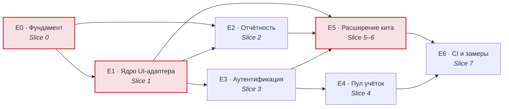
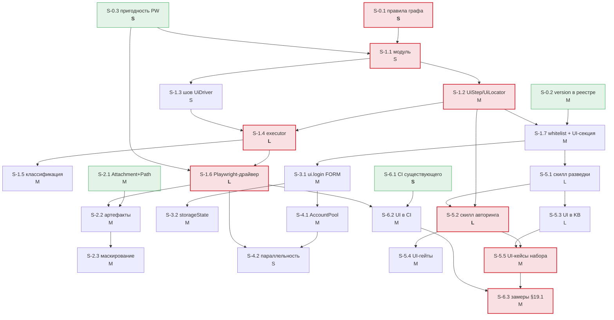

# 20. Бэклог волны 1: UI-тестирование на `stand-test-ui`

| | |
|---|---|
| **Документ** | Исполнимый бэклог (волна 1) |
| **Основание** | [BRD](../brd/ui-test-generation-brd.md) §18 «Волна 1» · [`10-target-architecture.md`](10-target-architecture.md) · [`adr/`](adr/) |
| **Дата** | 2026-08-01 · **статусы пересмотрены 2026-08-04** (`UITG-S010`) |
| **Статус** | **Не проект.** Большая часть волны 1 реализована; статус каждой Story проставлен ниже и подтверждён кодом или прогоном |
| **Источник статусов** | [`planning/02-requirements-traceability.md`](planning/02-requirements-traceability.md) и **сам код** — не этот документ. Где они расходятся, следует код, и расхождение названо |
| **Область** | **Только волна 1.** Визуальные регрессы, a11y, кросс-браузерность, grid, подмена сети, YAML-трек, сквозные UI+backend сценарии и негативные кейсы (BR-12) — волны 2–3 и в бэклог не входят |

## Как читать

Иерархия: **Epic → Feature → Story → технические подзадачи**. Story — единица приёмки; подзадача —
единица работы одного человека за раз.

Оценки `S/M/L/XL`: `S` ≈ до 1 дня, `M` ≈ 2–3 дня, `L` ≈ до недели, `XL` ≈ больше недели (такие
подлежат разбиению при планировании спринта — здесь их два, и оба помечены).

**Definition of Done, общий для каждой Story** (в карточках указано только то, что сверх него):

- [ ] `./gradlew build` зелёный — компиляция, checkstyle `maxWarnings = 0`, JaCoCo ≥ 80 % INSTRUCTION;
- [ ] полный набор зелёный — базовая линия NFR-06. Число росло вместе с работой: **1203** на
      `cf81358` (когда писался этот документ), **1473** на 2026-08-04 (0 падений, 1 намеренный
      пропуск, замер `./gradlew build --rerun-tasks --no-build-cache`). Сверяться следует с
      текущим прогоном, а не с числом в тексте;
- [ ] новые тесты падают без изменения (проверено вручную) — правило, выведенное из дефекта
      «guardrails that were declared and never ran» (`cf81358`);
- [ ] Javadoc на публичных типах; язык — английский, как во всём репозитории;
- [ ] документация обновлена (какая именно — в карточке);
- [ ] ни один тест не обращается к DEV/IFT;
- [ ] ревью пройдено.

---

## Фактическое состояние на 2026-08-04

Этот документ писался как проект и полтора месяца утверждал, что production-код не изменялся. Он
изменился: девятнадцать Story из двадцати пяти сделаны. Пока шапка говорила обратное, бэклог
оставался входом в планирование и заставлял планировать сделанное — это конфликт **CONF-05** и
вопрос **PQ-03**, и раздел заведён, чтобы закрыть их фактом.

**Правило доказательности.** Статус подтверждается кодом или прогоном, а не другим документом. Где
[`planning/02-requirements-traceability.md`](planning/02-requirements-traceability.md) расходится с
кодом, следует код; расхождения названы в конце раздела.

| Статус | Story | Итого |
|---|---|---|
| **Сделано** | S-0.1, S-0.2, S-0.3, S-1.1, S-1.2, S-1.3, S-1.4, S-1.5, S-1.6, S-1.7, S-2.1, S-2.2, S-2.3, S-3.1, S-3.2, S-4.1, S-4.2, S-5.1, S-5.2, S-5.4, S-5.5, S-6.1 | **22** |
| **Частично** | S-6.3 (инструмент KPI-9 есть, замеров нет) | **1** |
| **Не сделано** | S-5.3 (волна 2), S-6.2 (ждёт G-3) | **2** |

Статус каждой Story стоит в её карточке отдельной строкой с доказательством. Эпики — в таблице ниже.

> **Пересмотр 2026-08-07.** Числа выше и четыре строки статуса ниже пересняты: между снимком
> 2026-08-04 и этой датой сели `S012`…`S018` (лейн артефактов падения), `S020`/`S021`/`T004`/`F006`
> (UI-половина гейта безопасности) и `S023`. Прежние значения — 18/2/5 — были верны на свою дату и
> устарели; строки, которые изменились, названы поимённо в каждой карточке и передатированы. Три
> оставшиеся — `S-5.3` (UI в базе знаний, волна 2), `S-6.2` (ждёт G-3) и `S-6.3` (инструмент есть,
> замеров нет) — перепроверены и не изменились, поэтому сохраняют свою дату: пересмотр не делает
> утверждение новым. Метод прежний: статус подтверждается кодом и прогоном, а не намерением.

**Уточнение, которое сняло само себя.** До 2026-08-06 «Сделано» означало «существует и проверено
прогоном», но **не «в git»**: модуль `stand-test-ui` лежал в рабочем дереве целиком, и ревью третьим
лицом было невозможно. Это больше не так — порции сели коммитами `aa26ea5`…`ffe46a3`, и оговорка
осталась здесь как запись того, чем эта таблица однажды вводила в заблуждение. Различение «Сделано» и
«Сделано, в git» в карточках ниже с тех пор бессодержательно: в git теперь всё перечисленное.

**Три места, где `02-requirements-traceability.md` разошёлся с кодом** (матрица снята 2026-08-03, до
этих работ; здесь следуем коду):

| Утверждение матрицы | Факт (снят 2026-08-04, строка SEC-06 пересмотрена 2026-08-07) |
|---|---|
| BR-18: «в репозитории нет ни одного CI-конфига» | `.gitlab-ci.yml` есть: джобы `verify` и `nightly-verify` (`UITG-S025`) |
| D-5: «KPI-9 статически не считается (S-6.3)» | считается подкомандой `kpi-locators` гарда (`UITG-S024`); на эталонном Page Object кита — 3 из 5 |
| SEC-06: «15 из 20 гейтов U1…U20 — только глазами» | число уточнено spike `UITG-SP003`: 9 гейтов выразимы детектором, 11 частично, 1 невыразим. **Снято 2026-08-07:** детекторов уже восемь (`S020`/`S021`/`F006`), человеческими остались U4 (семантическая половина), U8, U10, U11a/b, U12, U14, U15, U18, U19 — перечень сверяется `UiHumanGateCensusTest`, а обратное направление — `UiMachineGateCensusTest` |

---

## Карта эпиков и срезов

Красным — критический путь.

| Epic | Название | Срезы | Оценка | **Статус (2026-08-04)** | Внешний блокер |
|---|---|---|---|---|---|
| **E0** | Фундамент: инварианты, версия формата, проверка драйвера | Slice 0 | L | **Сделан** | — |
| **E1** | Ядро UI-адаптера: алиас → браузер → проверка | Slice 1 | XL | **Сделан** | — |
| **E2** | Отчётность и артефакты падения | Slice 2 | L | **Не сделан** — ждёт ADR-UI-005 (`Proposed`) | — |
| **E3** | Аутентификация: `FORM` и `STORAGE_STATE` | Slice 3 | L | **Сделан** (`SSO` отвергается явно) | G-1 (частично обойдён) |
| **E4** | Пул учёток по ролям и параллельность | Slice 4 | M | **Сделан** | **G-5** (реальные учётки) |
| **E5** | Расширение AI-кита: разведка, авторинг, гейты | Slice 5–6 | XL | **Частично**: 9 скиллов и 5 команд есть, UI-детекторов нет, UI-сущностей в KB нет | G-5 (учётка разведки) |
| **E6** | CI, эталонный набор, замеры волны 1 | Slice 7 | M | **Частично**: протокольный CI и инструмент KPI-9 есть, UI-джобы и замеров нет | **G-3**, **G-2** |

---

# E0 · Фундамент

**Бизнес-результат.** Инварианты, которые волна 1 обязана не нарушить, становятся проверяемыми
**до** того, как появится код, способный их нарушить. Плюс закрываются два дешёвых-сейчас и
дорогих-потом вопроса: версия формата реестра и пригодность Playwright в закрытом контуре.

**Почему первым.** Три правила графа отсутствовали, и строка `implementation(libs.playwright)`
в `stand-test-core` прошла бы сборку и все 1203 теста ([`00-current-state.md`](00-current-state.md)
§6.3). **С тех пор правила заведены** (S-0.1) — абзац оставлен как запись мотива, а не состояния. RISK-09 обещает блокирующий дефект сборки — обещание надо сначала подкрепить.

## F0.1 · Архитектурные инварианты

### S-0.1 — Правила графа зависимостей заводятся до модуля

| | |
|---|---|
| **Статус (2026-08-04)** | **Сделано** — пять правил в `ModuleDependencyArchTest` (`coreHasNoUiOrIoDependencies`, `scenarioHasNoUiFields`, `playwrightIsConfinedToDriverPackage` + невакуумность, `nothingDependsOnUi`); правки — в рабочем дереве |
| **BRD** | NFR-05, RISK-09, D-1 · ADR-UI-001 |
| **Бизнес-результат** | Нарушение изоляции архитектуры ловится сборкой, а не ревью |
| **Техническое изменение** | Три новых ArchUnit-правила + расширение двух существующих в `ModuleDependencyArchTest` |
| **Модули** | `stand-test-example` (тесты), `gradle/libs.versions.toml` (нет) |
| **Зависимости** | нет — **первая задача бэклога** |
| **Оценка** | **S** |
| **Параллельно** | да, ни от чего не зависит |

**Подзадачи**

1. `coreHasNoUiOrIoDependencies` — `stand-test-core` не зависит ни на что, кроме JDK и `slf4j-api`
   (явный allow-list).
2. `scenarioHasNoUiFields` — состав полей `Scenario` зафиксирован явным списком
   (`id`, `environment`, `steps`, `tags`, `title`, `description`, `cleanupPolicy`).
3. `playwrightIsConfinedToDriverPackage` — заготовка, пока вакуумная; активируется в S-1.1.
4. Расширить `adaptersDoNotDependOnEachOther` и `nothingDependsOnTheStarter` на `…ui..`.
5. Для каждого правила — **негативная проверка**, что оно падает (по образцу `importIsNonVacuous`).

**Критерии приёмки**

- Правила зелёные на текущем коде.
- Каждое доказано падающим на искусственном нарушении (в PR — скриншот/лог, в коде — не остаётся).
- `importIsNonVacuous` расширен так, чтобы новый модуль не мог быть пропущен.

**Негативные сценарии**

- Добавление зависимости в `core` → сборка красная.
- Добавление поля в `Scenario` → `scenarioHasNoUiFields` красный.
- Ребро `ui → rest` → красный.

**Тесты:** architecture — 5 правил + 5 негативных проверок. Unit/integration — нет.
**Документация:** CLAUDE.md, раздел про граф модулей — упомянуть новые правила.
**DoD сверх общего:** правило `playwrightIsConfinedToDriverPackage` помечено как активируемое в S-1.1
и не даёт ложной зелёности (проверка на непустоту импорта).

---

### S-0.2 — Ключ `version` в реестре сред, отдельным изменением

| | |
|---|---|
| **Статус (2026-08-04)** | **Сделано, в git** — `EnvironmentConfigFormat` (`SUPPORTED_VERSION = 3`), коммиты `94666b6` и `46d3cfb`; обе поверхности читают одну константу |
| **BRD** | BR-37, D-10, OQ-13 · ADR-UI-004 шаг 1 |
| **Бизнес-результат** | Окно совместимости открывается, **пока оно пусто** — SDK ещё не публиковался, и ни один потребитель не отвергнет `version` |
| **Техническое изменение** | `version` в `ROOT_KEYS`; константа `EnvironmentConfigFormat.SUPPORTED` в core; зеркальная поддержка в стартере |
| **Модули** | `stand-test-core`, `stand-test-config`, `stand-test-spring-boot-starter` |
| **Зависимости** | нет |
| **Оценка** | **M** |
| **Параллельно** | да — не зависит ни от чего в UI-работах |

**Подзадачи**

1. `EnvironmentConfigFormat.SUPPORTED` в `core/environment/` — одно число на обе поверхности.
2. `version` в `ROOT_KEYS` `EnvironmentConfig`: отсутствует → `1`; `>SUPPORTED` → отказ с сообщением
   о версии; не целое / ≤0 → отказ как ошибка конфигурации.
3. То же в `StandTestProperties`/`EnvironmentRegistryFactory`, из той же константы.
4. Формулировка сообщения: называет версию файла, поддерживаемую версию и действие.
5. `docs/publishing.md` / README — раздел про версию формата.

**Критерии приёмки**

- Существующие файлы без `version` читаются без изменений.
- Файл с `version: 99` даёт сообщение о версии, а не `Unknown field 'version'`.
- Обе поверхности ведут себя одинаково.

**Негативные сценарии:** `version: "2"` (строка), `version: 0`, `version: -1`, `version` дважды.
**Unit:** `stand-test-config` — 5 кейсов таблицы поведения.
**Integration:** contract-тест `bothSurfacesAgreeOnTheSameConfig` в стартере.
**Architecture:** нет.
**Документация:** README (пример файла), `docs/publishing.md` (совместимость).
**DoD сверх общего:** изменение выпускаемо **само по себе**, без UI-работ.

---

### S-0.3 — Пригодность Playwright: контур, JDK, потокобезопасность

| | |
|---|---|
| **Статус (2026-08-04)** | **Сделано** — ADR-UI-002 `Accepted`: Playwright резолвится через внутренний Artifactory, задача `installPlaywrightBrowsers` существует. **Остаток не закрыт кодом:** браузеры качаются с `cdn.playwright.dev` — закрытый контур это `SP002`/G-3 |
| **BRD** | D-2, NFR-04 · ADR-UI-001 риски, ADR-UI-002 предположение |
| **Бизнес-результат** | Три потенциальных блокера D-2 закрыты до того, как на них построено что-либо |
| **Техническое изменение** | Временная ветка/spike; **в master попадает только запись результата** |
| **Модули** | `gradle/libs.versions.toml` (проба), spike-модуль |
| **Зависимости** | нет |
| **Оценка** | **S** |
| **Параллельно** | да |

**Подзадачи**

1. Резолв `playwright-java` через внутренний Artifactory (публичных фолбэков в
   `settings.gradle.kts` нет).
2. Скачивание браузеров в закрытом контуре: работает ли, куда кладёт, можно ли предзагрузить в
   образ.
3. Сборка пробного класса с `--release 17` — подтвердить NFR-04.
4. Параллельный запуск: один `Playwright` на поток против одного на JVM — подтвердить или опровергнуть
   предположение ADR-UI-002.
5. Записать результат в `docs/ui-test-generation/adr/ADR-UI-002-playwright-lifecycle.md` (раздел
   «Предположение») и в `02-open-questions.md` (Q-05, Q-11 п. Playwright).

**Критерии приёмки:** по каждому из четырёх пунктов — «да/нет» с воспроизводимой командой.
**Негативные сценарии:** резолв не проходит → зафиксировать как блокер D-2 и эскалировать; JDK выше
17 → зафиксировать конфликт с NFR-04 и вынести решение о `javaRelease` отдельно.
**Тесты:** нет (spike). **Документация:** обновление двух ADR и реестра вопросов.
**DoD сверх общего:** spike-код **не мержится**; мержится только запись результата.

---

# E1 · Ядро UI-адаптера

**Бизнес-результат.** Сценарий на алиасе приложения открывает браузер, ходит по экрану, проверяет
состояние и захватывает значение в `VariableStore` — то есть UI становится обычным шагом SDK.

## F1.1 · Скелет модуля

### S-1.1 — Модуль `stand-test-ui` в графе сборки

| | |
|---|---|
| **Статус (2026-08-04)** | **Сделано** — `settings.gradle.kts` включает `stand-test-ui`; модуль существует в рабочем дереве |
| **BRD** | D-1, D-2, NFR-04, NFR-06 · ADR-UI-001 |
| **Бизнес-результат** | Пустой, но правильно встроенный модуль; изоляция доказана |
| **Техническое изменение** | Новый модуль, `settings.gradle.kts`, версия Playwright в каталоге, constraint в BOM, `compileOnly optional` в стартере, SPI-файл |
| **Модули** | новый `stand-test-ui`, `settings.gradle.kts`, `gradle/libs.versions.toml`, `stand-test-bom`, `stand-test-spring-boot-starter`, `stand-test-example` |
| **Зависимости** | S-0.1 (правила), S-0.3 (пригодность) |
| **Оценка** | **S** |
| **Параллельно** | нет — вход в E1 |

**Подзадачи:** структура каталогов и `build.gradle.kts` по образцу `stand-test-rest`;
`package-info.java`; `META-INF/services/…StepExecutor` с заглушкой; constraint в BOM;
`compileOnly optional` в стартере; активация `playwrightIsConfinedToDriverPackage`;
README модуля.

**Критерии приёмки:** `./gradlew :stand-test-ui:build` зелёный; модуль публикуем; правила графа
зелёные и невакуумны; полный набор зелёный (1203 на момент постановки, 1473 на 2026-08-04).
**Негативные сценарии:** ребро `ui → rest` ломает сборку; `implementation(playwright)` в `core`
ломает сборку.
**Architecture:** 5 правил из S-0.1 применяются к новому модулю.
**Документация:** `stand-test-ui/README.md`; таблица модулей в корневом README и CLAUDE.md.

---

## F1.2 · Модель шага и публичный API

### S-1.2 — `UiStep`, `UiLocator`, `UiAssertion`, `UiCapture`, `UiStepParameters`

| | |
|---|---|
| **Статус (2026-08-04)** | **Сделано** — `UiStep`, `UiLocator`, `UiAssertion`, `UiCapture`, `UiStepParameters` в `stand-test-ui/src/main/java` |
| **BRD** | BR-06, BR-10, BR-11, BR-27, BR-31, D-4, D-5, NFR-07 · ADR-UI-003 |
| **Бизнес-результат** | Автор теста и агент получают грамматику UI-сценария в идиоме SDK |
| **Техническое изменение** | Ленивый билдер → `GenericStep`; записи ассершенов и захватов; зеркало ключей |
| **Модули** | `stand-test-ui`; `stand-test-core` (константы `UI_PREFIX`, `APPLICATION` в `StepParameterKeys`) |
| **Зависимости** | S-1.1 |
| **Оценка** | **M** |
| **Параллельно** | **да, с S-1.3** — разные файлы, встречаются на `UiStepParameters` |

**Подзадачи:** пять фабрик (`open`/`click`/`fill`/`expect`/`expectEventually`); сахар проверок +
`assertProperty`; три перегрузки `capture`; `within`/`withinSeconds`/`pollInterval` только на
polling-шаге; `injectCorrelationId`; валидации в `build()`; фабрики `UiLocator` (**без XPath**),
`sensitive()`, `fragile()`; `UiStepParameters` — **каждая константа ссылается на `StepParameterKeys`**.

**Критерии приёмки:** каждая фабрика даёт свой `type`; параметры под зеркальными ключами; ленивость
(`build()` не делает IO); ни одна публичная сигнатура не принимает абсолютный URL.
**Негативные сценарии:** `within(...)` на `ui.click`; `expectEventually` без единой проверки;
`assertProperty(VISIBLE, CONTAINS, …)`; пустой алиас; пустой `variableName`.
**Unit:** ~25 кейсов (см. таблицу тестов ADR-UI-003).
**Architecture:** `stepParameterKeysAreMirrored`; `noXPathFactoryExists`.
**Документация:** Javadoc; раздел UI в корневом README.

---

### S-1.3 — Шов драйвера: `UiDriver`, `ElementSnapshot`, `UiDriverFactory`

| | |
|---|---|
| **Статус (2026-08-04)** | **Сделано** — `UiDriver`, `ElementSnapshot`, `UiDriverFactory` — шов есть, Playwright за ним |
| **BRD** | NFR-05, NFR-06 · ADR-UI-002, ADR-UI-003 |
| **Бизнес-результат** | ~70 % тестов модуля работают без браузера — быстро и без flaky |
| **Техническое изменение** | Три публичных типа + фейковая реализация в `src/test` |
| **Модули** | `stand-test-ui` |
| **Зависимости** | S-1.1 |
| **Оценка** | **S** |
| **Параллельно** | **да, с S-1.2** |

**Подзадачи:** интерфейс `UiDriver`; `ElementSnapshot` + `absent()`; `UiDriverFactory`;
`FakeUiDriver` в тестах (программируемые снимки, счётчики вызовов, инъекция отказов).

**Критерии приёмки:** `snapshot` **не бросает** при отсутствии элемента — возвращает
`present == false`; фейк покрывает все методы.
**Негативные сценарии:** драйвер бросает из `close()`; драйвер возвращает `null`.
**Unit:** контракт `ElementSnapshot.absent()`; поведение фейка.
**Документация:** Javadoc с явным контрактом «`snapshot` не бросает и почему».

---

## F1.3 · Исполнение

### S-1.4 — `UiStepExecutor`: сессия, действия, проверки, захват

| | |
|---|---|
| **Статус (2026-08-04)** | **Сделано** — `UiStepExecutor`: сессия, действия, проверки, захват; `Awaiter` — единственное ожидание |
| **BRD** | BR-10, BR-11, BR-13, BR-22, BR-23, D-8, NFR-08 · ADR-UI-002, ADR-UI-003 |
| **Бизнес-результат** | UI-шаг исполняется, проверяет и кладёт значение в `VariableStore` |
| **Техническое изменение** | Executor + `UiSession` в `ResourceScope` + `UiAssertionEvaluator` поверх `AssertionMatchers` |
| **Модули** | `stand-test-ui` |
| **Зависимости** | S-1.2, S-1.3 |
| **Оценка** | **L** |
| **Параллельно** | нет — узел |

**Подзадачи:** `supports("ui.")`; `prepare` — **no-op** (браузер не поднимается); ленивое открытие
сессии по ключу `ui.session:<alias>`; разбор параметров; `${var}` через `context.resolver()`;
опрос через `Awaiter` с обязательным ограниченным таймаутом; короткий `probeTimeout` внутри опроса;
`UiAssertionEvaluator` **делегирует** в `AssertionMatchers`; захват → `variableStore().put(...)`;
диагностика `ui.application`/`ui.url`/`ui.locator`/`ui.locator.strategy`/`ui.element.*`;
инъекция `correlationId` заголовком.

**Критерии приёмки:** сценарий из пяти шагов на фейковом драйвере проходит; захват доступен
следующему шагу как `${var}`; `prepare` не создаёт драйвера; сессия переиспользуется в пределах
прогона; таймауты проходят generic-проверку валидатора.
**Негативные сценарии:** шаг с типом `ui.` без executor'а; таймаут > 1 ч (отвергается валидатором);
захват из отсутствующего элемента; `${var}` не определена.
**Unit:** ~35 кейсов на фейке.
**Integration:** сквозной сценарий на фейке через настоящий `DefaultScenarioRunner`.
**Architecture:** `browserContextIsNotHeldByExecutor`; `evaluatorDelegatesToCoreMatchers`.
**Документация:** README модуля — модель ожидания и владение сессией.

---

### S-1.5 — Классификация отказов и слой

| | |
|---|---|
| **Статус (2026-08-04)** | **Сделано** — классификация отказов + `Step [i/total] 'id' (type)` в логе и в тексте исключения (`DefaultScenarioRunner`) |
| **BRD** | BR-22, BR-26 (подготовка), D-7, NFR-01 · ADR-UI-005 §3 |
| **Бизнес-результат** | Отчёт отличает дефект продукта от инфраструктуры — иначе flaky rate неизмерим |
| **Техническое изменение** | Единая точка классификации в executor'е |
| **Модули** | `stand-test-ui` |
| **Зависимости** | S-1.4 |
| **Оценка** | **M** |
| **Параллельно** | нет |

**Подзадачи:** реализовать таблицу [`10-target-architecture.md`](10-target-architecture.md) §10.1
целиком; отдельный тест **на каждую строку**; `TimeoutDiagnostics` в диагностику; снимок элемента на
момент отказа.

**Критерии приёмки:** каждая строка таблицы §10.1 покрыта тестом; «`click` по отсутствующему
элементу» → `FAILED`, **не** `BROKEN`; «браузер не стартовал» → `BROKEN`.
**Негативные сценарии:** неизвестная `PlaywrightException` → `BROKEN`; `AssertionError` из фейка не
перехватывается и не переклассифицируется.
**Unit:** 10 кейсов (по строкам таблицы).
**Документация:** таблица классификации в README модуля — это контракт для авторов тестов и для
скилла отладки.
**DoD сверх общего:** таблица в README **совпадает** с реализацией; расхождение проверяется тестом.

---

### S-1.6 — Драйвер на Playwright и переиспользование браузера

| | |
|---|---|
| **Статус (2026-08-04)** | **Сделано** — `playwright/PlaywrightUiDriver`, `PlaywrightDriverFactory`; 24 браузерных теста в задаче `browserTest` |
| **BRD** | BR-18, BR-19, NFR-03, NFR-09, D-2 · ADR-UI-002 |
| **Бизнес-результат** | Тест работает против настоящего Chromium; headless в CI, headed локально |
| **Техническое изменение** | `PlaywrightUiDriver`, `PlaywrightDriverFactory`, `PlaywrightLocators`, `UiRunSettings`; **сначала браузер на прогон**, затем пул |
| **Модули** | `stand-test-ui` |
| **Зависимости** | S-1.4, S-0.3 |
| **Оценка** | **L** |
| **Параллельно** | нет |

**Подзадачи:** маппинг `UiLocator` → Playwright-локатор; `navigate`/`click`/`fill`/`snapshot`;
разграничение ожиданий (§9.3: `Awaiter` — опрос, Playwright — actionability, короткий
`probeTimeout`); `UiRunSettings` с приоритетом «системное свойство → профиль реестра → умолчание»;
локальное тестовое веб-приложение на `com.sun.net.httpserver` (JDK, без новых зависимостей);
**затем отдельным коммитом** `PlaywrightBrowserPool` (`ThreadLocal` + shutdown hook) + режим
`stand.test.ui.browser.reuse=false`.

**Критерии приёмки:** component-тесты против локального приложения зелёные; `headless=true` по
умолчанию, переключается свойством без правки теста; замер времени сценария зафиксирован (вход в
NFR-03).
**Негативные сценарии:** браузер не стартовал → `BROKEN`; навигация на недоступный порт → `BROKEN`;
страница 500 → `BROKEN`; элемента нет → `FAILED`/`TIMEOUT`.
**Component:** ~15 кейсов с Chromium. **Unit:** маппинг локаторов, `UiRunSettings` (без браузера).
**Architecture:** `playwrightIsConfinedToDriverPackage` перестаёт быть вакуумным.
**Документация:** README — таблица системных свойств.
**DoD сверх общего:** переиспользование браузера — **отдельный коммит после** замера варианта «на
прогон»; `parallelRunsDoNotShareCookies` зелёный.

---

## F1.4 · Guardrails для `ui.*`

### S-1.7 — Whitelist алиаса приложения и UI-секция реестра

| | |
|---|---|
| **Статус (2026-08-04)** | **Сделано, в git** — `ForbiddenOperation.NON_WHITELISTED_UI_APPLICATION`, секция `ui-applications` реестра, коммит `46d3cfb` |
| **BRD** | BR-27, BR-31, SEC-01, SEC-04 · ADR-UI-004 шаг 2 |
| **Бизнес-результат** | UI-приложение адресуется алиасом; произвольный URL невозможен; неизвестный алиас отвергается **до** запуска браузера |
| **Техническое изменение** | `UiApplicationDefinition` в core; ветка `ui.` в `checkAliasWhitelist`; разбор `ui-applications` в загрузчике и в стартере; `EnvironmentUiApplicationResolver` |
| **Модули** | `stand-test-core`, `stand-test-config`, `stand-test-spring-boot-starter`, `stand-test-ui` |
| **Зависимости** | S-0.2 (ключ `version`), S-1.2 |
| **Оценка** | **M** |
| **Параллельно** | частично — разбор конфигурации отделим от ветки валидатора |

**Подзадачи:** `UiApplicationDefinition` (алиас, `base-url-ref`, профили вьюпорта, `trace`, `auth`);
**опциональное** поле `uiApplications` в `EnvironmentDefinition` (по образцу `kafkaClusters` —
существующие конструкторы сохраняются); ветка `type.startsWith("ui.")` в `checkAliasWhitelist`;
разбор секции в `EnvironmentConfig` с `checkKnownKeys`; зеркало в `StandTestProperties`;
`EnvironmentUiApplicationResolver` через `SecretReferences.resolve`.

**Критерии приёмки:** алиас не из реестра → `NON_WHITELISTED_*` **до** прогона, браузер не
запускался; `literal://` и резолвнутый URL в UI-полях отвергаются; обе поверхности согласованы.
**Негативные сценарии:** опечатка в имени секции; `base-url-ref` со значением вместо имени;
`${VAR}` внутри UI-`*-ref` на стартере (ловушка двойного разрешения).
**Unit:** валидатор — 4 кейса; `stand-test-config` — 6 кейсов.
**Integration:** `bothSurfacesAgreeOnTheSameConfig` расширен UI-секцией.
**Architecture:** `existingRegistryFilesStillLoad`.
**Документация:** README — пример `ui-applications`; CLAUDE.md — упоминание новой секции.
**DoD сверх общего:** **тест, доказывающий, что без ветки `ui.` guardrail не работает** — прямая
профилактика дефекта класса `cf81358`.

---

# E2 · Отчётность и артефакты падения

### S-2.1 — Бинарные вложения в `Attachment`

| | |
|---|---|
| **Статус (2026-08-07)** | **Сделано** — `Attachment` несёт компонент `Path file` с инвариантом «ровно одно из `content`/`file`», плюс `ofFile(...)`/`isBinary()`; файловая ветка стока и защита пути от выхода за каталог прогона — в `AllureAttachmentPublisher` (`toRealPath()` + containment, fail-closed без корня). ADR-UI-005 принят, коммит `63e32c1` (`S012`/`T001`/`T002`/`T003`) |
| **BRD** | BR-21 · ADR-UI-005 |
| **Бизнес-результат** | Скриншот и трейс доходят до отчёта; **самое рискованное изменение волны 1** |
| **Техническое изменение** | Компонент `Path file` в `Attachment`; ветка в `AllureAttachmentPublisher` и `AllureLifecycleFacade` |
| **Модули** | `stand-test-core`, `stand-test-allure` |
| **Зависимости** | нет от UI-работ — **может идти параллельно всему E1** |
| **Оценка** | **M** |
| **Параллельно** | **да, полностью** |

**Подзадачи:** канонический конструктор с инвариантом «ровно одно из `content`/`file`»;
трёхаргументный конструктор и `of(...)` без изменений; `ofFile(...)`, `isBinary()`;
`addAttachment(name, type, ext, Path)` рядом с существующим строковым; отсутствующий файл → WARN, не
отказ; media type → расширение для `image/png` и `application/zip`.

**Критерии приёмки:** все 57 тестов `stand-test-allure` зелёные без правок; PNG приходит как `.png`;
полный набор зелёный (1203 на момент постановки, 1473 на 2026-08-04).
**Негативные сценарии:** оба представления null; оба не null; файл удалён к моменту публикации;
приёмник бросает (best-effort сохраняется).
**Unit:** `stand-test-core` — инвариант; `stand-test-allure` — 6 кейсов.
**Architecture:** нет.
**Документация:** Javadoc `Attachment` — ограничение «файл обязан существовать в момент публикации».
**DoD сверх общего:** запись в release notes о расширении record'а.

---

### S-2.2 — Снятие артефактов на отказе UI-шага

| | |
|---|---|
| **Статус (2026-08-07)** | **Сделано** — весь лейн: шов захвата в `UiDriver`, скриншот на упавшем шаге, консоль и сеть текстовыми вложениями, трейс по `trace: on-failure` и срок жизни артефактов. Реестровый `trace` **потребляется** (`PlaywrightDriverFactory` → драйвер → ветка отказа). Коммиты `4b2c6fc`, `ee49f51` (`S013`…`S018`, `T005`) |
| **BRD** | BR-21, BR-22, NFR-09 · ADR-UI-005 |
| **Бизнес-результат** | По упавшему шагу видно, что было на экране, в консоли и в сети |
| **Техническое изменение** | `UiArtifacts`, сбор в `PlaywrightUiDriver`, каталог артефактов |
| **Модули** | `stand-test-ui` |
| **Зависимости** | S-1.6, S-2.1 |
| **Оценка** | **M** |
| **Параллельно** | нет |

**Подзадачи:** буфер консоли и сети на сессии; скриншот и трейс в
`stand.test.ui.artifacts.dir`; сбор **только на отказе**; вложения в `StepResult`; трейс — по флагу
приложения, умолчание `off`.

**Критерии приёмки:** упавший шаг несёт 3 вложения (трейс запрещён) или 4 (разрешён); зелёный шаг —
0 вложений.
**Негативные сценарии:** снятие артефакта само упало → шаг всё равно падает по исходной причине, а
не по ошибке снятия; каталог недоступен → WARN.
**Unit:** на фейке — «на зелёном не снимаем», «на красном снимаем».
**Component:** реальные PNG/ZIP непусты и открываются.
**Документация:** README — каталог артефактов и SEC-09.

---

### S-2.3 — Маскирование чувствительных зон

| | |
|---|---|
| **Статус (2026-08-07)** | **Сделано** — маскирование размеченных зон DOM выполняется **до** снятия артефакта (`maskSensitive` → скриншот, порядок закреплён тестом), покрывает и поля формы `ui.login`; маски освобождаются после снятого артефакта (`T005`). Отдельно закрыт канал, которого маска не достаёт: журнал действий трейса писал введённый пароль — вход берётся в скобки `suspendTracing`/`resumeTracing` (`ee49f51`) |
| **BRD** | BR-35, SEC-05, RISK-05 · ADR-UI-005 §4 |
| **Бизнес-результат** | ПД не попадают в артефакты; ограничение по трейсу названо и по умолчанию безопасно |
| **Техническое изменение** | `SensitiveZoneMasker`: подмена значений в DOM до снятия + `mask`-опция скриншота |
| **Модули** | `stand-test-ui` |
| **Зависимости** | S-2.2 |
| **Оценка** | **M** |
| **Параллельно** | нет |

**Подзадачи:** сбор зон из `UiLocator.sensitive()` сценария; подмена в DOM перед снятием; `mask`
скриншота как защита в глубину; **запрет трейса при объявленных зонах**; фильтрация консоли и сети
существующим `SecretMasker` на приёмнике.

**Критерии приёмки:** значение помеченного поля отсутствует на PNG; при объявленных зонах трейс не
снимается; умолчание `trace: off`.
**Негативные сценарии:** зона объявлена, но элемента нет → маскирование не падает; поле пароля без
`sensitive()` → **находка гейта** (S-5.4), не отказ рантайма.
**Component:** `sensitiveFieldIsAbsentFromScreenshot`.
**Unit:** `traceIsDisabledWhenSensitiveZonesDeclared`.
**Документация:** README и `docs/ai-agent` — правило «поле с ПД помечается `sensitive()`».
**DoD сверх общего:** ограничение по трейсу зафиксировано в README модуля как известное, со сроком
снятия (волна 2).

---

# E3 · Аутентификация

> **Статус: реализовано (2026-08-02).** S-3.1, S-3.2 и подзадачи S-4.1 по пулу выполнены одним срезом —
> они разделяют модель (`ui.login` без пула невыразим: учётку неоткуда взять). Что в коде и чем это
> отличается от ADR — в разделе «Реализация» [ADR-UI-006](adr/ADR-UI-006-authentication-and-account-pool.md)
> и в [`stand-test-ui/README.md`](../../stand-test-ui/README.md). Открытым остаётся S-4.2 (модель
> параллельности набора и leak-тесты процессов).

### S-3.1 — `ui.login` со схемой `FORM`

| | |
|---|---|
| **Статус (2026-08-04)** | **Сделано** — `ui.login` со схемой `FORM`, `UiLoginService`; `UiLoginBrowserTest` зелёный |
| **BRD** | BR-28, SEC-04 · ADR-UI-006 |
| **Бизнес-результат** | Тест входит в приложение техучёткой; учётных данных нет в git |
| **Техническое изменение** | `UiAuthScheme`, поля `auth` в `UiApplicationDefinition`, тип шага `ui.login` |
| **Модули** | `stand-test-core` (модель), `stand-test-config`, `stand-test-ui` |
| **Зависимости** | S-1.7 |
| **Оценка** | **M** |
| **Параллельно** | нет |

**Подзадачи:** `UiAuthScheme {NONE, FORM, STORAGE_STATE, SSO}` (`SSO` — говорящий отказ «не
реализовано»); локаторы формы логина в реестре; `ui.login`; резолв `*-ref` через
`SecretReferences`; `role(...)` пока необязателен (станет обязательным в S-4.1).

**Критерии приёмки:** вход в локальное тестовое приложение проходит; логин и пароль не появляются
ни в логе, ни в диагностике, ни во вложении; `ui.login` — отдельный шаг в отчёте.
**Негативные сценарии:** неверные учётные данные → `FAILED` (это утверждение об экране), не
`BROKEN`; `*-ref` со значением вместо имени → отказ конфигурации; `SSO` → говорящий отказ.
**Unit:** резолв, классификация. **Component:** вход в локальное приложение с формой.
**Security:** `secretsNeverAppearInLogsOrAttachments`.
**Документация:** README — секция `auth`.

---

### S-3.2 — `STORAGE_STATE` и переиспользование сессии

| | |
|---|---|
| **Статус (2026-08-04)** | **Сделано** — `STORAGE_STATE` per-account: `StorageStateStore`, путь `<artifacts>/storage-state/<env>/<app>/<accountId>.json`. `SSO` объявлена и отвергается явно |
| **BRD** | BR-29, BR-30, SEC-09 · ADR-UI-006 |
| **Бизнес-результат** | Приложения с MFA/КАПЧА автоматизируемы через заранее выданную сессию; **G-1 уходит с критического пути разработки** |
| **Техническое изменение** | Загрузка `storageState` в `BrowserContext`; хранение по ключу учётки |
| **Модули** | `stand-test-ui` |
| **Зависимости** | S-3.1 |
| **Оценка** | **M** |
| **Параллельно** | нет |

**Подзадачи:** путь `<artifacts.dir>/storage-state/<application>/<accountId>.json`; создание
контекста с состоянием; проверка валидности при загрузке; при протухании — повторный `FORM`, если
доступен, иначе говорящий `BROKEN`; **явный запрет прикладывать файл состояния к отчёту**.

**Критерии приёмки:** сессия переиспользуется между прогонами с той же учёткой; файл состояния
никогда не среди вложений.
**Негативные сценарии:** файла нет; файл повреждён; сессия истекла.
**Unit:** ключевание по учётке. **Component:** повторный прогон не проходит форму логина заново.
**Security:** `storageStateNeverAppearsInAttachments`.
**Документация:** README + материал для BR-30 (шаблон «стратегия входа по приложению»).

---

# E4 · Пул учёток и параллельность

> **Внешний блокер G-5.** До выделения пула Epic не завершаем. Разработку **можно вести на фейковом
> пуле**: интерфейс и тесты от внешнего ответа не зависят.
>
> **Статус: E4 реализован целиком (2026-08-02).** S-4.1 — `AccountPool`/`LeasedAccount`/
> `InProcessAccountPool`, аренда в `ResourceScope`, ограниченный таймаут, `discovery-account-ref` вне
> пула. S-4.2 — `junit-platform.properties` UI-набора (классы параллельно, методы на одном потоке),
> `maxParallelForks = 1` на обеих задачах, отдельная параллельность для `browserTest`,
> `UiParallelSuiteTest` («параллельно == последовательно» и изоляция через один общий executor),
> `UiParallelSuiteBrowserTest` (`@Isolated`: то же на реальном Chromium плюс проверка осиротевших
> процессов) и `UiParallelExecutionConfigTest` (модель **применена**, а не только описана в файле).
> Всё проверено на реестре учёток из тестовых переменных, без обращения к реальным: G-5 остаётся
> блокером **эксплуатации**, а не разработки.

### S-4.1 — `AccountPool` с выдачей по ролям и ограниченным таймаутом

| | |
|---|---|
| **Статус (2026-08-04)** | **Сделано** — `AccountPool`, `InProcessAccountPool`, аренда в `ResourceScope`, `accountTimeout` с потолком — бесконечного ожидания нет |
| **BRD** | BR-34, BR-25, BR-23, SEC-10 · ADR-UI-006 |
| **Бизнес-результат** | Параллельные тесты не делят учётку; исчерпание пула не вешает прогон |
| **Техническое изменение** | `AccountPool`/`LeasedAccount`; аренда в `ResourceScope`; `role(...)` обязателен при объявленном пуле |
| **Модули** | `stand-test-ui`, `stand-test-config` (секция пула) |
| **Зависимости** | S-3.1 |
| **Оценка** | **M** |
| **Параллельно** | да, на фейковом пуле |

**Подзадачи:** интерфейс + in-process реализация на роль; регистрация аренды в `ResourceScope`
(возврат в `finally`); таймаут по умолчанию 60 с, потолок — общий `MAX_TIMEOUT_MILLIS`; исчерпание →
`BROKEN` с сообщением, называющим приложение/роль/размер/таймаут; `discovery-account-ref` **вне**
пула; диагностика «ожидание учётки заняло N с».

**Критерии приёмки:** запрос роли возвращает учётку этой роли; два параллельных прогона не делят
учётку; возврат в пул на зелёном и на красном; ожидание ограничено.
**Негативные сценарии:** роль не объявлена; пул исчерпан; «любая учётка» без роли при объявленном
пуле → отказ сборки сценария; попытка взять учётку разведки из пула.
**Unit:** 8 кейсов, включая многопоточный.
**Documentation:** README — секция пула; связь размера пула с параллельностью (G-5, OQ-12).

---

### S-4.2 — Модель параллельности и её проверка

| | |
|---|---|
| **Статус (2026-08-04)** | **Сделано, с зафиксированным конфликтом** — классы `concurrent`, методы `same_thread`, `maxParallelForks = 1`; `UiParallelSuiteBrowserTest` зелёный. BRD требует параллельности и на уровне методов — **CONF-02**, решает ADR-UI-012 |
| **BRD** | BR-25, NFR-06 · ADR-UI-002 |
| **Бизнес-результат** | Набор, прогнанный параллельно, даёт тот же результат, что последовательно |
| **Техническое изменение** | Конфигурация параллельности для UI-набора; leak-тесты |
| **Модули** | `stand-test-ui` (тесты), `stand-test-example` |
| **Зависимости** | S-4.1, S-1.6 |
| **Оценка** | **S** |
| **Параллельно** | нет |

**Подзадачи:** `junit-platform.properties` для UI-набора (classes=concurrent, methods=same_thread —
модель, уже принятая в `stand-test-example`); рекомендация в README для потребителя; leak-тест
процессов и контекстов; тест «параллельно == последовательно».

**Критерии приёмки:** параллельный и последовательный прогоны дают одинаковый результат; после
набора нет осиротевших процессов.
**Негативные сценарии:** пул меньше параллельности → тесты ждут и не падают в пределах таймаута.
**Документация:** README — модель параллельности и её потолок.

**Реализовано 2026-08-02.** Два уточнения к карточке:

1. **`stand-test-example` не изменялся, и не мог.** Правило `nothingDependsOnUi` делает UI-адаптер
   листом графа, поэтому показательный модуль не видит `ui.*` даже транзитивно. Его роль в этой
   истории — быть эталоном модели, которую UI-набор повторяет; его `junit-platform.properties`
   остаётся тем самым эталоном.
2. **Модель понадобилось сделать применимой, а не только объявленной.** JVM-широкий реестр пулов с
   `resetForTests()` был бы прямым источником интерференции ровно в наборе, доказывающем её
   отсутствие: сброс чистит все пулы, включая тот, из которого другой класс держит аренду. Поэтому
   `UiAccountPools` стал инстанцируемым (production берёт `shared()`, тест — свой), а `resetForTests()`
   удалён. Без этого `classes=concurrent` дал бы флаки, и правильным выводом сочли бы «UI-набор нельзя
   параллелить».

---

# E5 · Расширение AI-кита

### S-5.1 — Скилл разведки живого UI

| | |
|---|---|
| **Статус (2026-08-04)** | **Сделано** — скилл `stand-test-ui-discovery` + шаблон отчёта разведки; команда `/stand-test-ui-discover` |
| **BRD** | BR-03, BR-05, SEC-02, SEC-10 · внешний вход G-5 |
| **Бизнес-результат** | Агент добирает локаторы и тексты с самого стенда, а не выдумывает |
| **Техническое изменение** | Новый скилл в `docs/ai-agent/.claude/skills/` + зеркало `.opencode/` |
| **Модули** | `docs/ai-agent`, `stand-test-ai-schema` (тесты кита) |
| **Зависимости** | S-1.7 (алиасы), внешне — учётка разведки |
| **Оценка** | **L** |
| **Параллельно** | да, с E2–E4 |

**Подзадачи:** порядок источников истины **KB → разведка → вопрос** (у UI, в отличие от протокола,
есть второй источник, и «нет в KB» ≠ «спросить»); правило цитировать DOM; приоритет локаторов
(D-5); правило «разведка — под учёткой разведки»; запрет необратимых действий (поведенческое,
опирается на SEC-10); зеркало `.opencode/`.

**Критерии приёмки:** скилл проходит `BundleParityTest`, `PromptFrontmatterRequiredKeysTest`,
`PromptBundleInventoryTest`; `MANIFEST.json` обновлён.
**Негативные сценарии:** скилл не должен предлагать клик по «Удалить»/«Подтвердить платёж» без
подтверждения.
**Тесты кита:** паритет бандлов, инвентарь, frontmatter.
**Документация:** `docs/ai-agent/usage-guide.md` — раздел UI.

---

### S-5.2 — Скилл авторинга Java + Page Objects

| | |
|---|---|
| **Статус (2026-08-04)** | **Сделано** — скиллы `stand-test-ui-java-authoring` и `stand-test-ui-page-object-design`; эталонные артефакты компилируются (`javac --release 17`) и проходят checkstyle |
| **BRD** | BR-06, BR-07, D-4, D-5, NFR-07 |
| **Бизнес-результат** | Агент выдаёт компилируемый тест с Page Object'ами и отчёт из шести разделов |
| **Техническое изменение** | Скилл + `example-generated.java` + формат отчёта |
| **Модули** | `docs/ai-agent` |
| **Зависимости** | S-1.2, S-5.1 |
| **Оценка** | **L** |
| **Параллельно** | нет |

**Подзадачи:** паттерн Page Object (локаторы только там); шесть разделов отчёта, включая **три
новых** — хрупкие локаторы, способ связывания UI↔backend, **сохранение исходной выдачи** (копия или
хеш — база дифа для KPI-4); правило «`sensitive()` на поля с ПД».

**Критерии приёмки:** сгенерированный пример компилируется и проходит checkstyle репозитория; отчёт
содержит все шесть разделов; снимок исходной выдачи создаётся.
**Негативные сценарии:** локатор объявлен в теле теста; отсутствует таймаут; литеральный URL.
**Тесты кита:** формат отчёта; компиляция примера.
**Документация:** `usage-guide.md`.

---

### S-5.3 — UI-сущности в базе знаний

| | |
|---|---|
| **Статус (2026-08-04)** | **Не сделано** — в `docs/ai-agent/knowledge-base/` нет коллекций экранов, элементов и флоу — все 20 схем протокольные |
| **BRD** | BR-08, BR-36, RISK-11 |
| **Бизнес-результат** | Повторная генерация по тому же экрану не требует повторной разведки |
| **Техническое изменение** | Схемы экрана/элемента/флоу; **версионирование схем KB** |
| **Модули** | `docs/ai-agent/knowledge-base`, `stand-test-ai-schema` (валидаторы) |
| **Зависимости** | S-5.1 |
| **Оценка** | **L** |
| **Параллельно** | да |

**Подзадачи:** **сначала** ввести версию схем KB (сегодня её нет ни в одном из 20 файлов — Q-07),
**затем** добавить сущности; директории; ветки в ingest/review/apply; `noUrl`/`sensitive` в схемах;
тест обратной совместимости.

**Критерии приёмки:** KB, собранный до расширения, валиден после; UI-записи проходят строгую схему;
секрет и URL в UI-записи отвергаются.
**Негативные сценарии:** запись экрана с абсолютным URL; локатор с ПД в значении.
**Тесты кита:** `KnowledgeBaseSchemaValidationTest` расширен; тест обратной совместимости.
**DoD сверх общего:** версия схем выпущена **раньше** расширения — иначе критерий BR-36 нечем
проверить.

---

### S-5.4 — UI-правила в гейтах безопасности и качества

| | |
|---|---|
| **Статус (2026-08-07)** | **Сделано** — в `detectors.json` **восемь** находок, ведущих UI-гейты: `UI_LOCATOR_OUTSIDE_PAGES` (U2), `UI_LOGIN_WITHOUT_ROLE` (U5), `XPATH_LOCATOR` (U7), `UI_OPEN_OR_ASSERT_TEMPLATE` (U9), `EXPECT_EVENTUALLY_WITHOUT_WITHIN` (U17), `UI_REPORT_STAND_ADDRESS` (U3 над отчётами), `UI_DISCOVERY_PARITY` (U1), `UI_GENERATION_REPORT_INCOMPLETE` (U16), плюс расширенный драйверными ожиданиями `THREAD_SLEEP` (U6) и переиспользованный `SHARED_MUTABLE_TEST_STATE` (U20). Гейты, оставшиеся человеческими, перечислены поимённо и сверяются `UiHumanGateCensusTest`/`UiMachineGateCensusTest`. Коммиты `864208b`, `0f3635e` (`S020`/`S021`/`T004`/`F006`) |
| **BRD** | SEC-06, SEC-01, SEC-05, SEC-08, BR-23, BR-27 |
| **Бизнес-результат** | Небезопасный UI-артефакт не доходит до человека |
| **Техническое изменение** | Новые детекторы в `detectors.json` + правила в `stand-test-safety-review` |
| **Модули** | `docs/ai-agent`, `stand-test-ai-schema` |
| **Зависимости** | S-5.2 |
| **Оценка** | **M** |
| **Параллельно** | да |

**Подзадачи (детекторы):** литеральный URL в Page Object; `UiLocator` вне Page Object; поле пароля/ПД
без `sensitive()`; UI-ожидание без таймаута; необратимое действие в шаге (HIGH); XPath или
подозрительно хрупкий CSS (HIGH); учёт в `GuardDetectorCoverageTest`.

**Критерии приёмки:** каждый детектор доказан **обеими** половинами — срабатывает на нарушении и
**не** срабатывает на корректном артефакте.
**Негативные сценарии:** ложное срабатывание на корректном Page Object.
**Тесты кита:** `GuardDetectorCoverageTest`, `GuardrailScannerParityTest`, `GuardPerimeterTest`.
**Документация:** `stand-test-safety-review/SKILL.md`.

---

### S-5.5 — UI-кейсы в эталонном наборе

| | |
|---|---|
| **Статус (2026-08-04)** | **Сделано** — 12 UI-кейсов в `docs/agent-evaluation/dataset/cases/ui-*`, 6 из них с подсаженным отчётом разведки. **Оговорка:** `execution.outcome: NOT_RUN` — и по spike `UITG-SP001` до браузера доходят 4 кейса из 12, остальные заканчиваются вопросом раньше |
| **BRD** | BR-01, BR-05, BR-10, BR-11, KPI-4 |
| **Бизнес-результат** | «Стало ли лучше после правки промпта» становится измеримым для UI |
| **Техническое изменение** | Новые директории в `docs/agent-evaluation/dataset/cases/` |
| **Модули** | `docs/agent-evaluation`, `stand-test-ai-schema` |
| **Зависимости** | S-5.2, S-5.3 |
| **Оценка** | **M** |
| **Параллельно** | да |

**Подзадачи:** позитивный путь (BR-10); валидации форм (BR-11); по одному кейсу категорий
`incomplete-requirements` и `missing-context` (BR-05) с `forbiddenArtifactPatterns` на выдуманные
локаторы; расширить `EvaluationDatasetPatternsTest`.

**Критерии приёмки:** **схема `evaluation-case.schema.json` не меняется** — она уже UI-агностична
(проверено), и любая её правка означала бы регресс совместимости (BR-36).
**Негативные сценарии:** кейс, где верное поведение — задать вопрос, а не выдумать локатор.
**Тесты:** `EvaluationCaseSchemaValidationTest`, `EvaluationDatasetPatternsTest`.
**Открытый вход:** Q-15 — сколько кейсов достаточно для осмысленного KPI-4.

> **Поправка от 03.08.2026 (при выполнении).** Критерий «схема не меняется» выполнить нельзя:
> `category` — закрытый enum, и восьми из двенадцати требуемых категорий в нём не было, поэтому кейс
> такой категории записать было физически нечем. Схема расширена **аддитивно** до версии 2 — что и
> защищает совместимость, ради которой критерий писался: пятнадцать прежних кейсов валидны без
> правок, а секция версии 2 в документе версии 1 отвергается. Обе половины проверяются тестом, а не
> обещанием. Сделано сверх подзадач: двенадцать кейсов вместо четырёх названных, шесть подсаженных
> отчётов разведки, маршрутизация UI-кейсов в `stand-batch.mjs` (без неё единственный существующий
> раннер вёл UI-кейс через протокольный пайплайн, минуя разведку), шаблон сбора KPI и отчёт о
> готовности. **Не сделано:** браузерный дубль — `execution.outcome` у всех двенадцати `NOT_RUN`.

---

# E6 · CI и замеры волны 1

> **Внешний блокер G-3.** Образ с браузерами / grid, квоты, бюджет — вне команды SDK.
> Отдельный факт **устарел**: CI-конфиг появился (`.gitlab-ci.yml`, S-6.1), и набор прогоняется
> джобой `verify` на каждый merge request. G-3 это не снимает: он про **браузеры** в раннере, а
> протокольная джоба их не требует.

### S-6.1 — CI для существующего набора

| | |
|---|---|
| **Статус (2026-08-04)** | **Сделано** — `.gitlab-ci.yml`: джобы `verify` (MR и push) и `nightly-verify` (`--rerun-tasks --no-build-cache`); раздел CI в корневом `README.md`; закреплено `CiPipelineConfigTest`. Выполнено как `UITG-S025` |
| **BRD** | NFR-06, BR-18 (подготовка) |
| **Бизнес-результат** | Регресс перестаёт быть ручным — условие доверия ко всем правкам core волны 1 (1203 теста на момент постановки, 1473 на 2026-08-04) |
| **Техническое изменение** | Конвейер: `./gradlew build` на каждый PR |
| **Модули** | CI-конфигурация репозитория |
| **Зависимости** | нет |
| **Оценка** | **S** |
| **Параллельно** | **да — можно начинать сегодня** |

**Критерии приёмки:** PR с падающим тестом красный; конфигурация резолвится через внутренний
Artifactory.
**Документация:** README — как запускается CI.
**DoD сверх общего:** полезно независимо от судьбы UI-проекта.

---

### S-6.2 — UI-набор в CI headless

| | |
|---|---|
| **Статус (2026-08-04)** | **Не сделано** — UI-джобы нет: нужен образ с браузерами — внешний гейт **G-3**, вход даёт spike `SP002` |
| **BRD** | BR-18, NFR-09, KPI-8 |
| **Бизнес-результат** | Ночной регресс UI зелёный на эталонном наборе |
| **Техническое изменение** | Образ с браузерами либо grid; отдельный job |
| **Модули** | CI |
| **Зависимости** | S-6.1, S-1.6, **G-3** |
| **Оценка** | **M** |
| **Параллельно** | нет |

**Критерии приёмки:** пайплайн зелёный; артефакты падения сохраняются со сроком жизни (SEC-09);
KPI-8 замерен.
**Негативные сценарии:** браузеры не скачиваются в контуре (закрывается в S-0.3).

---

### S-6.3 — Замеры гейта §19.1

| | |
|---|---|
| **Статус (2026-08-04)** | **Частично** — инструмент есть: подкоманда `kpi-locators` гарда считает KPI-9 статически по Page Object'ам (выполнено как `UITG-S024`; на эталоне кита 3 из 5). **Самих замеров нет:** пороги §19.1 выражены относительно базы, а база — внешний гейт **G-2** |
| **BRD** | KPI-1, KPI-3, KPI-4, KPI-8, KPI-9, §19.1 |
| **Бизнес-результат** | Решение «продолжаем / корректируем / останавливаем» принимается по данным |
| **Техническое изменение** | Инструмент подсчёта KPI-9 статически по Page Object'ам; процедура замера |
| **Модули** | `docs/ai-agent` (инструмент), документация |
| **Зависимости** | S-5.5, S-6.2, внешне — **G-2** |
| **Оценка** | **M** |
| **Параллельно** | нет |

**Критерии приёмки:** KPI-9 считается **статически** и не совпадает по источнику с самооценкой
агента (это требование BRD); KPI-4 считается от снимка исходной выдачи (S-5.2).
**Открытый вход:** без базы G-2 (Q-13) пороги §19.1 неприменимы.

---

## Порядок и зависимости

Красным — критический путь. Зелёным — задачи без входящих зависимостей: их можно начинать
немедленно и параллельно.

---

## Вертикальные срезы

Каждый даёт демонстрируемый результат — то, что можно показать на демо, а не «код написан».

### Slice 0 — Module skeleton

**Состав:** S-0.1, S-0.2, S-0.3, S-1.1.
**Демо:** сборка красная при попытке добавить Playwright в `core` или поле в `Scenario`; файл
реестра с `version: 99` даёт сообщение о версии, а не `Unknown field`; пустой модуль
`stand-test-ui` собирается и публикуется; отчёт о пригодности Playwright в закрытом контуре.
**Ценность:** инварианты стали проверяемыми; два дешёвых-сейчас вопроса закрыты; блокеры D-2
выявлены до вложений.
**Внешних блокеров нет.**

### Slice 1 — Application alias → browser → assertion

**Состав:** S-1.2, S-1.3, S-1.4, S-1.5, S-1.6, S-1.7.
**Демо:** JUnit-тест на `Scenario` из пяти UI-шагов открывает **локальное тестовое приложение** по
алиасу из реестра, кликает, заполняет, дожидается текста, захватывает номер в `VariableStore` — и
следующий шаг читает его как `${var}`. Отдельно показывается, что сценарий с алиасом не из реестра
отвергается **до** запуска браузера.
**Ценность:** walking skeleton — UI стал шагом SDK. **Это первая точка, где архитектура доказана, а
не описана.**
**Внешних блокеров нет** (локальное приложение вместо стенда).

### Slice 2 — Reporting and failure artifacts

**Состав:** S-2.1, S-2.2, S-2.3.
**Демо:** упавший UI-шаг в Allure: скриншот (с замаскированным полем пароля), консоль, сеть; в
диагностике — `ui.application`, `ui.url`, `ui.locator.strategy`, снимок элемента; в логе —
`Step [3/5] 'submit' (ui.click) FAILED: …`; рядом — упавший `kafka.expect`, слой различается без
чтения кода.
**Ценность:** BR-21 + BR-22; падение стало диагностируемым.
**Внешних блокеров нет.**

### Slice 3 — Authentication

**Состав:** S-3.1, S-3.2.
**Демо:** вход в локальное приложение с формой логина по `*-ref`; повторный прогон переиспользует
`storageState` и не проходит форму заново; в логах и вложениях нет ни логина, ни пароля, ни файла
состояния.
**Ценность:** BR-28/BR-29; `STORAGE_STATE` даёт путь для приложений с MFA — **G-1 уходит с
критического пути разработки**.
**Внешний блокер:** G-1 — только для приложений с MFA на реальных стендах.

### Slice 4 — Role-based account pool

**Состав:** S-4.1, S-4.2.
**Демо:** десять тестов параллельно; каждый получает свою учётку по запрошенной роли; при пуле из
двух — остальные ждут и укладываются в таймаут; при пуле из нуля — `BROKEN` с внятным сообщением за
60 с, а не зависание; после набора нет осиротевших процессов браузера.
**Ценность:** BR-34/BR-25; параллельность стала безопасной.
**Внешний блокер:** **G-5** — на реальных приложениях; демо возможно на фейковом пуле.

### Slice 5 — Agent-generated positive test

**Состав:** S-5.1, S-5.2, S-5.3 (частично).
**Демо:** агенту даётся текстовый кейс и алиас приложения; он открывает UI, проходит флоу, выдаёт
Java-тест с Page Object'ами и отчёт из шести разделов; тест компилируется, проходит checkstyle и
гейт безопасности; человек ревьюит и мержит.
**Ценность:** BR-01/BR-03/BR-06/BR-07/BR-10 — **первая проверка ценности продукта, а не механики**.
**Внешний блокер:** учётка разведки (G-5, SEC-10).

### Slice 6 — Form validation generation

**Состав:** S-5.4, S-5.5, остаток S-5.3.
**Демо:** по форме с пятью валидациями агент порождает не менее пяти проверок либо перечисляет
пропуски с причиной; гейт блокирует артефакт с литеральным URL и с полем ПД без `sensitive()`;
UI-кейсы в эталонном наборе прогоняются.
**Ценность:** BR-11 + SEC-06; покрытие волны 1 закрыто.
**Внешних блокеров нет.**

### Slice 7 — CI and evaluation

**Состав:** S-6.1, S-6.2, S-6.3.
**Демо:** ночной регресс UI зелёный; артефакты падения сохранены со сроком жизни; таблица KPI-1/3/4/8/9
за волну 1 и решение по гейту §19.1.
**Ценность:** BR-18 + основание для решения «продолжаем / останавливаем».
**Внешние блокеры:** **G-3** (инфраструктура), **G-2** (база замеров).

---

## Что можно делать параллельно

| Поток | Задачи | Зависит от |
|---|---|---|
| **A. Фундамент** | S-0.1 → S-1.1 | — |
| **B. Версия формата** | S-0.2 | — (нужна к S-1.7) |
| **C. Пригодность драйвера** | S-0.3 | — (нужна к S-1.6) |
| **D. Отчётность в core** | S-2.1 | — (нужна к S-2.2) |
| **E. CI существующего набора** | S-6.1 | — |
| **F. API и шов** | S-1.2 ∥ S-1.3 | S-1.1 |
| **G. Кит** | S-5.1, S-5.3 | S-1.7 / S-5.1 |

Потоки B, C, D, E **не зависят ни от чего** и запускаются в первый же день параллельно с A. Внутри
E1 распараллеливаются только S-1.2 и S-1.3: дальше S-1.4 — узел, через который проходит всё.

Оценка при одном разработчике — сумма критического пути. При трёх параллельных потоках выигрыш
ограничен узлом S-1.4 и последовательностью E3 → E4.

---

## Внешние блокеры и их влияние на бэклог

| Гейт | Блокирует | Обход в разработке | Не обходится |
|---|---|---|---|
| **G-1** (MFA/OTP) | S-3.1 на реальных приложениях | локальное приложение с формой; `STORAGE_STATE` (S-3.2) | эксплуатация на приложениях с MFA |
| **G-5** (пул, учётка разведки) | S-4.1 на реальных, S-5.1 целиком | фейковый пул; локальное приложение | разведка живого UI (SEC-10) |
| **G-3** (инфраструктура CI) | S-6.2 | локальный прогон | замер KPI-8, NFR-09 |
| **G-2** (базовые замеры) | S-6.3 | — | пороги §19.1, решение «продолжаем» |
| **G-6** (состав волны, корреляция) | ничего в волне 1 | — | планирование волны 2 (KPI-5) |
| **Q-12** (способ удаления данных) | компенсации (ADR-UI-007) | — | BR-24 для приложений без UI-отзыва |

**Ключевое:** ни один внешний блокер не мешает пройти **Slice 0 → Slice 1 → Slice 2**. Три среза,
дающие проверенную архитектуру, полностью в руках команды SDK.

---

## Чего в этом бэклоге нет — и почему

| Не включено | Причина |
|---|---|
| Сквозные UI+backend сценарии как самостоятельная работа | Волна 2. Механизм (`VariableStore`) готов и демонстрируется в Slice 1; отдельная работа — про корреляцию и KPI-5 |
| Негативные и краевые кейсы (BR-12) | Волна 2 по §18 |
| BR-24 в полном объёме | ADR-UI-007: волна 1 — только компенсатор адаптера; сценарные cleanup-шаги — волна 2 |
| Визуальные регрессы, a11y, кросс-браузерность, адаптив, grid, подмена сети | Волны 2–3 |
| Декларативный YAML-трек (BR-32) | Волна 3, решение OQ-09 по итогам волны 1 |
| Jira/Confluence (BR-02), Figma (BR-04) | Волна 3 |
| `SSO` | ADR-UI-006: волна 2, после G-1 |
| Команда отладки (BR-26) | Волна 2; S-1.5 готовит для неё вход — корректную классификацию |
