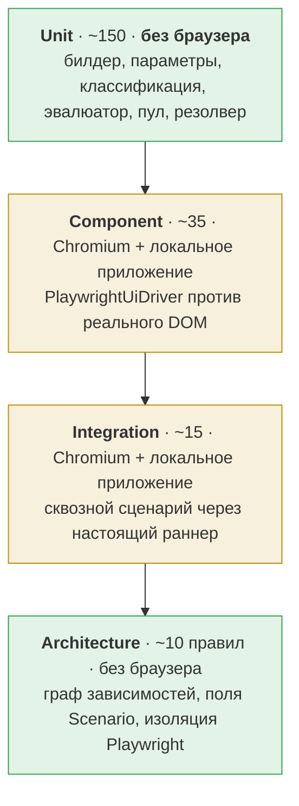

# 21. План тестирования волны 1

| | |
|---|---|
| **Документ** | Стратегия тестирования (волна 1) |
| **Основание** | [`10-target-architecture.md`](10-target-architecture.md) · [`adr/`](adr/) · [`20-wave-1-backlog.md`](20-wave-1-backlog.md) |
| **Дата** | 2026-08-01 · **статусы пересмотрены 2026-08-04** (`UITG-S010`) |
| **Статус** | **Не проект.** Бо́льшая часть плана исполнена: девять из тринадцати разделов имеют тесты в коде. Состояние по разделам — в §0; статус задач — в [`20-wave-1-backlog.md`](20-wave-1-backlog.md) |
| **Источник статусов** | код и прогон, а не документ. Где [`planning/02-requirements-traceability.md`](planning/02-requirements-traceability.md) расходится с кодом, следует код |

## 0. Состояние плана на 2026-08-04

Проставлено по коду, а не по этому документу. Разделы ниже сохранены как написаны; здесь — что из
них существует.

| § | Раздел | Состояние | Доказательство |
|---|---|---|---|
| 2 | Unit-тесты без браузера | **есть** | `stand-test-ui/src/test/java` — 165 тестов в задаче `test` |
| 3 | Component-тесты с локальным веб-приложением | **есть** | `LocalUiTestApplication` на `com.sun.net.httpserver`; 24 теста в задаче `browserTest` |
| 4 | Integration-тесты | **есть** | `UiVerticalSliceBrowserTest` — алиас → браузер → контекст → действие → проверка |
| 5 | Contract-тесты реестра сред | **есть** | `EnvironmentConfigTest`, `EnvironmentRegistryParityTest`, `UiApplicationDefinitionTest` |
| 6 | Архитектурные тесты | **частично** | 6 правил из 10 заведены — см. таблицу §6 |
| 7 | Тесты на утечку ресурсов | **есть** | `ResourceScope` закрывается раннером в `finally`; проверено в `stand-test-ui` |
| 8 | Тесты параллельного исполнения | **есть** | `UiParallelSuiteBrowserTest`; классы `concurrent`, методы `same_thread` |
| 9 | Тесты артефактов падения | **нет** | артефактов не снимается: `Attachment` текстовый (S-2.1/S-2.2, ждут ADR-UI-005) |
| 10 | Тесты безопасности | **частично** | алиас, secret-ref, `UiSecrets` — есть; UI-детекторов в гейте нет (S-5.4) |
| 11 | Регресс существующих адаптеров | **есть** | 1473 теста, 0 падений, 1 намеренный пропуск |
| 12 | Что не тестируется и почему | — | раздел-обоснование, не работа |

---

## Базовая линия

Всё, что описано ниже, добавлялось к набору, который на `cf81358` давал:

| Проверка | Результат на `cf81358` | Результат на 2026-08-04 |
|---|---|---|
| полный прогон с `--rerun-tasks` | **1203 теста, 0 падений, 0 ошибок, 1 пропущен** | **1473 теста, 0 падений, 0 ошибок, 1 пропущен** |
| `checkstyleMain` + `checkstyleTest` | 0 нарушений при `maxWarnings = 0` | без изменений |
| JaCoCo | INSTRUCTION ≥ 80 %, вшито в `check` | без изменений |

**Эта линия — критерий NFR-06,** и она выдержана: 270 тестов прибавилось, ни один существующий не
упал. Число в левой колонке — историческая запись, сверяться следует с прогоном, а не с текстом.

## Три жёстких правила

1. **Ни один тест не обращается к DEV/IFT.** Это не послабление для UI, а действующий инвариант
   репозитория: `stand-test-example` работает на офлайн-дублях, и весь набор (1203 теста тогда,
   1473 на 2026-08-04) прогоняется без единого внешнего адреса. Для UI роль дубля играет **локальное тестовое
   веб-приложение** (§3).
2. **Ни одной новой тестовой зависимости, пока не доказано, что без неё нельзя.** Локальное
   приложение поднимается на `com.sun.net.httpserver.HttpServer` — это JDK. Единственная новая
   зависимость волны 1 — сам `playwright-java`, и только в `stand-test-ui`.
3. **Каждое новое правило и каждый новый детектор доказываются обеими половинами:** срабатывает на
   нарушении **и** не срабатывает на корректном артефакте. Правило, которое не проверено на падение,
   хуже отсутствующего — оно создаёт ложное чувство покрытия. Прецедент в проекте есть: коммит
   `cf81358` («guardrails that were declared and never ran»).

---

## 1. Пирамида

| Уровень | Кол-во (оценка) | Браузер | Где живёт | Время |
|---|---|---|---|---|
| Unit | ~150 | **нет** | `stand-test-ui/src/test` | секунды |
| Component | ~35 | Chromium | `stand-test-ui/src/test` | минуты |
| Integration | ~15 | Chromium | `stand-test-example/src/test` | минуты |
| Architecture | ~10 | нет | `stand-test-example/src/test` | секунды |

**Почему такая форма.** Шов `UiDriver` (ADR-UI-003) существует ровно ради строки «Unit — браузера
нет». Самая ответственная часть модуля — **классификация отказов** (§10.1 архитектуры): ошибка там
отравляет NFR-01 (flaky rate) и BR-26 на входе. Без шва её пришлось бы проверять только через
Chromium — медленно и с собственным flaky. С швом «`click` по отсутствующему элементу → `FAILED`, а
не `BROKEN`» проверяется за миллисекунды на фейке, возвращающем `ElementSnapshot.absent()`.

---

## 2. Unit-тесты без браузера

**Инструмент:** `FakeUiDriver` — программируемые `ElementSnapshot`, счётчики вызовов, инъекция
отказов (таймаут, исключение драйвера, отказ `close()`).

| Область | Что проверяется | Story |
|---|---|---|
| Билдер `UiStep` | Каждая фабрика даёт свой `type`; параметры под зеркальными ключами; `build()` не делает IO | S-1.2 |
| Валидации сборки | `within(...)` на `ui.click`; `expectEventually` без проверок; `assertProperty(VISIBLE, CONTAINS, …)`; пустой алиас | S-1.2 |
| `UiLocator` | Пять фабрик; `fragile()` = false только для `TEST_ID`; **отсутствие XPath-фабрики**; `sensitive()` | S-1.2 |
| Зеркало ключей | **Каждая константа `UiStepParameters` ссылается на `StepParameterKeys`** — иначе generic-проверки валидатора не сработают | S-1.2 |
| Эвалюатор | Делегирование в `AssertionMatchers`, а не собственная логика; пять матчеров на строковых свойствах; EQUALS-only на булевых | S-1.4 |
| Исполнение | Ленивое открытие сессии; переиспользование по ключу; `prepare` не создаёт драйвера; захват в `VariableStore`; `${var}` в `fill` | S-1.4 |
| Ожидание | `Awaiter` владеет опросом; `probeTimeout` короткий; таймаут обязателен и ограничен | S-1.4 |
| **Классификация** | **По одному тесту на каждую из 10 строк таблицы §10.1** | S-1.5 |
| Настройки | Приоритет «системное свойство → профиль реестра → умолчание»; `headless=true` по умолчанию | S-1.6 |
| Резолвер | Алиас → `ResolvedUiApplication`; `SecretReferences` для `base-url-ref` | S-1.7 |
| Артефакты | На зелёном не снимаются; на красном снимаются; трейс запрещён при `sensitive`-зонах | S-2.2, S-2.3 |
| Пул учёток | Выдача по роли; эксклюзивность; возврат на зелёном и красном; исчерпание → `BROKEN` в пределах таймаута; учётка разведки вне пула | S-4.1 |
| Компенсации | Регистрация в `UndoLog`; общий обратный порядок с DB; `ALWAYS` на зелёном; один отказ не прерывает остальных; компенсатор не бросает | ADR-UI-007 |

**Покрытие:** JaCoCo ≥ 80 % INSTRUCTION по модулю — тот же порог, что у остальных.

---

## 3. Component-тесты с локальным веб-приложением

**Локальное приложение.** `com.sun.net.httpserver.HttpServer` на случайном порту (`:0`), раздающий
статические HTML из `src/test/resources/ui-app/`. **Новых зависимостей нет.** Набор страниц:

| Страница | Для чего |
|---|---|
| `/form` | поля, кнопка, валидация, сообщение об ошибке — S-1.6, S-1.2 |
| `/slow` | элемент появляется через N мс — проверка `expectEventually` и таймаута |
| `/login` | форма логина + сессионная кука — S-3.1, S-3.2 |
| `/secret` | поле с ПД для проверки маскирования — S-2.3 |
| `/broken` | 500 на навигации — классификация `BROKEN` |
| `/noisy` | пишет в консоль и делает XHR — проверка сбора консоли и сети |

| Область | Что проверяется | Story |
|---|---|---|
| Драйвер | `navigate`/`click`/`fill`/`snapshot` против реального DOM; маппинг всех пяти стратегий локатора | S-1.6 |
| Ожидания | Actionability Playwright ограничена; `Awaiter` владеет опросом; общий бюджет соблюдается | S-1.6 |
| Headless/headed | Переключение системным свойством не меняет код теста | S-1.6 |
| Артефакты | PNG и ZIP непусты и открываются; консоль и сеть непусты на `/noisy` | S-2.2 |
| **Маскирование** | **Значение поля с `/secret` отсутствует на PNG** | S-2.3 |
| Вход | `FORM` проходит; `STORAGE_STATE` переиспользуется, форма не проходится повторно; протухшая сессия обрабатывается | S-3.1, S-3.2 |
| Изоляция | Два параллельных прогона не видят куки друг друга | S-1.6, S-4.2 |
| Потокобезопасность | 4 потока против драйвера — проверка предположения ADR-UI-002 | S-0.3, S-1.6 |

**Тегирование.** Component-тесты помечаются так, чтобы их можно было исключить из быстрого
локального прогона (`-PexcludeTags=browser`) и включить в CI. Быстрый цикл разработчика остаётся
секундным.

---

## 4. Integration-тесты

Живут в `stand-test-example` — модуле-витрине, который не публикуется и работает на дублях.

| Сценарий | Что доказывает | Story |
|---|---|---|
| Пять UI-шагов через настоящий `DefaultScenarioRunner` | Walking skeleton целиком: алиас → браузер → проверка → захват | S-1.4 |
| UI-захват → проверка на дубле backend | **BR-13 «связывание по данным»** — `${applicationNumber}` из экрана читается следующим шагом | S-1.4 |
| Падение UI-шага | Отчёт несёт слой, идентификаторы, диагностику и четыре (или три) вложения | S-2.2 |
| Смешанный сценарий UI + существующий адаптер | Слой отказа различается без чтения кода теста (BR-22, D-7) | S-2.2 |
| Компенсация UI + DB в одном прогоне | Общий обратный порядок дренажа; `ALWAYS` на зелёном | ADR-UI-007 |
| Сценарий без UI-шагов | **Браузер не поднимался** — протокольные тесты не платят за Chromium | S-1.4 |

---

## 5. Contract-тесты реестра сред

Отдельный уровень, потому что поверхностей **две** и у них разные мапперы — известный риск дрейфа.

| Тест | Что доказывает | Story |
|---|---|---|
| `fileWithoutVersionIsReadAsV1` | Существующие файлы читаются без изменений | S-0.2 |
| `newerFormatVersionFailsWithVersionMessage` | Сообщение называет версию и действие, а не `Unknown field` | S-0.2 |
| `nonIntegerVersionIsRejected` | Fail-closed сохранён | S-0.2 |
| **`bothSurfacesAgreeOnTheSameConfig`** | **Одна конфигурация через файл и через стартер даёт эквивалентный `EnvironmentRegistry`** | S-0.2, S-1.7 |
| `uiApplicationsSectionIsParsed` | Алиас, `base-url-ref`, профили вьюпорта, `trace`, `auth` | S-1.7 |
| `uiApplicationRefRejectsLiteralMarker` | `literal://` отвергается | S-1.7 |
| `uiApplicationRefRejectsResolvedUrl` | Значение с `://` отвергается | S-1.7 |
| `starterRejectsPlaceholderInsideUiRef` | Ловушка двойного разрешения закрыта для UI-полей | S-1.7 |
| `unknownUiApplicationFailsValidation` | Алиас не из реестра → `NON_WHITELISTED_*` **до** прогона | S-1.7 |
| `existingRegistryFilesStillLoad` | NFR-06 после правки загрузчика | S-0.2 |

---

## 6. Архитектурные тесты

Живут в `stand-test-example` рядом с существующим `ModuleDependencyArchTest`.

| Правило | Новое? | Story |
|---|---|---|
| Правило | Планировалось | **Есть в коде?** | Где |
|---|---|---|---|
| `coreHasNoUiOrIoDependencies` | новое | **да** | `ModuleDependencyArchTest` |
| `scenarioHasNoUiFields` | новое | **да** | `ModuleDependencyArchTest` |
| `playwrightIsConfinedToDriverPackage` | новое | **да**, вместе с проверкой невакуумности | `ModuleDependencyArchTest` |
| `adaptersDoNotDependOnEachOther` (планировалось как `uiDoesNotDependOnOtherAdapters`) | расширение | **да**, расширено на `…ui..` — **имя другое**, чем в плане | `ModuleDependencyArchTest` |
| `nothingDependsOnUi` | расширение | **да** | `ModuleDependencyArchTest` |
| `uiModuleHasNoHttpClientDependency` | новое | **нет** | привязано к ADR-UI-007 (`Proposed`) |
| `scenarioHasNoCleanupField` | новое | **нет** | там же |
| `browserContextIsNotHeldByExecutor` | новое | **да, но не архитектурным тестом** — обычный тест исполнителя | `UiStepExecutorTest` |
| `stepParameterKeysAreMirrored` | новое | **да, но не архитектурным тестом** | `UiStepParametersTest` |
| `importIsNonVacuous` расширен | существующий | **да** | `ModuleDependencyArchTest` |

Строка про `coreHasNoUiOrIoDependencies` в исходной редакции говорила «сегодня
`implementation(libs.playwright)` в core прошёл бы все 1203 теста». Это перестало быть правдой в тот
момент, когда правило появилось, — ради этого оно и заводилось.

**Каждое правило сопровождается негативной проверкой**, что оно падает на искусственном нарушении —
по образцу существующего `importIsNonVacuous()`.

---

## 7. Тесты на утечку ресурсов

Отдельная категория: браузер — первый ресурс SDK, чья утечка видна снаружи процесса.

| Тест | Уровень | Что проверяет |
|---|---|---|
| `sessionIsClosedOnGreenRun` | unit | `UiDriver.close()` вызван |
| `sessionIsClosedOnFailedRun` | unit | То же на упавшем прогоне |
| `sessionIsClosedWhenCompensationFails` | unit | Порядок `drain → closeQuietly` соблюдён |
| `closeFailureDoesNotChangeOutcome` | unit | Драйвер, бросающий из `close()`, не валит зелёный прогон |
| `accountIsReturnedOnEveryOutcome` | unit | Аренда возвращается в пул в обоих исходах |
| `noOrphanBrowserProcessesAfterSuite` | component | Счётчик процессов/контекстов до и после набора совпадает |
| `contextCountReturnsToZero` | component | Активных контекстов после набора — ноль |

**Ограничение, которое надо знать:** `closeQuietly` в раннере проглатывает отказ закрытия
(намеренно — отказ уборки не должен менять исход теста). Значит утечка **не** проявится падением
теста, и её ловят только эти проверки плюс WARN в логе.

---

## 8. Тесты параллельного исполнения

| Тест | Уровень | Что проверяет |
|---|---|---|
| `parallelRunsDoNotShareCookies` | component | Два прогона против `/login` не видят сессий друг друга |
| `parallelRunsDoNotShareVariables` | unit | `VariableStore` изолирован (существующий инвариант, подтверждается для UI) |
| `twoConcurrentRunsNeverShareAnAccount` | unit, многопоточный | Эксклюзивность аренды |
| `parallelResultEqualsSequentialResult` | integration | Набор параллельно == последовательно |
| `parallelDriverAccessIsSafe` | component, 4 потока | Проверка предположения ADR-UI-002 о потокобезопасности |
| `poolSmallerThanParallelismBlocksButDoesNotFail` | unit | Тесты ждут в пределах таймаута, а не падают |

**Модель прогона UI-набора:** classes=concurrent, methods=same_thread — та же, что принята в
`stand-test-example` и совпадающая с инвариантом «один прогон = один поток». Потолок параллельности
— **размер пула учёток** (G-5, OQ-12), и это внешний параметр.

---

## 9. Тесты артефактов падения

| Тест | Уровень | Story |
|---|---|---|
| `artifactsAreCapturedOnlyOnFailure` | unit | S-2.2 |
| `failureCarriesAllFourArtifacts` | unit | S-2.2 |
| `screenshotAndTraceAreNonEmptyAndOpenable` | component | S-2.2 |
| `consoleAndNetworkAreCollected` | component (`/noisy`) | S-2.2 |
| `fileAttachmentReachesAllureWithCorrectExtension` | unit (`stand-test-allure`) | S-2.1 |
| `missingArtifactFileDoesNotFailTheRun` | unit | S-2.1 |
| `existingTextAttachmentsAreUnchanged` | **все 57 тестов `stand-test-allure`** | S-2.1 |
| `attachmentRequiresExactlyOneRepresentation` | unit (`stand-test-core`) | S-2.1 |
| `artifactCaptureFailureDoesNotMaskOriginalFailure` | unit | S-2.2 |

---

## 10. Тесты безопасности

Отдельная категория, потому что цена промаха здесь — остановка прогонов (RISK-05).

| Тест | Уровень | Требование |
|---|---|---|
| `sensitiveFieldIsAbsentFromScreenshot` | component | BR-35, SEC-05 |
| `traceIsDisabledWhenSensitiveZonesDeclared` | unit | SEC-05 |
| `traceIsOffByDefault` | unit | SEC-05 — безопасное умолчание |
| `secretsNeverAppearInLogs` | unit | SEC-04 — по образцу существующих фокус-тестов адаптеров |
| `secretsNeverAppearInDiagnostics` | unit | SEC-04 |
| `storageStateNeverAppearsInAttachments` | unit | SEC-04 — файл состояния фактически секрет |
| `uiApplicationRefRejectsInlineSecret` | `stand-test-config` | SEC-04 |
| `noStepParameterAcceptsAbsoluteUrl` | unit / arch | BR-27, SEC-01 |
| `unknownApplicationAliasIsRejectedBeforeBrowserStarts` | unit | SEC-01 |
| `discoveryAccountIsNotDrawnFromPool` | unit | SEC-10 |
| Детекторы гейта: 6 новых × 2 половины | `stand-test-ai-schema` | SEC-06 |

---

## 11. Регресс существующих адаптеров

**Обязателен после каждой из пяти правок `stand-test-core`.**

> **Статус (2026-08-04).** Четыре правки из пяти выполнены, регресс каждый раз оставался зелёным;
> пятая — `Attachment` + `Path file` — не сделана и ждёт ADR-UI-005. Числа в колонке «Регресс» —
> объёмы на момент постановки (полный набор был 1203, стал 1473). Сверяться следует с прогоном:
> `./gradlew build --console=plain --rerun-tasks --no-build-cache`.

| Правка | Регресс | Особое внимание |
|---|---|---|
| Ветка `ui.` в валидаторе | 238 тестов `stand-test-core` + 1203 полный | Существующие ветки `rest.`/`kafka.`/`db.`/`grpc.` не изменили поведения |
| Константы `StepParameterKeys` | 1203 | — |
| `UiApplicationDefinition` в `EnvironmentDefinition` | 238 + 33 (`config`) + 41 (starter) | **Существующие конструкторы сохранены** (по образцу `kafkaClusters`) |
| Ключ `version` в загрузчике | 33 (`config`) + 41 (starter) | Файлы без `version` читаются как прежде |
| **`Attachment` + `Path file`** | **57 (`allure`) + 238 (`core`) + 1203** | **Самое рискованное**; текстовый путь не изменён |

Плюс два общих:

- `existingProtocolTestsUnchanged` — полный набор зелёный после подключения `stand-test-ui`
  (**выполнено**: 1473 теста, 0 падений);
- `protocolScenarioDoesNotStartBrowser` — сценарий без UI-шагов не создаёт драйвера (integration).

---

## 12. Что не тестируется и почему

| Не тестируется | Причина |
|---|---|
| Доступность реальных DEV/IFT-стендов | Инвариант репозитория; стенды — предмет AS-06 и отдельного счётчика NFR-01 |
| Поведение при MFA/КАПЧА | Внешнее (G-1); обход — `STORAGE_STATE`, он тестируется |
| Права учётки разведки (SEC-10) | Свойство учётки, а не кода. Тестируется только то, что SDK **не берёт** учётку разведки из пула |
| Поведение агента при разведке (SEC-02) | Сам BRD признаёт немашинно-проверяемым; проверяется наличие правила в тексте скилла |
| Скачивание браузеров в закрытом контуре | Разово в S-0.3; не автотест, а проверка инфраструктуры |
| Совместимость со **старыми выпущенными** версиями SDK | Их нет: SDK ещё не публиковался (`docs/publishing.md`). Это и есть причина, по которой ключ `version` вводится сейчас (ADR-UI-004) |
| Визуальные регрессы, a11y, кросс-браузерность | Волны 2–3 |

---

## 13. Итоговая матрица покрытия волны 1

| Требование | Unit | Component | Integration | Contract | Arch | Security |
|---|:--:|:--:|:--:|:--:|:--:|:--:|
| BR-06 Java + Page Objects | ● | | ● | | ● | |
| BR-09 детерминированный прогон | | | ● | | ● | |
| BR-10 позитивный путь | ● | ● | ● | | | |
| BR-11 валидации форм | ● | ● | | | | |
| BR-13 / D-8 связывание по данным | ● | | ● | | | |
| BR-18 CI headless | | ● | | | | |
| BR-19 headed локально | ● | ● | | | | |
| BR-21 артефакты падения | ● | ● | ● | | | ● |
| BR-22 / D-7 слой отказа | ● | | ● | | | |
| BR-23 ожидания | ● | ● | | | | |
| BR-24 / D-9 cleanup | ● | | ● | | ● | |
| BR-27 алиас, не URL | ● | | | ● | ● | ● |
| BR-28 secret-ref | ● | ● | | ● | | ● |
| BR-29 сессия на учётку | ● | ● | | | | ● |
| BR-30 стратегия MFA | | ● | | | | |
| BR-31 конфигурация вне `Scenario` | ● | ● | | ● | ● | |
| BR-34 пул по ролям | ● | | ● | | | ● |
| BR-35 / SEC-05 маскирование | ● | ● | | | | ● |
| BR-36 совместимость KB | | | | ● | | |
| BR-37 / D-10 версия реестра | | | | ● | | |
| NFR-04 Java 17 | | | | | ● | |
| NFR-05 изоляция архитектуры | | | | | ● | |
| NFR-06 регресс | ● | | ● | ● | ● | |
| NFR-07 читаемость | | | | | ● | |
| NFR-08 наблюдаемость | ● | | ● | | | ● |
| SEC-01 контур | ● | | | ● | | ● |
| SEC-04 секреты | ● | ● | | ● | | ● |
| SEC-06 гейт | | | | | | ● |
| SEC-10 учётка разведки | ● | | | | | ● |

Пустые строки — там, где требование закрывается **вне кода**: SEC-02, SEC-07, SEC-09, BR-03 в части
доступа, G-1/G-3/G-5. Они перечислены в §12 и в
[`02-open-questions.md`](02-open-questions.md), а не притянуты к тестам.
