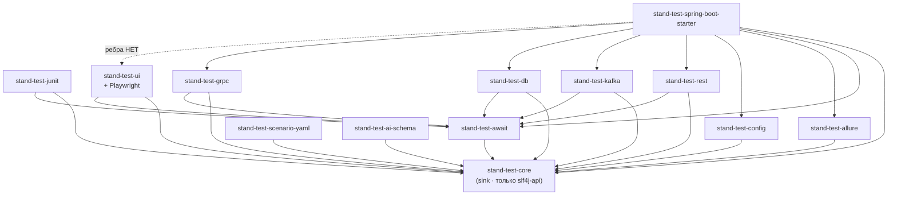
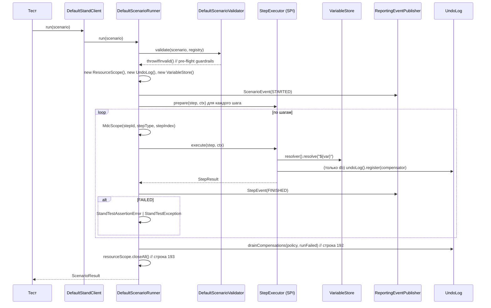

# 01. Фактическая архитектура

| | |
|---|---|
| **Документ** | Описание «как есть» по коду |
| **Дата** | 2026-08-03 · HEAD `46d3cfb` + незакоммиченное рабочее дерево |
| **Метод** | чтение исходников; каждое утверждение сопровождается путём и, где возможно, строкой |
| **Оговорка** | модуль `stand-test-ui` и правки `core`/`starter` **не закоммичены** (см. `00-artifact-inventory.md` §0) |

---

## 1. Модули и ответственность

15 модулей, `settings.gradle.kts:129`.

| Модуль | Роль | Внешние зависимости | Реализует |
|---|---|---|---|
| `stand-test-core` | сток графа: модель, SPI, контекст, валидация, события, компенсации | **только** `slf4j-api` | `Scenario`, `ScenarioStep`, `StepExecutor`, `ScenarioRunner`, `VariableStore`, `EnvironmentRegistry`, `ForbiddenOperation`, `UndoLog` |
| `stand-test-await` | единственный механизм ожидания | — | `Awaiter` |
| `stand-test-junit` | интеграция с JUnit 5 | junit-jupiter | `@StandTest`, `StandTestExtension` (`ServiceLoader.load(StepExecutor.class)`, строка 170) |
| `stand-test-rest` | адаптер REST | spring-webflux | `RestStep`, `RestStepExecutor` |
| `stand-test-kafka` | адаптер Kafka | kafka-clients | `KafkaStep`, `KafkaStepExecutor` |
| `stand-test-db` | адаптер JDBC | JDBC API | `DbStep`, `DbStepExecutor`, **`DbCompensator`** |
| `stand-test-grpc` | адаптер gRPC | grpc, protobuf | `GrpcStep`, `GrpcStepExecutor` |
| **`stand-test-ui`** | адаптер браузера | **Playwright** (`implementation`, не `api`) | `UiStep`, `UiLocator`, `UiStepExecutor`, `AccountPool`, `UiLoginService`, `PlaywrightUiDriver` |
| `stand-test-allure` | сток отчётности | allure-java-commons | подписчик `ReportingEventPublisher` |
| `stand-test-config` | файловый реестр сред | SnakeYAML | `FileEnvironmentRegistry` (SPI) |
| `stand-test-scenario-yaml` | YAML/AI-формат сценария | SnakeYAML | `AiScenarioParser` |
| `stand-test-ai-schema` | JSON Schema + правила генерации | — | `stand-test-scenario.schema.json` |
| `stand-test-spring-boot-starter` | автоконфигурация Boot 3 | spring-boot | `StandTestAutoConfiguration` |
| `stand-test-example` | витрина на офлайн-дублях | — | **`ModuleDependencyArchTest`** |
| `stand-test-bom` | `java-platform` | — | constraints |

## 2. Граф зависимостей (фактический)

Извлечён из `*/build.gradle.kts` по вхождениям `project(":…")`.



Три факта об этом графе, каждый закреплён тестом в `ModuleDependencyArchTest`:

1. **`core` — чистый сток** (`coreIsASink`, `coreHasNoUiOrIoDependencies`): allow-list разрешает
   только JDK и `slf4j-api`.
2. **Адаптеры не знают друг о друге** (`adaptersDoNotDependOnEachOther`), включая `ui`.
3. **На `ui` не ссылается никто** (`nothingDependsOnUi`): «the ui adapter must be a leaf: it is
   discovered by ServiceLoader, never depended on» (строки 121–126).

Из третьего правила следует ограничение, влияющее на план: **стартер не может получить ребро на
`ui`** в текущей формулировке правила. Сегодня `StandTestAutoConfiguration` объявляет бины
исполнителей явно и по одному (`@ConditionalOnClass(RestStepExecutor.class)` и аналоги, строки
135–146) и собирает раннер из `List<StepExecutor>` (строка 112) — **бина `UiStepExecutor` там нет**.
На plain-JUnit это неважно: `StandTestExtension:170` берёт исполнителей через `ServiceLoader`, а
`stand-test-ui/src/main/resources/META-INF/services/ru.alfa.stand.test.core.execution.StepExecutor`
существует. На Spring-пути потребитель обязан объявить бин сам. Решение — за командой (CONF-04).

## 3. Жизненный цикл существующего теста

```
@StandTest(env = "ift")                     ← stand-test-junit
class SomeTest {
  @Test void case(StandClient stand) {      ← параметр резолвит StandTestExtension
      Scenario s = Scenario.builder("id")   ← ленивый билдер: НИЧЕГО не исполняет
              .environment("ift")
              .step(RestStep.get(...).build())
              .build();
      ScenarioResult r = stand.run(s);      ← единственная точка исполнения
      assertThat(r.isSuccessful()).isTrue();
  }
}
```

`StandTestExtension` (строки 76–88, 170, 187) на резолве параметра собирает: исполнителей через
`ServiceLoader.load(StepExecutor.class)`, реестр сред и издателя событий — тем же способом, и
конструирует `DefaultStandClient`. Отсюда — свойство, важное для UI: **добавление модуля в
`testImplementation` потребителя достаточно**, кода подключения не требуется.

## 4. Исполнение шага (последовательность)

Прочитано в `DefaultScenarioRunner.run` (строки 146–200) и `StepExecutionContext` (record, строки
28–34).



Что этот рисунок означает для UI:

- **валидация — до первого шага**: `NON_WHITELISTED_UI_APPLICATION` отсекает алиас до запуска
  браузера;
- **`ResourceScope` закрывается в `finally`** — там живут `BrowserContext` (`UiStepExecutor:518`) и
  аренда учётки (`UiStepExecutor:331`);
- **`UndoLog` — не то же самое**, что `ResourceScope`: он про откат данных, и `register` вызывает
  **только** `DbStepExecutor:191`. Это и есть D-9.

## 5. Точки расширения

| Шов | Где | Как используется UI сегодня |
|---|---|---|
| `StepExecutor` (SPI) | `core/execution/StepExecutor.java`: `supports(String)`, `prepare(...)` (default no-op), `execute(...)` | `UiStepExecutor` реализует; регистрация — `META-INF/services` |
| `ServiceLoader` | `StandTestExtension:170` | UI подхватывается без кода |
| `StepExecutionContext` | record из 6 компонентов: `scenarioContext`, `variableStore`, `environmentRegistry`, `reportingEventPublisher`, `resourceScope`, `undoLog` | UI берёт `resourceScope` и `resolver()` |
| `EnvironmentRegistry` | `core/environment/` | `ui-applications` — секция версии 2; `auth.login`/`challenge` — версии 3 |
| `ReportingEventPublisher` | `core/event/` | UI публикует те же `StepEvent`; **вложения только текстовые** |
| `Compensator` / `UndoLog` | `core/compensation/` | UI **не использует** |
| `UiDriver` / `UiDriverFactory` | `ui/UiDriver.java`, `ui/UiDriverFactory.java` | шов под другой драйвер или grid; сегодня одна реализация |
| `UiLoginChallengeHandler` | `ui/UiLoginChallengeHandler.java` | внешняя точка для MFA/OTP (G-1); в SDK реализации нет |
| `AccountPool` | `ui/AccountPool.java`, `InProcessAccountPool` | пул учёток по ролям, аренда в `ResourceScope` |

## 6. Архитектурные ограничения (нарушать нельзя)

| Ограничение | Чем держится | Последствие нарушения |
|---|---|---|
| `core` не знает про IO и Playwright | `coreHasNoUiOrIoDependencies` (allow-list JDK + slf4j) | падение сборки |
| `Scenario` не получает UI-полей (браузер, вьюпорт, локатор) | `scenarioHasNoUiFields` — список полей `Scenario` зафиксирован | падение сборки; NFR-05, BR-31 |
| Playwright только в `ru.alfa.stand.test.ui.playwright` | `playwrightIsConfinedToDriverPackage` + тест невакуумности | падение сборки |
| На `ui` никто не ссылается | `nothingDependsOnUi` | падение сборки; **блокирует прямую автоконфигурацию в стартере** |
| Адаптеры не знают друг о друге | `adaptersDoNotDependOnEachOther` | падение сборки; сквозной сценарий связывается через `VariableStore`, не через compile-ребро |
| Java 17 в исходниках | `--release 17` (`javaRelease` в каталоге версий) | нет Sequenced Collections, `Math.clamp`, record-patterns |
| checkstyle нулевой терпимости | `maxWarnings = 0` | падение сборки; AssertJ вместо JUnit-ассертов |
| Покрытие ≥80% INSTRUCTION | JaCoCo-гейт в `subprojects` | падение `check` |

## 7. Места, которые нельзя связывать с Playwright

Формулировка «нельзя» здесь означает: **сборка упадёт** либо будет нарушен инвариант, который тест
проверяет отдельно.

1. **`stand-test-core` целиком.** Любой импорт `com.microsoft.playwright` — падение
   `coreHasNoUiOrIoDependencies`. Сюда же: модель `Scenario`, `ScenarioStep`, `StepExecutionContext`,
   `Attachment`.
2. **Модель сценария** — даже без импорта: поле `viewport`, `browser`, `locator` в `Scenario` роняет
   `scenarioHasNoUiFields`. Конфигурация браузера живёт в `UiRunSettings` (системные свойства) и в
   реестре (`ViewportProfile`).
3. **`ru.alfa.stand.test.ui` вне пакета `…ui.playwright`.** `UiStepExecutor`, `UiLocator`,
   `AccountPool`, `StorageStateStore` обязаны оставаться драйвер-агностичными: шов — `UiDriver`.
4. **Все прочие адаптеры и `stand-test-junit`.** Запрет держит `adaptersDoNotDependOnEachOther` и
   `nothingDependsOnUi`; практический смысл — протокольный тест не должен тянуть браузер в classpath.
5. **`stand-test-spring-boot-starter`.** Сегодня ребро отсутствует и запрещено правилом; появление
   `UiStepExecutor` в автоконфигурации требует **сначала решения**, что делать с правилом.
6. **`stand-test-ai-schema` и `stand-test-scenario-yaml`.** Оба зависят только от `core`; ui-шаги в
   декларативном формате (BR-32) не должны приводить к появлению драйверных типов в этих модулях.

## 8. Что уже умеет UI-адаптер (проверено по коду)

| Возможность | Где | Замечание |
|---|---|---|
| 6 типов шагов | `UiStep`: `open` (77), `click` (88), `fill` (101), `expect` (117), `expectEventually` (130), `login` (154) | других нет |
| Абсолютный адрес отвергается | `UiStep:542–543` | BR-27 |
| Ожидание — через `Awaiter` | `UiStepExecutor:19, 66` | BR-23 |
| Пометка чувствительного поля | `UiLocator.sensitive`, применяется в `UiStepExecutor:211` через `UiSecrets.guard` | **защищает текст исключения, не DOM** |
| Три браузера | `PlaywrightDriverFactory:89–92` (`chromium`/`firefox`/`webkit`) | переключение — `stand.test.ui.browser` |
| headless/headed | `UiRunSettings.HEADLESS_PROPERTY` | BR-19 |
| Вьюпорт | `PlaywrightDriverFactory:47, 79` (`setViewportSize`) | из `ViewportProfile` реестра |
| Пул учёток по ролям | `InProcessAccountPool`, аренда в `ResourceScope` (`UiStepExecutor:331`) | BR-34 |
| Сессия `STORAGE_STATE` | `StorageStateStore`, `UiRunSettings.artifactsDirectory()` (`UiStepExecutor:325`) | BR-29 |
| Схемы входа | `UiAuthScheme`: `NONE`, `FORM`, `STORAGE_STATE`, `SSO` | SSO — отказ с сообщением (`UiStepExecutor:459–460`) |
| Вызовы MFA/OTP | `UiLoginChallenge`: `NONE`, `MFA`, `OTP`; шов `UiLoginChallengeHandler` | реализации в SDK нет (G-1) |
| Артефакты падения | **нет** | `Attachment` — только `String content` |
| Grid/Selenoid | **нет** | только комментарии в `UiDriverFactory:10`, `UiDriver:11` |
| Перехват сети | **нет** | BR-33 |
