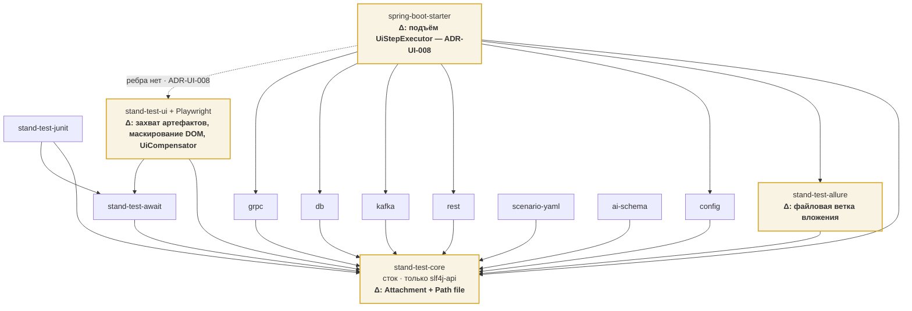

# 10. Implementation plan: UI-тестирование и агентная генерация UI-тестов

| | |
|---|---|
| **Документ** | План реализации |
| **Дата** | 2026-08-03 · ветка `feat/ai-agent-kit`, HEAD `46d3cfb` + незакоммиченное рабочее дерево |
| **Основание** | [BRD](../../brd/ui-test-generation-brd.md) v0.3 · [`00`](00-artifact-inventory.md) · [`01`](01-current-architecture.md) · [`02`](02-requirements-traceability.md) · [`03`](03-conflicts-and-gaps.md) · [`04`](04-open-questions.md) · [`05`](05-analysis-report.md) · ADR-UI-001…007 |
| **Спутники** | [`11-adr-worklist.md`](11-adr-worklist.md) · [`12-wave-plan.md`](12-wave-plan.md) · [`13-risk-register.md`](13-risk-register.md) · [`14-plan-review-report.md`](14-plan-review-report.md) |
| **Правило** | production-код этой работой не изменялся; каждая задача несёт Requirement ID; ни одно незакрытое решение не выбрано молча |

> **Помітка (сессии S012/S013/S016).** Это **план** на снимок `46d3cfb`, а не текущее состояние. Пункт
> «7d трейс/видео» и другие упоминания видео — **задуманное**; по итогам реализации и ревью **видео
> вынесено из S016 в `out_of_scope`** (см. `21-task-backlog.yaml`), трейс реализован в части ZIP. Актуальная
> картина — `21-task-backlog.yaml` и код, не план.

---

## 1. Цель

Довести `stand-test-sdk` и агентный кит до состояния, в котором **волна 1 BRD §18 закрывается
измеримо**: текстовый кейс превращается агентом в Java-тест на UI, тест прогоняется в CI headless,
падение диагностируется по артефактам, а гейт §19.1 получает числа, а не мнения.

План **не проектирует модуль заново**. Модуль существует и работает. План закрывает остаток.

## 2. Текущая точка

**Волна 1 реализована примерно на две трети, и это главный факт плана.** Он меняет и объём, и
порядок работ: планировать «построить `stand-test-ui`» означало бы планировать сделанное (PQ-03).

| Реализовано и проверено прогоном | Доказательство |
|---|---|
| Модуль `stand-test-ui` как SPI-адаптер, 6 типов шагов | `settings.gradle.kts:129`; `UiStep:77…154`; `META-INF/services` |
| Реальный браузер end-to-end | `:stand-test-ui:browserTest` — 24 теста, 0 падений, 33 с |
| Алиас вместо адреса; абсолютный URL невыразим | `UiStep:542–543`; `ForbiddenOperation.NON_WHITELISTED_UI_APPLICATION` |
| Версионированный реестр сред (1 → 2 → 3) | `EnvironmentConfigFormat.SUPPORTED_VERSION = 3` |
| Вход `FORM`/`STORAGE_STATE`, пул учёток по ролям, ограниченный таймаут | `UiLoginService`, `StorageStateStore`, `InProcessAccountPool` |
| Изоляция архитектуры | 10 правил `ModuleDependencyArchTest` |
| Кит: UI-ветка из 9 скиллов + 5 команд + 292 строки правил | `docs/ai-agent/.claude/`, копия в `.opencode/` |
| Набор: 27 кейсов, из них 12 UI | `docs/agent-evaluation/dataset/cases/` |
| Регресс SDK | 1481 тест, 0 падений, 1 намеренный пропуск |

| Не реализовано | Следствие |
|---|---|
| Бинарный канал вложений (`Attachment` несёт только `String content`) | BR-21, BR-35, SEC-05, SEC-09, часть BR-22 |
| Компенсации не-DB шагов (`undoLog().register` — только `DbStepExecutor:191`) | BR-24, SEC-03 в части UI |
| UI-детекторы (в `detectors.json` 18 находок, UI-специфичных 0) | SEC-06 в UI-ветке — 15 из 20 гейтов U1…U20 проверяются глазами |
| CI (ни `.github`, ни `.gitlab-ci.yml`, ни `Jenkinsfile`) | BR-18, NFR-09, KPI-8 |
| Браузерный дубль набора (`execution.outcome: NOT_RUN` у всех 12 UI-кейсов) | KPI-3, KPI-4 ненаблюдаемы |
| Замеры KPI-1/3/4/8/9 | «Выход волны 1» BRD §18 не достигнут ни по одному пункту |

**Два факта о процессе, влияющие на план сильнее половины функциональных пробелов:**

1. **Вся UI-линия не закоммичена** — 183 untracked-файла, 10 340 строк java. В клоне репозитория
   ничего этого нет. Любая совместная работа, ревью и NFR-06 начинаются с посадки кода в git.
2. **Разработка ушла вперёд гейтов.** BRD §14 говорит «проект не стартует, пока не закрыты все
   гейты»; ни один из G-1…G-6 не закрыт. Это не нарушение, которое надо скрыть, а факт, меняющий
   смысл гейтов: они теперь предусловие **пилота и эксплуатации**, а не начала разработки. План
   исходит из этого прочтения и нигде не выдаёт внешнее условие за задачу разработчика.

## 3. Scope

- Остаток волны 1: артефакты падения и маскирование; компенсации UI-данных; UI-половина гейта
  безопасности; CI; измеримость (браузерный дубль набора, инструмент KPI-9).
- Восемь архитектурных решений, без которых перечисленное нельзя начинать безопасно.
- Посадка существующего кода в git порциями, пригодными для ревью.
- Фиксация состояния гейтов G-1…G-6 и приведение документов линии в соответствие коду.
- Планирование волн 2 и 3 до уровня состава и гейтов (не до уровня срезов).

## 4. Non-scope

| Не входит | Причина |
|---|---|
| Миграция существующих Selenium-наборов | BRD §6.2 |
| Полная реализация BR-12, BR-13, BR-20, BR-26, BR-33 | BRD §18 — волна 2 |
| BR-14, BR-15 (критичный набор в двух браузерах), BR-16 (прогон по тегам), BR-17, BR-02, BR-04 | BRD §18 — волна 3 |
| Декларативный трек `ui.*` (BR-32) | до ответа на OQ-09 «по итогам волны 1» |
| `SSO` (половина BR-29) | ADR-UI-006 относит к волне 2, после G-1 |
| OCR-распознавание ПД на растре | BRD §6.2, остаточный риск принят организационно |
| Переписывание BRD | владелец BRD — не эта работа; расхождения зафиксированы, не исправлены |
| Собственный агентный рантайм | закрытый вопрос (`CLAUDE.md`); агент — хост-подписка |

## 5. Принципы

1. **Иерархия доказательности:** код → сборка → принятые ADR → схемы → BRD → прочая документация.
   Там, где документ противоречит коду, план следует коду и называет расхождение.
2. **`stand-test-core` остаётся стоком.** Ни Playwright, ни IO, ни UI-полей в `Scenario`. Правка
   `Attachment` — единственное санкционированное изменение контракта, и она аддитивна.
3. **Ни одного молчаливого решения.** Каждый незакрытый вопрос имеет ADR-задачу; зависящая работа
   помечена `BLOCKED`.
4. **Внешние гейты — не задачи разработчика.** Они входят в план как условия с обходом или без него.
5. **Срез заканчивается демонстрацией**, а не «код написан».
6. **Тесты — часть среза**, не финальная фаза. DoD каждого среза включает прогон 1481 существующего
   теста (NFR-06).
7. **Обходной путь предпочтительнее ожидания.** Локальное приложение вместо стенда, фейковый пул
   вместо реальных учёток — так три первых среза прошли без единого внешнего гейта, и остаток
   планируется так же.

## 6. Target architecture

Целевая архитектура **уже достигнута в части графа** и меняется в одной точке — контракт вложений.



**Инварианты, которые план обязан не нарушить** (каждый держится тестом; нарушение = падение сборки):

| Инвариант | Чем держится |
|---|---|
| `core` не знает про Playwright и IO | `coreHasNoUiOrIoDependencies` (allow-list JDK + slf4j) |
| `Scenario` не получает UI-полей | `scenarioHasNoUiFields` — список полей зафиксирован |
| Playwright только в `…ui.playwright` | `playwrightIsConfinedToDriverPackage` + тест невакуумности |
| На `ui` никто не ссылается | `nothingDependsOnUi` — **пересматривается только через ADR-UI-008** |
| Адаптеры не знают друг о друге | `adaptersDoNotDependOnEachOther` |
| Java 17 в исходниках, checkstyle 0, покрытие ≥80% | `--release 17`, `maxWarnings = 0`, JaCoCo-гейт |

Правка `Attachment` (ADR-UI-005, вариант А) добавляет компонент `Path file` с инвариантом «ровно
одно из `content`/`file` не null», сохраняя трёхаргументный конструктор и `of(...)`. `Path`, в
отличие от `byte[]`, корректен в `equals`/`hashCode` record'а — требование правил репозитория.
Никакого IO в `core` при этом не появляется: `core` носит путь, читает файл сток (`allure`).

## 7. Волны

Верхний уровень — волны BRD §18. Полная таблица с гейтами — [`12-wave-plan.md`](12-wave-plan.md).

### Wave 0 — Предусловия и архитектура

Работа с решениями, документами и процессом. Функциональность не добавляется.

| ID | Работа | Тип | Требования |
|---|---|---|---|
| N-01 | Посадка UI-линии в git порциями, пригодными для ревью | A | NFR-06, GAP-11 |
| D-01…D-08 | Восемь ADR (см. [`11`](11-adr-worklist.md)) | B | BR-21, BR-24, BR-25, BR-36, BR-37, KPI-4 |
| N-08 | Гигиена документов: статусы бэклога, `00-current-state`, пометка §21/§22 BRD | D | CONF-01/03/05/06/07 |
| K-01…K-06 | Закрытие **либо явная фиксация** G-1…G-6 | C | G-1…G-6 |
| SP-01 | Spike: браузерный дубль для 12 UI-кейсов набора | A | KPI-3, KPI-4 |
| SP-02 | Spike: Playwright в закрытом контуре и в CI-образе | A | BR-18, NFR-09 |
| SP-03 | Spike: какие из U1…U20 выразимы статически без ложных срабатываний | A | SEC-06 |
| M-00 | Поддержка базовых замеров G-2: шаблон и инструмент, **сбор — за QA-лидами** | D | KPI-1/2/3/5 |

### Wave 1 — Остаток основания

| ID | Работа | Срез | Требования | Блокер |
|---|---|---|---|---|
| S-2.1 | Бинарный канал вложений: `Attachment` + сток Allure | 6 | BR-21, BR-22 | D-01 |
| S-2.2 | Снятие четырёх артефактов падения в `stand-test-ui` | 7 | BR-21, D-2 | S-2.1 |
| S-2.3 | Маскирование DOM **до** снятия артефакта | 8 | BR-35, SEC-05 | S-2.2 |
| N-07 | Срок жизни артефактов | 8 | SEC-09 | S-2.2 |
| N-02 | `UiCompensator` в `undoLog` (ADR-UI-007, вариант А) | — | BR-24, SEC-03, D-9 | D-02, OQ-06 |
| S-5.4 | UI-детекторы в гейте безопасности | 14 | SEC-06, BR-23, BR-27, BR-35 | SP-03 |
| N-06 | Привязка хуков к событиям под opencode | 14 | SEC-06 | — |
| N-03 | Браузерный дубль набора | 15 | KPI-3, KPI-4 | SP-01, D-07 |
| S-6.3a | Статический подсчёт KPI-9 по Page Object'ам | 15 | KPI-9, D-5, RISK-01 | — |
| S-6.1 | CI для существующего набора | 16 | BR-18, NFR-06 | — |
| S-6.2 | UI-набор в CI headless | 16 | BR-18, NFR-09, KPI-8 | G-3, SP-02 |
| N-04 | Стартер поднимает `UiStepExecutor` | — | адоптация Spring | D-04 |
| N-05 | Окно совместимости версии реестра | 1 | BR-37, OQ-13 | D-03 |
| P-01 | Пилотные генерации на приложениях волны | 11–13 | BR-01, BR-03, BR-10, BR-11 | G-1, G-4, G-5, G-6 |
| M-01 | Сбор KPI-1/3/4/8/9 | — | §19.1 | P-01, G-2 |
| T-01 | Обучение: UI-раздел `usage-guide.md`, шаблон кейса, разбор кейса на команду | D | §17.3, BR-01 | — |

**Два пункта, вынесенные из волны 1 сознательно** — и почему это решение команды, а не автора плана:

| Пункт | Куда отнесён | Основание | Против чего идёт |
|---|---|---|---|
| S-5.3 · UI-сущности в KB (BR-08) | **Волна 2** | BRD §18 прямо относит «UI-сущности в KB» к волне 2; BR-08 — Should | `05-analysis-report.md` §8 рекомендует оставить в волне 1. Аргумент за: без KB каждая генерация делает полную разведку, что давит на NFR-02. Аргумент не доказан замером — решение за командой, оформлено вопросом в [`14`](14-plan-review-report.md) |
| BR-25 в части методов | **Волна 2** | реализована параллельность классов; методы конфликтуют с инвариантом «один прогон = один поток» | BRD BR-25 требует «дополнительно на уровне методов». Разрешается ADR-UI-012, не молчанием |

### Wave 2 — Полнота и сквозные проверки

Сквозные UI+backend (BR-13) и проверка гипотезы KPI-5; негативные и краевые кейсы (BR-12);
контролируемая деградация backend (BR-33); сценарные cleanup-шаги — остаток BR-24; параллельность
методов после ADR-UI-012 (BR-25); grid/Selenoid (BR-20); команда отладки и классификация падений
(BR-26); UI-сущности в KB (BR-08); `SSO` (остаток BR-29).

### Wave 3 — Расширенные проверки и масштаб

Визуальные регрессы (BR-14); кросс-браузерный критичный набор (BR-15); прогон по тегам на мобильном
вьюпорте (BR-16); a11y (BR-17); Jira/Confluence (BR-02); Figma (BR-04); декларативный трек (BR-32)
**только после ответа на OQ-09**; масштабирование на остальные команды.

## 8. Вертикальные срезы

Шестнадцать срезов из задания. **Девять уже поставлены** — для них указано доказательство, остаток и
регрессионное обязательство; переигрывать их без нового решения нельзя. Семь открыты — для них
полный набор полей.

### Сводка

| # | Срез | Состояние | Остаток |
|---|---|---|---|
| 1 | Registry versioning | **DELIVERED** | окно совместимости (N-05) |
| 2 | UI alias resolution | **DELIVERED** | — |
| 3 | Browser walking skeleton | **DELIVERED** | — |
| 4 | Базовые actions и assertions | **DELIVERED** | — |
| 5 | JUnit lifecycle | **DELIVERED** | подъём на Spring-пути (N-04) |
| 6 | Reporting | **PARTIAL** | бинарный канал (S-2.1) |
| 7 | Failure artifacts | **OPEN** | S-2.2 целиком |
| 8 | Masking | **PARTIAL** | маскирование DOM (S-2.3), срок жизни (N-07) |
| 9 | Form authentication | **DELIVERED** | `SSO` — волна 2 |
| 10 | Account pool | **DELIVERED** | реальные учётки — G-5 |
| 11 | Agent UI discovery | **PARTIAL** | ни одной живой разведки (P-01) |
| 12 | Page Object generation | **PARTIAL** | ни одной генерации (P-01), KPI-9 (S-6.3a) |
| 13 | Test generation | **PARTIAL** | замер (P-01, M-01) |
| 14 | Safety / quality gates | **PARTIAL** | UI-детекторы (S-5.4), opencode (N-06) |
| 15 | Evaluation dataset | **PARTIAL** | браузерный дубль (N-03) |
| 16 | CI pilot | **OPEN** | S-6.1, S-6.2 |

---

### Срезы 1–5, 9, 10 — поставлены

| Срез | Демо, которое уже воспроизводится | Доказательство | Регрессионное обязательство |
|---|---|---|---|
| 1 · Registry versioning | файл с `version: 99` даёт сообщение о версии и требуемом действии, а не `Unknown field` | `EnvironmentConfigFormat`, `EnvironmentConfigTest`, `EnvironmentRegistryParityTest` | обе поверхности читают одну константу — правило анти-дрейфа не ослаблять |
| 2 · UI alias resolution | сценарий с алиасом не из реестра отвергается **до** запуска браузера | `NON_WHITELISTED_UI_APPLICATION`, `UiStep:542–543` | абсолютный URL остаётся невыразимым (BR-27, SEC-01) |
| 3 · Browser walking skeleton | реальный Chromium открывает локальное приложение по алиасу | `:stand-test-ui:browserTest` — 24 теста | `playwrightIsConfinedToDriverPackage` + невакуумность |
| 4 · Actions и assertions | `open`/`click`/`fill`/`expect`/`expectEventually`, захват в `VariableStore`, чтение как `${var}` | `UiStep:77…154`, `UiVerticalSliceBrowserTest` | ожидание только через `Awaiter`; `Thread.sleep` не появляется (BR-23) |
| 5 · JUnit lifecycle | добавление модуля в `testImplementation` достаточно; кода подключения нет | `StandTestExtension:170` + `META-INF/services` | `ResourceScope` закрывается в `finally` на любом исходе |
| 9 · Form authentication | вход по `*-ref`; повторный прогон переиспользует `storageState`; ни логина, ни пароля, ни файла состояния в логах | `UiLoginService`, `StorageStateStore` | файл состояния не прикладывается и не логируется — проверяется тестом |
| 10 · Account pool | пул из двух на десять тестов: остальные ждут и укладываются в таймаут; пул из нуля — внятный отказ за 60 с | `InProcessAccountPool`, `UiParallelSuiteBrowserTest` | бесконечного ожидания не вводить; аренда возвращается в `finally` |

**Что следующий исполнитель не должен переоткрывать:** границы модуля (ADR-UI-001), владение
Playwright (ADR-UI-002), состав публичного API (ADR-UI-003), модель входа и пула (ADR-UI-006). Все
четыре Accepted и подтверждены кодом.

---

### Срез 6 · Reporting — бинарный канал вложений (S-2.1)

| | |
|---|---|
| **Цель** | тракт вложений перестаёт быть текстовым целиком |
| **Пользовательский результат** | к упавшему шагу можно приложить PNG, WebM и ZIP, и в Allure это картинка, а не base64-простыня |
| **Входные зависимости** | **BLOCKED** до D-01 (ADR-UI-005 → Accepted) |
| **Архитектурные изменения** | `Attachment` получает компонент `Path file`; инвариант «ровно одно из `content`/`file` не null»; аддитивно — существующие вызовы компилируются без правок |
| **Модули** | `stand-test-core` (контракт), `stand-test-allure` (сток) |
| **Точки расширения** | `core/event/Attachment.java`; `allure/attachment/AllureAttachmentPublisher`, `AttachmentType.extensionForMediaType()`; `allure/lifecycle/AllureLifecycleFacade` — метод `addAttachment(name, type, ext, Path)` **добавляется рядом**, не заменяет строковый; `allure/masking/SecretMasker` остаётся на текстовой ветке |
| **Тестовая стратегия** | unit на инвариант «ровно одно из двух»; тест обратной совместимости `new Attachment(a,b,c)` и `of(...)`; тест ветвления стока; **обязательный прогон всех 1481 теста** (NFR-06, RISK-15) |
| **Security** | файловая ветка **не проходит** `SecretMasker` — маскировать нечего в бинаре; отсюда требование маскировать **до** снятия (срез 8). Путь не должен указывать вне каталога прогона — проверка на выходе за `UiRunSettings.artifactsDirectory()` |
| **Observability** | вложение попадает в существующий `StepEvent`; идентификаторы прогона уже в MDC |
| **Rollout** | один коммит, отдельно от снятия артефактов: контракт можно смержить и не использовать |
| **Rollback** | удаление компонента `Path file` — обратно совместимо, так как ни один существующий вызов его не передаёт |
| **DoD** | 1481 существующий тест зелёный; checkstyle 0; JaCoCo-гейт пройден; в Allure видна картинка из ручного прогона |

### Срез 7 · Failure artifacts (S-2.2) — **L, требует декомпозиции**

| | |
|---|---|
| **Цель** | падение UI-шага перестаёт быть строкой текста |
| **Пользовательский результат** | по красному прогону видно, что было на экране, что говорила консоль, какие запросы ушли и как воспроизвести |
| **Входные зависимости** | S-2.1 |
| **Архитектурные изменения** | `UiDriver` (8 методов сегодня) получает захват артефактов — **шов остаётся драйвер-агностичным**: Playwright не выходит за `…ui.playwright` |
| **Модули** | `stand-test-ui` |
| **Точки расширения** | `UiDriver` + `PlaywrightUiDriver`; `UiStepExecutor` (ветка отказа); `UiRunSettings.artifactsDirectory()` |
| **Декомпозиция (обязательна)** | 7a скриншот (PNG) · 7b консоль браузера (текст) · 7c сетевые запросы (текст, с фильтрацией по маскам) · 7d трейс/видео (ZIP/WebM, включается флагом — `trace` в реестре уже парсится и никем не потребляется) |
| **Тестовая стратегия** | на фейковом `UiDriver` — что при отказе запрошены ровно четыре артефакта и что успех их не снимает; `browserTest` — что файлы реально появились и непусты; негативный тест: отказ снятия артефакта **не подменяет** исходную ошибку шага |
| **Security** | снятие идёт **после** маскирования DOM (срез 8) — порядок закрепляется тестом; консоль и сеть фильтруются по маскам; `storageState` не прикладывается никогда |
| **Observability** | в диагностике — `ui.application`, `ui.url`, `ui.locator.strategy`, снимок элемента; в логе — `Step [3/5] 'submit' (ui.click) FAILED` |
| **Rollout** | по одному артефакту за коммит; трейс — за флагом, выключенным по умолчанию |
| **Rollback** | флаг `stand.test.ui.artifacts=off` возвращает поведение «только текст»; контракт `Attachment` при этом не откатывается |
| **DoD** | четыре артефакта в Allure на упавшем шаге; успешный шаг не оставляет файлов; 1481 тест зелёный; NFR-03 (≤3 мин на сценарий) не деградировал — замер до и после |

### Срез 8 · Masking (S-2.3 + N-07)

| | |
|---|---|
| **Цель** | размеченное поле не попадает в артефакт **в принципе**, а не вычищается после |
| **Пользовательский результат** | скриншот формы входа содержит поле пароля закрашенным |
| **Входные зависимости** | S-2.2 |
| **Архитектурные изменения** | нет: `UiLocator.sensitive` и `UiSecrets.guard` существуют и сегодня защищают **текст исключения**; работа расширяет их действие на DOM перед снятием |
| **Модули** | `stand-test-ui` (+ `stand-test-allure` — фильтрация текстовых вложений уже есть) |
| **Точки расширения** | `UiSecrets`, `UiLocator.sensitive`, ветка отказа `UiStepExecutor`; `UiRunSettings` — срок жизни (N-07) |
| **Тестовая стратегия** | тест порядка «маскирование → снятие» (падает, если порядок переставить); визуальная проверка в `browserTest`; тест удаления артефактов старше срока |
| **Security** | это и есть SEC-05; растровое ПД вне области (BRD §6.2) — остаточный риск принят организационно и **должен быть назван в отчёте прогона**, а не умолчан |
| **Observability** | факт маскирования фиксируется в диагностике: сколько зон закрыто |
| **Rollout** | вместе с 7a — скриншот без маскирования не мержится |
| **Rollback** | отключение снятия скриншота (флаг среза 7), не отключение маскирования |
| **DoD** | тест доказывает, что снятие без маскирования невозможно; артефакты старше срока удаляются; SEC-09 настраивается |

### Срез 11 · Agent UI discovery — живая разведка (P-01, часть)

| | |
|---|---|
| **Цель** | доказать, что агент открывает **живое** приложение, а не пересказывает подсаженный отчёт |
| **Пользовательский результат** | отчёт разведки по реальному экрану стенда с локаторами, которые существуют |
| **Входные зависимости** | **BLOCKED-EXTERNAL**: G-5 (учётка разведки без необратимых прав), G-4 (согласование ИБ), G-6 (какие приложения) |
| **Архитектурные изменения** | нет — скилл `stand-test-ui-discovery` реализован |
| **Модули** | `docs/ai-agent` (промты), стенд |
| **Точки расширения** | `UiAuthConfig.discoveryAccountRef`; порядок источников «KB → разведка → вопрос» |
| **Тестовая стратегия** | не unit: критерий — сверка локаторов отчёта с DOM человеком на первых трёх генерациях; далее — детектор «локатор вне отчёта разведки» (S-5.4) |
| **Security** | SEC-10 — единственная машинная опора SEC-02: запрет необратимых действий обеспечивается **правами учётки**, не намерением агента. Без G-5 срез не начинается |
| **Observability** | отчёт разведки сохраняется как вход KPI-4 |
| **Rollout** | одно приложение, один флоу, присутствие человека |
| **Rollback** | возврат к подсаженной разведке — способ измерять авторинг без живого UI |
| **DoD** | ≥3 разведки на реальном стенде; ни одного необратимого действия; расхождения «локатор в отчёте / локатор в DOM» посчитаны |

### Срез 12–13 · Page Object и test generation — замер (P-01 + M-01 + S-6.3a)

| | |
|---|---|
| **Цель** | превратить работающую механику в измеренную ценность |
| **Пользовательский результат** | смерженный тест, про который известно, сколько он стоил и сколько строк в нём поправили |
| **Входные зависимости** | срез 11; G-2 (база) — иначе §19.1 неприменим; D-06 (где живут тесты — база дифа KPI-4) |
| **Архитектурные изменения** | нет |
| **Модули** | `docs/ai-agent`, `docs/agent-evaluation`, репозиторий-приёмник тестов (определяется D-06) |
| **Точки расширения** | §8 шаблона отчёта — сохранённая исходная выдача (без неё KPI-4 ненаблюдаем); `stand-guard` — новая подкоманда статического подсчёта KPI-9 (S-6.3a) |
| **Тестовая стратегия** | S-6.3a покрывается unit-тестами на эталонных Page Object'ах; сам замер — процесс, не тест |
| **Security** | гейт безопасности обязателен перед каждым merge; находка BLOCK останавливает выдачу (SEC-06) |
| **Observability** | таблица KPI по `kpi-collection-template.md` |
| **Rollout** | 2–3 приложения, сопровождение командой SDK (§17.3) |
| **Rollback** | приложение исключается из волны — не отменяет остальных |
| **DoD** | KPI-1, KPI-3, KPI-4, KPI-8, KPI-9 имеют значения; KPI-9 посчитан **инструментом по смерженным Page Object'ам**, а не по самооценке агента |

### Срез 14 · Safety / quality gates (S-5.4 + N-06)

| | |
|---|---|
| **Цель** | UI-половина гейта перестаёт быть проверкой глазами |
| **Пользовательский результат** | артефакт с литеральным URL, с полем ПД без `sensitive()`, с `Thread.sleep` или с локатором вне отчёта разведки не проходит |
| **Входные зависимости** | SP-03 — какие из U1…U20 выразимы статически без ложных срабатываний |
| **Архитектурные изменения** | нет; расширяется `detectors.json` (18 находок, UI-специфичных 0) |
| **Модули** | `docs/ai-agent/.claude` **и** `.opencode` (две копии), `MANIFEST.json`, тесты в `stand-test-ai-schema` |
| **Точки расширения** | `hooks/detectors.json`; `stand-guard.mjs scan` / `record-gate`; под opencode — привязка хуков к событиям (N-06, GAP-14) |
| **Тестовая стратегия** | на каждый детектор — пара «срабатывает на нагрузке / не срабатывает на эталоне»; кейсы набора `ui-forbidden-production-url`, `ui-secret-in-case-text`, `ui-thread-sleep-requested`, `ui-fragile-locators-no-testid`, `ui-stale-discovery-testid-renamed` служат нагрузкой |
| **Security** | это и есть SEC-06 для UI. **Пока детектор не написан, ассет обязан честно говорить, что чистый хук ≠ пройденное ревью** — сегодняшняя практика сохраняется до закрытия среза |
| **Observability** | SARIF-выдача уже есть |
| **Rollout** | детекторы вводятся по одному; ложное срабатывание — повод отключить один, не весь гейт |
| **Rollback** | детектор отключается флагом; `record-gate` не пишет `PASS` поверх блокирующей находки — это правило не откатывается |
| **DoD** | ≥1 UI-специфичный детектор на каждый машинно-выразимый гейт из U1…U20; неохваченные гейты **перечислены поимённо** в правилах кита; обе копии бандла и `MANIFEST.json` синхронны |

### Срез 15 · Evaluation dataset (N-03 + SP-01)

| | |
|---|---|
| **Цель** | снять `execution.outcome: NOT_RUN` с 12 UI-кейсов |
| **Пользовательский результат** | вопрос «стало ли лучше после правки промта» получает ответ числом |
| **Входные зависимости** | SP-01 (кандидат — `stand-test-ui/src/test/java/.../playwright/LocalUiTestApplication.java`, тот же алиас `client-portal`, форма входа, сессионная кука, асинхронный статус; **DOM другой**), D-07 |
| **Архитектурные изменения** | нет |
| **Модули** | `docs/agent-evaluation`, тестовое приложение в `stand-test-ui` |
| **Точки расширения** | `LocalUiTestApplication`; контракт `evaluation-case.schema.json` (версия формата 2, расширяется аддитивно) |
| **Тестовая стратегия** | схемная валидация набора уже есть (322 теста); добавляется проверка, что заявленный DOM кейса существует в дубле |
| **Security** | дубль не ходит в сеть и не несёт реальных данных |
| **Observability** | `execution.outcome` перестаёт быть `NOT_RUN` |
| **Rollout** | по одному кейсу; 6 кейсов с подсаженной разведкой переводятся последними |
| **Rollback** | кейс возвращается в `NOT_RUN` — набор остаётся валидным |
| **DoD** | ≥6 из 12 UI-кейсов прогоняются; расхождение «дубль / реальное приложение» описано, чтобы результат не выдавали за замер на живом стенде |

### Срез 16 · CI pilot (S-6.1 + S-6.2)

| | |
|---|---|
| **Цель** | регресс перестаёт держаться на добросовестности |
| **Пользовательский результат** | ночной прогон; красное видно сразу |
| **Входные зависимости** | S-6.1 — **ни от чего**; S-6.2 — G-3 (образ с браузерами или grid, квоты) и SP-02 |
| **Архитектурные изменения** | нет; появляется конфигурация CI, которой в репозитории нет вовсе |
| **Модули** | конфигурация репозитория; `stand-test-ui` (задача `browserTest` уже отделена от `test`) |
| **Точки расширения** | `browserTest` с `maxParallelForks = 1` (пул учёток внутрипроцессный); `-Pstand.test.ui.browser.parallelism=N`; `PLAYWRIGHT_DOWNLOAD_HOST` на внутреннее зеркало либо предустановка браузеров в образ |
| **Тестовая стратегия** | сам CI и есть прогон: 1481 тест + 24 браузерных; артефакты падения сохраняются со сроком жизни (N-07) |
| **Security** | секреты — только переменные окружения раннера; артефакты в контуре с ограниченным доступом (SEC-05, SEC-09) |
| **Observability** | KPI-8 (CI-минуты) снимается отсюда |
| **Rollout** | S-6.1 первым и немедленно — он дешевле всего и полезен независимо от судьбы UI |
| **Rollback** | UI-джоба помечается non-blocking, пока не стабилизируется; протокольная остаётся блокирующей |
| **DoD** | ночной прогон зелёный ≥5 раз подряд; KPI-8 замерен; квоты не превышены |

## 9. Dependency graph

```mermaid
graph TD
    subgraph EXT["Внешние гейты · не задачи разработчика"]
        G1["G-1 MFA/OTP/КАПЧА"]; G2["G-2 базовые замеры"]; G3["G-3 CI/grid/квоты"]
        G4["G-4 ИБ"]; G5["G-5 пул учёток"]; G6["G-6 приложения и владельцы"]
    end

    subgraph W0["Wave 0"]
        N01["N-01 посадка кода в git<br/>L · LOW"]
        D01["D-01 ADR-UI-005 вложения<br/>S · MED"]
        D02["D-02 ADR-UI-007 компенсации<br/>S · MED"]
        D03["D-03 ADR-UI-004 + окно<br/>XS · LOW"]
        D04["D-04 ADR-UI-008 стартер<br/>S · LOW"]
        D05["D-05 ADR-UI-009 схемы KB<br/>S · MED"]
        D06["D-06 ADR-UI-010 где живут тесты<br/>S · HIGH"]
        D07["D-07 ADR-UI-011 стратегия замера<br/>S · MED"]
        D08["D-08 ADR-UI-012 параллельность<br/>XS · LOW"]
        SP01["SP-01 spike дубль набора<br/>M · MED"]
        SP02["SP-02 spike PW в контуре<br/>S · MED"]
        SP03["SP-03 spike UI-детекторы<br/>S · MED"]
        N08["N-08 гигиена документов<br/>S · LOW"]
    end

    subgraph W1["Wave 1"]
        S21["S-2.1 Attachment+Path<br/>M · MED"]
        S22["S-2.2 артефакты падения<br/>L · MED"]
        S23["S-2.3 маскирование DOM<br/>M · MED"]
        N07["N-07 срок жизни<br/>S · LOW"]
        N02["N-02 UiCompensator<br/>M · HIGH"]
        S54["S-5.4 UI-детекторы<br/>M · MED"]
        N06["N-06 хуки opencode<br/>S · MED"]
        N03["N-03 браузерный дубль<br/>M · MED"]
        S63a["S-6.3a инструмент KPI-9<br/>S · LOW"]
        S61["S-6.1 CI существующего<br/>S · LOW"]
        S62["S-6.2 UI в CI<br/>M · HIGH"]
        N04["N-04 стартер<br/>S · LOW"]
        N05["N-05 окно совместимости<br/>XS · LOW"]
        P01["P-01 пилотные генерации<br/>L · HIGH"]
        M01["M-01 сбор KPI<br/>M · HIGH"]
        T01["T-01 обучение<br/>M · LOW"]
    end

    GATE{{"Гейт §19.1<br/>GO / CORRECT / NO_GO"}}

    N01 --> S21 & S54 & N04
    D01 --> S21 --> S22 --> S23 --> N07
    D02 --> N02
    D03 --> N05
    D04 --> N04
    D05 -.-> W2KB["S-5.3 UI в KB · волна 2"]
    D06 --> M01
    D07 --> N03
    D08 -.-> W2P["BR-25 методы · волна 2"]
    SP01 --> N03
    SP02 --> S62
    SP03 --> S54
    S61 --> S62
    G3 --> S62
    G5 --> P01
    G1 --> P01
    G4 --> P01
    G6 --> P01
    S22 --> S62
    S54 --> P01
    N03 --> M01
    S63a --> M01
    P01 --> M01
    G2 --> GATE
    M01 --> GATE
    S62 --> M01
    N06 --> S54
    T01 --> P01

    classDef crit fill:#cf222e22,stroke:#cf222e,stroke-width:2px
    classDef free fill:#2da44e22,stroke:#2da44e
    classDef ext fill:#8250df22,stroke:#8250df,stroke-dasharray: 4 3
    classDef spike fill:#0969da22,stroke:#0969da
    class N01,D01,S21,S22,S23,P01,M01,GATE crit
    class S61,D03,N05,S63a,N08,D08 free
    class G1,G2,G3,G4,G5,G6 ext
    class SP01,SP02,SP03 spike
```



Красным — критический путь. Зелёным — задачи без входящих зависимостей: начинаются немедленно.
Фиолетовым пунктиром — внешние гейты. Синим — spikes.

## 10. Critical path

**Критических путей два, и их полезно не путать.**

**Путь разработки** (полностью в руках команды SDK):

```
N-01 посадка кода → D-01 ADR-UI-005 → S-2.1 Attachment → S-2.2 артефакты → S-2.3 маскирование → S-6.2 UI в CI
```

Узел — **S-2.1**: это единственная работа волны, трогающая сток графа, от которого зависят все 14
модулей (RISK-15). Всё, что за ней, ждёт её.

**Путь результата** (доминируют внешние гейты):

```
G-6 приложения → G-5 учётки → G-1 вход → G-4 ИБ → P-01 пилот → M-01 замеры → гейт §19.1
                                          ↑
                                    G-2 база (иначе §19.1 неприменим в принципе)
```

**Главный вывод о сроках:** длина второго пути не сокращается разработкой. Даже при мгновенном
закрытии всего остатка волны 1 гейт §19.1 не принимается, пока не закрыт G-2 — его пороги выражены
относительно базы, а базы не существует. Это свойство самого гейта, а не дефект плана.

## 11. Parallel workstreams

| Поток | Задачи | Зависит от | Исполнителей | Комментарий |
|---|---|---|---|---|
| **A · Контракт отчётности** | D-01 → S-2.1 → S-2.2 → S-2.3 → N-07 | — | 1 (после S-2.1 можно 2 на подартефакты 7a–7d) | критический путь разработки |
| **B · CI** | S-6.1 → (G-3) → S-6.2 | — / G-3 | 1 | S-6.1 стартует в первый же день |
| **C · Гейт безопасности** | SP-03 → S-5.4 ∥ N-06 | — | 1 | не пересекается с A по файлам |
| **D · Измеримость** | SP-01 → N-03 ∥ S-6.3a | D-07 | 1 | превращает `NOT_RUN` в числа |
| **E · Решения и документы** | D-02…D-08, N-08 | — | владельцы решений | не разработка |
| **F · Компенсации** | D-02 → N-02 | OQ-06 | 1 | ждёт способ удаления данных по приложениям |
| **G · Посадка кода** | N-01 | — | 1 автор + 1–2 ревьюера | предшествует A и C по гигиене, не по компиляции |
| **H · Пилот и обучение** | T-01 → P-01 → M-01 | G-1/4/5/6, G-2 | 2–3 (SDK + команды) | внешне ограничен |

Потоки **B, C, D, E, G запускаются в первый день параллельно** и ни от чего не зависят. Поток A
стартует сразу после D-01. Реальный выигрыш от параллелизма ограничен узлом S-2.1 и внешними
гейтами потока H.

### 11.1 Оценка и неопределённость

Размеры — относительные (`XS`…`XL`), **человеко-дни не выставляются**: фактической velocity команды
нет, и выдуманное число было бы предположением в обёртке плана. `L` и `XL` обязаны быть
декомпозированы до начала работ.

| ID | Работа | Размер | Неопр. | Главный источник неопределённости | Spike | Исполн. | Параллельно с |
|---|---|---|---|---|---|---|---|
| N-01 | Посадка UI-линии в git | **L** → декомпозиция по эпикам обязательна | LOW | не техника, а объём ревью: 10 340 строк | нет | 1 автор + 1–2 ревьюера | всем |
| D-01 | ADR-UI-005 вложения | S | MEDIUM | цена правки стока графа; альтернатива Д меняет смысл BR-21 | нет | 2–3 (решение) | всем |
| D-02 | ADR-UI-007 компенсации | S | MEDIUM | зависит от внешнего OQ-06 (способ удаления по приложениям) | нет | 2–3 | всем |
| D-03 | ADR-UI-004 + окно | XS | LOW | — | нет | 1–2 | всем |
| D-04 | ADR-UI-008 стартер | S | LOW | дедупликация «бин + SPI» в варианте Б | нет | 1–2 | всем |
| D-05 | ADR-UI-009 схемы KB | S | MEDIUM | как выглядит неаддитивная правка, которой ещё не было | нет | 1–2 | всем |
| D-06 | ADR-UI-010 место тестов | S | **HIGH** | решение принимают внешние стороны | нет | внешние | всем |
| D-07 | ADR-UI-011 стратегия замера | S | MEDIUM | зависит от результата SP-01 | **SP-01** | 1–2 | всем |
| D-08 | ADR-UI-012 параллельность | XS | LOW | требует владельца BRD | нет | 2 | всем |
| SP-01 | Дубль набора: цена сближения DOM | M | MEDIUM | расхождение DOM `LocalUiTestApplication` и 12 кейсов не измерено | **сам spike** | 1 | B, C, E |
| SP-02 | Playwright в закрытом контуре и CI-образе | S | MEDIUM | сетевая политика контура вне репозитория | **сам spike** | 1 | A, C, D |
| SP-03 | Выразимость U1…U20 статически | S | MEDIUM | ложные срабатывания дороже пропусков | **сам spike** | 1 | A, B, D |
| S-2.1 | `Attachment` + сток Allure | M | MEDIUM | реакция 1481 теста на правку стока (PR-01) | нет | 1 | B, C, D |
| S-2.2 | Артефакты падения | **L** → 7a/7b/7c/7d | MEDIUM | поведение трейса и видео под нагрузкой; бюджет NFR-03 | нет | 1–2 (после 7a) | B, C, D |
| S-2.3 | Маскирование DOM | M | MEDIUM | надёжность закрытия зоны до снятия на реальном SPA | нет | 1 | B, C, D |
| N-07 | Срок жизни артефактов | S | LOW | — | нет | 1 | всем |
| N-02 | `UiCompensator` | M | **HIGH** | **OQ-06**: способ удаления данных свой у каждого приложения | нет | 1 | A, B, D |
| S-5.4 | UI-детекторы | M | MEDIUM | результат SP-03 | **SP-03** | 1 | A, B, D |
| N-06 | Хуки под opencode | S | MEDIUM | модель событий второго хоста | нет | 1 | A, B, D |
| N-03 | Браузерный дубль набора | M | MEDIUM | результат SP-01 | **SP-01** | 1 | A, B, C |
| S-6.3a | Инструмент KPI-9 | S | LOW | что считать «хрупким» — определение в BRD есть | нет | 1 | всем |
| S-6.1 | CI существующего набора | S | LOW | — | нет | 1 | всем |
| S-6.2 | UI-набор в CI | M | **HIGH** | **G-3**: образ, квоты, доступность стендов из сети CI (AS-01) | **SP-02** | 1 | A, C, D |
| N-04 | Стартер поднимает UI | S | LOW | — | нет | 1 | всем |
| N-05 | Окно совместимости | XS | LOW | — | нет | 1 | всем |
| N-08 | Гигиена документов | S | LOW | — | нет | 1 | всем |
| T-01 | Обучение и материалы | M | LOW | — | нет | 1–2 | всем |
| P-01 | Пилотные генерации | **L** → по приложениям | **HIGH** | G-1/G-4/G-5/G-6; поведение агента на незнакомом живом UI не наблюдалось ни разу (PR-03) | нет | 2–3 (SDK + команда) | — |
| M-01 | Сбор KPI | M | **HIGH** | **G-2**: без базы KPI-1 не считается вовсе | нет | 1–2 + QA-лиды | — |

**Правило декомпозиции.** Три `L` разбиваются до начала работ: **N-01** — по границам эпиков
(скелет → API и шов → исполнитель → драйвер → вход и пул → кит → набор); **S-2.2** — по одному
артефакту (7a скриншот, 7b консоль, 7c сеть, 7d трейс/видео); **P-01** — по приложениям волны, одно
приложение = одна единица работы с собственным решением «продолжаем / исключаем». `XL` в остатке
волны 1 нет — эпики размера `XL` (E1 «ядро адаптера», E5 «расширение кита») уже поставлены.

## 12. Внешние зависимости

Полный разбор — [`04-open-questions.md`](04-open-questions.md) §3 и [`13`](13-risk-register.md).

| Гейт | Что блокирует | Обход в разработке | Что **не** обходится |
|---|---|---|---|
| **G-1** MFA/OTP/КАПЧА | вход в приложения волны | локальное приложение с формой; `STORAGE_STATE` там, где сессию выдают заранее | эксплуатация на приложениях с MFA; SDK отвечает внятным отказом с указанием гейта |
| **G-2** базовые замеры | **гейт §19.1 целиком** | нет | пороги выражены относительно базы |
| **G-3** CI/grid/квоты | S-6.2, KPI-8, NFR-09 | локальный `browserTest` зелёный — доказывает работоспособность, не инфраструктуру | ночной регресс |
| **G-4** ИБ | разведка живого UI, хранение артефактов | нет | P-01 |
| **G-5** пул учёток + учётка разведки | P-01, BR-25 на реальных, SEC-10 | фейковый пул в тестах модуля | живая разведка |
| **G-6** приложения и владельцы | приёмка результата, KPI-5 | нет | вся волна 2 |
| **OQ-06** способ удаления UI-данных | N-02 (BR-24) | объявление остаточных данных в отчёте генерации | автоматическая очистка |
| **OQ-07** где живут тесты | база дифа KPI-4, форма поставки кита | spike в `stand-test-example` | замер KPI-4 |
| **DEP-01** Playwright в закрытом контуре | S-6.2 | `PLAYWRIGHT_DOWNLOAD_HOST` на зеркало либо предустановка в образ | — |

## 13. Риски

Реестр — [`13-risk-register.md`](13-risk-register.md). Пять главных, отобранных по «вероятность ×
цена» с опорой на замеренное:

1. **Правка `Attachment` дестабилизирует существующие тесты** (RISK-15) — единственная работа,
   трогающая сток графа. Ранний признак: любое падение из 1481 при первой же правке.
2. **Хрупкость локаторов выше порога эскалации уже на эталоне** — 3 из 5 (60%) при пороге KPI-9
   >50%; знаменатель — один файл.
3. **UI-половина безопасности держится на глазах** — 0 UI-специфичных детекторов из 18; выдуманный
   локатор синтаксически неотличим от настоящего.
4. **Кит ни разу не прогонялся сквозь UI-ветку** — 9 скиллов, 5 команд, 12 кейсов проверены
   статически; `execution.outcome: NOT_RUN` у всех.
5. **Отсутствие CI превращает регресс в добросовестность** — 1481 + 24 теста прогоняются вручную.

И риск процесса, не попавший в BRD: **ревью 10 340 строк одной порцией** (GAP-11).

## 14. Rollout

| Этап | Что выкатывается | Признак готовности идти дальше |
|---|---|---|
| R0 | Код в git порциями (N-01) | ревью каждой порции закрыто; 1481 тест зелёный на каждой |
| R1 | Контракт вложений (S-2.1) без потребителей | регресс зелёный; в Allure ручной прогон показывает картинку |
| R2 | Артефакты по одному (7a → 7b → 7c → 7d), трейс за выключенным флагом | NFR-03 не деградировал |
| R3 | CI протокольного набора (S-6.1) блокирующим | 5 зелёных ночных прогонов |
| R4 | CI UI-набора (S-6.2) **non-blocking** | 5 зелёных прогонов подряд → перевод в блокирующий |
| R5 | Пилот на одном приложении (P-01) с присутствием человека | ни одного необратимого действия; ≥3 разведки |
| R6 | Расширение на 2–3 приложения волны | KPI собираются по шаблону |

## 15. Rollback

| Работа | Откат | Стоимость отката |
|---|---|---|
| S-2.1 | удаление компонента `Path file` | нулевая: ни один существующий вызов его не передаёт |
| S-2.2 | `stand.test.ui.artifacts=off` | текстовая диагностика остаётся |
| S-2.3 | **не откатывается отдельно** — откатывается снятие скриншота | маскирование без снятия безвредно |
| N-02 | компенсатор не регистрируется; остаточные данные объявляются в отчёте | сегодняшняя практика кита |
| S-5.4 | детектор отключается по одному | правило «`record-gate` не пишет `PASS` поверх BLOCK» не откатывается |
| S-6.2 | джоба помечается non-blocking | протокольная джоба остаётся блокирующей |
| N-04 | потребитель объявляет `@Bean UiStepExecutor` сам | документированный обход существует уже сегодня |
| P-01 | приложение исключается из волны | остальные не затрагиваются |
| **Вся UI-линия** | модуль исключается из `settings.gradle.kts`; протокольные модули не изменялись | подтверждено: 1481 тест не зависит от `stand-test-ui` |

## 16. Quality gates

Действуют на **каждом** срезе, не в конце:

- `./gradlew build` зелёный: компиляция + checkstyle (`maxWarnings = 0`) + тесты + JaCoCo ≥80%
  INSTRUCTION;
- 1481 существующий тест зелёный — NFR-06, обязательно после любой правки `core` (RISK-15);
- `ModuleDependencyArchTest` — 10 правил графа, включая `coreHasNoUiOrIoDependencies`,
  `scenarioHasNoUiFields`, `playwrightIsConfinedToDriverPackage`, `nothingDependsOnUi`;
- `:stand-test-ui:browserTest` зелёный для срезов, трогающих драйвер;
- схемная валидация набора (`:stand-test-ai-schema:test`) — для срезов, трогающих кит или набор;
- `stand-guard scan` без находок на эталонных артефактах кита;
- новый код имеет тест, который **падал бы до него** — это условие приёмки, а не пожелание.

## 17. Security gates

| Гейт | Когда | Чем держится |
|---|---|---|
| Промышленный контур недостижим | всегда | алиас из whitelist; абсолютный URL невыразим (`UiStep:542`); enum `dev\|ift` в контракте набора. **Остаток:** что `base-url-ref` указывает не на пром, машина не проверяет — значение приходит из переменной окружения потребителя |
| Секреты только через `*-ref` | всегда | `SecretReferences`; `literal://` отвергается fail-closed; `*-ref` обязан быть голым именем |
| Маскирование **до** снятия артефакта | срез 8 | тест порядка операций |
| Гейт безопасности после каждой генерации | P-01 | `record-gate`; находка BLOCK останавливает выдачу |
| Разведка под учёткой без необратимых прав | срез 11 | **G-5** — единственная машинная опора SEC-02 |
| Срок жизни артефактов | N-07 | настраивается; по умолчанию не дольше срока хранения отчётов CI |
| ПД только синтетические | всегда | детектор 14 работает и над прозой |

**Честная граница:** до закрытия S-5.4 UI-половина гейта проверяется человеком, и каждый ассет кита
обязан это говорить прямо. Чистый прогон хуков в UI-ветке **не равен** пройденному ревью.

## 18. Метрики

Пороги — из BRD §12 и §19.1, без замены на технические суррогаты.

| ID | Порог волны 1 | Кто снимает | Чем блокирован |
|---|---|---|---|
| KPI-1 | ≤50% базы G-2 | QA-лиды, тайм-трекинг | **G-2** |
| KPI-3 | ≤5% на наборе волны 1 | окно 20 прогонов, разбор человеком (NFR-01) | P-01, S-6.2 |
| KPI-4 | ≥40% | диф «исходная выдача (BR-07 §8) ↔ смерженное» | **D-06**, P-01 |
| KPI-8 | в пределах бюджета §13.2 | CI-минуты | **G-3** |
| KPI-9 | >50% — триггер эскалации | **инструмент S-6.3a по смерженным Page Object'ам**, не по самооценке агента | S-6.3a |
| NFR-02 | ≤30 мин (≤90 на холодной разведке) | замер на P-01 | P-01 |
| NFR-03 | ≤3 мин на UI-сценарий | замер до/после среза 7 | — |

## 19. Definition of Done

**Срез готов**, когда: демо воспроизводится третьим лицом; DoD среза выполнен; quality gates
зелёные; документ линии обновлён вместе с кодом; откат описан и проверен хотя бы мысленно.

**Волна 1 готова**, когда одновременно:

- все Must-требования волны 1 (BR-01, BR-03, BR-05, BR-06, BR-07, BR-09, BR-10, BR-11, BR-18, BR-19,
  BR-21, BR-22, BR-23, BR-24, BR-27, BR-28, BR-30, BR-31, BR-34, BR-35, BR-37) имеют статус
  `IMPLEMENTED` либо явно записанное объяснение с внешним владельцем;
- KPI-1, KPI-3, KPI-4, KPI-8, KPI-9 **замерены** (не «инструмент готов» — есть числа);
- гейт §19.1 отработан с решением `GO` / `GO_WITH_CORRECTIONS` / `NO_GO`;
- ночной регресс зелёный ≥5 прогонов подряд;
- ни одного нарушения архитектурных инвариантов;
- UI-линия в git и отревьюена.

## 20. Предположения и нерешённые вопросы

**Предположения, на которых стоит план** (ни одно не подтверждено артефактом — BRD §15, `03` §3):

| ID | Предположение | Если неверно |
|---|---|---|
| AS-01 | стенды DEV/IFT доступны из сети CI | S-6.2 и P-01 не исполнимы; волна 1 не закрывается |
| AS-02 | `data-testid` не обязателен для продуктовых команд | KPI-9 >50% на первом же реальном наборе → эскалация (замер на эталоне уже 60%) |
| AS-03 | сгенерированный тест всегда проходит ревью человеком | KPI-4 перестаёт быть метрикой экономии |
| AS-05 | UI-данные поддаются удалению | N-02 не реализуем; BR-24 остаётся объявлением остаточных данных |
| AS-07 | сквозная корреляция **не** предполагается по умолчанию | связывание падает на захват с экрана — реализовано |
| AS-08 | есть учётка разведки без необратимых прав | SEC-02 остаётся декларацией; срез 11 не начинается |

**Предположения, возникшие внутри планирования и требующие проверки:**

1. Правка `Attachment` аддитивна и не тронет 1481 тест. Проверяется первым же прогоном; если
   неверна — RISK-15 срабатывает, работа откатывается (BRD: «любая регрессия — блокирующий дефект»).
2. Локальное тестовое приложение можно привести к DOM 12 UI-кейсов дешевле, чем написать новый
   дубль. Проверяется SP-01.
3. Достаточное число гейтов U1…U20 выразимо статически без ложных срабатываний. Проверяется SP-03;
   если нет — часть гейта остаётся человеческой, и это должно быть **написано**, а не подразумеваться.

**Нерешённые вопросы**, каждый с ADR-задачей: PQ-01 (D-01), PQ-02 (D-02), PQ-04/OQ-07 (D-06),
PQ-05 (D-04), PQ-07 (D-05), PQ-08/OQ-13 (D-03), PQ-09 (D-07), CONF-02/BR-25 (D-08). Полный перечень
с вариантами и последствиями — [`11-adr-worklist.md`](11-adr-worklist.md).
