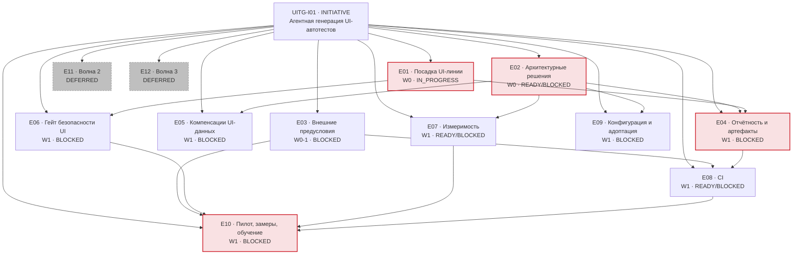

# 20. Task backlog

| | |
|---|---|
| **Документ** | Декомпозированный бэклог, пригодный для последовательной реализации и переноса в трекер |
| **Дата** | 2026-08-03 · ветка `feat/ai-agent-kit`, HEAD `46d3cfb` + незакоммиченное рабочее дерево |
| **Основание** | [`10-implementation-plan.md`](10-implementation-plan.md) · [`11`](11-adr-worklist.md) · [`12`](12-wave-plan.md) · [`13`](13-risk-register.md) · [`14`](14-plan-review-report.md) · [`02-requirements-traceability.md`](02-requirements-traceability.md) · [`00-artifact-inventory.md`](00-artifact-inventory.md) · [BRD](../../brd/ui-test-generation-brd.md) v0.3 · ADR-UI-001…007 |
| **Машинное представление** | [`21-task-backlog.yaml`](21-task-backlog.yaml) — все 30 обязательных полей по каждой задаче |
| **Спутники** | [`22-task-dependency-matrix.md`](22-task-dependency-matrix.md) · [`23-execution-queue.md`](23-execution-queue.md) · [`24-backlog-validation-report.md`](24-backlog-validation-report.md) |
| **Правило** | production-код этой работой не изменялся. `DONE` не ставится по факту существования документа; `IN_PROGRESS` — только при фактических изменениях в рабочем дереве |

---

## 1. Модель статусов

Счётчики ниже — по **рабочим элементам** (87 штук: Story, Task, Spike, ADR, External, Validation).
Контейнеры (1 Initiative, 12 Epic, 7 Feature) статус наследуют и в счёт не идут; их числа — в §12.

> **Пересчитано 2026-08-10** разбором YAML (`UITG-T010`). Прежние числа этой таблицы были сняты
> вместе с самим документом и с тех пор не двигались: они объявляли `DONE` **нулём** при 52
> закрытых, `BLOCKED` — 37 при четырёх, и держали `DISCOVERY_REQUIRED` непустым. Тем же заходом
> перегенерирована §4 матрицы зависимостей — расхождение того же рода и того же происхождения.

| Статус | Значение | Как применён здесь |
|---|---|---|
| `DISCOVERY_REQUIRED` | недостаточно данных для проектирования или оценки | **0** — слой пуст с 2026-08-09, когда владелец принял остаточный риск SEC-01 (`UITG-S029`) |
| `BLOCKED` | работа понятна, но не может начаться | **4**: `S026`, `V001`, `V004`, `V005` — и у каждой держащая карточка названа поимённо и жива |
| `READY` | Definition of Ready закрыт | **5** — и **все пять `EXTERNAL`** (`X002`, `X003`, `X005`, `X011`, `X012`): вопросы к людям вне команды SDK. Ни `STORY`, ни `TASK`, ни `SPIKE`, ни `ADR` |
| `IN_PROGRESS` | есть **фактические** незавершённые изменения | **0** среди рабочих элементов: девять порций посадки закрыты. Три `IN_PROGRESS` — контейнеры (`I01`, `E03`, `E05`) |
| `IN_REVIEW` | реализация завершена, ждёт ревью | **6**: `S004`, `S018`, `S022`, `S023`, `S025`, `T010` — ни у одной остаток не снимается словом |
| `DONE` | код, тесты, документация и критерии подтверждены артефактами | **52** — см. §12 |
| `DEFERRED` | сознательно перенесено в более позднюю волну | **19** задач волн 2–3 |
| `REJECTED` | принято явное решение не реализовывать | **1** (2026-08-09): `UITG-V003` — третьего приложения волны нет, отказ предусмотрен её собственным DoD |

**Почему `DONE` = 0.** Реализованная часть волны 1 (модуль, вход, пул, кит, набор) существует
только в рабочем дереве одной машины: `git ls-files stand-test-ui` возвращает 0 файлов. Пока код не
сядет в git и не пройдёт ревью, DoD §7 не выполнен — не выполнен пункт «review завершён». Поэтому
поставленная работа несёт статус `IN_PROGRESS`, а не `DONE`, и это не занижение: 1495 тестов зелёные,
24 браузерных зелёные, но в клоне репозитория этого нет.

> **Счётчики этого раздела сверены 2026-08-04** (`UITG-F002`) разбором
> [`21-task-backlog.yaml`](21-task-backlog.yaml). Они разошлись с YAML настолько, что читались как
> противоположность правде: `IN_REVIEW` стоял `0` при восьми выполненных задачах. Авторитетным
> остаётся **§12** — он и раньше считался разбором; §1 теперь ему не противоречит.

## 2. Definition of Ready

Задача получает `READY`, только если выполнены **все** девять условий:

1. scope однозначен и умещается в одну рабочую ветку;
2. требования перечислены (Requirement IDs заполнены);
3. acceptance criteria проверяемы машиной или воспроизводимой процедурой;
4. входящие зависимости закрыты;
5. необходимые ADR приняты;
6. внешние доступы получены либо не требуются;
7. тестовая стратегия определена;
8. оставшиеся неизвестные не меняют архитектуру решения;
9. затрагиваемые модули известны, конфликтов между артефактами нет.

Нарушение любого пункта → `BLOCKED` (известна блокирующая работа) или `DISCOVERY_REQUIRED`
(неизвестно, что именно делать).

## 3. Definition of Done

Implementation Story получает `DONE`, только если:

- production-код реализован; unit-тесты добавлены; integration/contract/architecture-тесты добавлены
  там, где применимы;
- **`./gradlew build` зелёный**: компиляция + checkstyle (`maxWarnings = 0`) + тесты + JaCoCo ≥80%
  INSTRUCTION;
- **1495 существующих тестов зелёные** (NFR-06) — обязательно после любой правки `stand-test-core`;
- `ModuleDependencyArchTest` (10 правил графа) зелёный;
- документация обновлена **в том же изменении**, а не отдельной задачей;
- security-требования задачи проверены;
- observability реализована;
- acceptance criteria подтверждены;
- нет скрытых `TODO`, переносящих обязательную часть задачи (сегодня в `stand-test-*/src/main/java`
  их 0 — планка удерживается);
- изменение сопоставлено с Requirement IDs;
- review завершён.

## 4. Initiative map



| Epic | Название | Волна | Статус | Состав |
|---|---|---|---|---|
| **UITG-E01** | Посадка UI-линии и гигиена артефактов | 0 | `IN_PROGRESS` | F001 (9 Story), F002 (2 Story) |
| **UITG-E02** | Архитектурные решения | 0 | смешанный | ADR001…ADR008 |
| **UITG-E03** | Внешние предусловия G-1…G-6 и открытые вопросы | 0–1 | `BLOCKED` | X001…X013 |
| **UITG-E04** | Отчётность и артефакты падения | 1 | `BLOCKED` | F003 (1 Story + 3 Task), F004 (4 Story), F005 (2 Story) |
| **UITG-E05** | Компенсации данных, созданных через UI | 1 | `BLOCKED` | S019 |
| **UITG-E06** | UI-половина гейта безопасности | 1 | `IN_REVIEW` | ~~SP003~~, ~~S022~~, ~~F006~~ (S020/S021/T004) — все потомки закрыты; оба acceptance_criteria эпика закреплены машинно |
| **UITG-E07** | Измеримость: набор и KPI-инструменты | 1 | смешанный | SP001, S023, S024 |
| **UITG-E08** | CI | 1 | смешанный | ~~SP002~~ и ~~S025~~ (`IN_REVIEW`), S026 (ждёт X003) |
| **UITG-E09** | Конфигурация и адоптация | 1 | `BLOCKED` | S027, S028, S029 |
| **UITG-E10** | Пилот, замеры и обучение | 1 | `BLOCKED` | S030, V001…V006 |
| **UITG-E11** | Волна 2: полнота и сквозные проверки | 2 | `DEFERRED` | F007, S031…S039, V007 |
| **UITG-E12** | Волна 3: расширенные проверки и масштаб | 3 | `DEFERRED` | S040…S046 |

## 5. Backlog по волнам

### Wave 0 — предусловия и архитектура

| ID | Тип | Название | Статус | Prio | Size | Зависит от |
|---|---|---|---|---|---|---|
| UITG-S001 | STORY | Порция 1: скелет модуля, сборка, arch-правила | `IN_PROGRESS` | P0 | M | — |
| UITG-S002 | STORY | Порция 2: публичный API и шов драйвера | `IN_PROGRESS` | P0 | M | S001 |
| UITG-S003 | STORY | Порция 3: исполнитель шагов и классификация отказов | `IN_PROGRESS` | P0 | L→разбита | S002 |
| UITG-S004 | STORY | Порция 4: Playwright-драйвер, локальное приложение, `browserTest` | `IN_PROGRESS` | P0 | L→разбита | S003 |
| UITG-S005 | STORY | Порция 5: вход `FORM`/`STORAGE_STATE`, пул учёток | `IN_PROGRESS` | P0 | M | S004 |
| UITG-S006 | STORY | Порция 6: реестр версии 3 (`auth.login`, `challenge`) | `IN_PROGRESS` | P0 | M | S002 |
| UITG-S007 | STORY | Порция 7: кит — UI-ветка (9 скиллов, 5 команд, правила) | `IN_PROGRESS` | P0 | M | S002 |
| UITG-S008 | STORY | Порция 8: набор — 12 UI-кейсов и контракт версии 2 | `IN_PROGRESS` | P0 | M | S007 |
| UITG-S009 | STORY | Порция 9: документы линии (BRD, ADR, planning) | `IN_PROGRESS` | P1 | S | — |
| UITG-S010 | STORY | Пересмотр статусов бэклога волны 1 и стратегии тестирования | `IN_REVIEW` | P1 | S | — |
| UITG-S011 | STORY | Переиздание `00-current-state.md`, пометка §21/§22 BRD | `BLOCKED` | P2 | XS | ADR003 |
| UITG-ADR001 | ADR | Форма бинарных вложений (ADR-UI-005 → Accepted) | `READY` | **P0** | S | — |
| UITG-ADR002 | ADR | Компенсации не-DB шагов (ADR-UI-007 → Accepted) | `BLOCKED` | P1 | S | X007 |
| UITG-ADR003 | ADR | Версия реестра + окно совместимости (ADR-UI-004) | `READY` | P1 | XS | — |
| UITG-ADR004 | ADR | Стартер против `nothingDependsOnUi` (ADR-UI-008) | `READY` | P2 | S | — |
| UITG-ADR005 | ADR | Версионирование схем KB (ADR-UI-009) | `READY` | P2 | S | — |
| UITG-ADR006 | ADR | Где живут сгенерированные тесты (ADR-UI-010) | `BLOCKED` | **P0** | S | X013 |
| UITG-ADR007 | ADR | Стратегия измерения набора (ADR-UI-011) | **`DONE` (принят 2026-08-06)** | P1 | S | ~~SP001~~ |
| UITG-ADR008 | ADR | Параллельность классов/методов (ADR-UI-012) | `READY` | P2 | XS | — |
| UITG-SP001 | SPIKE | Цена сближения DOM дубля и 12 UI-кейсов | `IN_REVIEW` | P1 | M | — |
| UITG-SP002 | SPIKE | Playwright в закрытом контуре и в CI-образе | `IN_REVIEW` | P1 | S | — |
| UITG-SP003 | SPIKE | Какие из U1…U20 выразимы статически | `IN_REVIEW` | P1 | S | — |
| UITG-X001…X013 | EXTERNAL | G-1…G-6 и открытые вопросы OQ | `BLOCKED` | P0–P2 | — | внешние |

### Wave 1 — остаток основания

| ID | Тип | Название | Статус | Prio | Size | Зависит от |
|---|---|---|---|---|---|---|
| UITG-S012 | STORY | Бинарный канал вложений: контракт `core` + сток Allure | `IN_REVIEW` | **P0** | M | ~~ADR001~~ |
| UITG-S013 | STORY | Шов захвата артефактов в `UiDriver` + скриншот | `IN_REVIEW` | P1 | M | ~~S012~~, ~~S004~~ |
| UITG-S014 | STORY | Консоль браузера как вложение | `IN_REVIEW` | P1 | S | ~~S013~~ |
| UITG-S015 | STORY | Сетевые запросы как вложение | `IN_REVIEW` | P1 | S | ~~S013~~ |
| UITG-S016 | STORY | Трейс за выключенным по умолчанию флагом | `IN_REVIEW` | P1 | M | ~~S013~~ |
| UITG-S017 | STORY | Маскирование размеченных зон DOM **до** снятия | `IN_REVIEW` | P0 | M | ~~S013~~ |
| UITG-S018 | STORY | Срок жизни артефактов прогона | `IN_REVIEW` | P1 | S | ~~S013~~ |
| UITG-S019 | STORY | `UiCompensator`: откат UI-данных средствами UI | `BLOCKED` | P1 | M | ADR002, X007 |
| UITG-S020 | STORY | UI-детекторы: адрес, секрет, `Thread.sleep`, ПД | `BLOCKED` | P1 | M | ~~SP003~~, S007 |
| UITG-S021 | STORY | Детектор расхождения «локатор ↔ отчёт разведки» | `BLOCKED` | P1 | M | ~~SP003~~, S020 |
| UITG-S022 | STORY | Привязка хуков к событиям под opencode | `IN_REVIEW` | P1 | S | — |
| UITG-S023 | STORY | Браузерный дубль набора: приведение DOM | `IN_REVIEW` | P1 | M | ~~SP001~~, ~~ADR007~~, ~~S008~~ |
| UITG-S024 | STORY | Инструмент статического подсчёта KPI-9 | `IN_REVIEW` | P1 | S | — |
| UITG-S025 | STORY | CI для существующего набора | `IN_REVIEW` | **P0** | S | — |
| UITG-S026 | STORY | UI-набор в CI headless | `BLOCKED` | P1 | M | X003, S004 |
| UITG-S027 | STORY | Стартер поднимает `UiStepExecutor` | `BLOCKED` | P2 | S | ADR004 |
| UITG-S028 | STORY | Окно совместимости версии реестра | `BLOCKED` | P2 | XS | ADR003 |
| UITG-S029 | STORY | Проверка резолвленного хоста против запретного списка | `DISCOVERY_REQUIRED` | P2 | S | — |
| UITG-S030 | STORY | Обучение: UI-раздел `usage-guide`, шаблон кейса | `IN_REVIEW` | P1 | M | — |
| UITG-V001 | VALIDATION | Пилотная генерация: приложение волны №1 | `BLOCKED` | **P0** | L→по флоу | X001, X004, X005, X006, ~~S030~~ |
| UITG-V002 | VALIDATION | Пилотная генерация: приложение волны №2 | `BLOCKED` | P1 | L→по флоу | V001 |
| UITG-V003 | VALIDATION | Пилотная генерация: приложение волны №3 | `BLOCKED` | P2 | L→по флоу | V001 |
| UITG-V004 | VALIDATION | Сбор KPI-1/3/4/8/9 волны 1 | `BLOCKED` | **P0** | M | V001, X002, ADR006, S024, S026 |
| UITG-V005 | VALIDATION | Гейт §19.1: решение GO / CORRECTIONS / NO_GO | `BLOCKED` | **P0** | S | V004, X002, X011 |
| UITG-V006 | VALIDATION | Инструментальная поддержка базовых замеров G-2 | `IN_REVIEW` (2026-08-09) | P1 | S | X002 |

### Wave 2 и Wave 3 — `DEFERRED`

| ID | Тип | Название | Волна | Требование | Основание переноса |
|---|---|---|---|---|---|
| UITG-S031 | STORY | Сквозной UI+backend сценарий и связывание | 2 | BR-13 | BRD §18 |
| UITG-S032 | STORY | Негативные и краевые кейсы | 2 | BR-12 | BRD §18 |
| UITG-S033 | STORY | Сценарные cleanup-шаги (остаток BR-24) | 2 | BR-24 | ADR-UI-007 §Волна 2 |
| UITG-S034 | STORY | Параллельность методов внутри класса | 2 | BR-25 | ADR008 + OQ-12 |
| UITG-S035 | STORY | Grid/Selenoid | 2 | BR-20 | BRD §18 |
| UITG-S036 | STORY | Перехват и подмена сетевых ответов | 2 | BR-33 | BRD §18 |
| UITG-S037 | STORY | Классификация падений (команда отладки) | 2 | BR-26 | BRD §18 |
| UITG-S038 | STORY | UI-сущности в базе знаний | 2 | BR-08 | BRD §18; расхождение с `05` §8 вынесено на решение |
| UITG-S039 | STORY | Схема входа `SSO` | 2 | BR-29 | ADR-UI-006 |
| UITG-V007 | VALIDATION | Гейт §19.2 | 2 | KPI-5/6/7 | BRD §19.2 |
| UITG-S040 | STORY | Визуальные регрессы | 3 | BR-14 | BRD §18; DEP-05 |
| UITG-S041 | STORY | Кросс-браузерный критичный набор | 3 | BR-15 | BRD §18 |
| UITG-S042 | STORY | Прогон отмеченных сценариев на мобильном вьюпорте | 3 | BR-16 | BRD §18 |
| UITG-S043 | STORY | Доступность (a11y) | 3 | BR-17 | BRD §18 |
| UITG-S044 | STORY | Кейсы из Jira/Confluence | 3 | BR-02 | BRD §18; DEP-04 |
| UITG-S045 | STORY | Сверка с макетом Figma | 3 | BR-04 | BRD §18; DEP-04 |
| UITG-S046 | STORY | Декларативный трек `ui.*` | 3 | BR-32 | **только после OQ-09** |

## 6. Backlog по epic

### UITG-E01 · Посадка UI-линии и гигиена артефактов

**Бизнес-результат.** Работа перестаёт существовать на одной машине. Пока `git ls-files
stand-test-ui` = 0, ревью невозможно, NFR-06 не проверяем третьим лицом, а любая совместная работа
начинается с «пришли мне архив».

**F001 · Посадка кода порциями** (9 Story). Разбиение по границам эпиков; каждая порция обязана
оставлять сборку зелёной и 1495 тестов целыми. Порядок: S001 → S002 → {S003, S006, S007} → S004 →
S005 → S008; S009 — независимо.

**F002 · Гигиена документов** (S010, S011) — **выполнена 2026-08-04, `IN_REVIEW`.** CONF-03,
CONF-05 и CONF-07 закрыты, CONF-06 и CONF-01 приняты явно (последний ждёт `ADR003` — перевод
ADR-UI-004 в `Accepted` не вправе сделать сессия). Критерий приёмки закреплён тестом
`UiLineDocumentHygieneTest`, а не однократной правкой: документы линии — снимки по природе, код
уходит вперёд, и следующее устаревшее утверждение будет выглядеть точно так же. `S011` остаётся
`BLOCKED`: его вторая половина — статус ADR-UI-004.

### UITG-E02 · Архитектурные решения

Восемь ADR. **ADR001 и ADR006 блокируют старт волны 1**; шесть остальных блокируют отдельные
задачи. Варианты, рекомендации и последствия — [`11-adr-worklist.md`](11-adr-worklist.md); бэклог
их не пересказывает и не выбирает молча.

### UITG-E03 · Внешние предусловия

Тринадцать `EXTERNAL`. **Это не задачи разработчика** — у каждой владелец вне репозитория.
Разработка обходит G-1, G-3, G-4, G-5 локальным приложением и фейковым пулом; **G-2 не обходится
ничем** — гейт §19.1 выражен относительно базы.

### UITG-E04 · Отчётность и артефакты падения

Самый крупный функциональный пробел волны 1 и **единственная работа, трогающая сток графа**
(`stand-test-core`), от которого зависят все 14 модулей. `S-2.2` плана размера `L` разбита на четыре
Story по одному артефакту. Маскирование (S017) входит **в тот же релиз**, что скриншот (S013): риск
утечки RISK-05 вырастает ровно на этом срезе.

### UITG-E05 · Компенсации данных, созданных через UI

Одна Story. Правки `core` не требует: `Compensator`, `UndoLog`, `CleanupPolicy.ALWAYS` уже
универсальны, а `undoLog().register` имеет единственный вызов — `DbStepExecutor:191` — по
употреблению, а не по ограничению модели.

### UITG-E06 · UI-половина гейта безопасности

Сегодня в `detectors.json` 18 находок, UI-специфичных **0**; 15 из 20 гейтов U1…U20 проверяются
глазами. До закрытия E06 каждый ассет кита обязан прямо говорить, что чистый прогон хуков в
UI-ветке **не равен** пройденному ревью (задача UITG-T004).

### UITG-E07 · Измеримость

Превращает 12 `execution.outcome: NOT_RUN` в числа и даёт инструмент KPI-9. Замер на эталонном Page
Object уже даёт 60% хрупких локаторов при пороге эскалации 50% — инструмент нужен **до** пилота,
иначе эскалация опоздает.

### UITG-E08 · CI

`S025` выполнен и стоит в `IN_REVIEW`: `.gitlab-ci.yml` прогоняет `./gradlew build` на merge request,
на push и по расписанию (ночью — `--rerun-tasks --no-build-cache`). Браузерная джоба сюда намеренно не
входит и приходит с `S026` вместе со своей инфраструктурой (G-3).

**Поправка к числу.** Прогон набора даёт **1465** тестов (1457 существующих + 8 новых в
`CiPipelineConfigTest`), 0 падений, 1 намеренный пропуск — не 1481, как записано в документах
планирования. Источник расхождения не установлен; здесь следуем факту прогона. Браузерных
тестов по-прежнему 24, они прогоняются отдельной задачей `browserTest`.

### UITG-E09 · Конфигурация и адоптация

Три Story, ни одна не на критическом пути. S029 — единственная `DISCOVERY_REQUIRED` этой группы:
остаток SEC-01, найденный при проверке плана и не покрытый ни одним источником.

### UITG-E10 · Пилот, замеры и обучение

Семь элементов. `V001…V003` разбиты по приложениям: одно приложение = одна единица работы с
собственным решением «продолжаем / исключаем из волны».

## 7. Critical path

```
UITG-S001 → S002 → S003 → S004        (посадка: без неё нет ревью и общей базы)
                              ↘
UITG-ADR001 ──────────────────→ UITG-S012 → UITG-S013 → UITG-S017
                                                            ↓
                                                       UITG-S026 (⟵ X003)
                                                            ↓
UITG-X006 → X005 → X001 → X004 ─────────────────────→ UITG-V001
                                                            ↓
UITG-X002 ─────────────────────────────────────────→ UITG-V004 → UITG-V005
```

**Узел — `UITG-S012`.** Единственная работа, трогающая `stand-test-core`; за ней стоят шесть Story.

**Критический путь непрерывен**, но состоит из двух участков разной природы: `S001…S017` полностью в
руках команды SDK, `V001…V005` доминирован внешними гейтами и не сокращается разработкой.

## 8. Parallel workstreams

| Lane | Задачи | Стартует | Пересечение по файлам |
|---|---|---|---|
| **L1 · Посадка** | S001…S009 | немедленно | все — идёт первой |
| **L2 · Отчётность** | ADR001 → S012 → S013 → {S014, S015, S016} → {S017, S018} | после ADR001 | `core/event`, `allure`, `ui` |
| **L3 · CI** | ~~S025~~, ~~SP002~~ (`IN_REVIEW`) → X003 → S026 | ждёт X003 (внешний) | конфигурация репозитория — ни с чем |
| **L4 · Гейт безопасности** | ~~SP003~~ → S020 → S021; ~~S022~~ — обе `IN_REVIEW` | S020 ждёт посадки S007 | `docs/ai-agent` |
| **L5 · Измеримость** | ~~SP001~~ (`IN_REVIEW`) → ~~ADR007~~ (**принят 2026-08-06**) → ~~S023~~ (**исполнена 2026-08-07, `IN_REVIEW`**); ~~S024~~ (`IN_REVIEW`) | S023 — исполнена; V004 получил вход KPI-3/4 на дубле | `docs/agent-evaluation`, тестовое приложение |
| **L6 · Решения** | ADR003, ADR004, ADR005, ADR008 | немедленно | документы |
| **L7 · Компенсации** | X007 → ADR002 → S019 | по X007 | `ui` |
| **L8 · Конфигурация** | ADR004 → S027; ADR003 → S028; S029 | по ADR | `starter`, `config`, `core` |
| **L9 · Пилот** | ~~S030~~ (`IN_REVIEW`) → V001 → V002/V003 → V004 → V005 | по гейтам | вне репозитория |

**L3, L4, L5, L6 не пересекаются между собой ни по одному файлу** и запускаются одновременно.
L2 конфликтует с L1 по `stand-test-ui` — поэтому S013 зависит от S004.

## 9. Blocked tasks

37 рабочих элементов (49 с контейнерами). Полный перечень с точной причиной и действием для
разблокировки — [`23-execution-queue.md`](23-execution-queue.md) §BLOCKED. Сводка по причинам:

| Причина | Задач | Разблокирует |
|---|---|---|
| **ADR001** не принят | 7 (S012…S018) | одно решение команды SDK |
| **X002 (G-2)** не закрыт | 3 (V004, V005, V006) | базовые замеры QA-лидов |
| **X001/X004/X005/X006** не закрыты | 4 (V001…V003, S019 частично) | согласования и выдача учёток |
| **X003 (G-3)** не закрыт | 1 (S026) | образ с браузерами и квоты |
| ~~**SP002** не выполнен~~ | 0 | выполнен — отчёт [`32-playwright-closed-contour-spike.md`](32-playwright-closed-contour-spike.md); все три SPIKE закрыты, см. также [`30`](30-ui-gate-expressibility-spike.md) и [`31`](31-ui-dom-convergence-spike.md) |
| **X007 (OQ-06)** не закрыт | 2 (ADR002, S019) | владельцы приложений |
| **X013 (OQ-07)** не закрыт | 2 (ADR006, V004) | QA-лиды и команды |
| **ADR003/ADR004** не приняты | 2 (S027, S028) | два дешёвых решения |
| Незавершённая зависимость внутри лейна | 17 | последовательность работ |

## 10. Discovery tasks

| ID | Что неизвестно | Что закроет |
|---|---|---|
| **UITG-S029** | Нужна ли машинная проверка, что резолвленный `base-url-ref` указывает не на промышленный контур. Сегодня контроль — whitelist алиасов и enum `dev\|ift` в контракте набора; значение приходит из переменной окружения потребителя и SDK его не видит. **Ни один источник не покрывает этот остаток SEC-01** — находка проверки плана | решение команды SDK: принять остаточный риск письменно **или** завести реализацию с запретным списком хостов |
| **UITG-V006** | Что именно и в каком формате замеряют QA-лиды на G-2 — от этого зависит, нужен ли инструмент вообще или достаточно `kpi-collection-template.md` | ответ владельцев G-2 (X002) |

Все три `SPIKE` (SP001, SP002, SP003) выполнены и стоят в `IN_REVIEW`. `DISCOVERY_REQUIRED` они не
были никогда: у каждого был известен вопрос, известен метод и известно, какую задачу он разблокирует.

## 11. Deferred tasks

17 задач: 10 в волне 2 (S031…S039, V007), 7 в волне 3 (S040…S046). Основание переноса у каждой —
BRD §18, ADR или незакрытый OQ; ни одна не перенесена «по усмотрению».

**Два переноса, которые обязаны быть замечены при приёмке плана:**

- **UITG-S038** (UI-сущности в KB, BR-08) — BRD §18 относит к волне 2, `05-analysis-report.md` §8
  рекомендовал волну 1. Бэклог следует BRD; расхождение открыто и решается командой.
- **UITG-S032, S031** (BR-12, BR-13) — **Must-требования без задачи в волне 1**. Это решение BRD
  §18, а не пропуск бэклога; §19.1 прямо оговаривает, что самая трудная для агента часть в замер
  волны 1 не попадает и KPI-4/KPI-1 поэтому оптимистичны.

## 12. Status summary

Числа получены разбором [`21-task-backlog.yaml`](21-task-backlog.yaml), а не подсчётом глазами.

| Статус | Рабочих элементов | Всего с контейнерами | Комментарий |
|---|---|---|---|
| `DONE` | **52** | **57** | **2026-08-09: гейт ИБ пройден** — `X001`, `X004` и `S029` закрыты по заявлению владельца линии, принято без вопросов (факт ниже). **2026-08-09: закрыт эпик `E02`** «Архитектурные решения UI-линии» — все восемь решений приняты, все двенадцать ADR на диске `Accepted` (факт ниже). **2026-08-09: закрыта `S030`** после переформулировки её DoD — прежняя редакция создавала **взаимный тупик** с `V001` (факт ниже). **2026-08-09: принят `ADR002`** — ADR-UI-007, вариант А; **последнее непринятое решение линии, и единственная `BLOCKED`, открываемая решением** (факт ниже). **2026-08-09: утверждена `V006`** — и перед переводом закрыт её невыполненный `documentation_changes`: парный шаблон получил перекрёстные ссылки (факт ниже). **2026-08-09: утверждён `F002`** — последний контейнер линии, способный закрыться; после него закрываемых контейнеров не осталось ни одного. **2026-08-09, второй заход того же ревью: `S011` (после закрытия `CONF-06` решением владельца) плюс контейнеры `F003` и `F004`.** **2026-08-09: ПЕРВОЕ ЧЕЛОВЕЧЕСКОЕ РЕВЬЮ линии** — владелец рассмотрел и утвердил восемь карточек (`S013`, `S027`, `S028`, `T001`, `T006`, `T007`, `T008`, `T009`), и оговорка «ревью было агентским», стоявшая в каждой из них, снята по существу (факт ниже). **2026-08-09: закрыт `X008`** (SLA: 1 рабочий день на ревью, 3 — на дефект платформы). **2026-08-09: принят `ADR006` — ADR-UI-010, и это ПОСЛЕДНЕЕ решение линии: открытых ADR не осталось ни одного.** Тогда же закрыт `X009` (порог недоступности 5%). **2026-08-09: закрыты `X013` и `X007`** — второй положительно, третий **отрицательно** («способа удаления нет»), и оба закрытия валидны (факт ниже). **2026-08-09: закрыт `X010`** — два числа (2 прогона, 2 учётки на роль), последнее предусловие `X005` (факт ниже). **2026-08-09: принят `ADR005` — ADR-UI-009, вариант Б′ + В** (факт ниже). **Открытых решений архитектора в линии не осталось ни одного.** **2026-08-09: принят `ADR008` — ADR-UI-012, вариант Б** (факт ниже); решение приняло не предпочтение, а замер. **2026-08-09: закрыт `X006` (G-6) — ПЕРВЫЙ закрытый внешний гейт линии** (факт ниже). **2026-08-08: приняты ДВА решения — `ADR003` и `ADR004`** (факты ниже). `ADR003` — ADR-UI-004 в `Accepted`, OQ-13 закрыт «окна нет» (факт ниже). переведены 2026-08-07 после агентского ревью всех 39 карточек `IN_REVIEW` (см. факт ниже). Оговорка, которую нельзя терять: DoD линии предполагал ревью **человеком**, здесь его заменило агентское — это записано в каждом `status_reason`, а не подразумевается |
| `IN_REVIEW` | **6** | **13** | **2026-08-10: сюда заведена-выполнена `T010`** — матрица зависимостей приведена к фактам и втянута в перепись: колонка «Статус» расходилась с YAML в **52 строках из 79**, колонка `Blocks` — в 23, шести карточек не было вовсе; закрыто `BacklogMatrixCensusTest` (факт ниже). Прежняя строка: **2026-08-09: минус `S029`.** **2026-08-09: минус `S030`.** **2026-08-09: сюда переведена `S029`** — остаточный риск SEC-01 принят письменно, запись сделана; `DONE` не ставится, её DoD требует **подписи ИБ** (факт ниже). **2026-08-09: `V006` утверждена человеком и ушла в `DONE`.** Прежняя строка: **2026-08-09: сюда переведена выполненная `V006`** — форма сбора базы G-2 построена, `DISCOVERY` снят ответом QA-лида (факт ниже). **2026-08-09: минус `F002`.** **2026-08-09: минус ещё три** — `S011`, `F003`, `F004`. Осталось шесть рабочих, и ни у одного остаток не снимается словом: `S004` (третье лицо), `S018` (`SEC-09` за `X003`/`S026`), `S022` (гейт opencode), `S023` (живая модель), `S025` (время), `S030` (пилот). **2026-08-09: минус восемь** — утверждены человеком (см. строку `DONE`). Осталось семь рабочих: `S004` (третье лицо), `S011` (`CONF-06` — решение владельца BRD), `S018` (DoD не выполнен: `SEC-09` за `X003`/`S026`), `S022` (гейт opencode), `S023` (живая модель), `S025` (время), `S030` (пилот). Прежняя строка: | **2026-08-08: сюда переведён контейнер `E09`** — его `acceptance_criteria` подтверждён фактами, а не пересказом, `negative_scenario` проверен состязательно и в НЕназванной половине тоже (факт ниже); `DONE` не ставится, пока не разрешена `S029`. **2026-08-08: сюда переведена выполненная `S011`** — `00-current-state.md` сверен целиком, `CONF-01` закрыт (факт ниже). **2026-08-08: сюда переведена выполненная `S027`** — стартер поднимает SPI-исполнителей, ADR-UI-008 реализован (факт ниже). **2026-08-08: сюда переведена выполненная `S028`** — канал устаревания формата реестра, `OQ-13` закрыт эксплуатационно (факт ниже). **2026-08-08: сюда переведена выполненная `T009`** — 18 мёртвых правил разрешений сняты, защита доказана сравнением множеств до/после, чистый старт сессии замерен (27 предупреждений → 0). **Тем же днём сюда заведена-выполнена `T008`** — ADR-worklist приведён к фактам и втянут в перепись статусов (факт ниже). `T006` выполнена и переведена сюда 2026-08-07 (факт ниже); тогда же сюда переведён `E07` — см. строку `BLOCKED`; и заведена-выполнена **`T007`** (отчёт готовности приведён к фактам, документ втянут в перепись — факт ниже). Остальные — те, чей DoD ревью закрыть не может: `S004` (воспроизведение третьим лицом), ~~`S013` (NFR-03 не замерен)~~ — **DoD `S013` закрыт 2026-08-07 замером до/после** (факт ниже), `S018` и `E06` (переходы SEC-09/SEC-06 в `IMPLEMENTED`), `S022` (под opencode нет гейта завершения сессии), `S023` (`NOT_RUN` до прогона с моделью), `S025` (5 ночных прогонов — время), `S030` (пилот в `BLOCKED`), ~~`T001` (покрытие ветвей 88.9% при требуемых 100%)~~ — **DoD `T001` закрыт 2026-08-07: 18/18 = 100.0%** (факт ниже), карточка остаётся `IN_REVIEW` только под ревью человеком, плюс контейнеры `E01`/`F001`/`F002`/~~`F003`~~ — **DoD `F003` закрыт 2026-08-07 ручным прогоном: картинка в отчёте видна** (факт ниже) — и пришедшие сюда 2026-08-07 из `BLOCKED` `E04`/`F004`/`F005`, которые не могут опережать своих детей. **У `F004` и `E04` 2026-08-07 закрыта исполнимая часть первого `acceptance_criteria`: трейс доходит до отчёта** (факт `UITG-F004` ниже); остаток обеих — только видео, то есть решение владельца требования |
| `IN_PROGRESS` | **0** | **2** | **2026-08-09: сюда переведён `E02`** — обе его внешние зависимости (`X007`, `X013`) закрыты, то есть прежняя причина `BLOCKED` умерла; шесть решений из восьми приняты, `ADR006` `READY`, `ADR002` заблокирован составом волны. Не `IN_REVIEW`: работа не закончена. Прежняя строка: | порции посадки переведены в IN_REVIEW (см. поправку ниже); осталась только инициатива I01 |
| `READY` | **11** | **11** | **2026-08-09: `ADR005` принят — в `READY` не осталось ни одного `ADR`.** Все одиннадцать — `EXTERNAL`, то есть вопросы к людям вне команды SDK. Прежняя строка: **2026-08-09, вторая правка того же дня: сюда подняты ещё пять — `X002`, `X004`, `X008`, `X009`, `X011`.** Это **поправка статуса по факту, а не новая работа**: все пять стояли `BLOCKED`, не имея ни одной блокировки (`depends_on`, `external_dependencies`, `adr_dependencies` и `definition_of_ready` пусты), тогда как `X003` и `X012` с той же пустотой стояли `READY`. У `X004` сильнее: его `definition_of_ready` не пуст, а **выполнен** (`S017` `DONE`, `S018` реализована). **Все двенадцать `READY` — вопросы к людям.** Прежняя строка: **2026-08-09: закрытие `X006` подняло сюда три карточки — `X001`, `X007`, `X013`.** Все три внешние: их держало не отсутствие работы, а немота — спрашивать было не у кого и не про что, пока не назван состав волны. `X005` сюда НЕ поднялся: его вторая половина, `X010`, ждёт `ADR008`. Прежняя строка: **2026-08-08: контейнер `E09` взят и переведён в `IN_REVIEW`** — в `READY` не осталось НИ ОДНОГО элемента, исполнимого сессией: `ADR005`/`ADR008` — архитектор, `X003`/`X012` — владельцы CI. Прежняя строка: `S011` выполнена → `IN_REVIEW`; **сессии-исполнимых не осталось** — только `ADR005`/`ADR008` (архитектор), `X003`/`X012` (владельцы CI) и контейнер `E09`. `S027` выполнена в день разблокировки → `IN_REVIEW`. Приёмка `ADR004` 2026-08-08 снимала `S027` и эпик `E09`. `S028` выполнена в день разблокировки → `IN_REVIEW`; в `READY` из сессии-исполнимого осталась **`S011`**. 2026-08-08 приёмка `ADR003` разблокировала `S011` и `S028` — впервые за долгое время в `READY` стоят две сессии-исполнимые задачи, а не только решения людей. Тем же днём сюда добавлялась `T009` (18 мёртвых правил разрешений, найдено пробным прогоном батча) и **в тот же день выполнена** → `IN_REVIEW`. Состав вернулся к прежнему: только решения людей `ADR003/004/005/008` и внешние гейты `X003/X012`. Тем же днём **материал всех четырёх `ADR`-решений перепроверен по коду** (`T008`) и оказался верным — архитектор может решать по нему, а не перезамерять сам; расхождение нашлось только в закрытой строке `D-01` (см. факт ниже). `T006` заведена и **тут же выполнена** 2026-08-07 → `IN_REVIEW`. Снова остаются только решения людей `ADR003/004/005/008` и внешние гейты `X003/X012`. Прежняя строка: **F006 переведён из `READY` в `IN_REVIEW`** — исполнимый остаток контейнера закрыт (детектор U16, исправление U20; см. факт ниже). Остаются только решения людей ADR003/004/005/008 и внешние гейты X003/X012 — сессии-executable `READY` в волне не осталось |
| `BLOCKED` | **8** | **12** | **2026-08-09: минус `X007`, `X013` и `E02`.** Осталось восемь рабочих, и у двух из них — `ADR002`, `S019` — причина **сменилась**: их вход не «ждёт ответа», а **отвечен отказом**. **2026-08-09: минус `X005`** — закрытие `X010` сняло его последнее предусловие; цепочка до пилота `V001` держится теперь только на ответах ИБ и владельца приложения. **2026-08-09: минус `X010`** — принятие `ADR008` закрыло его единственное предусловие. **2026-08-09: минус ещё пять мёртвых блокировок** — `X002`, `X004`, `X008`, `X009`, `X011` (см. строку `READY`). После правки **мёртвых блокировок не осталось ни одной**: у каждой из 16 оставшихся держащая карточка названа и жива. Прежняя строка: **2026-08-09: минус четыре — `X006` закрыт, `X001`/`X007`/`X013` в `READY`.** Прежняя строка: Минус `S011`/`S028` (приёмка `ADR003`) и минус `S027`/`E09` (приёмка `ADR004`), всё 2026-08-08. незакрытые ADR-решения и внешние гейты (G-1..G-6), а также S011/S019/S026/S027/S028/S029 (S023 разблокирована). Минус три контейнера: `E04`/`F004`/`F005` держали `BLOCKED` по причинам, опровергнутым ещё посадкой `4b2c6fc`, — переведены в `IN_REVIEW` 2026-08-07 (факт ниже). Минус четвёртый: **`E07`** держал `BLOCKED` формулировкой «ждёт исполнения S023», перестававшей быть верной с посадки `8eec32e`, — переведён в `IN_REVIEW` 2026-08-07 (его собственный DoD выполнен наполовину: KPI-9 наблюдаем инструментом, KPI-3 — нет) |
| `DISCOVERY_REQUIRED` | **0** | **0** | **2026-08-09: `S029` вышла отсюда** — решение принято владельцем, риск принят письменно. **Слой `DISCOVERY_REQUIRED` пуст впервые.** Прежняя строка: **2026-08-09: `V006` вышла отсюда** — её `definition_of_ready` требовал ответа QA-лида, и владелец его дал. Остался `S029` (решение ИБ). |
| `DEFERRED` | **19** | **22** | **2026-08-09: сюда перенесена `V002`** — второго приложения волны нет, повторять цикл не на чем. **2026-08-09: сюда перенесена `S019`** — не по нехватке ресурса, а по нехватке ПРЕДМЕТА: компенсировать средствами UI нечем, пути удаления у приложения волны нет. Прежняя строка: | волны 2 и 3 |
| `REJECTED` | **1** | **1** | **2026-08-09: `V003`** — первый явный отказ линии, и он предусмотрен её собственным DoD («либо задача явно отклонена»): третьего приложения волны нет |
| **Итого** | **86** | **106** | включая заданную и исполненную T005, заведённую T006 и заведённые-исполненные T007, **T008** и **T009** |

> **Факт 2026-08-09 (`UITG-V002` и `UITG-V003` — карточки, которых гейты бы не открыли).** Тот же
> вопрос, что вскрыл `ADR002` и `S030`: **тому ли поставлена зависимость**. Обе числились ждущими
> `X001`/`X004`/`X005` — но даже все закрытые, эти гейты не создали бы второго и третьего приложения.
> `X006` назвал **одно**.
>
> **`V003` → `REJECTED`, первый явный отказ линии, и он предусмотрен самой карточкой:** её
> `definition_of_done` звучит «≥1 тест смержен **либо задача явно отклонена**», а описание — «третье
> приложение волны, **если G-6 назвал три**». Условие не наступило.
>
> **`V002` → `DEFERRED`, волна 2** — по нехватке **предмета**, тем же правилом, что применено к `S019`.
> Отличие от `V003` названо: третье приложение объявлено **необязательным**, а второе BRD §14 просит
> («2–3 приложения»), и отступление владельца от этого числа зафиксировано как осознанное — поэтому
> откладывается, а не отклоняется.
>
> **Проверено, что закрытие ничего не ломает:** `V005` (гейт §19.1) зависит только от `V004`, `X002` и
> `X011` — ни `V002`, ни `V003` в его входах нет.
>
> `BLOCKED` сократился до **четырёх** рабочих карточек: `S026`, `V001`, `V004`, `V005`.

> **Факт 2026-08-09 (`UITG-S030` — взаимный тупик, найденный до того, как он сработал).** Прежний
> `definition_of_done` карточки звучал «материалы предъявлены команде пилота **до `V001`**», а `V001`
> держит `S030` в `depends_on`. **Ни один не мог пойти первым:** пилот ждал материалов, а материалы —
> команды пилота, которая появляется с пилотом.
>
> **Тупик был невидим**, пока `V001` держат ещё и `X001`/`X004`/`X005`, и обнажился бы ровно тогда,
> когда ИБ подпишет и учётки выдадут — то есть в момент, когда всё остальное будет готово. Найден тем
> же приёмом, что вскрыл DoR `ADR002`: зависимость проверялась не «жива ли», а **«тому ли вопросу
> поставлена»**.
>
> **Новая редакция:** «материалы существуют, опубликованы, и все их ссылки резолвятся» — ровно то, от
> чего зависит `V001`; предъявление принадлежит **старту** пилота, где ему и место. Выполнено и
> закреплено `TrainingMaterialLinksTest`.
>
> **Результат:** `V001` держат теперь **только три внешних гейта** — `X001`, `X004`, `X005`, все в
> `READY`. Вход в пилот стал тремя человеческими действиями без единой внутренней зависимости.
>
> Тем же заходом исправлена устаревшая запись `S026`: она называла среди блокеров «посадку `S004`», а
> посадка состоялась (`61f6654`). Настоящих блокеров два, и оба внешние — `X003` и `X012`.

> **Факт 2026-08-09 (принятие `UITG-ADR002` / ADR-UI-007).** Последнее непринятое решение линии — и
> **единственная `BLOCKED`-карточка, которую можно было открыть решением**. Открылась она не обходом
> предусловия, а **исправлением его формулировки**.
>
> Прежний `definition_of_ready` требовал, чтобы `X007` дал способ удаления «хотя бы для одного
> приложения волны», и тем самым **смешивал два разных вопроса**: может ли SDK **выразить** компенсацию
> (архитектура — предмет этого ADR) и есть ли у конкретного приложения **чем** компенсировать (свойство
> приложения). Отрицательный ответ `X007` касался второго и сделал DoR невыполнимым при составе волны 1
> — при том что решение принять было можно и нужно.
>
> **Принят вариант А:** `UiStepExecutor` регистрирует `UiCompensator`, компенсирующий средствами самого
> UI; `stand-test-core` **не трогается**, `RISK-15` по этой линии снимается.
>
> **Материал перепроверен по коду, а не пересказан:** `Scenario` несёт `cleanupPolicy`
> (`ALWAYS`/`ON_FAILURE`/`NEVER`), `Compensator` и `UndoLog` живут в core и ничего DB-специфичного не
> содержат, но регистрирует компенсаторы **только** `DbStepExecutor:191`; сценарного cleanup-шага у
> `Scenario` нет вовсе.
>
> **`S019` перенесена в волну 2 по нехватке ПРЕДМЕТА, а не ресурса.** Держать `BLOCKED` было бы
> неверно: блокировка подразумевает работу, которая начнётся, когда снимут препятствие, — а здесь
> препятствие снимается только появлением приложения, у которого есть что отзывать. Это **состав
> волны**, а не блокировка.
>
> **`E05` → `IN_PROGRESS`:** обе зависимости закрыты, но `acceptance_criteria` эпика («сущность
> отсутствует после прогона») в волне 1 недостижим — удалить её нечем.

> **Факт 2026-08-09 (`UITG-S029` и контейнер `UITG-E03`).** Два разных слоя, обе находки — четвёртого
> слоя сверки.
>
> **`E03` стоял `BLOCKED`, не имея ни одной живой зависимости и ни одного заблокированного потомка:**
> шесть гейтов закрыты, семь стоят `READY`. Несогласованность была видна только при сравнении с `E02`,
> переведённым в этот же день тем же правилом: два эпика в одинаковом положении несли разные статусы.
> `BLOCKED` здесь советовал **ждать** там, где надо **спрашивать**. → `IN_PROGRESS`.
>
> **`S029` — последняя `DISCOVERY_REQUIRED` линии; слой опустел впервые.** Владелец принял остаточный
> риск `SEC-01` письменно: машинной проверки, что `base-url-ref` указывает не на пром, нет и не будет —
> SDK видит только имя переменной.
>
> **Отказ от проверки обоснован собственным `negative_scenario` карточки, а не удобством:** запретный
> список хостов ведётся руками и устаревает, то есть даёт **ложную уверенность** — состояние хуже
> названного предела.
>
> Запись сделана в `stand-test-config/README.md` с контролями, проверенными по коду:
> `NON_WHITELISTED_UI_APPLICATION` (отказ **до старта браузера**), невыразимость литерального URL в
> шаге, enum контура набора `dev|ift` с собственной фразой «Production is not expressible».
>
> **`SEC-01` в матрице остаётся `PARTIALLY_IMPLEMENTED`** — принятие риска не делает требование
> реализованным, и подгонять статус под решение было бы той же ошибкой, что подгонять его под
> формулировку DoD. **`DONE` не ставится:** DoD карточки требует «явно принят **с подписью ИБ**», а
> подпись — роль Security, приходящая с протоколом G-4 (`X004`). Пункт складывается в повестку той же
> встречи: запись готова, подписать её есть что.

> **Факт 2026-08-09 (утверждение `UITG-V006`).** Переведена в `DONE`, но **не сразу**: чтение карточки
> перед переводом нашло невыполненный пункт, которого не видно в `definition_of_done`. Её
> `documentation_changes` называет `kpi-collection-template.md`, а сессия его не трогала — построила
> новый файл и остановилась.
>
> **Пункт закрыт тремя правками парного шаблона**, и каждая отвечает на вопрос, который иначе остался
> бы у читателя: в шапке объявлено, что шаблон меряет сторону «после», а база собирается формой;
> клетка «База G-2 (ручной путь), ч-ч» — **та самая единственная клетка, из-за которой шаблона и не
> хватило** — теперь показывает, откуда берётся число, и говорит «не считать здесь»; в разделе «Что
> этот шаблон не измеряет» уточнено, что базы `KPI-2` и `KPI-5` всё же собираются, просто в другом
> документе.
>
> **Без этих правок расхождение вернулось бы первым же читателем шаблона** — он видел бы клетку базы и
> не знал, откуда её взять, то есть ровно то состояние, ради устранения которого форма и строилась.
>
> Правило, применённое уже третий раз за два дня, подтвердилось снова: перед `DONE` читается **вся**
> карточка, а не только `definition_of_done`.

> **Факт 2026-08-09 (`UITG-V006` — единственная `DISCOVERY`, чей вход держал сам владелец).**
> `DISCOVERY_REQUIRED` снят ответом, которого требовал её собственный `definition_of_ready`: нужна
> **отдельная** форма базы, а не расширение существующего шаблона. Форма построена —
> [`g2-baseline-collection-form.md`](../../agent-evaluation/g2-baseline-collection-form.md).
>
> **Решение опёрлось на факт, а не на предпочтение.** Существующего `kpi-collection-template.md` не
> хватает, и это следует из него самого: он объявляет себя формой замеров «по прогонам эталонного
> набора и по смерженным тестам волны 1» — то есть меряет сторону **после**; для базы держит **одну**
> клетку, не говоря, откуда её взять; а `KPI-2` и `KPI-5` не покрывает **по собственному признанию**.
> Двух из четырёх баз, которых требует `X002`, не описано нигде.
>
> **Оба критерия закрыты конструкцией формы:** формат повторяет парный шаблон вплоть до правила
> заполнения («пустая клетка = не мерили, прочерк = мерили, значения нет»), а разделение §13.3 стоит
> **первым** разделом — A (ручной), B (покрыт и остаётся), C (покрыт, но будет переписан), с прямым
> указанием, что в формулу входят A и C. **Ошибка здесь не видна в самом числе** — она проявится лишь
> тем, что окупаемость окажется лучше, чем есть.
>
> `KPI-5` записан нулём **по построению**, и строка оставлена именно затем, чтобы ноль был *записан*:
> по правилу заполнения пустая клетка означала бы «не мерили».
>
> **Что это дало `X002`:** снята половина стоимости — вопрос «что мерить и в каких знаменателях»
> закрыт. Сам замер остаётся за QA-лидами.

> **Факт 2026-08-09 (`UITG-F002` — последний закрываемый контейнер).** Утверждён владельцем и переведён
> в `DONE`. Все четыре потомка (`S010`, `S011`, `T007`, `T008`) закрыты, остаток «не может опережать
> детей» умер вместе с переводом `S011`.
>
> **Оговорка в его DoD оказалась существенной, и это стоит записи.** Формулировка звучит
> «`CONF-01`, `CONF-03`, `CONF-05`, `CONF-06`, `CONF-07` закрыты **или явно приняты**». У карточки
> `S011` тот же перечень записан **без** этой оговорки — и ровно поэтому `S011` не закрывалась, пока
> `CONF-06` стоял «принятым», а не «закрытым», тогда как `F002` закрылся бы и так. Две формулировки
> одного и того же перечня разошлись на одном слове.
>
> **Критерий приёмки держится тестом, а не однократной правкой:** `UiLineDocumentHygieneTest` требует,
> чтобы каждое утверждение об отсутствии модуля несло рядом поправку, а `docs/ui-test-generation` и BRD
> объявлены входами тестовой задачи; проверено падением.
>
> **Закрываемых контейнеров больше не осталось:** `E01` держит `S004` (третье лицо), `E04` — `S018`
> (`SEC-09` за CI), `E06` — `S022`, `E07` — `S023`, `E09` — `S029`, `E02` — `ADR002`.

> **Факт 2026-08-09 (второй заход ревью: `CONF-06`, `S011`, `F003`, `F004`).** Владелец закрыл
> **`CONF-06`** решением — расхождение «`BR-07` говорит шесть разделов, шаблон несёт восемь» принято как
> **окончательный ответ**, а не отложенное уточнение. **Формулировка `BR-07` при этом не правилась:**
> закрыт вопрос «что считать нормой» (норма — восемь разделов), а не текст BRD, и расхождение безопасно
> в одну сторону, потому что шаблон **шире** требования.
>
> Это сняло последний невыполненный пункт `definition_of_done` карточки **`S011`** — она отказывалась
> двигаться накануне именно из-за него, и отказ был правильным.
>
> **Контейнеры `F003` и `F004`** переведены следом: их единственный остаток — «не может опережать
> детей» — умер, а собственные критерии закрыты **прогонами, а не рассуждением**. У `F003` — ручной
> прогон, где картинка видна в отчёте и где нашёлся мёртвый бинарный канал вложений. У `F004` — второй
> прогон с трейсом: пять вложений, ZIP из отчёта побитно совпал с файлом на диске; плюс замер `NFR-03`
> (+0,7 % при шуме 1,3–2,6 %, то есть **ниже шума**).
>
> **Что в закрытие `F004` не входит и названо явно:** видео не снимается вовсе и вынесено в
> `out_of_scope` `S016`. Это остаток `BR-21` — то есть DoD эпика `E04`, — а не этого контейнера, чьи
> критерии говорят о четырёх артефактах, и их видно пять.

> **Факт 2026-08-09 (первое человеческое ревью линии).** Владелец рассмотрел десять карточек и утвердил
> их; **восемь переведены в `DONE`, две — нет**, и отказ здесь важнее перевода.
>
> **Переведены:** `S013`, `S027`, `S028`, `T001`, `T006`, `T007`, `T008`, `T009`. У каждой
> `definition_of_done` был закрыт замером, а не впечатлением, и единственным остатком стояло ревью
> человеком. Оговорка «ревью 2026-08-07 было **агентским**», которую каждая карточка несла отдельной
> фразой, снята **по существу**, а не переписана.
>
> **НЕ переведены две, и обе — по фактам, а не по осторожности.** `S018`: её DoD «`SEC-09` переходит в
> `IMPLEMENTED`» **не выполнен** — в матрице `PARTIALLY_IMPLEMENTED`, вычистка артефактов на стороне CI
> остаётся за `X003`/`S026`; это внешняя работа, а не остаток ревью, и `DONE` был бы подгонкой статуса
> под слово. `S011`: её DoD «`CONF-01`, `CONF-03`, `CONF-06`, `CONF-07` закрыты» выполнен **на три
> четверти** — `CONF-06` её собственный `status_reason` называет «явно принятым, а не закрытым», потому
> что формулировку `BR-07` правит владелец BRD.
>
> **Обе были названы сессией «ждущими только ревью» — это была её ошибка**, исправленная проверкой
> перед переводом, а не после. Правило подтверждено: перед переводом в `DONE` читается
> `definition_of_done` карточки, а не только слово «утверждаю».
>
> **Побочное следствие:** у контейнеров `F003` и `F004` **все дети стали `DONE`**, то есть их
> единственный остаток — «контейнер не может опережать детей» — умер. Их собственные критерии закрыты
> ручными прогонами (`34-allure-manual-run-report.md`, `35-allure-trace-run-report.md`) и замером
> `NFR-03`. Ждут отдельного слова владельца.

> **Факт 2026-08-09 (закрытие `UITG-X008`, пересмотр `UITG-X011`).** `X008`: ревью сгенерированного
> теста — **один рабочий день**, дефект платформы — **три**.
>
> **Вместе с ответом зафиксировано различение, без которого DoD гейта невыполним.** `KPI-1` меряет
> **человеко-часы** (трудоёмкость от кейса до merge, включая ревью), SLA — **календарное время
> реакции**. Засчитав ожидание ревью в `KPI-1`, метрику раздули бы временем, в которое человек не
> работал, и цель «≤1 ч» стала бы недостижимой по построению.
>
> **`X011` не закрыт, и подготовка ответа вскрыла в карточке два расхождения — оба исправлены.**
> Владелец стоял `QA lead`, тогда как BRD §20 отдаёт `OQ-10` **«Руководству качества»**: числа
> §13.1/§13.3 — это бюджет, и QA-лид его не назначает. Роль `Quality management` добавлена в словарь
> `owner_roles` аддитивно. Размер стоял `XS`, будто это один ответ; фактически критерий требует **семи
> строк** человеко-месяцев по трём волнам, модели окупаемости §13.3 и **правки BRD** — исправлен на `M`.
>
> **Чисел сессия не выдумывала намеренно:** у неё нет ни данных тайм-трекинга, ни права назначать
> стоимость человеко-месяца, а придуманное число попало бы прямо в модель окупаемости и в четвёртый
> порог гейта §19.1.

> **Факт 2026-08-09 (принятие `UITG-ADR006` / ADR-UI-010 и закрытие `UITG-X009`).** **Последнее решение
> линии: открытых ADR не осталось ни одного.** Написан
> [`ADR-UI-010`](../adr/ADR-UI-010-generated-test-location-and-kpi4-baseline.md) — четвёртый ADR за два
> дня, который пришлось не только выбрать, но и написать.
>
> **Первая половина была предопределена ответом `X013`** (отдельный репозиторий владельца набора).
> Настоящим предметом решения осталась вторая: **чем меряется `KPI-4`**.
>
> **Механизм не строился — он существует целиком, и это меняло сам вопрос:** выбирали не «что
> построить», а «что объявить базой». §8 шаблона отчёта несёт копии, хеши и момент снятия, а детектор
> `UI_GENERATION_REPORT_INCOMPLETE` уровня `BLOCK` проверяет восемь разделов **плюс существование
> `original.sha256` на диске**.
>
> **Git-коммит первой генерации рассмотрен и базой не объявлен**, и причина не вкусовая: компиляционный
> фикс меняет исполняемые строки, то есть по букве `KPI-4` **является правкой**; коммит может оказаться
> после него, и ничто этого не проверяет, тогда как снимок проверяется детектором. База, снятая поздно,
> систематически **завышала** бы метрику.
>
> **`X009`: порог недоступности — не более 5 % прогонов.** Совпадение с целью flaky rate волны 1 —
> довод, а не случайность: недоступность не должна шуметь громче самих тестов. Вторая половина критерия
> («способ отделения от flaky») закрыта **уже действующим** определением `NFR-01`: такие падения
> исключаются из flaky rate и идут отдельным счётчиком. Механизм существовал до гейта — не хватало числа.
>
> **`KPI-4` стал наблюдаемым впервые с постановки.** Перепись `AdrWorklistCensusTest` 5/5, и она же
> поймала промежуточное состояние, когда ADR лёг на диск раньше правки worklist — ровно то, ради чего
> заводилась.

> **Факт 2026-08-09 (закрытие `UITG-X013` и `UITG-X007`).** Два гейта одним ответом владельца, и один
> из них закрыт **отрицательно** — что валидно и предусмотрено его же критерием приёмки.
>
> **`X013`: отдельный репозиторий владельца набора.** Выбор стал решением одного человека после
> закрытия `X006` — владелец приложения и автоматизатор одно лицо. Цена варианта названа и принята:
> **UI-дрейф замечается позже**, тест и код разъезжаются молча. **Разблокировало `ADR006`.**
>
> **`X007`: способа удаления тестовых данных НЕТ** — ни UI, ни API, ни БД. Критерий гейта звучит «назван
> способ **либо зафиксировано, что его нет**», поэтому гейт закрыт. Следствие ровно то, что предписывает
> его `negative_scenarios`: остаточные данные объявляются в отчёте генерации, `BR-24` для приложения не
> закрывается — и теперь у `BR-24` причина **внешняя по отношению к SDK**, что и записано в матрице.
>
> **Главное последствие неочевидно, и его легко было бы пропустить.** `definition_of_ready` карточки
> `ADR002` гласит «`X007` дал способ удаления **хотя бы для одного** приложения волны». Вход закрыт
> ответом «нет», волна состоит из одного приложения — значит DoR `ADR002` не «ещё не выполнен», а
> **невыполним при нынешнем составе волны**. Закрытие гейта поэтому **не разблокировало** ни `ADR002`,
> ни `S019`; у обеих причина переписана с «ждёт ответа» на «отвечено отказом».
>
> **Это создало ловушку для автоматической проверки, и она названа явно.** Сверка мёртвых блокировок
> идёт по графу: у `ADR002` единственная внешняя зависимость `X007` теперь `DONE`, поэтому скрипт
> помечает её блокировку мёртвой — **ложно**. Граф не выражает «закрыто отрицательно». Следующая сверка
> обязана прочитать `status_reason`, а не только статус зависимости, иначе переведёт `ADR002` в `READY`
> на пустом месте.
>
> **`E02` переведён `BLOCKED` → `IN_PROGRESS`:** обе его внешние зависимости закрыты, прежняя причина
> умерла. Не `IN_REVIEW` — шесть решений из восьми приняты, но `ADR006` не решён, а `ADR002` заблокирован.
>
> **Осталось неотвеченным** поле 9 бланка G-6 — экранный идентификатор («не знаю»). Вместе с «не знаю»
> о корреляции это держит `RISK-14` живым: без обоих сквозной сценарий не строится вовсе.

> **Факт 2026-08-09 (закрытие `UITG-X010` / OQ-12).** Второй внешний гейт линии, закрытый ответом
> владельца по подготовленному материалу. **Два одновременных прогона, две учётки на каждую роль —
> шесть всего** (`client`×2, `operator`×2, `admin`×2).
>
> **Число выбрано не наугад.** Оно совпадает с умолчанием браузерного набора, потому что поток стоит
> одного Chromium; запаса по `NFR-03` хватает **семнадцатикратно** (10,3 с при бюджете 180 с), то есть
> в волне 1 параллельность нужна ради времени **набора**, а не сценария, и завышать не из чего. Пул
> считается **по каждой роли**, а не суммарно: худший случай — оба прогона просят одну роль (`BR-34`).
>
> **Записано как «2 сейчас, пересмотр после первого ночного прогона».** Ошибка в меньшую сторону
> безопасна по построению — выше пула прогоны **очередятся, а не падают**, — поэтому поднять число
> дешевле, чем просить у владельца приложения учётки впрок.
>
> **Разблокировало `X005`** (`G-5`, пул техучёток) — его последнее предусловие. Теперь у владельца
> приложения просится конкретное: шесть учёток плюс **отдельная** учётка разведки, и она **не может**
> быть административной (`SEC-10`).

> **Факт 2026-08-09 (принятие `UITG-ADR005` / ADR-UI-009).** Четвёртое решение владельца за два дня и
> **последнее открытое решение архитектора в линии** — после него в `READY` не осталось ни одного `ADR`.
> Написан [`ADR-UI-009-kb-schema-versioning.md`](../adr/ADR-UI-009-kb-schema-versioning.md), `Accepted`,
> **вариант Б′ + В**: одна версия **формата** базы знаний в документе, **не** привязанная к
> `MANIFEST.json`, плюс аддитивность жёстким правилом.
>
> **Замер опроверг рекомендацию самого worklist.** Он советовал «В + А», где В означает «новые коллекции
> **игнорируются** старым китом». Проверено напрямую зонтичной схемой: настоящий
> `services/pakt-lgoty.yml` — **принят** (контроль невакуумен, без него «отвергнуто» ничего не значило
> бы); тот же файл с коллекцией `screens` и отдельный `screens.yml` — **отвергнуты** с `not valid under
> any of the given schemas`. Старый кит новые коллекции не игнорирует, а **отвергает**: зонтичная схема
> это `oneOf` из девяти форм файлов, каждая `additionalProperties: false`. **Вариант В невозможен в том
> виде, как записан.**
>
> **Против А нашёлся второй факт:** `kit-doctor`, которому А поручает проверку совместимости, схемы
> **не валидирует вовсе** — `doctor.mjs:178` проверяет лишь наличие каталога.
>
> **Б′ отличается от Б worklist одним, и это принципиально:** версия не привязана к `MANIFEST.json`,
> который двигается на каждой правке любого ассета кита. Версия, растущая от чужих изменений,
> обесценивается ровно так же, как предупреждение, обещающее отказ, которого не будет.
>
> **`acceptance_criteria` «названо, чем проверяется аддитивность» закрыт конкретикой, а не словом
> «тестом»:** направление «новая схема — старые данные» закреплено **уже действующим**
> `KnowledgeBaseSchemaValidationTest.examples_pass`, он же был контролем замера; путь отказа по версии
> добавляется волной 2, и формулировка пинится жёстче кода — приём `UITG-S028`.
>
> `BR-36`: `Q-07` закрыт решением, строка остаётся `PARTIALLY_IMPLEMENTED` — механизм ещё не реализован.
> `S038` получила обязательную часть. `AdrWorklistCensusTest` 5/5, `build` зелёный.

> **Факт 2026-08-09 (принятие `UITG-ADR008` / ADR-UI-012).** Третье решение владельца за два дня.
> Документа не существовало, поэтому принятие означало **выбрать вариант И написать ADR** — как было с
> `ADR004`. Написан [`ADR-UI-012-test-parallelism.md`](../adr/ADR-UI-012-test-parallelism.md),
> `Accepted`, **вариант Б**: `BR-25` не понижается, методы — волна 2.
>
> **Решил замер, а не предпочтение.** `mode.default` временно переключён на `concurrent`, набор модуля
> дал **213 из 214**, и единственное падение — `UiParallelExecutionConfigTest`, который пинит саму
> конфигурацию: страж сработал как задумано, падений от разделяемого состояния нет. Файл возвращён
> побайтно, набор перепрогнан зелёным.
>
> **Замер опроверг довод варианта А.** `same_thread` обосновывался инвариантом «один прогон сценария =
> один поток», а тот объясняет, почему не параллелятся **шаги** одного сценария; два `@Test`-метода —
> два разных прогона, и о них инвариант молчит. Понижать требование ради препятствия, которого нет, —
> отдавать дёшево доставшееся.
>
> **Граница замера названа, а не умолчана:** прогнан набор **самого SDK**, а `BR-25` про набор
> потребителя. Поэтому Б (волна 2), а не «включить сегодня».
>
> **Практическое следствие действует уже сейчас:** `X010` обязан назвать параллельность **считая
> методы**, иначе размер пула будет посчитан по классам и окажется мал в день включения.
> `BR-25` в матрице: `ARCHITECTURAL_CONFLICT` → `PARTIALLY_IMPLEMENTED`, `CONF-02` закрыт **решением**,
> а не переписыванием требования. **Разблокировало `X010`** → он последнее предусловие `X005`.
> `AdrWorklistCensusTest` 5/5, `build` зелёный.

> **Факт 2026-08-09 (закрытие `UITG-X006` / G-6).** **Первый закрытый внешний гейт линии.** Ответ дал
> владелец в сессии по подготовленному накануне бланку; сессия его записала, а не приняла за него.
>
> **Состав волны 1: одно приложение** — алиас `taksa-portal`, контур DEV, вход формой без второго
> фактора и без SSO, роли `client`/`operator`/`admin`, владелец и автоматизатор-владелец набора — одно
> лицо. Отметка про корреляцию — **«не знаю»**, что гейт не блокирует: BR-13 требует отметки, а не
> положительного ответа.
>
> **`definition_of_done` проверен, а не объявлен.** Он звучит как проверка — «`X001` и `X005` **могут
> быть закрыты** по каждому приложению», — и обе половины проверены: `X001` по этому приложению
> закрывается тривиально (второго фактора нет, ослаблять нечего), `X005` стал задаваемым и упирается
> дальше только в число параллельности из `X010`.
>
> **Три оговорки записаны явно, чтобы их нельзя было принять за недосмотр:** приложение одно, а BRD §14
> просит 2–3 — осознанное отступление владельца; поля «экранный идентификатор» и «способ удаления» не
> отвечены и переходят в `X007`; при «не знаю» о корреляции **первое из них становится критичным** —
> без идентификатора И без корреляции сквозной сценарий не строится (RISK-14).
>
> **Адрес стенда и учётные данные прозвучали в сессии и в репозиторий не записаны.** Конфигурация SDK
> принимает только имена переменных окружения; литеральный адрес и пароль отвергаются fail-closed.
> Отдельно названо то, к чему ответ подталкивает ошибиться: в волне прозвучала административная учётка,
> и она **не может** стоять в `discovery-account-ref` — SEC-10 требует у учётки разведки отсутствия прав
> на необратимые операции.
>
> **Разблокировало три карточки:** `X001`, `X007`, `X013` → `READY`. `X005` остался за `X010` ← `ADR008`.
> `:stand-test-ai-schema:test` зелёный; кода не менялось.

> **Факт 2026-08-08 (сессия `UITG-E09`).** Взят как **единственный сессии-исполнимый `READY`**: остальные
> четыре — решения архитектора (`ADR005`, `ADR008`) и внешние гейты (`X003`, `X012`), а правило очереди
> отдаёт их людям. Тот же случай, что у `F006`: контейнер — это работа, а не строка статуса.
>
> **Прежний отказ ставить `IN_REVIEW` держался на двух доводах, и один умер:** «`S027` не начата»
> перестало быть верным с посадки `194445c`. Той же проверкой найдены ещё две мёртвые формулировки —
> у `E01` и `F002` обе называли `S011` потомком в `BLOCKED`; `ADR003` принят, `S011` выполнена. Три
> устаревших довода в один день — все из-за пересказа статуса вместо сверки с ним.
>
> **`acceptance_criteria` подтверждён фактами, а не пересказом `status_reason` потомка** — ровно та
> ошибка, из-за которой закрытие `T003` пережило мёртвый бинарный канал (`F003`): `stand-test-ui` везёт
> `META-INF/services/…StepExecutor` с единственной строкой `UiStepExecutor`;
> `StandTestAutoConfiguration.scenarioRunner` склеивает бины с SPI; композиция исполняется настоящим
> Spring-контекстом с настоящим адаптером (`StarterDiscoversUiExecutorTest`, 4 теста в
> `stand-test-example`).
>
> **`negative_scenario` проверен состязательно, и проверена НЕ названная в нём половина.** Названная
> («ADR004 ослабляет `nothingDependsOnUi`») не наступила по построению варианта Б. Неназванная
> появилась вместе с подбором: может ли SPI воскресить адаптер, который потребитель выключил. **Не
> может** — выключателя у исполнителей нет вовсе, а `stand.test.enabled=false` не создаёт даже
> `ScenarioRunner`, то есть подбор не запускается; единственный бин с выключателем по свойству —
> публикатор Allure, и он `ReportingEventPublisher`, которого подбор не касается.
>
> **Побочная находка, поймавшая сессию на её собственной ошибке:** в шапку матрицы зависимостей была
> записана фраза «`Depends on` и `Blocks` проверены и верны» — **до проверки**. Сверка с YAML тут же её
> опровергла: `Depends on` верна во всех 81 строке, `Blocks` устарела в пяти (`S013`, `S017`, `S020`,
> `S021`, `S024`), потому что у пяти карточек, заведённых после снимка (`T005`…`T009`), строки нет вовсе.
> Фраза заменена на измеренную; правка таблицы принадлежит `F002`.
>
> `build --rerun-tasks` **1611/0/1** — то же число, что у предыдущей сессии, и это и есть доказательство:
> кода не менялось, поэтому новых тестов нет. Сказано вслух, а не спрятано за зелёным прогоном: работа
> карточки была проверкой чужой реализации, а не реализацией. checkstyle 0, JaCoCo ≥80%,
> `:stand-test-ai-schema:test` 385.
> **`DONE` не ставится:** `S029` (остаток SEC-01) — решение владельца роли Security за внешним гейтом
> `X004` (G-4).

> **Факт 2026-08-08 (сессия `UITG-S011`).** Взята как единственная сессии-исполнимая и **выполнена** —
> второй из двух опций, которые предлагает описание карточки: документ **помечен, а не переиздан**.
> Переиздание отвергнуто по причине, записанной в нём самом: он ценен как карта швов, снятая ДО
> UI-модуля. Прочитаны все 833 строки — это и был остаток, который документ откладывал на `S011`.
>
> **Помечено ещё шестнадцать мест.** Разрешён конфликт бинарных вложений (§8, §11.4), закрыт конфликт
> версионирования реестра (§7.2, §11.8), появился пул учёток (§11.10), решён жизненный цикл браузера
> (§11.9). Счётное: модулей 15, java-файлов UI 45, тест-классов кита 45, детекторов 26, скиллов 26,
> команд 19, правил ArchUnit десять.
>
> **Одно место устарело в обратную сторону, и оно важнее прочих:** §6.2 числила ребро `starter → ui`
> среди **разрешённых** точек, а `ADR-UI-008` его отверг. Читатель, поверивший ей, завёл бы сегодня
> запрещённую зависимость — документ вредил бы, а не просто отставал.
>
> **Две пометки первой сверки сами состарились** («в git модуля ещё нет», «правил стало восемь») и
> получили поправки: тот же механизм устаревания на слой глубже.
>
> **Проверено и оставлено без изменений** — не по недосмотру: компенсаторы регистрирует только
> `DbStepExecutor:191`; `HARDCODED_STAND_URL` не испускается ни одним валидатором; схем KB 20; кейсов 27.
> Числа §12 не трогались **намеренно** — датированы прогоном на `cf81358`, стареют, но не лгут.
>
> **`CONF-01` закрыт** этой работой (решением `ADR003`), исходная запись сохранена как история.
> `CONF-06` остаётся «явно принятым»: формулировку BR-07 правит владелец BRD, а правка BRD — `out_of_scope`.
> `build --rerun-tasks` 1610/0/1; `UiLineDocumentHygieneTest` 3/3.

> **Факт 2026-08-08 (сессия `UITG-S027`).** Реализация ADR-UI-008, в день его приёмки. Список
> исполнителей стартера = бины **плюс** зарегистрированные через `META-INF/services`; компиляционного
> ребра `starter → ui` не появилось, `nothingDependsOnUi` не тронут. Приоритет бина обеспечен **двумя**
> механизмами: порядком (бины первыми, раннер берёт первого совпавшего) и дедупликацией по классу.
>
> **Найден дефект, которого не было в плане, и он про production.** Запись в `META-INF/services`, чей
> класс не загружается, заставляет `ServiceLoader` бросить `ServiceConfigurationError` **на итерации** —
> ошибка вышла бы из `@Bean`-метода, и **контекст не стартовал бы**. Одна устаревшая запись в постороннем
> jar положила бы приложение потребителя, который все свои адаптеры объявил бинами. Сделано: `WARN` и
> пропуск, обход итератора ограничен сверху. ADR дополнен пунктом 5.
>
> **Вторая поправка к ADR — по факту, а не подгонкой.** Пункт 4 обещал строку `INFO`, перечисляющую
> «какие **типы шагов** пришли из SPI». Невыполнимо: `StepExecutor` объявляет только предикат
> `supports(String)`. Строка называет **классы**.
>
> **Десять тестов на двух уровнях**, и разделение продиктовано самим решением: стартеру нельзя зависеть
> от `stand-test-ui`, поэтому там проверяются только правила слияния на фейках, а **настоящая
> композиция** — в `stand-test-example`, единственном модуле с полным графом на одном тестовом classpath
> (арх-правило сканирует только main). Прямое применение урока `F003`.
>
> Закрыт и тот пробел, который обесценил вариант В при выборе: в README стартера появился раздел
> «Adapters discovered on the classpath».
>
> `build --rerun-tasks` **1610/0/1** (было 1600 — ровно десять новых), checkstyle 0, JaCoCo ≥80%.
> **Честно о красных прогонах:** два полных прогона до итогового краснели на таймаутах gRPC-рефлексии
> (`GrpcExampleTest`, `FullStandTestFrameworkExampleTest`, ~4,1–4,9 с при дедлайне около 5 с против
> локального дубля). Оба теста стартер не используют, изолированно проходят, итоговый прогон зелёный —
> похоже на предсуществующую флейкость под полной параллельной нагрузкой. Названо, а не замолчано.

> **Факт 2026-08-08 (приёмка `UITG-ADR004` / ADR-UI-008).** Второе решение владельца за день. В отличие
> от `ADR-UI-004`, здесь **документа не существовало**: принятие означало выбрать вариант и написать ADR.
> Написан [`ADR-UI-008-starter-executor-discovery.md`](../adr/ADR-UI-008-starter-executor-discovery.md),
> статус `Accepted`, **вариант Б** — стартер добирает исполнителей `ServiceLoader`'ом в дополнение к
> бинам. Арх-правило `nothingDependsOnUi` **не менялось**: ровно поэтому Б и выбран.
>
> Вместе с вариантом принято три уточнения: **бин всегда побеждает SPI** (SPI добирает лишь недостающие
> типы), правило **общее** — поднимается любой SPI-адаптер, включая сторонние, — и подбор объявляется
> **одной строкой `INFO`** на старт контекста.
>
> **Подготовка нашла два факта, изменивших цену вариантов.** Первый: «обход существует и документирован»
> — утверждение, стоявшее в трёх местах (`ADR004`, `S027`, `E09`) и в строке `D-04` worklist, — **неверно**.
> Ни `UiStepExecutor`, ни `stand-test-ui` не упоминаются ни в README стартера, ни в корневом, ни в
> исходниках стартера. Значит у варианта В не было преимущества «нулевая стоимость»: он означал бы
> сначала написать недостающий раздел. Второй: раннер выбирает исполнителя **линейным сканом, первый
> совпавший** (`DefaultScenarioRunner:507–513`), поэтому `negative_scenario` карточки `S027` («иначе шаг
> выполнится дважды») описывал **не тот** риск — дубль даёт не двойное исполнение, а **подмену**
> настроенного бина SPI-умолчанием. Обе ошибки исправлены на местах.
>
> Смягчающий факт, которого прежняя постановка не называла: отказ сегодня **громкий** —
> `StandTestException: No step executor registered for step type 'ui.open'`, а не тихий пропуск.
>
> **Разблокировало `S027` и эпик `E09`** (его DoR — «ADR003 и ADR004 приняты» — закрыт).

> **Факт 2026-08-08 (приёмка `UITG-ADR003` / ADR-UI-004).** Владелец принял решение; сессия его
> подготовила и записала, но не принимала. **ADR-UI-004 → `Accepted`** пост-фактум, вариант А ровно
> как написан (механизм давно в коде). **Вместе с приёмкой закрыт `OQ-13`**, которого в исходном
> тексте ADR не было: он числился среди закрываемых требований, а политика нигде не формулировалась.
>
> **Принято: окна нет** — каждая версия формата от 1 до `SUPPORTED_VERSION` читается бессрочно.
> Обоснование записано как свойство, а не как оценка: все три версии аддитивны, отсутствие секции и
> так умолчание, поэтому поддержка старых файлов стоит ноль строк. **Условие пересмотра обязательное:**
> на вопрос «планируется ли неаддитивное изменение» ответ был «неизвестно», и это внесено честно —
> первое переименование или удаление секции обязано переоткрыть ADR.
>
> **Сверх рекомендации** решено завести канал устаревания (`WARN` при `declared < SUPPORTED`). Из пары
> «окна нет» + «предупреждать» вытекает ограничение, записанное в ADR отдельным блоком: сообщение **не
> имеет права** обещать, что файл перестанет читаться — это была бы неправда, а угроза несуществующим
> отказом обесценивает и себя, и соседние `WARN`.
>
> **Две поправки к собственной работе сессии.** (1) Перевод ADR в `Accepted` без правки worklist уронил
> `AdrWorklistCensusTest`, заведённый `T008` накануне, — перепись сработала на первом же настоящем
> случае. (2) Тот же прогон вскрыл **дефект самой переписи**: `settled()` читал от маркера до конца
> файла, поэтому упоминание ADR в дописанном ниже разделе «Пересмотр» засчитывалось как «назван среди
> непересматриваемых». Ложный пропуск в свою пользу, укрывший бы ровно первый ADR, принятый после
> переписи. Список ограничен своим абзацем; после починки красными стали два теста из пяти.
> (3) Под канал `WARN` сессия сперва завела карточку `T010` — **дубль**: работу уже несла `S028`, чьи
> `implementation_notes` прямо предвосхищали этот ответ. `T010` удалена, `S028` дополнена.
>
> **Разблокировало `S011` и `S028`** — впервые за долгое время в `READY` есть сессии-исполнимая работа.

> **Факт 2026-08-08 (пробный прогон батча).** По решению владельца снят стоячий отвод «прогон
> `stand-batch.mjs` против дубля неисполним»; прогнана **одна** сессия вместо двенадцати. Гипотеза, с
> которой прогон брался, **опровергнута**: предполагалось, что UI-кейсы упрутся в отсутствие UI-записей
> KB, а стадия 2 флагманского кейса вернула `READY-WITH-ASSUMPTIONS` **без блокирующих вопросов** —
> подсаженного отчёта разведки и записи `ui-applications` в реестре хватило. Прогон остановился на
> другом: рабочий каталог не был доверенным, allow-list кита оказался инертен, права на запись не было —
> оставшиеся 11 кейсов упали бы идентично. Кит при этом отработал верно: агент отказался обойти запрет
> шеллом, назвав гейты, которые обход миновал бы. Заведена **`UITG-T009`** (`READY`, XS) — 18 правил
> разрешений в неприменяемых написаниях, 27 строк предупреждений на сессию; защита цела (у каждого есть
> парное `Edit(...)`), и потому это гигиена, а не инцидент. Подробности и то, что намеренно **не**
> исправлено, — в [`23-execution-queue.md`](23-execution-queue.md).

> **Факт 2026-08-08 (сессия `UITG-T008`).** Сессии-исполнимой задачи в бэклоге снова не было, и это
> проверено всеми тремя слоями: `READY` держит только `ADR003/004/005/008` и `X003/X012`; у каждой
> `IN_REVIEW`-карточки остаток назван в её `status_reason` и требует человека, времени или внешней
> стороны; ни у одной `BLOCKED` блокировка не оказалась мёртвой. Отдельно перепроверена самая
> «протухающая» из них — `S022`: под opencode **1.18.15** (было 1.18.12, когда контракт вычитывали)
> плагинных событий по-прежнему только `tool.execute.before/after`, `permission.ask`, `chat.*`,
> `session.idle`/`compacted` — гейта завершения сессии, способного отказать, нет, и остаток `S022` жив.
>
> **Работа взялась из правила команды, а не из бэклога:** для `ADR`-типа предписано подготовить
> материал для решения. При подготовке выяснилось, что материал — [`11-adr-worklist.md`](11-adr-worklist.md),
> названный в `definition_of_ready` **каждой** `ADR`-карточки, — **лжёт в одной строке**: `D-01`
> объявлял ADR-UI-005 как `PROPOSED`, «решение не принято», а закрывающая строка называла его среди
> двух решений, блокирующих старт волны 1, — при том что сам ADR четыре дня читался
> `Accepted · Принят: 2026-08-04` и весь срез артефактов, который он якобы блокировал, посажен.
> Архитектор, открывший документ, чтобы решить, увидел бы уже принятое решение как несделанное.
>
> **Главное, что нашлось, — не ошибка, а её отсутствие там, где она была вероятна:** материал всех
> **четырёх** открытых решений перепроверен по коду и оказался **верным**, включая ссылки на строки —
> `D-03` (`SUPPORTED_VERSION = 3`), `D-04` (`ModuleDependencyArchTest:121–126`, `StandTestExtension:170`,
> бина UI в автоконфигурации нет), `D-05` (коллекции KB только протокольные), `D-08`
> (`mode.classes.default=concurrent` при `mode.default=same_thread`, `maxParallelForks = 1`). Правок не
> потребовалось, то есть четыре решения действительно готовы к принятию.
>
> Исправлены четыре расхождения, **все в одну сторону — открытым объявлено закрытое**; заведён раздел
> «Пересмотр 2026-08-08» с таблицей «что утверждалось / факт / чем измерено». Про `D-06` записан факт, а
> не разрешение: волна 1 стартовала и прошла с **открытым** D-06, вопреки требованию BRD. Анти-дрейф —
> `AdrWorklistCensusTest` (5 тестов): статусы читаются из `adr/*.md`, а не из копии в тесте, и сверка
> **биконъюнктивна** — ловится и проглядённое принятие, и объявленное решение, которого не было (вторая
> половина добавлена намеренно: объявить решение принятым за архитектора хуже, чем проглядеть принятое).
> Пинятся статусы; варианты, последствия и рекомендации **не пинятся** — это суждение, и тест,
> заморозивший бы их, стал бы второй копией. **Проверено падением:** до правки 2 теста из 5 красные.
> **Проверено мутацией четырежды**, каждая ловится: возврат `D-01` в `PROPOSED` (2 теста), объявление
> `D-03` принятым при `Proposed` ADR-UI-004 (2), удаление ADR-UI-011 из списка принятых (1),
> расхождение сводки с секцией (1). Ни один ADR не принят и ни один ADR-файл не тронут.
> Подтверждено: `build` зелёный, **1589/0/1** (было 1584 — ровно пять новых тестов), checkstyle 0,
> JaCoCo ≥80%, `:stand-test-ai-schema:test` 383. `browserTest` не требовался: под `stand-test-ui` не
> тронуто ни файла.
>
> **Разблокировало:** ничего — открытые решения остаются за архитектором. **Следующая фактически готовая
> задача: сессии-исполнимых по-прежнему нет.** Работа появляется после `ADR003` (снимает `S011`, `S028`),
> `ADR004` (`S027`), `ADR008` (`S034`, `X010`), `ADR005` (`S038`, волна 2) либо закрытия `X003`/`X012`
> (снимают `S026`).

> **Факт 2026-08-07 (сессия `UITG-T007`).** Отчёт готовности волны 1
> [`ui-wave-1-readiness.md`](../../agent-evaluation/ui-wave-1-readiness.md) — тот, по которому принимают
> решение о пилоте, — приведён к фактам, и, что важнее, **втянут в перепись гейтов**. Карточка заведена
> этой же сессией: в `READY` сессии-исполнимого не было, работа взята из находки сверки по прямому
> указанию владельца — записано и здесь, и в `status_reason`.
>
> **Документ расходился с фактами в шести местах, и все шесть занижали готовность:** «детекторов 18,
> **UI-специфичных 0**» при **26** и **11**, закрывающих гейты; U1, U2, U5, U7, U9, U16, U17 названы
> человеческими гейтами, хотя детекторы у них есть с посадки `S020`/`S021`/`F006`; «применимых к
> java-артефакту 12» при 19; KPI-9 «`grep` по `UiLocator.*`» вместо инструмента `S024`; 1481/322 теста
> вместо 1583/377; рекомендация №1 внутренних работ предлагала сделать уже сделанное. Занижение — не
> безобидная сторона ошибки: документ, который недооценивает себя, читается как осторожно честный, и
> именно поэтому его никто не перепроверял месяц.
>
> **Причина, по которой это устарело молча, была устройством, а не невнимательностью.** Перепись
> `T004`/`F006` (`UiHumanGateCensusTest`, `UiMachineGateCensusTest`) сверяет правила кита с
> `detectors.json` — и **этого документа не видела**, хотя наружу подаётся именно он. Дыра закрыта
> `UiReadinessCensusTest` (6 тестов): числа читаются **из** документа и сверяются с `detectors.json` и
> таблицей *Machine coverage*, а перечень человеческих гейтов обязан совпадать с правилами
> **побуквенно** — пересказ и есть механизм устаревания. В самом документе теперь сказано, **что
> пинится тестом** (детекторы и гейты — утверждения о «сейчас») и **что датировано** (числа прогонов —
> стареют, но не лгут).
>
> **Проверено падением дважды:** на документе до правки падают 4 теста из 5 (пятый читает только файлы
> кита); смена одного `appliesTo` в `detectors.json` роняет счётный тест; добавление `U16` в
> процитированный перечень роняет два.
>
> **Ревью диффа того же дня нашло шесть дефектов, три — в самой этой правке; все исправлены.** Главный
> стоит записи, потому что он повторял чинимую ошибку: строка «что ловит машина» была написана руками и
> **потеряла гейт `U13`** (секреты/ПД). Прежняя формулировка этой сводки — «ни одного списка руками» —
> была неверна и снята: список руками там есть, но теперь он пинится шестым тестом (равенство с
> гейт-множеством таблицы *Machine coverage*), и дефект нашёл именно тест, а не глаза. Второй: строка
> таблицы пересмотра сравнивала разное — «UI-специфичных 0» против «11 закрывают гейты», где 11 включает
> три протокольные находки; приведено к сравнению подобного (0 → **восемь** UI-специфичных, отдельно 11
> закрывающих). Третий: новый тест **дублировал** разбор таблицы чеклиста — второе место, где формат
> разъедется, ровно то, против чего перепись и заведена, причём две копии уже разошлись в обработке `U4`;
> разбор вынесен в общий `KitCensus`, на него переведены все три переписи, и обе прежние
> **перепроверены мутацией после выноса** (удаление `U8` из перечня правил роняет 2 теста, удаление
> строки `U16` из таблицы — 5). Подтверждено после ревью: `build` **1584/0/1** при `--rerun-tasks`,
> checkstyle 0, JaCoCo ≥80%, `browserTest` 41/41.
>
> **Вердикт документа не изменён:** живые гейты `G-3`/`G-5`/`G-6` не закрывались, `execution.outcome`
> у двенадцати кейсов по-прежнему `NOT_RUN`. Фраза «чистый прогон хуков **не является** пройденным
> ревью» осталась на месте: занижать нельзя, но и завышать нельзя.

> **Факт 2026-08-07 (сессия `UITG-F003`).** Ручной прогон с Allure сделан, **картинка в отчёте видна** —
> отчёт [`34-allure-manual-run-report.md`](34-allure-manual-run-report.md), снимок
> [`assets/34-allure-manual-run.png`](assets/34-allure-manual-run.png). Пункт держали за «действие
> человека»; он оказался исполнимым по третьей за три сессии причине: `stand-test-allure` и `stand-test-ui`
> композируются через `META-INF/services`, поэтому потребительский проект **вне** сборки репозитория
> собирает их без compile-ребра — инвариант `nothingDependsOnUi` запрещает ребро внутри сборки, а не прогон
> снаружи.
>
> **И прогон нашёл ровно то, ради чего пункт держали открытым.** Первый прогон дал в отчёте **три вложения
> из четырёх**: скриншот не дошёл, хотя PNG лежал на диске. `AllureReportingEventPublisher`, которого
> создаёт `ServiceLoader`, строил `AllureAttachmentPublisher` **без каталога артефактов**, а публикатор без
> каталога fail-closed отвергает любое файловое вложение; трёхаргументный конструктор не имел ни одного
> вызывающего в production. **Бинарный канал вложений был мёртв на всём пути от потребителя** — каждое
> звено покрыто тестами по отдельности, композиция не исполнялась ни разу. Карточка `T003` при этом стояла
> `DONE` с формулировкой «обе половины»: ревью прочитало производящую сторону и не проверило принимающую.
> Её `status_reason` исправлен, статус оставлен — собственные критерии `T003` выполнены, неверным было
> утверждение, а не вердикт.
>
> **Правка:** определение каталога перенесено в ядро (`core/event/RunArtifacts` — имя свойства, умолчание и
> чистая функция разрешения), `UiRunSettings` и сток читают его. Один источник на двух читателей, не
> видящих друг друга. Три теста, каждый падал бы до правки, плюс `RunArtifactsTest`; **мутация** роняет
> ровно один тест из 66. Второй прогон: четыре вложения на упавшем шаге, `ui-screenshot` **1280×800**
> (размер совпал с профилем `desktop` реестра), в отчёте — картинкой. Подтверждено: `build` **1578/0/1**
> (было 1570), checkstyle 0, JaCoCo ≥80%, `browserTest` 40/40, `:stand-test-ai-schema:test` зелёный.
>
> **Побочно:** ни одна README не называла обязательный `allure-junit5` — без него отчёт выходит пустым без
> сообщения об ошибке. Дополнены корневой `README.md` и `stand-test-allure/README.md`.
>
> **Не закрыто:** четвёртый артефакт `F004` — трейс в прогоне не снимался (`trace: off` в реестре),
> видео не снимается вовсе (`out_of_scope` `S016`); прогон был против локального приложения, не стенда.
> **Трейс закрыт следующей сессией — см. факт `UITG-F004` ниже.**

> **Факт 2026-08-07 (сессия `UITG-F004`).** Вторая половина первого `acceptance_criteria` контейнера
> закрыта: **трейс доходит до отчёта Allure** — отчёт
> [`35-allure-trace-run-report.md`](35-allure-trace-run-report.md), снимки
> [`assets/35-allure-trace-run.png`](assets/35-allure-trace-run.png),
> [`assets/35-trace-viewer.png`](assets/35-trace-viewer.png). На упавшем шаге **пять** вложений
> (`diagnostics`, `ui-screenshot`, **`ui-trace` `application/zip`**, `ui-console`, `ui-network`); ZIP,
> скачанный из **сгенерированного отчёта**, побитно совпал с файлом на диске и открылся Trace Viewer'ом.
> Правок в проводке не потребовалось — канал, починенный `F003`, работает и для второго бинарного типа.
> Заодно перепроверен второй `acceptance_criteria` в конфигурации, в которой его не проверяли: при
> **работающей** записи трейса зелёный прогон не создаёт даже каталог артефактов.
>
> **Прогон нашёл дефект документации, и не косметический.** Комментарий `PlaywrightDriverFactory`, javadoc
> `UiDriver.captureTrace` и раздел «Трейс» в `stand-test-ui/README.md` утверждали, что в ZIP лежит
> «DOM/network-история». **Сетевой истории там нет:** вкладка *Network* Trace Viewer'а пуста, `trace.network`
> — 0 байт. Измерено двумя трейсами одной страницы: `snapshots: false` → `trace.network` 0 B и ни одной
> записи `resources/`; `snapshots: true` → 3705 B и HTML-клон кадра. Это **цена решения SEC-05**, а не
> ошибка: сетевую историю несёт `ui-network` (`S015`), и потому два артефакта не дублируют друг друга —
> читатель, поверивший документам, снял бы `ui-network` как избыточный. Три места приведены к фактам,
> поведение не менялось; закреплено браузерным тестом `exportedTraceCarriesNoDomCloneAndNoNetworkStory` с
> защитой от вакуумного прохода (непустой `networkRequests()` перед проверкой). **Мутация**
> `setSnapshots(true)` роняет два теста из 41 — новый и тест секрета (в DOM-клоне оказывается введённый
> пароль). Заодно исправлена фраза `snapshots:true` в `status_reason` `S016`, расходившаяся с кодом.
> Подтверждено: `build` **1578/0/1**, checkstyle 0, JaCoCo ≥80%, `browserTest` **41/41**,
> `:stand-test-ai-schema:test` зелёный.
>
> **Не закрыто:** **видео** — единственный из четырёх артефактов `BR-21`, который не снимается вовсе
> (`out_of_scope` `S016`); его перевод — решение владельца требования, а не работа. Прогон был против
> локального приложения, не стенда (ADR-UI-011).

> **Факт 2026-08-07 (сессия `UITG-S013`).** Единственный числовой остаток волны 1 закрыт: **NFR-03
> замерен до и после лейна артефактов падения, деградации нет** — отчёт
> [`33-nfr-03-artifact-lane-measurement.md`](33-nfr-03-artifact-lane-measurement.md). Задача взята как
> единственный сессии-исполнимый остаток: в `READY` только `ADR`/`EXTERNAL`, а из двенадцати `IN_REVIEW`
> одиннадцать требуют человека или внешней стороны.
>
> **Довод, которым задачу отвели прошлой сессией, опровергнут.** Он звучал так: «шов захвата давно в git,
> „до“ на дереве больше нет, и снять его — это откатывать посаженную работу». «До» лежит **в git** и
> материализуется `git worktree` read-only, ничего не откатывая. Базовой точкой стал `ffe46a3` — родитель
> `4b2c6fc`; **не** `d9a9058` (посадка `S005`), который сам по себе не компилируется: `UiLoginService`
> зовёт `auth.login()`/`auth.challenge()` из реестра версии 3, посаженного позже (`c1f5830`). Порядок
> посадки порций и порядок их написания расходятся — базовой точкой замера может быть только коммит,
> который собирается.
>
> **Гранулярность задана git, а не выбором.** Весь лейн (`S013`…`S018`, `T003`, `T005`) посажен **одним**
> коммитом, состояния «есть шов, но нет консоли и сети» в истории не существует. Поэтому измерена
> суммарная цена лейна — верхняя оценка вклада `S013` и ровно то, что требует DoD контейнера `F004`.
>
> **Метод и результат.** 23 сценария, существующие в обоих деревьях (три `browserTest`-класса совпадают
> **побайтово** — под одним исходником теста работает разный SDK), по 5 прогонов каждого дерева, время из
> JUnit-XML по каждому `testcase`, параллельность снижена до 1, чтобы время сценария не включало
> конкуренцию с соседним классом. Сумма медиан **30,489 → 30,691 с (+0,202 с, +0,7 %)** при разбросе той
> же суммы **1,3 %** («до») и **2,6 %** («после»): эффект **ниже шума установки**, и честная формулировка
> не «+0,7 %», а «не больше 2,6 %, и это граница шума, а не измеренная величина». Самый долгий одиночный
> сценарий **10,283 → 10,311 с при бюджете 180 с** (5,7 % бюджета). Путь отказа покрыт и проверен
> **файлами**: дерево «после» оставляет два настоящих PNG (по одному на каждый падающий сценарий), дерево
> «до» — ноль; цена снятия на падающем шаге +0,028 с и +0,011 с, обе внутри разброса собственных прогонов.
>
> **Не закрыто и названо явно:** абсолютное значение NFR-03 на **живом** приложении. Замер сделан на
> локальном тестовом приложении, и запас в 17 раз получен на странице, которая отдаётся за миллисекунды;
> переносить его на реальное приложение нельзя. Это G-6 (`X006`) и G-3 (`X003`). В матрице NFR-03
> переведён `UNKNOWN` → `PARTIALLY_IMPLEMENTED`.
>
> **Побочная находка, названная явно как выход за `documentation_changes` карточки.** Строки **BR-21**,
> **BR-35** и **SEC-05** матрицы прослеживаемости не правились с посадки `c1da382` и утверждали «бинарного
> канала нет», «маскирование до снятия невозможно: артефактов нет», «артефактов не снимается вовсе» —
> опровергнуто двумя PNG этого же замера. Строки приведены к фактам; `SEC-09` и `SEC-06` **не тронуты** —
> их переходы ревью оставило решением человека. Заодно `E04`, `F004` и `F005` переведены из `BLOCKED` в
> `IN_REVIEW`: их причины блокировки («S013 ждёт посадки S004 в git», «маскировать нечего, пока артефакты
> не снимаются») перестали быть верными ещё в момент посадки лейна.
>
> **DoD `E04` и `F005` при этом НЕ закрыты и подгонять их я не буду.** `E04` требует перевода BR-21 и
> BR-35 в `IMPLEMENTED`: из четырёх артефактов BR-21 не снимается **видео**, сознательно вынесенное в
> `out_of_scope` `S016`, — это решение человека о формулировке требования, а не работа. `F005` требует
> `SEC-05` и `SEC-09` в `IMPLEMENTED`: у обоих остались названные остатки. Тот же случай, что у `E06`.

> **Факт 2026-08-07 (ревью 39 карточек `IN_REVIEW`).** По указанию владельца проведено сплошное ревью
> всего, что стояло в `IN_REVIEW`, и статусы переведены по его итогу: **26 рабочих элементов → `DONE`**,
> **13 остались `IN_REVIEW`**. Правило перевода записано явно, чтобы его можно было оспорить: пункты DoD
> вида «ревью закрыто» закрыты ЭТИМ ревью, пункты про внешние стороны, время, ручные прогоны и переходы
> статусов в матрице требований — **нет**.
>
> **Оговорка, которая важнее чисел: ревью АГЕНТСКОЕ, не человеческое.** DoD линии предполагал ревью
> человеком; здесь его заменило агентское, и это записано в каждом `status_reason` отдельной фразой, а не
> подразумевается. Кто захочет пересмотреть — увидит, что именно он пересматривает.
>
> **Что ревью нашло** (не «подтвердило и закрыло»): один CRITICAL — журнал действий Playwright-трейса
> писал пароль техучётки, и ни `asSensitive()`, ни `UiSecrets`, ни маскер отчёта туда не дотягивались
> (`ee49f51`); один HIGH — корневой `README.md` и `CLAUDE.md` отрицали уже поставленный трейс; четыре
> MEDIUM — ретенция удаляла чужие файлы, парити-тест `S023` мог пройти вхолостую, статусные документы
> волны 1 устарели в пяти местах, логи консоли и сети были неограниченны; два LOW. Всё исправлено
> коммитами `ee49f51`, `0f3635e`, `8fb9bb5`, `a08587e`; каждый фикс проверен мутацией.
>
> **Почему 13 не поехали.** `S004` — воспроизведение browserTest третьим лицом (прогоны были, но одной
> сессией на одной машине); `S013` — NFR-03 в матрице `UNKNOWN`; `S018` и `E06` — переходы SEC-09/SEC-06 в
> `IMPLEMENTED`; `S022` — под opencode нет гейта завершения сессии и субагентов; `S023` — `NOT_RUN` до
> прогона с живой моделью; `S025` — пять ночных прогонов измеряются временем; `S030` — пилот в `BLOCKED`;
> `T001` — покрытие ветвей `Attachment` 88.9% при требуемых 100% (замер JaCoCo); контейнеры
> `E01`/`F001`/`F002`/`F003` — не могут опережать своих детей.
>
> **Отдельно к решению человека:** DoD эпика `E06` («SEC-06 переходит в `IMPLEMENTED`») в нынешней
> формулировке **недостижим** — девять гейтов остаются человеческими по построению, и матрица честно
> держит `PARTIALLY_IMPLEMENTED`. Это надо переформулировать, а не подгонять статус под формулировку.

> **Факт 2026-08-07 (сессия `UITG-T001`).** Остаток `T001` — единственный пункт DoD, «покрытие ветвей
> 100%» — **закрыт**: по JaCoCo у `core/event/Attachment` теперь 18 ветвей из 18 (100.0%) против 16 из 18
> (88.9%), которые нашло ревью. Дыра оказалась не «двумя абстрактными ветками», а конкретным пробелом
> контракта: непокрытыми были **null-половины** коротких замыканий строк 50 и 53 (`name == null`,
> `mediaType == null`) — все существующие тесты проверяли `blank` и ни один не передавал `null`. Поэтому
> добавленный тест пинит не факт исключения, а именно контракт: **`null` и `blank` отвергаются одинаково**,
> `IllegalArgumentException` с тем же сообщением, а не `NullPointerException`, которым обернулся бы
> `name.isBlank()` без префикса; те же две ветки пройдены и через канонический четырёхаргументный
> конструктор, и через `ofFile`, чтобы ни один вход в record не приходил к охране с другим исходом.
> **Проверено мутацией дважды** (снятие каждого из двух префиксов `== null ||` роняет РОВНО новый тест,
> остальные семь остаются зелёными — то есть до него эту ветку не пинило ничто). Production-код не менялся,
> кроме javadoc `@param`. Подтверждено: `build` 1567/0/1 (было 1566 — прирост ровно на новый тест),
> checkstyle 0, JaCoCo ≥80%, `browserTest` 40/40. **Что разблокировало:** у контейнера `F003` остаток
> сведён к одному пункту — ручному прогону с Allure, то есть к действию человека. Урок тот же, что у
> `F002` и `F006`, только с другой стороны: незакрытая работа сессии лежит не только в `READY`, но и в
> `IN_REVIEW` — в пунктах DoD, которые ревью честно назвало невыполненными.
>
> **Заведена `UITG-T006`** (`TASK`, `XS`, `P2`, `READY`) — побочная находка той же сессии, оставленная за
> границей `T001` сознательно: предмет `T001` — `Attachment`, а нулевое покрытие обнаружилось у соседнего
> `core/event/FailureAttachments` (`METHOD missed 1`, `INSTRUCTION missed 2 / covered 0`), и дописывать его
> в чужую карточку значило бы размывать её область. Дыра не в проценте: `default`-тело
> `failureDiagnostics()` не исполняется в репозитории ни разу — обе реализации в `stand-test-ui` его
> переопределяют, — а это ровно тот способ подключения, к которому приглашает javadoc маркера
> («реализация, которая несёт только вложения, не получает ничего, о чём не просила»). Рядом лежит
> незакреплённое поведение раннера: `DefaultScenarioRunner:447` делает
> `diagnostics.putAll(withEvidence.failureDiagnostics())`, и реализация, вернувшая `null`, подменит
> **настоящий** отказ шага падением ветки отчётности.
>
> **`UITG-T006` выполнена в тот же день** и переведена в `IN_REVIEW`. Разбор нашёл дыру шире заявленной: в
> `stand-test-core` нулями стоял **весь** путь маркера (обе ветки чтения в раннере), то есть в ядре никогда
> не падал отказ, реализующий маркер, — его покрывал только `stand-test-ui` со своего конца. И предсказанный
> `null` оказался не гипотезой: **воспроизведён тестом до правки** — `Expecting StandTestAssertionError but
> was NullPointerException … at DefaultScenarioRunner.recordFailure(DefaultScenarioRunner.java:447)`.
> Раннер сделан терпимым к нарушению контракта с WARN, называющим класс-нарушитель и метод, — по тому же
> правилу, что уже принято в лейне артефактов (`S013`: не снявшийся скриншот это WARN, а не подменённый
> отказ). Терпимость распространена и на `failureAttachments()`: фактически она там была, но держалась на
> null-коалесцировании внутри `StepResult` — скрытая опора, которая молча исчезла бы при правке `StepResult`.
> Контракт «empty, never null» и цена его нарушения выписаны в javadoc маркера, а не только в тесте.
> Подтверждено: покрытие `FailureAttachments` 100% (было 0), `build` 1570/0/1, checkstyle 0,
> `browserTest` 40/40; **три мутации, каждая роняет ровно один тест из 41**.

> **Факт 2026-08-07 (сессия `UITG-F006`).** Контейнер `UITG-F006` переведён из `READY` в
> `IN_REVIEW`, вместе с ним эпик `UITG-E06`. Взят по тому же правилу, что однажды уже сработало на
> `F002`: очередь отдаёт людям `ADR` и `EXTERNAL`, а не `FEATURE`, и в контейнере лежал исполнимый
> остаток — его собственный `definition_of_done` («каждый машинно-выразимый гейт U1..U20 имеет
> детектор») не был подтверждён ничем машинным. `T004` закрепил ОБРАТНОЕ направление (у человеческих
> гейтов детектора нет), и этого мало: тому же условию удовлетворял бы кит вообще без детекторов —
> все гейты были бы человеческими, а перепись — согласованной. Прямая сверка ✔-строк spike
> (U2, U5, U6, U7, U9, U13, U16, U17, U20) с фактическим составом `detectors.json` нашла ровно две
> дыры, и обе были невидимы именно из-за её отсутствия: **U16** не имел детектора вовсе, а **U20** его
> ИМЕЛ — находка 17 `SHARED_MUTABLE_TEST_STATE` — тогда как правила и чеклист называли его «только
> глаза». Второе не рассуждение, а замер: скан Page Object'а со статическим `List<String>` даёт
> находку. **Сделано:** находка 26 `UI_GENERATION_REPORT_INCOMPLETE` (BLOCK, `prose`, только
> `Ui*GenerationReport.md` — шаблон кита под это имя не попадает и потому молчит): восемь секций
> считаются по НОМЕРУ заголовка, а не по формулировке (их переписывают под сценарий), и названный
> секцией 8 `original.sha256` обязан существовать на диске — без снимка KPI-4 не занижен, а
> **ненаблюдаем**. Граница вписана честно: наполнение секции детектор не читает, заголовок без
> содержания проходит, и чеклист говорит это прямо. **Чем подтверждено:** 26 находок в обеих копиях
> бандла, `MANIFEST.json` перегенерирован (266 файлов); пять тестов приёма в `GuardDetectorCoverageTest`
> (пропущенная секция / снимок не на диске / полный отчёт со снимком молчит / шаблон кита молчит /
> отчёт разведки не судится чужой структурой); новый `UiMachineGateCensusTest` (4 теста) читает ✔ из
> отчёта spike и таблицу *Machine coverage* из чеклиста — **ни одного списка руками**, поэтому гейт,
> повышенный в spike, роняет тест до появления детектора, а детектор, названный чеклистом и
> отсутствующий в таблице, — тоже. Ложных срабатываний **0 на 251** markdown-файле `docs/`. Проверено
> падением: возврат чеклиста в состояние до изменения роняет новый тест. Полный `build` — **1555
> тестов, 0 падений, 1 намеренный пропуск**, checkstyle 0, JaCoCo ≥80%. Драйвер и браузерные сценарии
> не затронуты, поэтому `browserTest` для этой задачи не требуется и не запускался. **Разблокировал:**
> прямых потомков нет (`blocks: []`), но закрыл оба acceptance_criteria эпика `E06` — перевод `SEC-06`
> в `IMPLEMENTED` для UI-ветки остался людям как ревью, а не как работа.

> **Факт 2026-08-07 (сессия `UITG-S023`).** `UITG-S023` «Браузерный дубль набора» переведена из
> `READY` в `IN_REVIEW` — последняя сессия-executable `READY`-задача волны, исполнена целиком. По
> варианту А ADR-UI-011 DOM `LocalUiTestApplication` сведён к корпусу (экраны `/requests/new` и
> `/requests`, 11 элементов, 12 строк, отложенная валидация, минт `RQ-…`, отказ дубликата — `409`),
> а обязательный тест-парити ADR-011 §3 поставлен `UiDuplicateDomParityTest` (9 тестов: каждый Chosen
> locator шести подсаженных отчётов резолвится в сервленном HTML, `data-testid` совпадает, 12 совпадений
> там, где отчёт пишет 12, POST-контракт). Браузерные тесты двух экранов — `UiRequestsScreensBrowserTest`
> (4). Подтверждено: `build` зелёный (checkstyle 0, JaCoCo ≥80%), `browserTest` 39/0,
> `stand-test-ai-schema:test` зелёный (вкл. `EvaluationCaseSchemaValidationTest`). `execution.outcome`
> остаётся `NOT_RUN` — фактический исход пишется прогоном `stand-batch.mjs` против дубля; любой
> результат дубля пишется с источником «дубль, не живой стенд». (**Поправка 2026-08-07:** здесь стояло
> «схема принимает PASSED/FAILED/SKIPPED» — неверно, enum схемы набора несёт и `NOT_RUN`, и
> `INFRA_ERROR`, так что это штатное значение, а не обход ограничения.)
> Ревью человеком по-прежнему висит — DONE не ставлю.

> **Факт 2026-08-06 (сессия `UITG-T004`).** `UITG-T004` «Перечислить в правилах кита гейты,
> оставшиеся человеческими» переведена из `READY` в `IN_REVIEW` — став следующей фактически готовой
> задачей после `UITG-S021`. Перечень неавтоматизируемых гейтов уже называли правила
> (stand-test-ui-guardrails.md, «The rest stay human: U4, U8, U10, U11a/b, U12, U14, U15, U16, U18,
> U19, U20») и чеклист (ui-safety-checklist.md, таблица Machine coverage, «no detector in this kit —
> eye only»), а текст «чистый хук != пройденное ревью» стоял в обоих — но обещание НЕ было
> машинно-проверяемо: `stand-test-ai-schema` не содержал теста, который сверял бы перечень с
> фактическим составом `detectors.json`, хотя правило ссылалось на «the stand-test-ai-schema test».
> Эта сессия поставила такой тест: новый `UiHumanGateCensusTest` (5 тестов) читает `detectors.json`
> из ОБЕИХ копий бандла и три источника перечня и сверяет их — (1) перечень «The rest stay human: …»
> в правилах равен перечню в чеклисте; (2) каждый человеческий гейт (U4 semantic, U8, U10, U11a/b,
> U12, U14, U15, U16, U18, U19, U20) не имеет в фактических детекторах ни одной находки; (3) набор
> машинно-покрытых гейтов (KNOWN_UI_RULES) замкнут и точен относительно обеих копий `detectors.json`;
> (4) паритет детектор-таблиц `.claude`/`.opencode`; (5) фраза «A clean hook run is still not a clean
> UI review» жива в правилах и чеклисте. Negative-сценарий карточки закрыт анти-дрейфовой проверкой:
> новый `UI_*`-rule в детекторах, которого нет в перечне правил, роняет тест раньше, чем документы и
> детектор разойдутся. ПРОВЕРЕНО мутацией: удаление «U16» из human-перечня правил роняет
> `guardRule_andChecklist_nameTheHumanGates_andNoDetectorCoversOne`. Полный `:stand-test-ai-schema:test`
> зелёный (включая UiHumanGateCensusTest 5/5 и BundleParityTest/GuardrailScannerParityTest=25/
> GuardDetectorCoverageTest/KitManifestTest), `./gradlew build` — BUILD SUCCESSFUL (checkstyle 0, JaCoCo
> ≥80%). Ассетов кита задача не добавляет — только тест сверки, поэтому MANIFEST.json/инвентарь не
> меняются; документация правил/чеклиста уже подготовлена рабочим деревом S020/S021. Ревью человеком
> по-прежнему висит — DONE не ставлю.

> **Факт 2026-08-06 (сессия `UITG-S021`).** `UITG-S021` «Детектор расхождения „локатор ↔ отчёт
> разведки“» переведена из `READY` в `IN_REVIEW`: оба depends_on (SP003 выполнен, S020 реализована в
> дереве) фактически закрыты. Гейт U1 переведён из «только глаза» в машинно-проверяемый: 25-я
> detector-находка `UI_DISCOVERY_PARITY` (обе копии бандла) — локатор Page Object, не прослеживающийся
> до колонки «Chosen locator» `UiDiscoveryReport.md`, даёт BLOCK; отчёт подаётся `scan --discovery
> <path>`, заявленный и отсутствующий на диске отчёт — сам по себе BLOCK; обе стороны нормируются к
> `<strategy>=<value>`, колонка отчёта ищется по заголовку, а не по индексу. Подтверждено
> вручную на seeded-отчёте `ui-stale-discovery-testid-renamed` (сдвинутый `requestStatus` ловится,
> собранный по отчёту 1:1 молчит), на эталоне example-page-object против
> ui-discovery-report-template (0 ложных), тремя тестами `GuardDetectorCoverageTest`; таблица
> `GuardrailScannerParityTest` до 25, `GuardSarifOutputTest` 24→25. Документация обновлена тем же
> изменением в обеих копиях (guardrails, checklist Machine coverage, safety-review SKILL, pipeline,
> usage-guide); MANIFEST перегенерирован, паритет подтверждён. Полный `build` 1533 теста / 0 падений /
> 1 намеренный пропуск. Карточка и `status_reason` — в `21-task-backlog.yaml`. Ревью человеком по-прежнему
> висит — DONE не ставлю.

> **Факт 2026-08-06 (сессия `UITG-S018`).** `UITG-S018` «Срок жизни артефактов прогона» переведена из
> `READY` в `IN_REVIEW`: единственный depends_on S013 (шов захвата) фактически закрыт. Реализован
> `RunArtifactRetention` (SEC-09): `UiRunSettings.artifactRetention` + свойство
> `stand.test.ui.artifacts.retention.days` (по умолчанию 7), первый открывший сессию прогон выметает из
> каталога артефактов файлы старше срока; поддерево `storage-state` полностью пропускается (секрет
> SEC-05 живёт своим жизненным циклом); best-effort, WARN, прогон не падает. Подтверждено
> `RunArtifactRetentionTest` (+ `UiRunSettingsTest` на новое свойство), полным `build` (1530 тестов / 0
> падений, checkstyle 0, JaCoCo ≥80%) и `browserTest` (0 падений). Матрица `SEC-09`
> → `PARTIALLY_IMPLEMENTED` (остаток — ретенция на стороне CI, конфигурация раннера). Карточка и
> `status_reason` — в `21-task-backlog.yaml`. Ревью человеком по-прежнему висит — DONE не ставлю.

> **Факт 2026-08-06 (сессия статус-сверки).** Таблица выше — актуальный снимок с
> `21-task-backlog.yaml` на конец сессии S017: 102 задачи, `IN_PROGRESS` только инициатива `I01`.
> Посадка S001..S009 завершена фактом (каждая порция имеет land-коммит, `stand-test-ui` в git),
> поэтому контейнеры `E01`/`F001` и все девять Story переведены из `IN_PROGRESS` в `IN_REVIEW`;
> `T003` закрыт фактом (проводка каталога получила вызывающего S013). Новая задача **`UITG-T005`**
> («освобождение масок после снятого артефакта», XS, P1, `depends_on S017`) заведена по замечанию
> код-ревью S017 (MEDIUM: `maskedLocators` не очищаются после применения) — чтобы шов маскирования
> был сюрёз-безопасен для `S016`, который снимает несколько артефактов подряд. **Исполнена в тот же
> день** → `IN_REVIEW`: драйвер расходует маску (очищает `maskedLocators` до снятия), подтверждено
> browser-тестом `maskedZoneIsNotInheritedByTheNextCapture` (`browserTest` 200/0, `build` 1508/0);
> `README.md`/`queue` синхронизированы.

> **Факт 2026-08-06 (сессия `UITG-S016`).** `UITG-S016` «Трейс за выключенным по умолчанию
> флагом» переведена из `READY` в `IN_REVIEW`: поле `trace` реестра, которое было распарсено и не
> потреблялось, теперь читается сквозной цепочкой resolver → `ResolvedUiApplication` →
> `PlaywrightDriverFactory` → драйвер → ветка отказа; по `on-failure` снимается трейс (ZIP, открывается
> Trace Viewer'ом) строго после `maskSensitive`, по умолчанию (`OFF`) — ничего. Видео вынесено в
> `out_of_scope` решением по итогам ревью (см. `21-task-backlog.yaml`). Подтверждено браузерным тестом
> (`PlaywrightUiDriverTraceBrowserTest`), unit-тестами порядка «маскирование → скриншот → трейс» и
> тестами resolver; полный `build` 0 падений.
> DoD «по умолчанию поведение не изменилось» подтверждён OFF-тестом. Карточка/status_reason — в
> `21-task-backlog.yaml`.

> **Факт 2026-08-06 (сессия `UITG-S014`).** `UITG-S014` «Консоль браузера как текстовое вложение»
> переведена из `READY` в `IN_REVIEW`. Третий артефакт падения, в отличие от скриншота и трейса —
> **текстовый**: `UiDriver.consoleMessages()` (шов, read-copy; пустой список вместо `null`),
> `PlaywrightUiDriver` копит все уровни через `page.onConsoleMessage` с момента создания страницы, и
> ветка отказа прикладывает к упавшему шагу текстовое `Attachment("ui-console","text/plain",…)` только
> при непустой консоли (negative-критерий). Текстовый канал по определению проходит SecretMasker
> (SEC-05). Подтверждено unit/интеграцией (упавший шаг несёт ui-console; пустая консоль → ровно
> скриншот, `hasSize(1)`), browser-тестом (`PlaywrightUiDriverConsoleBrowserTest` на реальном Chromium),
> полным `build` (checkstyle 0, JaCoCo ≥80%) и браузерным набором 33/0. Ревью каждых S013/S016/S014
> человеком по-прежнему висит — DONE не ставлю.

> **Факт 2026-08-06 (сессия `UITG-S015`).** `UITG-S015` «Сетевые запросы как текстовое вложение»
> переведена из `READY` в `IN_REVIEW`. Четвёртый артефакт падения, текстовый, как консоль S014.
> `UiDriver.networkRequests()` (шов, read-copy; пустой список вместо `null`), `PlaywrightUiDriver`
> копит «METHOD путь статус» через `page.onResponse` с момента создания страницы — только наблюдение,
> без `route`/intercept (BR-33 вне области); URL режется до пути (query/fragment — одноразовый токен),
> а заголовки `Authorization`/`Cookie` в запись не попадают вовсе (SEC-05). Ветка отказа прикладывает к
> упавшему шагу текстовое `Attachment("ui-network","text/plain",…)` только при непустой сети; тела не
> сохраняются. Подтверждено unit/интеграцией (`StepEvent` FAILED несёт ui-network),
> browser-тестом (`PlaywrightUiDriverNetworkBrowserTest` на реальном Chromium: GET/POST видны как
> метод/путь/статус, навигация с `Authorization`-заголовком не несёт ни имя, ни значение), полным
> `build` (unit stand-test-ui 186/0, checkstyle 0, JaCoCo ≥80%) и браузерным набором 35/0.
> Карточка/`status_reason` — в `21-task-backlog.yaml`. Ревью человеком по-прежнему висит — DONE не ставлю.

> **Три поправки к этой таблице, внесённые сессией `UITG-SP002`.**
>
> 1. **Определение уточнено:** «рабочий элемент» здесь — всё, кроме `INITIATIVE`, `EPIC` и
>    `FEATURE`. Раньше `F006` попадал в число рабочих `READY`, а `F002` нет; теперь оба контейнера
>    вынесены в скобки, и обе колонки считаются одним правилом.
> 2. **Предыдущая пара чисел не сходилась,** и это стоит назвать, а не замолчать: `BLOCKED` стоял
>    «40 рабочих / 53 с контейнерами», то есть 13 заблокированных контейнеров, тогда как их
>    существует 12 (девять `EPIC` плюс `F003`, `F004`, `F005`). Фактическое состояние YAML до правок
>    этой сессии — 39 / 51.
> 3. **Изменение по существу — минус два:** spike снял внутреннюю зависимость с `X012` и второе
>    основание с `X003`. Обе задачи внешние: они перешли не в работу, а в ожидание людей.

> **Поправка сессии `UITG-S017` (2026-08-06).** `UITG-S017` переведена из `BLOCKED` в `IN_REVIEW`
> (маскирование реализовано и проверено). Ранее заблокированные `S014`/`S015`/`S016`/`S018` стали
> `READY`; приведённая выше таблица строк волны 1 обновлена. Действующие числа статус-модели берутся из
> `21-task-backlog.yaml`.

| Тип | Количество |
|---|---|
| INITIATIVE | 1 |
| EPIC | 12 |
| FEATURE | 7 |
| STORY | 46 |
| TASK | 4 |
| SPIKE | 3 |
| ADR | 8 |
| EXTERNAL | 13 |
| VALIDATION | 7 |
| **Всего** | **101** |

| Приоритет | Рабочих элементов | Что это |
|---|---|---|
| `P0` | 23 | блокирует старт либо стоит на критическом пути |
| `P1` | 31 | обязательно для волны 1 |
| `P2` | 20 | обязательно для волны 2 либо некритично для волны 1 |
| `P3` | 7 | волна 3 |
| `P4` | 0 | кандидатов на отказ нет; ближайшие — UITG-S046 (при ответе «не нужен» на OQ-09), UITG-S034 (при варианте А ADR008), UITG-V003 (если G-6 назовёт два приложения) |

**Одна поправка, внесённая проверкой.** `UITG-S011` изначально стоял `READY`, имея зависимость от
непринятого `UITG-ADR003` — прямое нарушение DoR §2 пункта 5. Переведён в `BLOCKED`; часть без
зависимости (переиздание `00-current-state.md`) может быть выделена и выполнена сразу. Аналогично
убраны две ложные зависимости: `UITG-ADR008` и `UITG-SP002` числились заблокированными внешними
задачами, которые на самом деле **зависят от них**, а не наоборот.
