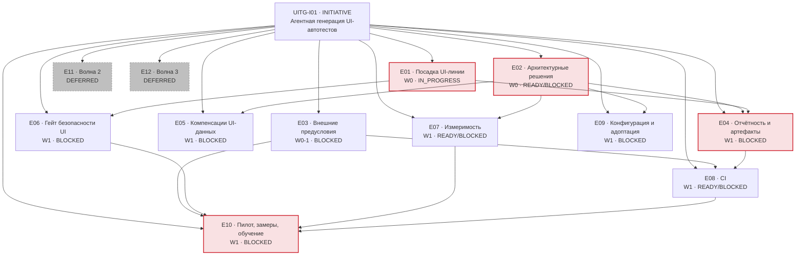

# 20. Task backlog

| | |
|---|---|
| **Документ** | Декомпозированный бэклог, пригодный для последовательной реализации и переноса в трекер |
| **Дата** | 2026-08-03 · ветка `feat/ai-agent-kit`, HEAD `46d3cfb` + незакоммиченное рабочее дерево |
| **Основание** | [`10-implementation-plan.md`](10-implementation-plan.md) · [`11`](11-adr-worklist.md) · [`12`](12-wave-plan.md) · [`13`](13-risk-register.md) · [`14`](14-plan-review-report.md) · [`02-requirements-traceability.md`](02-requirements-traceability.md) · [`00-artifact-inventory.md`](00-artifact-inventory.md) · [BRD](../../brd/ui-test-generation-brd.md) v0.3 · ADR-UI-001…007 |
| **Машинное представление** | [`21-task-backlog.yaml`](21-task-backlog.yaml) — все 30 обязательных полей по каждой задаче |
| **Спутники** | [`22-task-dependency-matrix.md`](22-task-dependency-matrix.md) · [`23-execution-queue.md`](23-execution-queue.md) · [`24-backlog-validation-report.md`](24-backlog-validation-report.md) |
| **Правило** | production-код этой работой не изменялся. `DONE` не ставится по факту существования документа; `IN_PROGRESS` — только при фактических изменениях в рабочем дереве |

---

## 1. Модель статусов

Счётчики ниже — по **рабочим элементам** (81 штука: Story, Task, Spike, ADR, External, Validation).
Контейнеры (1 Initiative, 12 Epic, 7 Feature) статус наследуют и в счёт не идут; их числа — в §12.

| Статус | Значение | Как применён здесь |
|---|---|---|
| `DISCOVERY_REQUIRED` | недостаточно данных для проектирования или оценки | 2: остаток SEC-01 (UITG-S029) и инструментальная поддержка G-2 (UITG-V006) |
| `BLOCKED` | работа понятна, но не может начаться | 37: незакрытый ADR, внешний гейт или незавершённая зависимость |
| `READY` | Definition of Ready закрыт | 8 — шесть ADR и два внешних гейта, то есть работа людей, а не сессии |
| `IN_PROGRESS` | есть **фактические** незавершённые изменения | 9 порций посадки кода — 183 untracked-файла в рабочем дереве |
| `IN_REVIEW` | реализация завершена, ждёт ревью | **8** — ни одна из них не порция посадки: это самостоятельные задачи (S010, S022, S024, S025, S030, SP001, SP002, SP003) |
| `DONE` | код, тесты, документация и критерии подтверждены артефактами | **0** — см. §12 |
| `DEFERRED` | сознательно перенесено в более позднюю волну | 17 задач волн 2–3 |
| `REJECTED` | принято явное решение не реализовывать | 0 |

**Почему `DONE` = 0.** Реализованная часть волны 1 (модуль, вход, пул, кит, набор) существует
только в рабочем дереве одной машины: `git ls-files stand-test-ui` возвращает 0 файлов. Пока код не
сядет в git и не пройдёт ревью, DoD §7 не выполнен — не выполнен пункт «review завершён». Поэтому
поставленная работа несёт статус `IN_PROGRESS`, а не `DONE`, и это не занижение: 1495 тестов зелёные,
24 браузерных зелёные, но в клоне репозитория этого нет.

> **Счётчики этого раздела сверены 2026-08-04** (`UITG-F002`) разбором
> [`21-task-backlog.yaml`](21-task-backlog.yaml). Они разошлись с YAML настолько, что читались как
> противоположность правде: `IN_REVIEW` стоял `0` при восьми выполненных задачах. Авторитетным
> остаётся **§12** — он и раньше считался разбором; §1 теперь ему не противоречит.

## 2. Definition of Ready

Задача получает `READY`, только если выполнены **все** девять условий:

1. scope однозначен и умещается в одну рабочую ветку;
2. требования перечислены (Requirement IDs заполнены);
3. acceptance criteria проверяемы машиной или воспроизводимой процедурой;
4. входящие зависимости закрыты;
5. необходимые ADR приняты;
6. внешние доступы получены либо не требуются;
7. тестовая стратегия определена;
8. оставшиеся неизвестные не меняют архитектуру решения;
9. затрагиваемые модули известны, конфликтов между артефактами нет.

Нарушение любого пункта → `BLOCKED` (известна блокирующая работа) или `DISCOVERY_REQUIRED`
(неизвестно, что именно делать).

## 3. Definition of Done

Implementation Story получает `DONE`, только если:

- production-код реализован; unit-тесты добавлены; integration/contract/architecture-тесты добавлены
  там, где применимы;
- **`./gradlew build` зелёный**: компиляция + checkstyle (`maxWarnings = 0`) + тесты + JaCoCo ≥80%
  INSTRUCTION;
- **1495 существующих тестов зелёные** (NFR-06) — обязательно после любой правки `stand-test-core`;
- `ModuleDependencyArchTest` (10 правил графа) зелёный;
- документация обновлена **в том же изменении**, а не отдельной задачей;
- security-требования задачи проверены;
- observability реализована;
- acceptance criteria подтверждены;
- нет скрытых `TODO`, переносящих обязательную часть задачи (сегодня в `stand-test-*/src/main/java`
  их 0 — планка удерживается);
- изменение сопоставлено с Requirement IDs;
- review завершён.

## 4. Initiative map



| Epic | Название | Волна | Статус | Состав |
|---|---|---|---|---|
| **UITG-E01** | Посадка UI-линии и гигиена артефактов | 0 | `IN_PROGRESS` | F001 (9 Story), F002 (2 Story) |
| **UITG-E02** | Архитектурные решения | 0 | смешанный | ADR001…ADR008 |
| **UITG-E03** | Внешние предусловия G-1…G-6 и открытые вопросы | 0–1 | `BLOCKED` | X001…X013 |
| **UITG-E04** | Отчётность и артефакты падения | 1 | `BLOCKED` | F003 (1 Story + 3 Task), F004 (4 Story), F005 (2 Story) |
| **UITG-E05** | Компенсации данных, созданных через UI | 1 | `BLOCKED` | S019 |
| **UITG-E06** | UI-половина гейта безопасности | 1 | `IN_REVIEW` | ~~SP003~~, ~~S022~~, ~~F006~~ (S020/S021/T004) — все потомки закрыты; оба acceptance_criteria эпика закреплены машинно |
| **UITG-E07** | Измеримость: набор и KPI-инструменты | 1 | смешанный | SP001, S023, S024 |
| **UITG-E08** | CI | 1 | смешанный | ~~SP002~~ и ~~S025~~ (`IN_REVIEW`), S026 (ждёт X003) |
| **UITG-E09** | Конфигурация и адоптация | 1 | `BLOCKED` | S027, S028, S029 |
| **UITG-E10** | Пилот, замеры и обучение | 1 | `BLOCKED` | S030, V001…V006 |
| **UITG-E11** | Волна 2: полнота и сквозные проверки | 2 | `DEFERRED` | F007, S031…S039, V007 |
| **UITG-E12** | Волна 3: расширенные проверки и масштаб | 3 | `DEFERRED` | S040…S046 |

## 5. Backlog по волнам

### Wave 0 — предусловия и архитектура

| ID | Тип | Название | Статус | Prio | Size | Зависит от |
|---|---|---|---|---|---|---|
| UITG-S001 | STORY | Порция 1: скелет модуля, сборка, arch-правила | `IN_PROGRESS` | P0 | M | — |
| UITG-S002 | STORY | Порция 2: публичный API и шов драйвера | `IN_PROGRESS` | P0 | M | S001 |
| UITG-S003 | STORY | Порция 3: исполнитель шагов и классификация отказов | `IN_PROGRESS` | P0 | L→разбита | S002 |
| UITG-S004 | STORY | Порция 4: Playwright-драйвер, локальное приложение, `browserTest` | `IN_PROGRESS` | P0 | L→разбита | S003 |
| UITG-S005 | STORY | Порция 5: вход `FORM`/`STORAGE_STATE`, пул учёток | `IN_PROGRESS` | P0 | M | S004 |
| UITG-S006 | STORY | Порция 6: реестр версии 3 (`auth.login`, `challenge`) | `IN_PROGRESS` | P0 | M | S002 |
| UITG-S007 | STORY | Порция 7: кит — UI-ветка (9 скиллов, 5 команд, правила) | `IN_PROGRESS` | P0 | M | S002 |
| UITG-S008 | STORY | Порция 8: набор — 12 UI-кейсов и контракт версии 2 | `IN_PROGRESS` | P0 | M | S007 |
| UITG-S009 | STORY | Порция 9: документы линии (BRD, ADR, planning) | `IN_PROGRESS` | P1 | S | — |
| UITG-S010 | STORY | Пересмотр статусов бэклога волны 1 и стратегии тестирования | `IN_REVIEW` | P1 | S | — |
| UITG-S011 | STORY | Переиздание `00-current-state.md`, пометка §21/§22 BRD | `BLOCKED` | P2 | XS | ADR003 |
| UITG-ADR001 | ADR | Форма бинарных вложений (ADR-UI-005 → Accepted) | `READY` | **P0** | S | — |
| UITG-ADR002 | ADR | Компенсации не-DB шагов (ADR-UI-007 → Accepted) | `BLOCKED` | P1 | S | X007 |
| UITG-ADR003 | ADR | Версия реестра + окно совместимости (ADR-UI-004) | `READY` | P1 | XS | — |
| UITG-ADR004 | ADR | Стартер против `nothingDependsOnUi` (ADR-UI-008) | `READY` | P2 | S | — |
| UITG-ADR005 | ADR | Версионирование схем KB (ADR-UI-009) | `READY` | P2 | S | — |
| UITG-ADR006 | ADR | Где живут сгенерированные тесты (ADR-UI-010) | `BLOCKED` | **P0** | S | X013 |
| UITG-ADR007 | ADR | Стратегия измерения набора (ADR-UI-011) | **`DONE` (принят 2026-08-06)** | P1 | S | ~~SP001~~ |
| UITG-ADR008 | ADR | Параллельность классов/методов (ADR-UI-012) | `READY` | P2 | XS | — |
| UITG-SP001 | SPIKE | Цена сближения DOM дубля и 12 UI-кейсов | `IN_REVIEW` | P1 | M | — |
| UITG-SP002 | SPIKE | Playwright в закрытом контуре и в CI-образе | `IN_REVIEW` | P1 | S | — |
| UITG-SP003 | SPIKE | Какие из U1…U20 выразимы статически | `IN_REVIEW` | P1 | S | — |
| UITG-X001…X013 | EXTERNAL | G-1…G-6 и открытые вопросы OQ | `BLOCKED` | P0–P2 | — | внешние |

### Wave 1 — остаток основания

| ID | Тип | Название | Статус | Prio | Size | Зависит от |
|---|---|---|---|---|---|---|
| UITG-S012 | STORY | Бинарный канал вложений: контракт `core` + сток Allure | `IN_REVIEW` | **P0** | M | ~~ADR001~~ |
| UITG-S013 | STORY | Шов захвата артефактов в `UiDriver` + скриншот | `IN_REVIEW` | P1 | M | ~~S012~~, ~~S004~~ |
| UITG-S014 | STORY | Консоль браузера как вложение | `IN_REVIEW` | P1 | S | ~~S013~~ |
| UITG-S015 | STORY | Сетевые запросы как вложение | `IN_REVIEW` | P1 | S | ~~S013~~ |
| UITG-S016 | STORY | Трейс за выключенным по умолчанию флагом | `IN_REVIEW` | P1 | M | ~~S013~~ |
| UITG-S017 | STORY | Маскирование размеченных зон DOM **до** снятия | `IN_REVIEW` | P0 | M | ~~S013~~ |
| UITG-S018 | STORY | Срок жизни артефактов прогона | `IN_REVIEW` | P1 | S | ~~S013~~ |
| UITG-S019 | STORY | `UiCompensator`: откат UI-данных средствами UI | `BLOCKED` | P1 | M | ADR002, X007 |
| UITG-S020 | STORY | UI-детекторы: адрес, секрет, `Thread.sleep`, ПД | `BLOCKED` | P1 | M | ~~SP003~~, S007 |
| UITG-S021 | STORY | Детектор расхождения «локатор ↔ отчёт разведки» | `BLOCKED` | P1 | M | ~~SP003~~, S020 |
| UITG-S022 | STORY | Привязка хуков к событиям под opencode | `IN_REVIEW` | P1 | S | — |
| UITG-S023 | STORY | Браузерный дубль набора: приведение DOM | `IN_REVIEW` | P1 | M | ~~SP001~~, ~~ADR007~~, ~~S008~~ |
| UITG-S024 | STORY | Инструмент статического подсчёта KPI-9 | `IN_REVIEW` | P1 | S | — |
| UITG-S025 | STORY | CI для существующего набора | `IN_REVIEW` | **P0** | S | — |
| UITG-S026 | STORY | UI-набор в CI headless | `BLOCKED` | P1 | M | X003, S004 |
| UITG-S027 | STORY | Стартер поднимает `UiStepExecutor` | `BLOCKED` | P2 | S | ADR004 |
| UITG-S028 | STORY | Окно совместимости версии реестра | `BLOCKED` | P2 | XS | ADR003 |
| UITG-S029 | STORY | Проверка резолвленного хоста против запретного списка | `DISCOVERY_REQUIRED` | P2 | S | — |
| UITG-S030 | STORY | Обучение: UI-раздел `usage-guide`, шаблон кейса | `IN_REVIEW` | P1 | M | — |
| UITG-V001 | VALIDATION | Пилотная генерация: приложение волны №1 | `BLOCKED` | **P0** | L→по флоу | X001, X004, X005, X006, ~~S030~~ |
| UITG-V002 | VALIDATION | Пилотная генерация: приложение волны №2 | `BLOCKED` | P1 | L→по флоу | V001 |
| UITG-V003 | VALIDATION | Пилотная генерация: приложение волны №3 | `BLOCKED` | P2 | L→по флоу | V001 |
| UITG-V004 | VALIDATION | Сбор KPI-1/3/4/8/9 волны 1 | `BLOCKED` | **P0** | M | V001, X002, ADR006, S024, S026 |
| UITG-V005 | VALIDATION | Гейт §19.1: решение GO / CORRECTIONS / NO_GO | `BLOCKED` | **P0** | S | V004, X002, X011 |
| UITG-V006 | VALIDATION | Инструментальная поддержка базовых замеров G-2 | `DISCOVERY_REQUIRED` | P1 | S | X002 |

### Wave 2 и Wave 3 — `DEFERRED`

| ID | Тип | Название | Волна | Требование | Основание переноса |
|---|---|---|---|---|---|
| UITG-S031 | STORY | Сквозной UI+backend сценарий и связывание | 2 | BR-13 | BRD §18 |
| UITG-S032 | STORY | Негативные и краевые кейсы | 2 | BR-12 | BRD §18 |
| UITG-S033 | STORY | Сценарные cleanup-шаги (остаток BR-24) | 2 | BR-24 | ADR-UI-007 §Волна 2 |
| UITG-S034 | STORY | Параллельность методов внутри класса | 2 | BR-25 | ADR008 + OQ-12 |
| UITG-S035 | STORY | Grid/Selenoid | 2 | BR-20 | BRD §18 |
| UITG-S036 | STORY | Перехват и подмена сетевых ответов | 2 | BR-33 | BRD §18 |
| UITG-S037 | STORY | Классификация падений (команда отладки) | 2 | BR-26 | BRD §18 |
| UITG-S038 | STORY | UI-сущности в базе знаний | 2 | BR-08 | BRD §18; расхождение с `05` §8 вынесено на решение |
| UITG-S039 | STORY | Схема входа `SSO` | 2 | BR-29 | ADR-UI-006 |
| UITG-V007 | VALIDATION | Гейт §19.2 | 2 | KPI-5/6/7 | BRD §19.2 |
| UITG-S040 | STORY | Визуальные регрессы | 3 | BR-14 | BRD §18; DEP-05 |
| UITG-S041 | STORY | Кросс-браузерный критичный набор | 3 | BR-15 | BRD §18 |
| UITG-S042 | STORY | Прогон отмеченных сценариев на мобильном вьюпорте | 3 | BR-16 | BRD §18 |
| UITG-S043 | STORY | Доступность (a11y) | 3 | BR-17 | BRD §18 |
| UITG-S044 | STORY | Кейсы из Jira/Confluence | 3 | BR-02 | BRD §18; DEP-04 |
| UITG-S045 | STORY | Сверка с макетом Figma | 3 | BR-04 | BRD §18; DEP-04 |
| UITG-S046 | STORY | Декларативный трек `ui.*` | 3 | BR-32 | **только после OQ-09** |

## 6. Backlog по epic

### UITG-E01 · Посадка UI-линии и гигиена артефактов

**Бизнес-результат.** Работа перестаёт существовать на одной машине. Пока `git ls-files
stand-test-ui` = 0, ревью невозможно, NFR-06 не проверяем третьим лицом, а любая совместная работа
начинается с «пришли мне архив».

**F001 · Посадка кода порциями** (9 Story). Разбиение по границам эпиков; каждая порция обязана
оставлять сборку зелёной и 1495 тестов целыми. Порядок: S001 → S002 → {S003, S006, S007} → S004 →
S005 → S008; S009 — независимо.

**F002 · Гигиена документов** (S010, S011) — **выполнена 2026-08-04, `IN_REVIEW`.** CONF-03,
CONF-05 и CONF-07 закрыты, CONF-06 и CONF-01 приняты явно (последний ждёт `ADR003` — перевод
ADR-UI-004 в `Accepted` не вправе сделать сессия). Критерий приёмки закреплён тестом
`UiLineDocumentHygieneTest`, а не однократной правкой: документы линии — снимки по природе, код
уходит вперёд, и следующее устаревшее утверждение будет выглядеть точно так же. `S011` остаётся
`BLOCKED`: его вторая половина — статус ADR-UI-004.

### UITG-E02 · Архитектурные решения

Восемь ADR. **ADR001 и ADR006 блокируют старт волны 1**; шесть остальных блокируют отдельные
задачи. Варианты, рекомендации и последствия — [`11-adr-worklist.md`](11-adr-worklist.md); бэклог
их не пересказывает и не выбирает молча.

### UITG-E03 · Внешние предусловия

Тринадцать `EXTERNAL`. **Это не задачи разработчика** — у каждой владелец вне репозитория.
Разработка обходит G-1, G-3, G-4, G-5 локальным приложением и фейковым пулом; **G-2 не обходится
ничем** — гейт §19.1 выражен относительно базы.

### UITG-E04 · Отчётность и артефакты падения

Самый крупный функциональный пробел волны 1 и **единственная работа, трогающая сток графа**
(`stand-test-core`), от которого зависят все 14 модулей. `S-2.2` плана размера `L` разбита на четыре
Story по одному артефакту. Маскирование (S017) входит **в тот же релиз**, что скриншот (S013): риск
утечки RISK-05 вырастает ровно на этом срезе.

### UITG-E05 · Компенсации данных, созданных через UI

Одна Story. Правки `core` не требует: `Compensator`, `UndoLog`, `CleanupPolicy.ALWAYS` уже
универсальны, а `undoLog().register` имеет единственный вызов — `DbStepExecutor:191` — по
употреблению, а не по ограничению модели.

### UITG-E06 · UI-половина гейта безопасности

Сегодня в `detectors.json` 18 находок, UI-специфичных **0**; 15 из 20 гейтов U1…U20 проверяются
глазами. До закрытия E06 каждый ассет кита обязан прямо говорить, что чистый прогон хуков в
UI-ветке **не равен** пройденному ревью (задача UITG-T004).

### UITG-E07 · Измеримость

Превращает 12 `execution.outcome: NOT_RUN` в числа и даёт инструмент KPI-9. Замер на эталонном Page
Object уже даёт 60% хрупких локаторов при пороге эскалации 50% — инструмент нужен **до** пилота,
иначе эскалация опоздает.

### UITG-E08 · CI

`S025` выполнен и стоит в `IN_REVIEW`: `.gitlab-ci.yml` прогоняет `./gradlew build` на merge request,
на push и по расписанию (ночью — `--rerun-tasks --no-build-cache`). Браузерная джоба сюда намеренно не
входит и приходит с `S026` вместе со своей инфраструктурой (G-3).

**Поправка к числу.** Прогон набора даёт **1465** тестов (1457 существующих + 8 новых в
`CiPipelineConfigTest`), 0 падений, 1 намеренный пропуск — не 1481, как записано в документах
планирования. Источник расхождения не установлен; здесь следуем факту прогона. Браузерных
тестов по-прежнему 24, они прогоняются отдельной задачей `browserTest`.

### UITG-E09 · Конфигурация и адоптация

Три Story, ни одна не на критическом пути. S029 — единственная `DISCOVERY_REQUIRED` этой группы:
остаток SEC-01, найденный при проверке плана и не покрытый ни одним источником.

### UITG-E10 · Пилот, замеры и обучение

Семь элементов. `V001…V003` разбиты по приложениям: одно приложение = одна единица работы с
собственным решением «продолжаем / исключаем из волны».

## 7. Critical path

```
UITG-S001 → S002 → S003 → S004        (посадка: без неё нет ревью и общей базы)
                              ↘
UITG-ADR001 ──────────────────→ UITG-S012 → UITG-S013 → UITG-S017
                                                            ↓
                                                       UITG-S026 (⟵ X003)
                                                            ↓
UITG-X006 → X005 → X001 → X004 ─────────────────────→ UITG-V001
                                                            ↓
UITG-X002 ─────────────────────────────────────────→ UITG-V004 → UITG-V005
```

**Узел — `UITG-S012`.** Единственная работа, трогающая `stand-test-core`; за ней стоят шесть Story.

**Критический путь непрерывен**, но состоит из двух участков разной природы: `S001…S017` полностью в
руках команды SDK, `V001…V005` доминирован внешними гейтами и не сокращается разработкой.

## 8. Parallel workstreams

| Lane | Задачи | Стартует | Пересечение по файлам |
|---|---|---|---|
| **L1 · Посадка** | S001…S009 | немедленно | все — идёт первой |
| **L2 · Отчётность** | ADR001 → S012 → S013 → {S014, S015, S016} → {S017, S018} | после ADR001 | `core/event`, `allure`, `ui` |
| **L3 · CI** | ~~S025~~, ~~SP002~~ (`IN_REVIEW`) → X003 → S026 | ждёт X003 (внешний) | конфигурация репозитория — ни с чем |
| **L4 · Гейт безопасности** | ~~SP003~~ → S020 → S021; ~~S022~~ — обе `IN_REVIEW` | S020 ждёт посадки S007 | `docs/ai-agent` |
| **L5 · Измеримость** | ~~SP001~~ (`IN_REVIEW`) → ~~ADR007~~ (**принят 2026-08-06**) → ~~S023~~ (**исполнена 2026-08-07, `IN_REVIEW`**); ~~S024~~ (`IN_REVIEW`) | S023 — исполнена; V004 получил вход KPI-3/4 на дубле | `docs/agent-evaluation`, тестовое приложение |
| **L6 · Решения** | ADR003, ADR004, ADR005, ADR008 | немедленно | документы |
| **L7 · Компенсации** | X007 → ADR002 → S019 | по X007 | `ui` |
| **L8 · Конфигурация** | ADR004 → S027; ADR003 → S028; S029 | по ADR | `starter`, `config`, `core` |
| **L9 · Пилот** | ~~S030~~ (`IN_REVIEW`) → V001 → V002/V003 → V004 → V005 | по гейтам | вне репозитория |

**L3, L4, L5, L6 не пересекаются между собой ни по одному файлу** и запускаются одновременно.
L2 конфликтует с L1 по `stand-test-ui` — поэтому S013 зависит от S004.

## 9. Blocked tasks

37 рабочих элементов (49 с контейнерами). Полный перечень с точной причиной и действием для
разблокировки — [`23-execution-queue.md`](23-execution-queue.md) §BLOCKED. Сводка по причинам:

| Причина | Задач | Разблокирует |
|---|---|---|
| **ADR001** не принят | 7 (S012…S018) | одно решение команды SDK |
| **X002 (G-2)** не закрыт | 3 (V004, V005, V006) | базовые замеры QA-лидов |
| **X001/X004/X005/X006** не закрыты | 4 (V001…V003, S019 частично) | согласования и выдача учёток |
| **X003 (G-3)** не закрыт | 1 (S026) | образ с браузерами и квоты |
| ~~**SP002** не выполнен~~ | 0 | выполнен — отчёт [`32-playwright-closed-contour-spike.md`](32-playwright-closed-contour-spike.md); все три SPIKE закрыты, см. также [`30`](30-ui-gate-expressibility-spike.md) и [`31`](31-ui-dom-convergence-spike.md) |
| **X007 (OQ-06)** не закрыт | 2 (ADR002, S019) | владельцы приложений |
| **X013 (OQ-07)** не закрыт | 2 (ADR006, V004) | QA-лиды и команды |
| **ADR003/ADR004** не приняты | 2 (S027, S028) | два дешёвых решения |
| Незавершённая зависимость внутри лейна | 17 | последовательность работ |

## 10. Discovery tasks

| ID | Что неизвестно | Что закроет |
|---|---|---|
| **UITG-S029** | Нужна ли машинная проверка, что резолвленный `base-url-ref` указывает не на промышленный контур. Сегодня контроль — whitelist алиасов и enum `dev\|ift` в контракте набора; значение приходит из переменной окружения потребителя и SDK его не видит. **Ни один источник не покрывает этот остаток SEC-01** — находка проверки плана | решение команды SDK: принять остаточный риск письменно **или** завести реализацию с запретным списком хостов |
| **UITG-V006** | Что именно и в каком формате замеряют QA-лиды на G-2 — от этого зависит, нужен ли инструмент вообще или достаточно `kpi-collection-template.md` | ответ владельцев G-2 (X002) |

Все три `SPIKE` (SP001, SP002, SP003) выполнены и стоят в `IN_REVIEW`. `DISCOVERY_REQUIRED` они не
были никогда: у каждого был известен вопрос, известен метод и известно, какую задачу он разблокирует.

## 11. Deferred tasks

17 задач: 10 в волне 2 (S031…S039, V007), 7 в волне 3 (S040…S046). Основание переноса у каждой —
BRD §18, ADR или незакрытый OQ; ни одна не перенесена «по усмотрению».

**Два переноса, которые обязаны быть замечены при приёмке плана:**

- **UITG-S038** (UI-сущности в KB, BR-08) — BRD §18 относит к волне 2, `05-analysis-report.md` §8
  рекомендовал волну 1. Бэклог следует BRD; расхождение открыто и решается командой.
- **UITG-S032, S031** (BR-12, BR-13) — **Must-требования без задачи в волне 1**. Это решение BRD
  §18, а не пропуск бэклога; §19.1 прямо оговаривает, что самая трудная для агента часть в замер
  волны 1 не попадает и KPI-4/KPI-1 поэтому оптимистичны.

## 12. Status summary

Числа получены разбором [`21-task-backlog.yaml`](21-task-backlog.yaml), а не подсчётом глазами.

| Статус | Рабочих элементов | Всего с контейнерами | Комментарий |
|---|---|---|---|
| `DONE` | **0** | 0 | реализованное пока без завершённого ревью человеком — DoD по пункту «review завершён» не выполнен |
| `IN_REVIEW` | **31** | 37 | посадка S001..S009, срез вложений S012/T001/T002/T003, S013/S014/S015/S016/S017/S018/S020/S021/S022/S023/S024/S025/S030, T004, spikes SP001..003 — устаревший снимок 12/14 заменён фактом ниже. Контейнеры: +`F006` и +`E06`, закрытые сессией F006 (см. факт ниже) |
| `IN_PROGRESS` | **0** | 1 | порции посадки переведены в IN_REVIEW (см. поправку ниже); осталась только инициатива I01 |
| `READY` | **6** | 6 | **F006 переведён из `READY` в `IN_REVIEW`** — исполнимый остаток контейнера закрыт (детектор U16, исправление U20; см. факт ниже). Остаются только решения людей ADR003/004/005/008 и внешние гейты X003/X012 — сессии-executable `READY` в волне не осталось |
| `BLOCKED` | **23** | 35 | незакрытые ADR-решения и внешние гейты (G-1..G-6), а также S011/S019/S026/S027/S028/S029 (S023 разблокирована) |
| `DISCOVERY_REQUIRED` | 2 | 2 | S029, V006 |
| `DEFERRED` | 17 | 20 | волны 2 и 3 |
| `REJECTED` | 0 | 0 | явных отказов не принято |
| **Итого** | **82** | **102** | включая заданную и исполненную T005 |

> **Факт 2026-08-07 (сессия `UITG-F006`).** Контейнер `UITG-F006` переведён из `READY` в
> `IN_REVIEW`, вместе с ним эпик `UITG-E06`. Взят по тому же правилу, что однажды уже сработало на
> `F002`: очередь отдаёт людям `ADR` и `EXTERNAL`, а не `FEATURE`, и в контейнере лежал исполнимый
> остаток — его собственный `definition_of_done` («каждый машинно-выразимый гейт U1..U20 имеет
> детектор») не был подтверждён ничем машинным. `T004` закрепил ОБРАТНОЕ направление (у человеческих
> гейтов детектора нет), и этого мало: тому же условию удовлетворял бы кит вообще без детекторов —
> все гейты были бы человеческими, а перепись — согласованной. Прямая сверка ✔-строк spike
> (U2, U5, U6, U7, U9, U13, U16, U17, U20) с фактическим составом `detectors.json` нашла ровно две
> дыры, и обе были невидимы именно из-за её отсутствия: **U16** не имел детектора вовсе, а **U20** его
> ИМЕЛ — находка 17 `SHARED_MUTABLE_TEST_STATE` — тогда как правила и чеклист называли его «только
> глаза». Второе не рассуждение, а замер: скан Page Object'а со статическим `List<String>` даёт
> находку. **Сделано:** находка 26 `UI_GENERATION_REPORT_INCOMPLETE` (BLOCK, `prose`, только
> `Ui*GenerationReport.md` — шаблон кита под это имя не попадает и потому молчит): восемь секций
> считаются по НОМЕРУ заголовка, а не по формулировке (их переписывают под сценарий), и названный
> секцией 8 `original.sha256` обязан существовать на диске — без снимка KPI-4 не занижен, а
> **ненаблюдаем**. Граница вписана честно: наполнение секции детектор не читает, заголовок без
> содержания проходит, и чеклист говорит это прямо. **Чем подтверждено:** 26 находок в обеих копиях
> бандла, `MANIFEST.json` перегенерирован (266 файлов); пять тестов приёма в `GuardDetectorCoverageTest`
> (пропущенная секция / снимок не на диске / полный отчёт со снимком молчит / шаблон кита молчит /
> отчёт разведки не судится чужой структурой); новый `UiMachineGateCensusTest` (4 теста) читает ✔ из
> отчёта spike и таблицу *Machine coverage* из чеклиста — **ни одного списка руками**, поэтому гейт,
> повышенный в spike, роняет тест до появления детектора, а детектор, названный чеклистом и
> отсутствующий в таблице, — тоже. Ложных срабатываний **0 на 251** markdown-файле `docs/`. Проверено
> падением: возврат чеклиста в состояние до изменения роняет новый тест. Полный `build` — **1555
> тестов, 0 падений, 1 намеренный пропуск**, checkstyle 0, JaCoCo ≥80%. Драйвер и браузерные сценарии
> не затронуты, поэтому `browserTest` для этой задачи не требуется и не запускался. **Разблокировал:**
> прямых потомков нет (`blocks: []`), но закрыл оба acceptance_criteria эпика `E06` — перевод `SEC-06`
> в `IMPLEMENTED` для UI-ветки остался людям как ревью, а не как работа.

> **Факт 2026-08-07 (сессия `UITG-S023`).** `UITG-S023` «Браузерный дубль набора» переведена из
> `READY` в `IN_REVIEW` — последняя сессия-executable `READY`-задача волны, исполнена целиком. По
> варианту А ADR-UI-011 DOM `LocalUiTestApplication` сведён к корпусу (экраны `/requests/new` и
> `/requests`, 11 элементов, 12 строк, отложенная валидация, минт `RQ-…`, отказ дубликата — `409`),
> а обязательный тест-парити ADR-011 §3 поставлен `UiDuplicateDomParityTest` (9 тестов: каждый Chosen
> locator шести подсаженных отчётов резолвится в сервленном HTML, `data-testid` совпадает, 12 совпадений
> там, где отчёт пишет 12, POST-контракт). Браузерные тесты двух экранов — `UiRequestsScreensBrowserTest`
> (4). Подтверждено: `build` зелёный (checkstyle 0, JaCoCo ≥80%), `browserTest` 39/0,
> `stand-test-ai-schema:test` зелёный (вкл. `EvaluationCaseSchemaValidationTest`). `execution.outcome`
> остаётся `NOT_RUN` — фактический исход пишется прогоном `stand-batch.mjs` против дубля; любой
> результат дубля пишется с источником «дубль, не живой стенд». (**Поправка 2026-08-07:** здесь стояло
> «схема принимает PASSED/FAILED/SKIPPED» — неверно, enum схемы набора несёт и `NOT_RUN`, и
> `INFRA_ERROR`, так что это штатное значение, а не обход ограничения.)
> Ревью человеком по-прежнему висит — DONE не ставлю.

> **Факт 2026-08-06 (сессия `UITG-T004`).** `UITG-T004` «Перечислить в правилах кита гейты,
> оставшиеся человеческими» переведена из `READY` в `IN_REVIEW` — став следующей фактически готовой
> задачей после `UITG-S021`. Перечень неавтоматизируемых гейтов уже называли правила
> (stand-test-ui-guardrails.md, «The rest stay human: U4, U8, U10, U11a/b, U12, U14, U15, U16, U18,
> U19, U20») и чеклист (ui-safety-checklist.md, таблица Machine coverage, «no detector in this kit —
> eye only»), а текст «чистый хук != пройденное ревью» стоял в обоих — но обещание НЕ было
> машинно-проверяемо: `stand-test-ai-schema` не содержал теста, который сверял бы перечень с
> фактическим составом `detectors.json`, хотя правило ссылалось на «the stand-test-ai-schema test».
> Эта сессия поставила такой тест: новый `UiHumanGateCensusTest` (5 тестов) читает `detectors.json`
> из ОБЕИХ копий бандла и три источника перечня и сверяет их — (1) перечень «The rest stay human: …»
> в правилах равен перечню в чеклисте; (2) каждый человеческий гейт (U4 semantic, U8, U10, U11a/b,
> U12, U14, U15, U16, U18, U19, U20) не имеет в фактических детекторах ни одной находки; (3) набор
> машинно-покрытых гейтов (KNOWN_UI_RULES) замкнут и точен относительно обеих копий `detectors.json`;
> (4) паритет детектор-таблиц `.claude`/`.opencode`; (5) фраза «A clean hook run is still not a clean
> UI review» жива в правилах и чеклисте. Negative-сценарий карточки закрыт анти-дрейфовой проверкой:
> новый `UI_*`-rule в детекторах, которого нет в перечне правил, роняет тест раньше, чем документы и
> детектор разойдутся. ПРОВЕРЕНО мутацией: удаление «U16» из human-перечня правил роняет
> `guardRule_andChecklist_nameTheHumanGates_andNoDetectorCoversOne`. Полный `:stand-test-ai-schema:test`
> зелёный (включая UiHumanGateCensusTest 5/5 и BundleParityTest/GuardrailScannerParityTest=25/
> GuardDetectorCoverageTest/KitManifestTest), `./gradlew build` — BUILD SUCCESSFUL (checkstyle 0, JaCoCo
> ≥80%). Ассетов кита задача не добавляет — только тест сверки, поэтому MANIFEST.json/инвентарь не
> меняются; документация правил/чеклиста уже подготовлена рабочим деревом S020/S021. Ревью человеком
> по-прежнему висит — DONE не ставлю.

> **Факт 2026-08-06 (сессия `UITG-S021`).** `UITG-S021` «Детектор расхождения „локатор ↔ отчёт
> разведки“» переведена из `READY` в `IN_REVIEW`: оба depends_on (SP003 выполнен, S020 реализована в
> дереве) фактически закрыты. Гейт U1 переведён из «только глаза» в машинно-проверяемый: 25-я
> detector-находка `UI_DISCOVERY_PARITY` (обе копии бандла) — локатор Page Object, не прослеживающийся
> до колонки «Chosen locator» `UiDiscoveryReport.md`, даёт BLOCK; отчёт подаётся `scan --discovery
> <path>`, заявленный и отсутствующий на диске отчёт — сам по себе BLOCK; обе стороны нормируются к
> `<strategy>=<value>`, колонка отчёта ищется по заголовку, а не по индексу. Подтверждено
> вручную на seeded-отчёте `ui-stale-discovery-testid-renamed` (сдвинутый `requestStatus` ловится,
> собранный по отчёту 1:1 молчит), на эталоне example-page-object против
> ui-discovery-report-template (0 ложных), тремя тестами `GuardDetectorCoverageTest`; таблица
> `GuardrailScannerParityTest` до 25, `GuardSarifOutputTest` 24→25. Документация обновлена тем же
> изменением в обеих копиях (guardrails, checklist Machine coverage, safety-review SKILL, pipeline,
> usage-guide); MANIFEST перегенерирован, паритет подтверждён. Полный `build` 1533 теста / 0 падений /
> 1 намеренный пропуск. Карточка и `status_reason` — в `21-task-backlog.yaml`. Ревью человеком по-прежнему
> висит — DONE не ставлю.

> **Факт 2026-08-06 (сессия `UITG-S018`).** `UITG-S018` «Срок жизни артефактов прогона» переведена из
> `READY` в `IN_REVIEW`: единственный depends_on S013 (шов захвата) фактически закрыт. Реализован
> `RunArtifactRetention` (SEC-09): `UiRunSettings.artifactRetention` + свойство
> `stand.test.ui.artifacts.retention.days` (по умолчанию 7), первый открывший сессию прогон выметает из
> каталога артефактов файлы старше срока; поддерево `storage-state` полностью пропускается (секрет
> SEC-05 живёт своим жизненным циклом); best-effort, WARN, прогон не падает. Подтверждено
> `RunArtifactRetentionTest` (+ `UiRunSettingsTest` на новое свойство), полным `build` (1530 тестов / 0
> падений, checkstyle 0, JaCoCo ≥80%) и `browserTest` (0 падений). Матрица `SEC-09`
> → `PARTIALLY_IMPLEMENTED` (остаток — ретенция на стороне CI, конфигурация раннера). Карточка и
> `status_reason` — в `21-task-backlog.yaml`. Ревью человеком по-прежнему висит — DONE не ставлю.

> **Факт 2026-08-06 (сессия статус-сверки).** Таблица выше — актуальный снимок с
> `21-task-backlog.yaml` на конец сессии S017: 102 задачи, `IN_PROGRESS` только инициатива `I01`.
> Посадка S001..S009 завершена фактом (каждая порция имеет land-коммит, `stand-test-ui` в git),
> поэтому контейнеры `E01`/`F001` и все девять Story переведены из `IN_PROGRESS` в `IN_REVIEW`;
> `T003` закрыт фактом (проводка каталога получила вызывающего S013). Новая задача **`UITG-T005`**
> («освобождение масок после снятого артефакта», XS, P1, `depends_on S017`) заведена по замечанию
> код-ревью S017 (MEDIUM: `maskedLocators` не очищаются после применения) — чтобы шов маскирования
> был сюрёз-безопасен для `S016`, который снимает несколько артефактов подряд. **Исполнена в тот же
> день** → `IN_REVIEW`: драйвер расходует маску (очищает `maskedLocators` до снятия), подтверждено
> browser-тестом `maskedZoneIsNotInheritedByTheNextCapture` (`browserTest` 200/0, `build` 1508/0);
> `README.md`/`queue` синхронизированы.

> **Факт 2026-08-06 (сессия `UITG-S016`).** `UITG-S016` «Трейс за выключенным по умолчанию
> флагом» переведена из `READY` в `IN_REVIEW`: поле `trace` реестра, которое было распарсено и не
> потреблялось, теперь читается сквозной цепочкой resolver → `ResolvedUiApplication` →
> `PlaywrightDriverFactory` → драйвер → ветка отказа; по `on-failure` снимается трейс (ZIP, открывается
> Trace Viewer'ом) строго после `maskSensitive`, по умолчанию (`OFF`) — ничего. Видео вынесено в
> `out_of_scope` решением по итогам ревью (см. `21-task-backlog.yaml`). Подтверждено браузерным тестом
> (`PlaywrightUiDriverTraceBrowserTest`), unit-тестами порядка «маскирование → скриншот → трейс» и
> тестами resolver; полный `build` 0 падений.
> DoD «по умолчанию поведение не изменилось» подтверждён OFF-тестом. Карточка/status_reason — в
> `21-task-backlog.yaml`.

> **Факт 2026-08-06 (сессия `UITG-S014`).** `UITG-S014` «Консоль браузера как текстовое вложение»
> переведена из `READY` в `IN_REVIEW`. Третий артефакт падения, в отличие от скриншота и трейса —
> **текстовый**: `UiDriver.consoleMessages()` (шов, read-copy; пустой список вместо `null`),
> `PlaywrightUiDriver` копит все уровни через `page.onConsoleMessage` с момента создания страницы, и
> ветка отказа прикладывает к упавшему шагу текстовое `Attachment("ui-console","text/plain",…)` только
> при непустой консоли (negative-критерий). Текстовый канал по определению проходит SecretMasker
> (SEC-05). Подтверждено unit/интеграцией (упавший шаг несёт ui-console; пустая консоль → ровно
> скриншот, `hasSize(1)`), browser-тестом (`PlaywrightUiDriverConsoleBrowserTest` на реальном Chromium),
> полным `build` (checkstyle 0, JaCoCo ≥80%) и браузерным набором 33/0. Ревью каждых S013/S016/S014
> человеком по-прежнему висит — DONE не ставлю.

> **Факт 2026-08-06 (сессия `UITG-S015`).** `UITG-S015` «Сетевые запросы как текстовое вложение»
> переведена из `READY` в `IN_REVIEW`. Четвёртый артефакт падения, текстовый, как консоль S014.
> `UiDriver.networkRequests()` (шов, read-copy; пустой список вместо `null`), `PlaywrightUiDriver`
> копит «METHOD путь статус» через `page.onResponse` с момента создания страницы — только наблюдение,
> без `route`/intercept (BR-33 вне области); URL режется до пути (query/fragment — одноразовый токен),
> а заголовки `Authorization`/`Cookie` в запись не попадают вовсе (SEC-05). Ветка отказа прикладывает к
> упавшему шагу текстовое `Attachment("ui-network","text/plain",…)` только при непустой сети; тела не
> сохраняются. Подтверждено unit/интеграцией (`StepEvent` FAILED несёт ui-network),
> browser-тестом (`PlaywrightUiDriverNetworkBrowserTest` на реальном Chromium: GET/POST видны как
> метод/путь/статус, навигация с `Authorization`-заголовком не несёт ни имя, ни значение), полным
> `build` (unit stand-test-ui 186/0, checkstyle 0, JaCoCo ≥80%) и браузерным набором 35/0.
> Карточка/`status_reason` — в `21-task-backlog.yaml`. Ревью человеком по-прежнему висит — DONE не ставлю.

> **Три поправки к этой таблице, внесённые сессией `UITG-SP002`.**
>
> 1. **Определение уточнено:** «рабочий элемент» здесь — всё, кроме `INITIATIVE`, `EPIC` и
>    `FEATURE`. Раньше `F006` попадал в число рабочих `READY`, а `F002` нет; теперь оба контейнера
>    вынесены в скобки, и обе колонки считаются одним правилом.
> 2. **Предыдущая пара чисел не сходилась,** и это стоит назвать, а не замолчать: `BLOCKED` стоял
>    «40 рабочих / 53 с контейнерами», то есть 13 заблокированных контейнеров, тогда как их
>    существует 12 (девять `EPIC` плюс `F003`, `F004`, `F005`). Фактическое состояние YAML до правок
>    этой сессии — 39 / 51.
> 3. **Изменение по существу — минус два:** spike снял внутреннюю зависимость с `X012` и второе
>    основание с `X003`. Обе задачи внешние: они перешли не в работу, а в ожидание людей.

> **Поправка сессии `UITG-S017` (2026-08-06).** `UITG-S017` переведена из `BLOCKED` в `IN_REVIEW`
> (маскирование реализовано и проверено). Ранее заблокированные `S014`/`S015`/`S016`/`S018` стали
> `READY`; приведённая выше таблица строк волны 1 обновлена. Действующие числа статус-модели берутся из
> `21-task-backlog.yaml`.

| Тип | Количество |
|---|---|
| INITIATIVE | 1 |
| EPIC | 12 |
| FEATURE | 7 |
| STORY | 46 |
| TASK | 4 |
| SPIKE | 3 |
| ADR | 8 |
| EXTERNAL | 13 |
| VALIDATION | 7 |
| **Всего** | **101** |

| Приоритет | Рабочих элементов | Что это |
|---|---|---|
| `P0` | 23 | блокирует старт либо стоит на критическом пути |
| `P1` | 31 | обязательно для волны 1 |
| `P2` | 20 | обязательно для волны 2 либо некритично для волны 1 |
| `P3` | 7 | волна 3 |
| `P4` | 0 | кандидатов на отказ нет; ближайшие — UITG-S046 (при ответе «не нужен» на OQ-09), UITG-S034 (при варианте А ADR008), UITG-V003 (если G-6 назовёт два приложения) |

**Одна поправка, внесённая проверкой.** `UITG-S011` изначально стоял `READY`, имея зависимость от
непринятого `UITG-ADR003` — прямое нарушение DoR §2 пункта 5. Переведён в `BLOCKED`; часть без
зависимости (переиздание `00-current-state.md`) может быть выделена и выполнена сразу. Аналогично
убраны две ложные зависимости: `UITG-ADR008` и `UITG-SP002` числились заблокированными внешними
задачами, которые на самом деле **зависят от них**, а не наоборот.
