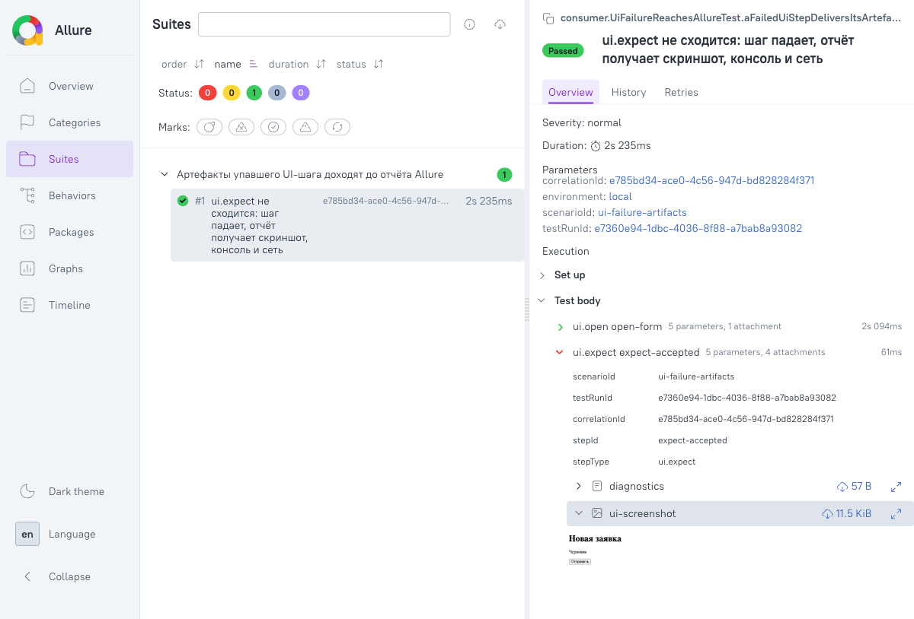

# 34. Ручной прогон `UITG-F003` — картинка в Allure, и дефект, который он нашёл

| | |
|---|---|
| **Документ** | Отчёт о ручном прогоне: доходит ли артефакт упавшего UI-шага до отчёта Allure |
| **Задача** | `UITG-F003`, пункт `definition_of_done` «в Allure ручного прогона видна картинка». Тем же прогоном закрывается первый `acceptance_criteria` контейнера `UITG-F004` («четыре артефакта в Allure на упавшем шаге») в той его части, что не отдана в `out_of_scope` |
| **Дата** | 2026-08-07 |
| **Прогон против** | `stand-test-*` версии `0.1.0-SNAPSHOT`, опубликованные `publishToMavenLocal`; Chromium через Playwright 1.61.0; Allure CLI `allure open` |
| **Где жил прогон** | одноразовый **потребительский** Gradle-проект вне сборки репозитория. Модуль внутри сборки, зависящий от `stand-test-ui`, уронил бы правило `nothingDependsOnUi` (ADR-UI-008) |

---

## 0. Ответ в трёх строках

**Картинка видна — но только после правки, которую этот прогон и породил.** Первый прогон дал в отчёте
три вложения из четырёх: `diagnostics`, `ui-console`, `ui-network`. **Скриншот не дошёл**, хотя PNG лежал
на диске: `build/stand-test-ui/screenshot-<uuid>.png`, 12 КБ, настоящий.

**Причина — не в UI-модуле и не в guard'е, а в проводке.** `AllureReportingEventPublisher`, который и
создаёт `ServiceLoader` у потребителя, строил `AllureAttachmentPublisher` **двухаргументным**
конструктором, то есть без каталога артефактов. А публикатор без каталога **fail-closed отвергает любое
файловое вложение** — по конструкции, правильно и молча (WARN). Трёхаргументный конструктор, тот самый,
что закрывает `T003`, **не имел ни одного вызывающего в production**: его звали только тесты.

**То есть бинарный канал вложений был мёртв на всём пути от потребителя.** Каждое звено покрыто
тестами по отдельности; композиция не исполнялась ни разу, и держать `definition_of_done` открытым
до ручного прогона оказалось ровно верным решением — предыдущие два ревью закрыли соседний `T003`
чтением, и чтение этого не увидело.

---

## 1. Что было собрано

Потребительский проект повторяет ровно то, что документирует корневой `README.md`, плюс UI-адаптер:

```kotlin
testImplementation(platform("ru.alfa.stand.test:stand-test-bom:0.1.0-SNAPSHOT"))
testImplementation("ru.alfa.stand.test:stand-test-junit")
testImplementation("ru.alfa.stand.test:stand-test-ui")
testImplementation("ru.alfa.stand.test:stand-test-config")
testImplementation("ru.alfa.stand.test:stand-test-allure")
testImplementation("io.qameta.allure:allure-junit5:2.29.1")   // см. §4
```

Ни одного compile-ребра между `stand-test-ui` и `stand-test-allure` при этом не появляется: первый
поставляет `StepExecutor`, второй — `ReportingEventPublisher`, оба через `META-INF/services`. Их
композирует `ServiceLoader` у потребителя, и это же делает прогон возможным **вне** сборки SDK.

Реестр — алиасом, как требует инвариант; адрес приезжает именем переменной окружения:

```yaml
version: 2
environments:
  local:
    ui-applications:
      demo-portal:
        base-url-ref: DEMO_APP_URL
        default-viewport: desktop
        viewport-profiles:
          desktop: { width: 1280, height: 800 }
        trace: off
```

Сценарий: `ui.open` на страницу локального одностраничного приложения (обычный
`com.sun.net.httpserver`, страница логгирует в консоль две записи и делает один `fetch`), затем
`ui.expect` с заведомо несходящимся `assertText("Принята")` — на экране «Черновик».

## 2. Первый прогон: чего не хватило

`allure-results` после прогона:

| Шаг | Вложения |
|---|---|
| `ui.open open-form` | `diagnostics` (text/plain) |
| `ui.expect expect-accepted` **FAILED** | `diagnostics`, `ui-console`, `ui-network` — **и ни одного файла** |

При этом на диске: `build/stand-test-ui/screenshot-5d59714a-….png`. Снятие работает; доставка — нет.

Разбор занял один вызов `grep`: `AllureReportingEventPublisher` строил
`new AllureAttachmentPublisher(lifecycle, secretMasker)` — перегрузку с `artifactsRoot = null`, — а
`publishFile` при `artifactsRoot == null` пишет WARN и выходит. `stand-test-allure/README.md` честно
описывал эту дыру своим последним пунктом «Limitations» («проводка каталога — задача `UITG-T003`, и у
неё пока нет вызывающего»), но карточка `T003` была закрыта в статусе `DONE` с формулировкой «обе
половины», потому что ревью прочитало *производящую* половину (`UiStepExecutor` действительно пишет в
`runSettings.artifactsDirectory()`) и не проверило принимающую.

## 3. Правка

Проводка не может пойти «из `UiRunSettings` в сток»: `stand-test-allure` не имеет и не должен иметь
ребра на `stand-test-ui`. Каталог артефактов — это значение, которое читают **двое, не видящие друг
друга**: производитель в адаптере и сток в модуле отчётности. Два читателя одного значения без ребра
между ними — та самая форма, которая дрейфует, и она уже дрейфовала.

Поэтому определение переехало в ядро — `ru.alfa.stand.test.core.event.RunArtifacts`: имя системного
свойства, значение по умолчанию и **чистая** функция разрешения (источник свойств передаётся
параметром, ядро ничего не читает и не открывает). `UiRunSettings` теперь делегирует ей обе константы и
само разрешение, `AllureReportingEventPublisher` разрешает каталог тем же вызовом. Приём тот же, каким
`EnvironmentConfigFormat.SUPPORTED_VERSION` держит две рукописные поверхности реестра.

Имя свойства осталось `stand.test.ui.artifacts.dir`, хотя живёт теперь в ядре: оно опубликовано и
задокументировано, а переименование сломало бы конфигурации потребителей ради опрятности. Ядро при этом
не получает зависимости — строка не ребро.

Три теста, каждый падал бы до правки:

| Тест | Что пинит |
|---|---|
| `AllureReportingEventPublisherTest.fileAttachment_reachesTheReportThroughTheProductionConstructor` | вложение доходит через **тот** конструктор, который зовёт SPI. Передать каталог руками значило бы протестировать guard и снова не увидеть дефект |
| `AllureReportingEventPublisherTest.fileAttachmentOutsideTheArtefactsDirectory_isStillRefused` | резолв каталога **не открыл** канал: файл снаружи по-прежнему отвергается |
| `UiRunSettingsTest.artefactsDirectoryIsCoresSingleDefinition` | производитель и сток читают одно определение; отдельное написание свойства в UI-модуле роняет тест |

Плюс `RunArtifactsTest` (5 тестов) на само разрешение: умолчание, пустая строка, обрезка пробелов,
«читается ровно одно имя», отказ на `null`-источнике.

**Проверено мутацией:** возврат `AllureReportingEventPublisher(AllureLifecycleFacade)` к
`this(lifecycle, (Path) null)` — то есть к состоянию до правки — роняет **ровно один** тест из 66 в
модуле, тот самый новый. До него композицию не пинило ничто.

## 4. Побочная находка: `allure-junit5` не назван нигде

`stand-test-allure` тянет `allure-java-commons` — модель и жизненный цикл, но **не** интеграцию с
JUnit 5. Без `io.qameta.allure:allure-junit5` на classpath потребителя жизненному циклу некуда
складывать шаги: тест-кейса не существует, и отчёт получается пустым. Ни корневой `README.md`, ни
`stand-test-allure/README.md` этого не говорили — а на пилоте в `QA_TEST` ровно это уже стоило
отладочной сессии. Обе README дополнены; это единственная правка, вышедшая за
`documentation_changes` карточки, и она названа здесь явно.

## 5. Второй прогон: что видно

`allure-results` после правки — четыре вложения на упавшем шаге, включая **файловое**:

```
ui.open open-form   passed
   ATT diagnostics    text/plain
ui.expect expect-accepted   failed
   ATT diagnostics    text/plain
   ATT ui-screenshot  image/png   ec8cb4a3-…-attachment.png   ← 1280×800, 11.5 KiB
   ATT ui-console     text/plain
   ATT ui-network     text/plain
```

Размер PNG — **1280×800** — совпадает с профилем `desktop` из реестра, то есть вьюпорт действительно
пришёл конфигурацией, а не полем сценария.

Отчёт сгенерирован (`allure generate`) и открыт (`allure open`); вложение `ui-screenshot`
разворачивается **картинкой прямо в отчёте**, а не строкой base64:



На снимке видно и остальное, что требует карточка: параметры `scenarioId`/`testRunId`/`correlationId`/
`environment` на тест-кейсе и `stepId`/`stepType` на шаге, сообщение отказа
`UI assertion failed on TEST_ID(request-status): expected TEXT EQUALS <Принята> but got <Черновик>`, и
все четыре вложения шага.

Содержимое текстовых вложений того же прогона:

```
ui-console:  error: [demo] the status widget failed to refresh
             warning: [demo] falling back to the cached status
ui-network:  GET http://127.0.0.1:18080/requests/new 200
             GET http://127.0.0.1:18080/api/status 200
diagnostics: exception.class=ru.alfa.stand.test.ui.UiAssertionFailure
```

## 6. Как повторить

```bash
./gradlew publishToMavenLocal
# потребительский проект вне сборки SDK: зависимости и реестр — §1
gradle test                                  # UI-шаг падает намеренно
allure generate build/allure-results -o build/allure-report --clean
allure open build/allure-report
```

## 7. Что этот прогон НЕ закрывает

1. **Четвёртый артефакт `F004` — видео.** Карточка `F004` называет «трейс/видео»; видео сознательно
   вынесено в `out_of_scope` `S016` и не снимается. Трейс в этом прогоне тоже не снимался: реестр
   объявляет `trace: off` (умолчание). Проверять его в Allure имело бы смысл отдельным прогоном с
   `trace: on-failure` — это не входило в предмет `F003` (её предмет — канал, а не снятие).
2. **Прогон против настоящего стенда.** Приложение было локальным, внутри JVM теста; ADR-UI-011
   требует называть это прямо у каждого числа, и здесь названо.
3. **Ревью человеком.** `F003` остаётся `IN_REVIEW`: её DoD закрыт, ревью — нет.
