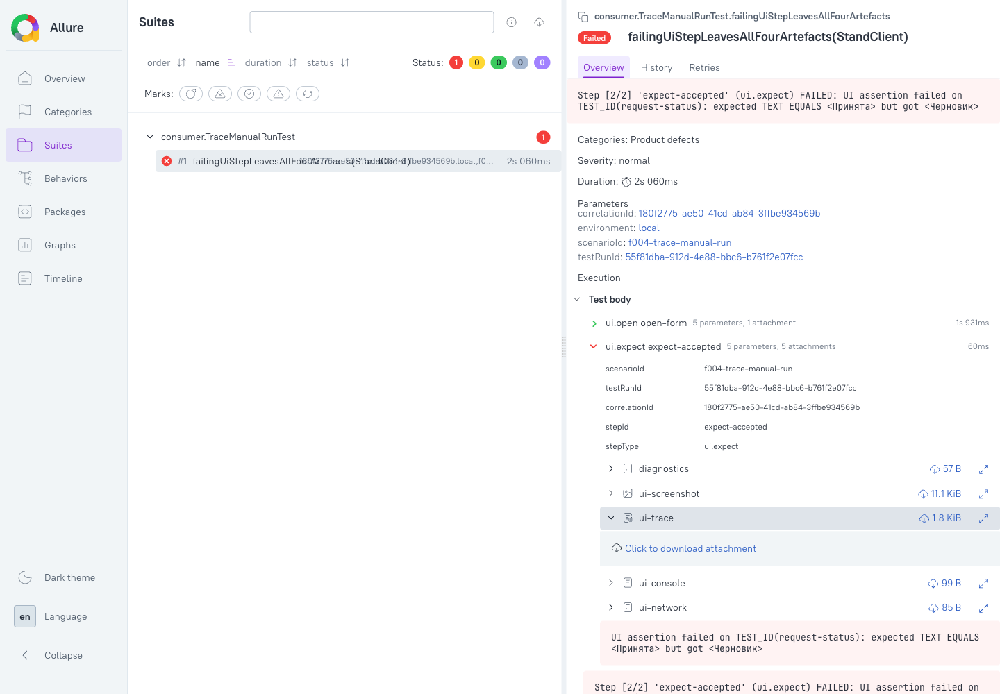
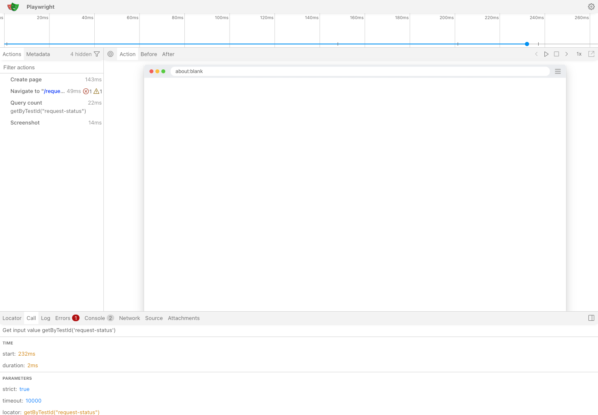
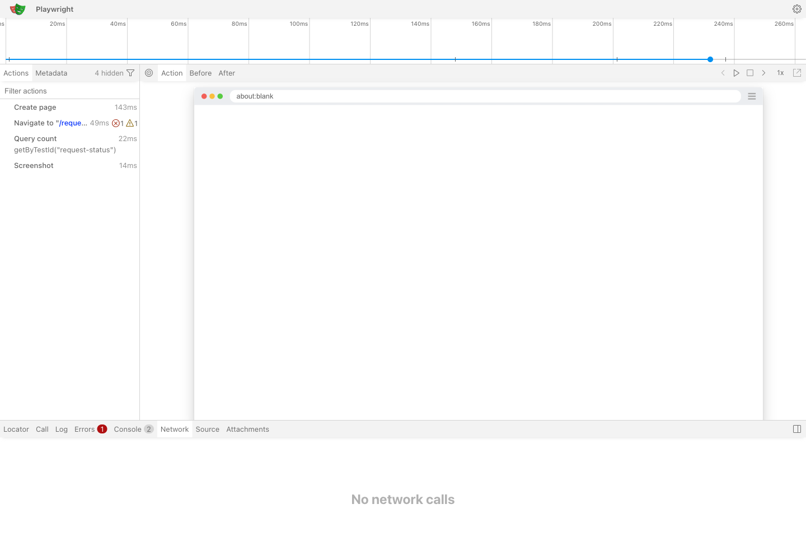

# 35. Ручной прогон `UITG-F004` — трейс в Allure, и что в трейсе на самом деле лежит

| | |
|---|---|
| **Документ** | Отчёт о ручном прогоне: доходит ли **трейс** упавшего UI-шага до отчёта Allure и что он содержит |
| **Задача** | `UITG-F004`, первый `acceptance_criteria` («четыре артефакта в Allure на упавшем шаге») — половина, оставленная незакрытой прогоном `F003`: там реестр объявлял `trace: off`. Тем же прогоном закрывается вторая половина того же критерия у эпика `UITG-E04` |
| **Дата** | 2026-08-07 |
| **Прогон против** | `stand-test-*` версии `0.1.0-SNAPSHOT`, опубликованные `publishToMavenLocal`; Playwright 1.61.0 (драйвер сообщает о себе `1.61.1`), Chromium headless; Allure CLI 2.44.0 |
| **Где жил прогон** | одноразовый **потребительский** Gradle-проект вне сборки репозитория — как и в [`34`](34-allure-manual-run-report.md): модуль внутри сборки, зависящий от `stand-test-ui`, уронил бы `nothingDependsOnUi` (ADR-UI-008) |

---

## 0. Ответ в трёх строках

**Трейс доходит.** На упавшем шаге в отчёте пять вложений: `diagnostics`, `ui-screenshot`, **`ui-trace`
(`application/zip`, 1.8 KiB)**, `ui-console`, `ui-network`. ZIP, скачанный из **сгенерированного отчёта**,
побитно совпадает с файлом на диске и открывается Playwright Trace Viewer'ом. Правок в проводке не
потребовалось — канал, починенный `F003`, работает и для второго бинарного типа.

**Зелёный прогон при включённой записи не оставляет ни одного файла** — каталог артефактов не создаётся
вовсе. Это вторая половина `acceptance_criteria` `F004`, проверенная в конфигурации, в которой её ещё не
проверяли: с работающим `tracing()`.

**Зато прогон опроверг то, что документы утверждали про содержимое трейса.** Комментарий фабрики, javadoc
`UiDriver.captureTrace` и `stand-test-ui/README.md` в один голос говорили, что в ZIP лежит
«DOM/network-история, которую и читают в Trace Viewer». **Сетевой истории там нет**: вкладка *Network*
Trace Viewer'а пуста, `trace.network` — 0 байт. Это не дефект, а **цена решения SEC-05**, которую никто не
измерял.

---

## 1. Что было собрано

Тот же потребительский проект, что в §1 отчёта [`34`](34-allure-manual-run-report.md), с одной разницей —
реестр объявляет запись:

```yaml
version: 2
environments:
  local:
    ui-applications:
      demo-portal:
        base-url-ref: DEMO_APP_URL
        default-viewport: desktop
        viewport-profiles:
          desktop: { width: 1280, height: 800 }
        trace: on-failure        # <- вся разница с прогоном F003
```

Сценарий: `ui.open` на страницу локального приложения (`com.sun.net.httpserver`; страница логгирует две
записи в консоль и делает один `fetch`), затем `ui.expect` с заведомо несходящимся `assertText("Принята")`
— на экране «Черновик». Второй сценарий, `f004-trace-green-run`, тот же самый, но с сходящейся проверкой.

## 2. Что видно в отчёте

`allure-results` упавшего шага:

```
ui.open open-form   passed
   ATT diagnostics    text/plain
ui.expect expect-accepted   failed
   ATT diagnostics    text/plain
   ATT ui-screenshot  image/png     11.1 KiB
   ATT ui-trace       application/zip   1.8 KiB      ← новое по сравнению с прогоном F003
   ATT ui-console     text/plain
   ATT ui-network     text/plain
```



Allure **не показывает** ZIP встроенно — у него нет вьюера для этого типа; вложение разворачивается в
«Click to download attachment». Это ожидаемо и правильно: трейс читают Trace Viewer'ом, а не в отчёте.

Проверено, что в отчёт уехал именно артефакт прогона, а не пустышка: файл, скачанный по ссылке из
`allure generate`-отчёта, и файл на диске имеют один SHA-256
(`b6fad94a4d749c075a9b9b1ea7749de8d3c1ccc76e2ef8227fe1c9ae6d8ea37f`).

## 3. Трейс открывается и показывает прогон

`show-trace --host 127.0.0.1 --port 18098` на скачанном из отчёта ZIP:



Видны все действия шага (`Create page`, `Navigate to "/reque…"`, `Query count getByTestId("request-status")`,
`Screenshot`), их тайминги и параметры (`locator: getByTestId("request-status")`, `timeout: 10000`),
вкладки *Errors* (1) и *Console* (2) — то есть то, ради чего трейс и снимают.

## 4. Чего в трейсе нет — и почему это важно знать заранее

Вкладка *Network* того же трейса:



**«No network calls»** — при том, что прогон сделал два обмена, и оба перечислены в текстовом вложении
`ui-network` того же шага:

```
GET http://127.0.0.1:18080/requests/new 200
GET http://127.0.0.1:18080/api/status 200
```

Причина установлена измерением, а не рассуждением. Тем же Playwright 1.61.0 записаны два трейса одной и
той же страницы, различающиеся одним параметром:

| `snapshots` | размер ZIP | `trace.trace` | `trace.network` | `resources/` |
|---|---|---|---|---|
| `false` (как в SDK) | 1026 B | 2151 B | **0 B** | нет |
| `true` | 3408 B | 4311 B | 3705 B | `…html` 430 B, `…json` 29 B |

То есть сетевые записи живут в том же снапшот-потоке, что и DOM-клоны кадров. Выключив снапшоты ради
SEC-05 (`snapshots: true` кладёт в ZIP HTML кадра — а вместе с ним и введённый пароль, до которого не
дотягивается ни `asSensitive()`, ни маскер отчёта), SDK **одновременно** лишает трейс сетевой истории.
Это цена решения, а не ошибка: сетевую историю несёт отдельное текстовое вложение `ui-network`
(`UITG-S015`), которое **из-за этого не дублирует трейс**, а дополняет его.

**Что исправлено.** Три места утверждали обратное и правились этим же изменением: комментарий
`PlaywrightDriverFactory`, javadoc `UiDriver.captureTrace` и раздел «Трейс» в `stand-test-ui/README.md`.
Цена ошибки не косметическая: читатель, поверивший, что сеть есть в трейсе, счёл бы вложение `ui-network`
избыточным и снял бы его — потеряв единственный сетевой артефакт прогона.

**Что закреплено тестом.** Браузерный `PlaywrightUiDriverTraceBrowserTest.exportedTraceCarriesNoDomCloneAndNoNetworkStory`
измеряет обе половины на самом артефакте: в ZIP нет ни одной записи `resources/` (безопасностная
половина) и `trace.network` пуст (её цена), причём перед этим утверждается непустой
`driver.networkRequests()` — иначе тест проходил бы и на прогоне, который вообще ничего не запрашивал.
**Проверено мутацией:** `setSnapshots(true)` в фабрике роняет два теста из 41 — новый и
`PlaywrightUiDriverTraceSecretBrowserTest` (в DOM-клоне обнаруживается введённый пароль). До правки первую
половину не проверял никто.

## 5. Зелёный прогон с включённой записью

Отдельный прогон `f004-trace-green-run` (та же страница, сходящаяся проверка, тот же `trace: on-failure`):

```
Scenario 'f004-trace-green-run' finished: SUCCESS (2059 ms)
$ ls -la build/stand-test-ui
"build/stand-test-ui": No such file or directory
```

Каталог артефактов не создаётся вовсе — ни ZIP, ни PNG. Буфер записи освобождается закрытием контекста;
`captureTrace` на зелёном пути не вызывается.

## 6. Как повторить

```bash
./gradlew publishToMavenLocal
# потребительский проект вне сборки SDK: зависимости — §1 отчёта 34, реестр — §1 здесь
gradle test --tests 'consumer.TraceManualRunTest'     # UI-шаг падает намеренно
allure generate allure-results -o build/allure-report --clean
allure open build/allure-report
# трейс из отчёта:
gradle showTrace -PtraceZip=<скачанный zip>           # show-trace --host 127.0.0.1 --port 18098
```

## 7. Что этот прогон НЕ закрывает

1. **Видео — четвёртый артефакт в формулировке `BR-21`.** Оно сознательно вынесено в `out_of_scope`
   `S016` и не снимается вовсе. Перевод `BR-21` в `IMPLEMENTED` требует решения о видео, а не работы;
   строка матрицы это и говорит.
2. **Прогон против настоящего стенда.** Приложение локальное, внутри JVM теста; ADR-UI-011 требует
   называть это у каждого числа — названо.
3. **Ревью человеком.** `F004` остаётся `IN_REVIEW`: её `acceptance_criteria` и `definition_of_done`
   закрыты в исполнимой части, ревью — нет.
